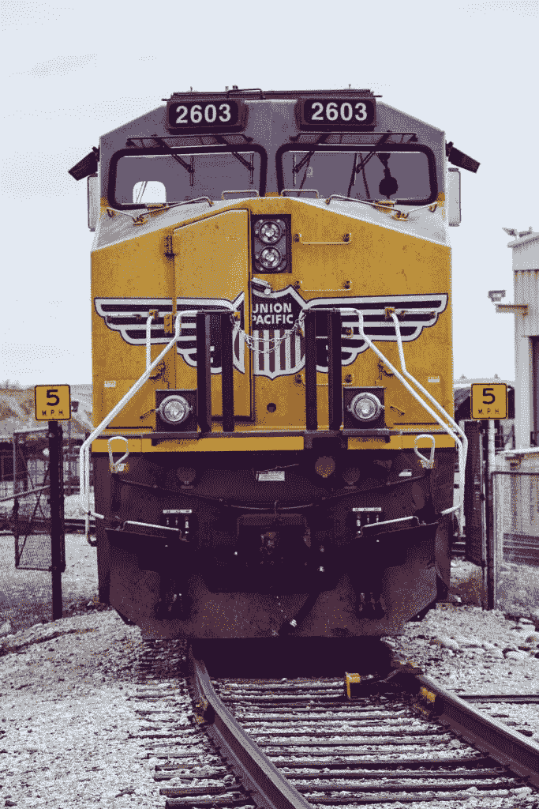
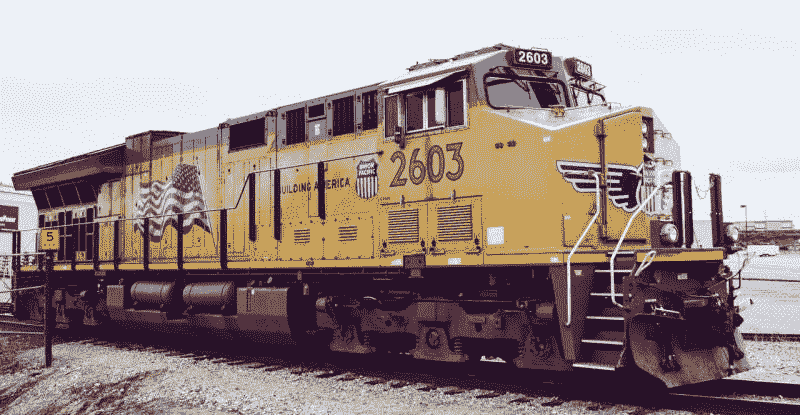

# 联合太平洋能挺过冠状病毒吗？—市场疯人院

> 原文：<https://medium.datadriveninvestor.com/can-union-pacific-survive-coronavirus-market-mad-house-ab001e95957d?source=collection_archive---------34----------------------->

冠状病毒可能会杀死联合太平洋公司(纽约证券交易所代码:UNP)T1，因为这一历史悠久的铁路在纽约证券交易所庆祝 150 周年。

新闻稿显示，[联合太平洋或 UP 于 1870 年 9 月 15 日加入纽约证券交易所。然而，Stockrow 估计联合太平洋的](https://www.up.com/media/releases/200915-nyse-150-years.htm)[收入增长在截至 2020 年 6 月 30 日的季度下降了 24.16%](https://stockrow.com/UNP/financials/income/quarterly) 。

与此同时，我估计联合太平洋公司(Union Pacific)在过去两年里裁员 11711 人。为了解释，奥马哈世界先驱报*估计 [UP 的员工数量从 2018 年 9 月的 44531 人减少到 2020 年 7 月的 32820 人](https://omaha.com/business/local/union-pacific-to-lay-off-employees-company-ties-cuts-to-efficiency-efforts/article_cf9f74aa-c3c0-568a-9696-f664d3768299.html)。*

# 铁路交通崩溃

首席执行官兰斯·弗里茨承认，联合太平洋正在裁员，因为其运输量在 2019 年第二季度至 2020 年期间下降了 20%。此外，据美国铁路协会(AAR)估计，2019 年 8 月至 2020 年 8 月，美国铁路运输量[下降了 14.9%，即 156，797 车次](https://marketmadhouse.com/can-union-pacific-survive-coronavirus/#:~:text=Total%20combined%20U.S.%20traffic%20for,percent%20compared%20to%20last%20year.&text=Total%20U.S.%20weekly%20rail%20traffic,the%20same%20week%20last%20year.)。

铁路运输的煤炭数量下降了 25.8%；AAR 估计，在 2019 年 8 月至 2020 年 8 月期间，将有 85，216 车皮。此外，砂石装运量下降了 24，961 车，降幅为 25%。另外，石油产品的铁路运输下降了 14.3%；或 7，128 车皮。

此外，铁路运输增长太慢，不足以弥补其他地方的损失。例如，AAR 估计铁路谷物运输数量增长了 5.6%，即 4，683 车皮。此外，农产品的铁路运输增长了 168 车，增幅为 5%。

# 联合太平洋收缩了

于是， [**联合太平洋**](https://marketmadhouse.com/is-the-union-pacific-in-trouble/) **(纽约证券交易所代码:UNP)** 业务萎缩。然而,“市场先生”看不到这种萎缩。

2020 年，联合太平洋的股价从 2020 年 1 月 2 日的 182.27 美元涨到 9 月 22 日的 197.32 美元。令人难以置信的是，2020 年 9 月 15 日，联合太平洋公司的股价达到了 202.37 美元的高点，以庆祝该公司成立 150 周年。

相比之下，联合太平洋的季度收入从 2019 年 12 月 31 日的 52.12 亿美元降至 2020 年 6 月 30 日的 42.44 亿美元。相比之下，联合太平洋在 2019 年 6 月 30 日报告的季度收入为 55.96 亿美元。

 [## 应对新型冠状病毒的新型经济体系？数据驱动的投资者

### 经济学不受自然法则或物质世界的支配，而是受人类创造的规则支配。

www.datadriveninvestor.com](https://www.datadriveninvestor.com/2020/05/27/a-novel-economic-system-to-respond-to-the-novel-coronavirus/) 

# 联合太平洋是不是赚钱少了？

加上联合太平洋的季度营业收入从 2020 年 12 月 12 日的 31.2 亿美元下降到 2020 年 6 月 30 日的 26.51 亿美元。

然而，联合太平洋的季度毛利从 2019 年 12 月 31 日的 31.2 亿美元降至 2020 年 6 月 30 日的 26.51 亿美元。同期，UP 的季度共同净收入从 14.03 亿美元降至 11.32 亿美元。

联合太平洋的季度运营现金流从 2019 年 12 月 31 日的 23.45 亿美元降至 2020 年 6 月 30 日的 23.7 亿美元。然而，截至 2019 年 6 月 30 日，联合太平洋的季度运营现金流为 19.41 亿美元。

# 联合太平洋公司产生的现金少了吗？

奇怪的是，联合太平洋的季度期末现金流从 2019 年 12 月 31 日的-4.47 亿美元上升到 2020 年 6 月 30 日的 15.17 亿美元。因此，联合太平洋赚的钱更少，但产生的现金更多。

重要的是，我认为联合太平洋最近几个月没有借钱，因为它报告了负的融资现金流。融资可以显示一个公司已经偿还了多少债务。

值得注意的是，联合太平洋的季度负融资现金流从 2019 年 12 月 31 日的-18.64 亿美元降至 2020 年 6 月 30 日的-1.1 亿美元。因此，联合太平洋支付的债务减少了。

我认为，如果目前的趋势继续下去，联合太平洋可能很快就会报告正的融资现金流。解释一下，一个正的融资现金流表明一个公司正在借钱来支付运营费用。

# 联合太平洋不再是一项价值投资

另一方面，**联合太平洋(纽约证券交易所代码:UNP)** 在 2020 年 6 月 30 日有 27.66 亿美元的现金和短期投资。这一数字从 2019 年 12 月 31 日的 8.91 亿美元和 2019 年 6 月 30 日的 11.09 亿美元增长。

此外，联合太平洋的总资产从 2019 年 12 月 31 日的 616.73 亿美元增长至 2020 年 6 月 30 日的 635.55 亿美元。因此，联合太平洋更有价值，但我不认为联合太平洋是一个价值投资。

我认为**联合太平洋公司(UNP)** 不是一个价值投资，因为市场先生高估了它的股票，铁路没有收入增长。事实上，我甚至不认为联合太平洋是一个价值陷阱。解释一下，价值陷阱有一些积极的价值特征，比如巨额现金。另外，[经典价值陷阱](https://www.investopedia.com/terms/v/valuetrap.asp)价格便宜。

然而，联合太平洋公司目前提供了不错的股息。统一国民党将于 2020 年 9 月 30 日支付 97₵季度股息。联合太平洋公司在 2020 年 9 月 22 日提供了 3.88 美元的年化股息和 1.94%的股息收益率。

但我认为，由于收入下降，联合太平洋公司的股息可能会减少。

# 为什么联合太平洋的股价让我害怕

联合太平洋的股票价格让我害怕，因为它太高了。我认为市场先生会买这只股票仅仅是因为它的大名和丰富的历史。

似乎许多人在购买股票时没有检查财务数据。因此，联合太平洋银行展示了美国现代股市泡沫是如何运作的。市场先生为股票支付价格，因为它们有极好的声誉，除此之外别无其他。这让我感到害怕，因为我认为这似乎是一个崩溃前的泡沫。

联合太平洋公司的现状也显示了美国经济的问题所在。该公司生意越做越少，赚钱越来越少，工作岗位越来越少，但其股价却在飙升。

另一个问题是，联合太平洋是乔布斯。在过去的两年里，联合太平洋公司已经取消了 11711 个高薪和福利优厚的工会职位。因此，美国的新经济扼杀了好的工作，并且没有提供替代它们的机会。这为[杨安泽的论点](https://qz.com/1687957/the-case-for-andrew-yangs-ubi-plan/)提供了一个极好的例子。

# 股市崩盘迫在眉睫吗？

联合太平洋公司(Union Pacific)向我们展示了投资者为何需要对后新冠肺炎时代的美国经济感到恐惧。

我认为美国的底层经济支撑不了飙升的股市。如果出现更多具有联合太平洋公司特征的股票，我认为市场崩盘可能即将来临。

我认为，只要有一家大型蓝筹股公司，如联合太平洋公司(Union Pacific)或网飞公司(NASDAQ: NFLX)宣布破产或倒闭，目前的股市就会崩溃。这样的崩溃会让投资者恐慌，引发崩盘。

然而，我不认为投资者需要离开市场。相反，投资者需要阅读财务报告，并留意看起来不稳定的公司，如联合太平洋公司(纽约证券交易所代码:UNP)。我认为股票市场将会幸存下来，许多投资者将会繁荣起来，但许多较弱的公司，包括联合太平洋公司，可能比大多数人意识到的更接近崩溃。

*原载于 2020 年 9 月 22 日 https://marketmadhouse.com***。**

***进入专家视角—** [**订阅 DDI 英特尔**](https://datadriveninvestor.com/ddi-intel)*