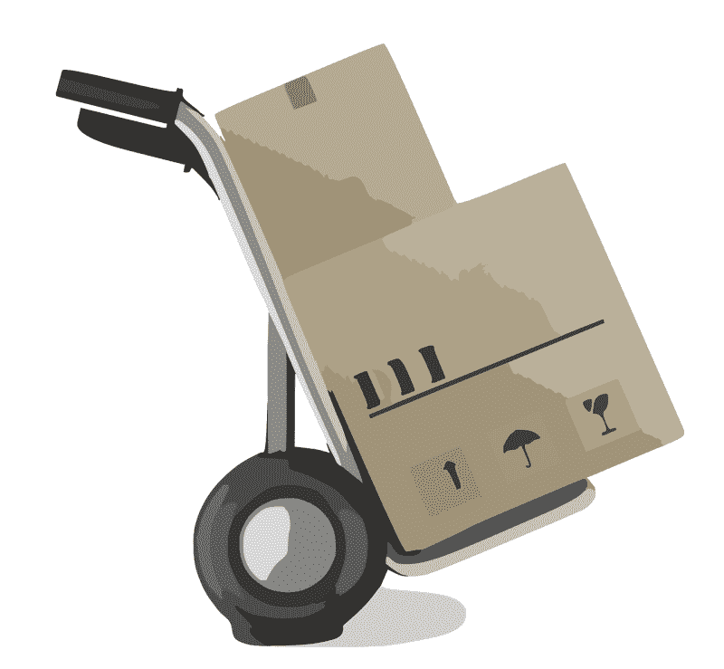

# 没有亚马逊，UPS 能赚钱吗？—市场疯人院

> 原文：<https://medium.datadriveninvestor.com/can-ups-make-money-without-amazon-market-mad-house-37aa22abf8ba?source=collection_archive---------13----------------------->

因为**亚马逊(纳斯达克代码:AMZN)** 在美国交付了 46%的订单，所以 **UPS(纽约证券交易所代码:UPS)** 的未来受到质疑。

亚马逊物流有望在 2019 年交付 35 亿个包裹，亚马逊声称， *Vox Recode* [报道](https://www.vox.com/recode/2019/12/19/21029932/amazon-logistics-delivery-network-fedex-ups-usps)。相比之下，UPS 2018 年在美国交付了 52 亿个包裹和文件。

重要的是，亚马逊声称亚马逊物流现在交付的订单比 UPS 或美国邮政署​都多。此外， *Vox Recode* 声称亚马逊物流可以交付 46%到 50%的亚马逊订单。

# 到 2022 年，亚马逊物流可能会超过 UPS

令人印象深刻的是， *Vox Recode* 预测，到 2022 年，亚马逊物流可以交付 65 亿个包裹。同时， *Vox Recode* 预测 UPS 在 2022 年可以递送 50 亿个包裹。

引人注目的是， *Vox Recode* 预测**联邦快递(纽约证券交易所:FDX)** 到 2022 年可能会递送 34 亿个包裹。到 2022 年，这种亚马逊物流可以交付几乎两倍于 UPS 的包裹。

因此，到 2022 年，亚马逊物流可能会成为美国最大的快递公司。因此，如果亚马逊递送其他公司的订单，它可能会主导递送业务。

 [## 2019 年值得关注的 20 种数字营销趋势和技术|数据驱动的投资者

### Faisal 在加拿大工作，拥有金融/经济和计算机方面的背景。他一直积极从事外汇交易…

www.datadriveninvestor.com](https://www.datadriveninvestor.com/2019/02/04/20-digital-marketing-trends-techniques-to-watch-out-for-in-2019/) 

然而，我认为亚马逊可能会面临政治压力和反垄断行动，以剥离亚马逊物流。我预计反垄断监管机构将把目标对准亚马逊物流，因为它可能会把 UPS 和联邦快递赶出许多市场。

例如，我认为如果没有亚马逊包裹，UPS 和联邦快递可能会在许多农村和郊区的送货上赔钱。在这种情况下，联邦快递和 UPS 可能会退出这些领域。

# UPS 赚钱吗？

相反，UPS 在 2019 年的季度收入和毛利都有增长。例如，UPS 的季度毛利从 2018 年 9 月 30 日的 129.24 亿美元增长到 2019 年 9 月 30 日的 140.25 亿美元。

然而，联合包裹在 2018 年 12 月享受了今年看不到的季度利润增长。解释一下，UPS 的毛利从 2019 年 9 月 30 日的 129.24 亿美元增长到 2019 年 12 月 31 日的 146.13 亿美元。

我想这种利润增长的原因是假日航运。因此，助推不可能发生；或者今年规模更小，因为亚马逊正在处理自己的发货。

此外，UPS 在 2019 年实现了健康的收入增长。例如，Stockrow 估计，在截至 2019 年 9 月 30 日的季度中，UPS 的收入增长率为 5.01%。

因此，UPS 的季度收入从 2019 年 6 月 30 日的 137.18 亿美元增长到 2019 年 9 月 30 日的 140.25 亿美元。因此，尽管亚马逊物流在扩张，但 UPS 的业务仍在增长。

# UPS 赚了多少钱？

另一方面，联合包裹服务公司(纽约证券交易所代码:UPS) 报告该季度收入略有下降。

特别是，UPS 的季度营业收入从 2019 年 6 月 30 日的 21.43 亿美元下降到三个月后的 21.28 亿美元。然而，同期 UPS 的季度普通净收入从 16.85 亿美元上升至 17.5 亿美元。

与此同时，UPS 的季度运营现金流从 2019 年 6 月 30 日的 19.30 亿美元降至 2019 年 9 月 30 日的 14.86 亿美元。相比之下，同期 UPS 的期末现金流从-3.26 亿美元上升至-3，100 万美元。

因此，UPS 产生了更多的收入，但从递送中获得的现金和收入却减少了。因此，送货似乎利润较低。

重要的是，UPS 的现金和短期投资从 2019 年 6 月 30 日的 47.97 亿美元降至 2019 年 9 月 30 日的 45.38 亿美元。此外，UPS 在年底时现金较少。UPS 在 2018 年 9 月 30 日报告了 48.41 亿美元的现金和短期投资。

# 亚马逊可能会花掉 UPS 的业务

因此，在亚马逊物流对其业务构成直接威胁之际，UPS 的现金和收入可能会减少。亚马逊对 UPS 是一个巨大的威胁，因为它在 2019 年 9 月 30 日拥有 434.01 亿美元的现金和短期投资。

所以亚马逊的现金是 UPS 的近 10 倍。因此，亚马逊可以在不借钱的情况下以 10 比 1 的比例支出 UPS。

新闻报道显示，杰夫·贝索斯将这笔钱花在了送货上。例如，三大汽车制造商的商用货车销售；**菲亚特克莱斯勒(NYSE:FCAU**)**戴姆勒股份公司(Frankfurt:DAI)****福特(NYSE:F)**2019 年因为亚马逊订单上涨*汽车新闻* [索赔](https://www.autonews.com/sales/amazons-van-buying-spree-delivers-gift-auto-industry)。

考克斯汽车公司(Cox Automotive)估计，详细来说，美国商用货车销量从 2017 年的 620，500 辆增加到 2018 年的 675，100 辆，2019 年增加到 734，000 辆。2018 年，亚马逊拥有一支由 3 万辆送货车组成的车队。

此外，杰夫·贝索斯表示，亚马逊可能会从 Rivian Automotive 购买另外 10 万辆电动货车。贝佐斯声称这些货车可能会在 2024 年上路。因此，亚马逊可能在四年内拥有一支 13 万辆货车的车队。

看起来亚马逊正在把 UPS 和联邦快递挤出市场。我不得不怀疑 UPS 如何能与这样的支出竞争。

# UPS 还是价值投资吗？

鉴于亚马逊威胁的程度，我认为市场先生在 2020 年 1 月 8 日将 UPS(纽约证券交易所代码:UPS) 的价格定得过高，达到 116.95 美元。UPS 正在成长，但我认为它缺乏与亚马逊竞争的资源。

因此，我的结论是，UPS 不是一个价值投资，但它仍然是一个良好的股息和收益股。例如，UPS 股份于 2019 年 11 月 15 日支付 96₵股息。

总体而言，截至 2020 年 1 月 8 日，每股 UPS 股票向投资者提供的股息收益率为 3.19%，年化派息为 3.84 美元，派息率为 51.05%。此外，Dividend.com 将 2020 年 1 月 8 日 UPS 连续九年的股息增长归功于此。

UPS 是一家好公司，但它经营的业务正遭受亚马逊的戏剧性破坏。在这些情况下，在可预见的将来，需要避免 UPS 股票的不利风险。

*原载于 2020 年 1 月 8 日*[*【https://marketmadhouse.com】*](https://marketmadhouse.com/can-ups-make-money-without-amazon/)*。*