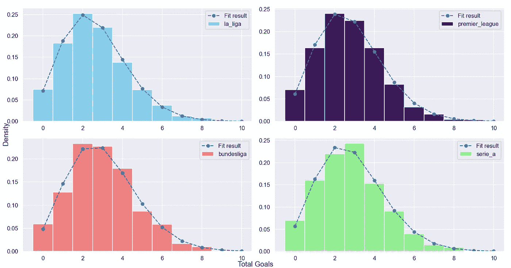
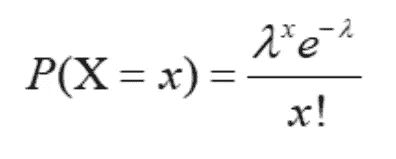
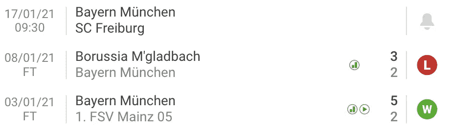

# 我们能打败庄家吗？用简单模型预测足球比赛

> 原文：<https://medium.datadriveninvestor.com/can-we-beat-the-bookies-predicting-football-games-with-a-simple-model-43fe020fb384?source=collection_archive---------0----------------------->

## 预测英超、西甲、意甲和德甲的足球比赛结果。

Photo by [Free-Photos](https://pixabay.com/users/free-photos-242387/) on [Pixabay](https://pixabay.com/photos/cards-blackjack-casino-gambling-1030852/)

足球被认为是最精彩的比赛之一，因为它是如此的不可预测。失败者的胜利和东山再起让一些游戏变得难以预测，即使对于专业的下注者来说也是如此。

然而，当涉及到建立一个预测联盟中所有比赛的模型时，事情就变了。一个赛季是一场漫长的比赛，即使是最强大的俱乐部也有许多起伏，但最终，只有几支球队是赢得联赛的重要候选人。最近十年西甲、意甲、德甲的冠军几乎一样，这不是巧合。

作为一名投注者，我知道我无法预测利物浦会以 7 -2 输给阿斯顿维拉，但作为一名数据科学家，我知道有可能建立一个简单的模型来帮助增加赢得赌注的机会。

让我们来预测欧洲四大联赛的足球比赛吧！首先，我会告诉你在哪里可以获得我正在使用的数据，然后我们一起建立模型，最后，我会告诉你这如何帮助我在体育博彩。

# 数据

我们需要三个输入来构建模型:**历史数据、当前表和剩余的匹配项**。幸运的是，在这个[网站](https://www.football-data.co.uk/data.php)上，许多联赛的足球比赛历史数据已经可以以 CSV 格式使用了。

虽然网站上有很多赛季的足球数据，但我只考虑过去的 5 个赛季。关于建立一个模型需要多少历史数据还存在争议。根据我赌足球的经验，我认为过去 5 年足以做出好的预测。

过多的过去数据会使我们的模型不太准确。足球俱乐部、规则和球员这些年来变化很大。10 年前，没有 VAR 来纠正裁判的决定，15 年前，没有梅西独自为巴塞罗那赢得比赛。

***注*** *:我也是用这些数据，用 Python 的 Selenium 和 Pandas 构建了一个盈利的投注工具。在下面的文章中，我展示了完整的代码，并解释了我是如何做到的。*

 [## 我曾经每年花 180 美元购买一个有利可图的赌博工具。今年我用 Python 做了一个

### 完整的代码创建一个足球博彩工具与熊猫和硒。

frank-andrade.medium.com](https://frank-andrade.medium.com/i-used-to-pay-180-yr-for-a-profitable-betting-tool-this-year-i-built-one-in-python-dda1a9b9581f) 

## 史料

您可以下载。csv 文件，或者使用以下代码让 Python `for`循环为您完成这项工作:

通过这个简单的代码，我们将第 15/16 季的数据存储在一个名为`dict_historical_data`的字典中。在此之后，我们只需重命名密钥。例如`‘SP1’`代表`‘la_liga’.`那些细节可以在我的 [Github](https://github.com/ifrankandrade/football-games-predictions.git) 上找到。

## 当前表格和左侧匹配项

有许多网站显示当前的位置和许多联赛中剩下的比赛。谷歌一下，复制粘贴必要的数据就行了。

我已经建立了一个 CSV 文件，其中包含了前 4 名联赛的表格和即将到来的比赛。你可以在我的 [Github](https://github.com/ifrankandrade/football-games-predictions.git) 上找到这些文件。

# 背后的数学

我们应该在编写任何代码之前了解数学，这次也不例外。

如果你至少看过一次足球比赛，你就会知道一个球员可以在比赛中的任何时候进球。这是过去 5 年前 4 名联赛每场比赛进球数的柱状图。

Histogram of the number of goals in the 4 leagues

毫不奇怪，德甲拥有最高的平均进球数(2.91)，但如果你仔细看这 4 张图表，你会发现它们都有一些共同点——它们的分布有一条共同的拟合曲线。**是泊松分布！**

## 为什么是泊松分布？

一些原因如下:

1.  足球比赛是相互独立的。一场比赛/进球的发生不影响另一场比赛/进球的概率。
2.  事件发生的确切时间是随机的。进球的时机是随机的。
3.  目标是一个离散变量，因为它们是可数的。一场足球比赛可以有 1、2、3 个进球，但不能有分数。

最重要的是，我们试图使这变得简单。我们可以添加更多的变量来提高预测的准确性，但是现在，让我们用最简单的方法来做。

所以我们在处理给定时间段内发生的事件数量的离散概率分布。如果我们把一个进球看作是一场足球比赛 90 分钟内可能发生的事件，这就更有意义了。

Poisson Distribution Formula

正如我们在上面的公式中看到的。泊松分布需要 2 个输入`lambda`和`x`。在我们的分析中,`lambda`将是 90 分钟进球的中位数。这可能是主队、客场队或联赛中进球的中位数。另一方面，`x`是 A 队或 b 队在一场比赛中可以打进的球数。

# 让我们建立模型

为了预测比赛的获胜者，我们需要计算一个球队在联赛中的实力。为此，我使用函数`calculate_strength`返回一个数据框，其中包含过去 5 年中前 4 名联赛中所有球队的标准化进球数和失球数。

下面你可以找到一个英超球队实力的例子。例如，曼城是主场进攻最好的球队，而利兹则是客场失球最多的球队之一。

这两支球队之间的比赛将增加比赛中的进球数量，也增加了曼城赢得比赛的机会。

获得 4 个联赛的实力后，我们创建另一个函数来模拟所有剩余比赛之间的所有可能结果。这个函数使用前一个函数来计算每个队的实力。λ是用公式`lambda = home_scored * away_conceded`计算出来的，代表主队或客场队进球的概率。

此外，我们需要为模拟中使用的目标数量设置限制。由于像拜仁慕尼黑这样的球队最近设立了很高的标准，我们将使用每支球队最多 10 个进球的限制。

对于每次迭代，我们计算之前显示的泊松公式。在这种情况下，参数是进球数(`x`)和平均进球数(`lamb_home`和`lamb_away`)。我们不用编写公式，而是使用`scipy`库中的`poisson.pmf` 函数。

结果将被分为 3 类:赢，输或平局。之后，我们使用公式`3*prob_home + prob_draw`找出足球比赛中的 3 分是如何在两队之间分配的。当主队赢得比赛的机会是 100%时，那么`points_home` 将是 1，主队将得到 3 分。同样的想法也适用于平局。

最后，我们执行用以下代码创建的两个函数:

在 for 循环中，我们将每场比赛的结果存储在`list_points_home`和`list_points_away`中，并且在每场比赛模拟完成后更新表格。

对 4 个联赛的预测如下:

在这里你可以找到赛季中每场比赛的结果。

# 你怎么能用这个进行体育博彩呢？

如果你喜欢赌全职直播结果(1x2)，这些预测很有帮助。想象一下，一个最喜欢的球队在上半场输了，那么赌一场翻盘或平局将比赌预赛的回报高得多。然而，在下注之前，你也应该考虑处于劣势的一方赢得比赛的机会。

这就是模型派上用场的时候了。通过在预测表中搜索球队名称，你可以很容易地看到他们获胜的机会，并决定他们是好还是坏的失败者。

**我以拜仁慕尼黑为例**。拜仁此前的上半场成绩是 0-2(输给美因茨)和 2-2(战平门格拉德巴赫)。我们不需要模型来提醒我们拜仁慕尼黑是一支多么伟大的球队，但如果你对德甲知之甚少，模型可以告诉你美因茨队获胜或 Borussia M'gladbach 保持平局的可能性。

通过在上表中键入德甲球队的名称，您将获得美因茨的得分为 0.5，这意味着即使他们领先 2 球，赢得比赛的几率也很低。另一方面，格拉德巴赫在主场比赛时有 0.8，如果你和其他德甲球队相比，这还算不错。

如果我们对德甲一无所知，我们可以说，比起美因茨赢得或获得平局，格拉德巴赫至少有更多机会获得平局。

这些是比赛的真实结果:

Score results screenshot

所以模型终究是有帮助的！格拉德巴赫甚至赢得了比赛。自然，如果你在预赛中以此为指导下注，利润会很少，但如果你在喜欢的球队没有获胜时明智地使用它，那么回报会更高。

这只是两个匹配。希望在这个赛季结束时，我能做一个更好的比较。

# 最后的想法

这种模式远非完美。实际上，它的简单性使得它不太适合某些场景。例如，在一场足球比赛的分析中，我只考虑了正面交锋的历史数据。在现实生活中，这不足以让我下注。我仍然需要主队在主场比赛和没有主场优势的客场比赛的数据。

我仍然认为它对于预测联赛冠军非常有用，并且在最喜欢的球队没有赢得比赛时是一个很好的指导。在联赛或杯赛中，足球队有许多起伏，但最终…

> **足球**是一种简单的**游戏**——22 个人追逐一个球 90 分钟，最后**德国人**总是**赢**