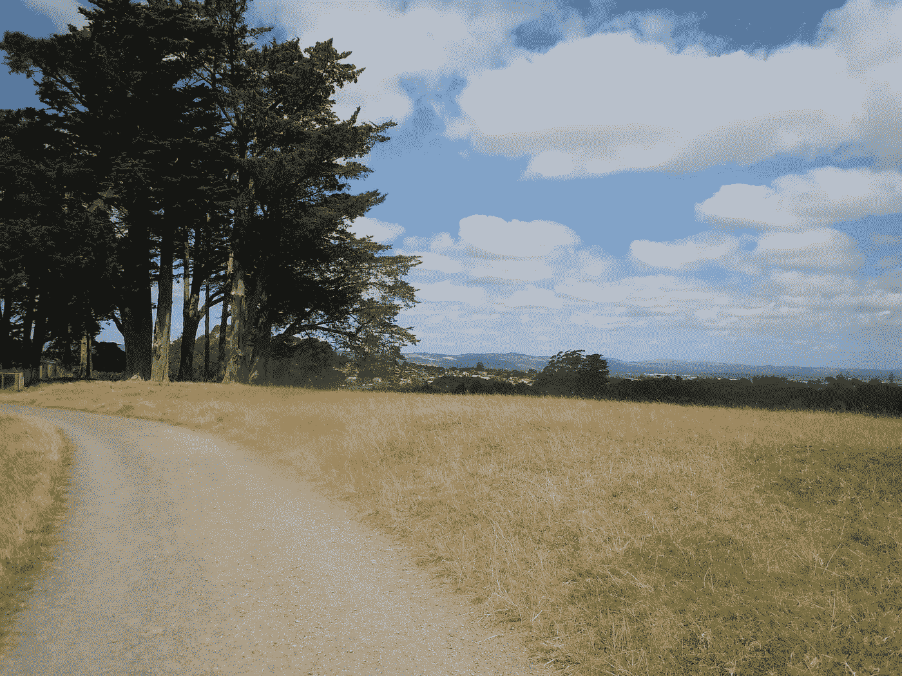

# 更清洁的空气能带来强劲的经济吗？

> 原文：<https://medium.datadriveninvestor.com/can-we-have-a-robust-economy-when-the-air-clears-5308242e5063?source=collection_archive---------16----------------------->

## 我们能从更清洁的空气、更安静的街道、适合步行的城市和改革的基础设施中获得什么

cleaner streets ahead? Christyl Rivers

## 更好的呼吸天堂

鸟类观察者和科学家都注意到，在一级防范禁闭期间，世界各地的天空更加晴朗。随着新冠肺炎·疫情席卷全球，有一个更清洁，更美好的世界。疫情前的污染水平和大流行后的预测揭示了心脏和呼吸系统脆弱性的危险。

在短期内，工业的大部分增长将集中在测试、疫苗、分销和整个卫生部门。其他工作将缓慢恢复，大量的混乱将乘风破浪。然而，即便如此，数据收集仍将是重建的一个重要组成部分。

## 当空气变清时会发生什么？

颠倒的经济也有好处。收集的数据不仅能告诉我们远程办公和工业减少对商业的影响；它还帮助我们了解解决公共卫生和经济本身的前进方向。

在一项由 Lauri Myllyvirta 撰写的欧洲研究中，计算机分析处理了疫情期间的实时数据。他们的研究得出结论，由于整体空气污染减少带来的意想不到的好处，整个欧洲的死亡人数减少了 11，000 人。

 [## 现金为王，比我们想象的更强大|数据驱动的投资者

### 2020 年 3 月 12 日，在川普总统宣布新冠肺炎进入国家紧急状态的前夕，纽约时报报道…

www.datadriveninvestor.com](https://www.datadriveninvestor.com/2020/03/26/cash-is-king-more-potent-than-we-think/) 

那些最容易感染呼吸道疾病的人，也是最容易感染所有动物传染病的人，如 SARS、MERS 和新冠肺炎。

患有心脏病、支气管炎、肺气肿和肺病的人从较少的空气污染方面受益最大。随着整体交通的减少，工业排放污染物的减少，人们接受这些疾病的测试和治疗，在污染减少的地区显示出积极的结果。

## 疫情会议后的针对性治疗

被称为 PM2.5 的颗粒物质和二氧化氮 NO2 被认为是日常商业中的主要污染源。颗粒物如此之小，以至于人们通常不知道他们每天吸入了多少。然而，在人们在禁闭期间经历的短暂外出期间，呼吸更多新鲜空气更容易的报告是非常常见的。

我们可能都戴着口罩，即使是在长期的未来，但即使有这种阻碍，如果我们减缓疾病的传播，我们也将观察到更少的污染行为，如交错的工作时间表，以及更少的高影响公共聚会。

包括疫苗在内的制药行业需要医学专业知识，而这些工作将永远供不应求。但我们将通过更仔细地审查人类的影响、行为(如减少驾驶)和加大数据收集来确定这次和未来大流行的轨迹。

## 创新和清洁空气事业

创新往往是由危机推动的。大多数人已经知道接触追踪和生物识别技术来追踪个人，因为我们都回到了新常态。监控将成为等式的一部分，数据收集将成为未来所有技术创新的主要参与者。无论你对公共健康监测导致的隐私损失有何感受，从现在开始，这种情况很可能会以多种方式发生。这也有积极的一面，因为许多新的清洁空气事业将在各大洲展开。

各种形式的数据收集，如检测空气质量，收集关于污染的人口和地理位置的数据——以及污染较少的地方——将成为常规，以便最好地预测公共卫生结果。

当一个地区遭受太多的颗粒污染时，数据收集器将能够发布公共知识，告诉公众哪条路线最适合患有呼吸系统疾病的人，或者哪家公共游乐场最适合患有哮喘的儿童。

在交通和车辆领域，将需要技术人员和工程师来开发电车、火车、汽车，以及更加清洁、适合步行的城市。这种创新将需要非常广泛的基础设施，从建筑到袖珍花园规划，以增加更多的绿色空间和空气净化生物多样性。

现在，城市需要可靠的食物也不是什么秘密。这需要一整套全新的行业来储存和保护水资源，净化空气。更高的农业产量和可呼吸的城市空气，将需要工程师、建筑师、各种劳动力、管理人员和数百万服务人员。

后疫情时代，专家建议我们不仅要建设适合步行的城市街道，还要建设不会危及未来食品供应链的食品供应基础设施。

共同胜利花园不是一个小主意，因为它们允许消费者在家工作，有助于吸收污染的碳汇，保持空气和栖息地更清洁，回收和保护水资源，创建社区，并且它们将确保公民获得持续和可预测的食物供应。

在更大的范围内，通过卫星跟踪空气质量，数据收集将有助于预测哪些地区在工业和农业方面都是高产的。

如果人们要求一个更安全的世界向前发展，整个一代新的就业机会将得到保证。而且，如果我们选择好我们的优先事项，我们将在这个过程中在全世界创造数百万个就业机会。