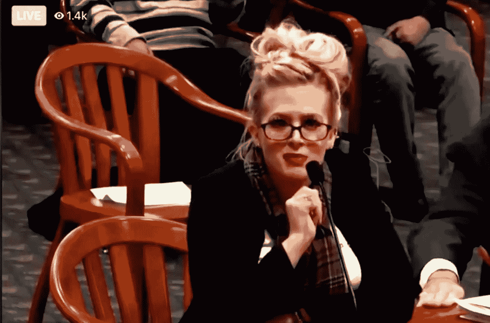

# "我们能推迟到猪赛之后吗？"

> 原文：<https://medium.datadriveninvestor.com/can-we-hold-off-until-after-the-pig-races-dee174a80195?source=collection_archive---------24----------------------->

## 美国概要:你希望你没有在聚会上与之交谈的国家。

Courtesy of Twitter, Ryan J. Reilly

“共和党是一个说政府不起作用的政党，然后他们当选并证明这一点”奥鲁克

到目前为止，我们都已经听说过 Mellissa Carone，这位自治领投票举报者和所谓的 IT 专家(自治领已经报告说她被聘为清洁工)。在证词中，她声称对美国土地上发生的最腐败的投票转变有第一手的了解。她声称，超过 15 万张选票应该流向特朗普，并告诉委员会检查注册选民名单。“没有，”她说。

当共和党人斯蒂夫·约翰森说她的数字没有增加时，她厉声反驳道，“你们做了什么？拿着它做些疯狂的事情？”我敢肯定朱利安尼俯在她耳边说，“梅利莎，约翰逊是共和党人。我们中的一个，换句话说，你这个傻瓜。”

> 谁会想到告诉你的主要证人至少记得党派关系？

公平地说，朱利安尼前一天才见过她。谁会想到告诉你的明星证人记住党派关系可能不是个坏主意？没什么大不了的。随着显示计票员拿走“容器”的摄像机镜头，一切都会浮出水面——福克斯新闻频道评论员肖恩·哈尼蒂和塔克·卡尔森称之为“非常可疑”

实际上，这些容器是用来将选票从一个地方转移到另一个地方的标准容器。他们没有说“官方的集装箱用来将选票从一个地方运送到另一个地方。”所以，就细节而言，汉尼提和卡尔森是对的。任何没有标签的东西都是可疑的。

调查性新闻在这一点上是明确的。

很明显没人花太多时间调查梅利莎·卡隆。在作证之前，她对众议员约翰逊的态度就像“他是福乐鸡快餐店的雇员，奶昔机刚刚坏了一样”(瑞安·j·赖利)，她被指控向情人的前女友发送裸体照片。

鲁迪不知道——卡尔森和汉尼蒂也不知道。

调查性新闻可能也有所帮助。

再说一次，没什么大不了的。她致力于这项事业，甚至提供了一份宣誓书。“我签了一份文件，上面写着我可以去监狱，”她告诉众议员斯蒂夫·约翰森。“你有吗？”

> 毫无疑问，梅利莎将在 *SNL* 上被模仿，可能比莎拉·佩林更多(同样的眼镜和引人注目的撤销)。

作为明星证人，梅利莎比大多数人更认真地对待她的证词。你不能嘘她，她的打断让许多人想起了塞西莉·斯特朗在 *SNL* 上做的“那个你希望在聚会上没有与之交谈的女孩”毫无疑问，梅利莎将在 SNL 上被模仿，可能比莎拉·佩林更多(同样的眼镜和引人注目的发髻)。

如果密歇根州监督委员会的共和党人就此止步，也许 SNL 会将梅利莎限制在一个小品开场。但是朱利安尼和他的助手詹娜·埃利斯推出了另一位明星证人。底特律 TCF 中心的一名共和党投票观察员再次表示。她声称选民身份证是必要的，因为所有的中国人看起来都一样。在她的证词中，她称他们为“周”“太令人震惊了，”她说。

汉尼提和卡尔森都没有消息。他们忙于支持他们认为无可争议的证据。当它不再是无可争议的——或者甚至是*可靠的*——卡尔森倾向于依靠“有点奇怪”，而汉尼提像长臂猿一样吹他的脸颊。

为了更好地理解这一点，我想起了我的一位音乐家朋友告诉我的一件事。在他参加县集市和 ribfests 的日子里，有一次有人问他，“你能等到猪赛之后吗？”你可能会说，出于同样的原因，特朗普正在推迟他总统任期的结束。

 [## 全民或跨州的国营保险私人医疗保险:经济学…

### 我们目前生活在一个所有非医疗行业都痴迷于…

www.datadriveninvestor.com](https://www.datadriveninvestor.com/2020/05/21/state-run-insurance-for-all-or-across-the-state-lines-private-healthcare-coverage-economics-politics-social-mix-up/) 

猪不得不跑。忘记 40 多起被法院驳回的案件(通常带有严厉的谴责)。在共和党渎职的部落背景下，这叫做正当程序。而且，像任何 ribfest 一样，没有首先向猪致敬，任何事情都不会发生。

> 提示卡尔森说，“有点奇怪，”和汉尼蒂吹他的长臂猿脸颊。

也许应该放一首以猪为主题的歌。有一些，特别是乔治·哈里逊的“小猪”这肯定会让猪跑起来，让共和党人站起来挥舞拳头。这是非常奥威尔式的，在看台上回荡着“*你看到那些更大的小猪了吗，”*。提示卡尔森说，“有点奇怪，”和汉尼蒂吹他的长臂猿脸颊。

很难知道这首歌是否适合跳舞。除了村民，大多数摇滚乐队都告诉特朗普停止播放他们的歌曲。也许他们能以合适的价格买到“小猪”。钱从来不是特朗普的问题。这就是为什么国家的 3.3 万亿债务。

所有那些告诉特朗普放弃的人——为什么要放弃？许多法律途径仍然畅通。有些比其他的更牵强，但是，该死的，如果那些共和党最高法院法官在被问及时不会通过牵强的东西，那他们有什么意义呢？

如果他们没有准备好合作，至少特朗普可以依靠他的亿万富翁朋友，他们仍然准备支付更多的 ipac——只要他留下来，让民主党人不对他们的离岸账户征税。他们现在有 2.5 亿美元，这是一个相当大的数目，但它能持续下去吗？没有人会支持一个失败的总统，就像他们不会支持一只跛脚的猪一样。

一些人认为特朗普仍然是猪圈里的大人物，但最糟糕的情况也不容忽视。他离开白宫的那一天，哥伦比亚特区的每个律师都会瞄准他的鼻子。特朗普是个大块头，骨头上有很多肉。如果你是特朗普，他很有可能一路尖叫到大房子里，这是一个有趣的前景，并期望在 Mar-a-Lago 的链接上与几个“被赦免”的朋友度过余生。

这一切都有点太让人想起 ribfests 和县集市。正如我的音乐家朋友所说，“你怎么能指望那些东西在公开比赛中竞争，然后吃掉它们？”这似乎违背了任何公平的规则，但在这一点上我们已经超越了所有的公平。尤其是共和党人，知道是时候炒点什么了，尤其是如果你指望特朗普的忠实者会吞下两名女性的证词，这两名女性仍然认为他们在密歇根州监督委员会“杀死了它”。

> 共和党人以其真诚、不可动摇的忠诚而闻名，即使明星证人在“皇家争吵”中被证明是比职业摔跤手更有态度的明星怪人。

也许他们真的杀了它。共和党人以其真诚、不可动摇的忠诚而闻名，即使明星证人被证明是怪胎。不过，我们不要对那些女人太苛刻。他们 27 小时都在投票站(至少梅利莎·卡隆是这么声称的)。

任何人都可能产生幻觉，可能在同一个晚上看到乔治·华盛顿和拉斯普京。其他投票观察员也看到了同样奇怪的事情。一位女士说，“黑人的命也是命人戴着莱茵石。”这让她非常不安。另一个人觉得“房间太热了”

> 当比赛在熊熊燃烧的烤肉架上结束时，猪也是如此。

嗯，正如小猪和民意测验所显示的那样，这是一场与众不同的比赛，我们会记住参赛者——尤其是梅利莎·卡隆。如果没有她，我们可以毫无遗憾地离开这次选举。现在我们有了 SNL 和吉米·基梅尔，天知道还有谁，都通过梅利莎的证词反映了美国。当然，它是狂风大作。当比赛在熊熊燃烧的烤肉架上结束时，猪也是如此。

这是美国。你必须预料到这种事情。

罗伯特科马克是一个讽刺作家，小说家，前广告文案。他的第一部小说[“你可以把马牵到水边(但你不能让它潜水)”](http://robertcormack.net/)在网上和大多数主要书店都有售。查看[天马出版社](http://skyhorsepublishing.com/)或[西蒙和舒斯特](http://simonandschuster.ca/)了解更多细节。

**访问专家视图—** [**订阅 DDI 英特尔**](https://datadriveninvestor.com/ddi-intel)