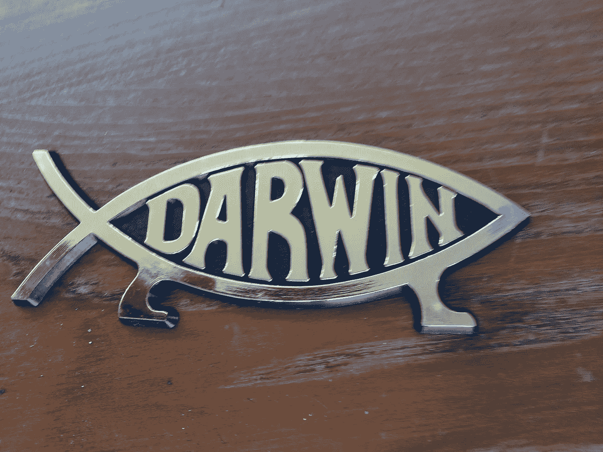

# 我们能在平等的基础上建立一个新的宗教吗？

> 原文：<https://medium.datadriveninvestor.com/can-we-start-a-new-religion-based-on-equality-9b0d5a342228?source=collection_archive---------18----------------------->

面对我们固有的意识形态和信仰，是值得考虑的

Can human society evolve? Christyl Rivers

## 我们需要做的是

在平等的基础上开始新的宗教传统的第一个问题是，人们会说:

“哦。但佛教已经创造了这一点，我们只需要遵循它。”

他们可能会说:“基督已经给我们带来了这个概念；我们只需要跟着它走。”或者，他们可能会说:“(在此插入宗教 __)已经开始了，我们只需要遵循它。”

他们都很好。但是，他们也错了。

比如佛教，不是建立在平等的基础上，而是建立在修正依附的思想上。如果我们不为我们所有的私欲的渴求和执着所苦，我们会更好地平等相待。

基督教不是建立在平等的基础上，而是建立在这样一种理念上，即如果我们爱邻居如爱自己，我们就会选择救赎。随着时间的推移，我们将向爱、公平和平等低头。

 [## 保护主义、政治和经济动荡|数据驱动的投资者

### 美国股市昨日出现 400 多点的大幅反转，为未来的事情发出了警告信号。市场…

www.datadriveninvestor.com](https://www.datadriveninvestor.com/2018/06/28/protectionism-politics-economic-turmoil/) 

所有其他宗教也一样，平等不是它们的基础，而是结果。

例如，伊斯兰教要求人们要虔诚，要真实。

印度教，最后，但绝对不是最不重要的，告诉追随者要重视因果报应、佛法、解脱(解脱描述开悟)和阿尔塔(物质成功)。

## 时间需要很长时间

文明会随着时间的推移而改变，但一种信仰的核心原则却很少改变。

创立一种新宗教的另一个问题是，人们每天都被灌输他们已经相信的东西。这种确认偏见开始是一种帮助我们生存的防御机制，但在一个抽象的世界里，它现在也分裂了我们。

因此，所有上述信仰的信徒，可能已经相信他们代表了为平等而努力。

在世界上为数不多的不支持平等趋势的宗教中，他们也已经下定决心拥抱“唯一的真正信仰”改变通常需要很长时间。

一个建立在平等基础上的新宗教，就像所有的信仰一样，会从争论术语是什么，如何应用它们，谁比其他人更平等，以及更多这样的分歧开始。

你永远也不能指望一个建立在基本公平和平等价值基础上的新宗教会比我们的政治、我们的种族问题、我们的社会阶级(仅举几个孤立的部落为例)受到更少的攻击。

社会就像其他生物一样进化。我们迈出的一大步是发明了抽象的思想、意识形态和信仰体系，它们在全球范围内影响着我们。

世界上无宗教信仰的人比以往任何时候都多。但是，即使去教堂做礼拜停止了，根深蒂固的意识形态仍然存在，这种意识形态通常是由谁拥有权力所驱动的。

## 平等值得追求吗？

我并不是说社会不应该追求平等。当然，我们都应该是女权主义者，是一个种族，如果我们提倡平等的人权。如果我们相信整个世界都值得我们欣赏和保护，我们可以称自己为环保主义者。

如果我们相信爱和宽恕，我们可以称自己为基督徒。我们可以称自己为佛教徒、印度教徒——不管怎样——如果我们从我们拥有的信仰开始，并随着我们的前进，加入更多对平等的尊重。每个人都可以不止是一件事。

变化通常发生得很慢，但有时包容性也会激增。例如，同性恋伴侣现在可以合法结婚。

不管你的信仰倾向于什么，LGBTQ 现在被所有理性的人视为完整的人。但也应该看到，他们为了接近平等，不得不奋斗了几个世纪。

就像自然界一样，大多数社会进化都是缓慢的变化，其间夹杂着惊人的飞跃。

## 打破父权制会留下锋利的碎片

许多人认为，为了重新开始一个更好的世界，我们必须摧毁旧的世界。这种观点有可取之处。然而，也有余波，拒绝，疏远，甚至更糟。

因为没有人能断言告诉别人如何生活而没有反冲，甚至反抗。对粉碎者来说，粉碎父权制意味着解放，但对那些更舒适、更稳定地拥有他们已经尊重的权威的人来说，这意味着真正的威胁。

在自然界，创造是中性的。她不喜欢灾难或流行病。大自然经常把东西砸成碎片重新开始。

然而，在人类社会，这是行不通的。人类努力影响偏爱。他们会拿走最好的土地，水资源等。、他们的近亲和/或自我认同的群体。

对于一个建立在公平和平等基础上的新宗教来说，唯一的方法就是我们消除这种共同的人类倾向。也就是说，如果我们真的包容所有人，我们将会完全侵蚀偏爱的顽固信念。

我认识的基督徒并不反对平等，他们反对那些挑战他们的信仰，不尊重他们的价值观的人。

也许，在未来的一千年里，我们可以看到联盟是如何帮助我们生存的。也许到那时，就像我们现在不再崇拜 Ra 或宙斯一样，我们会把平等视为信仰和爱情坚如磐石的基础。