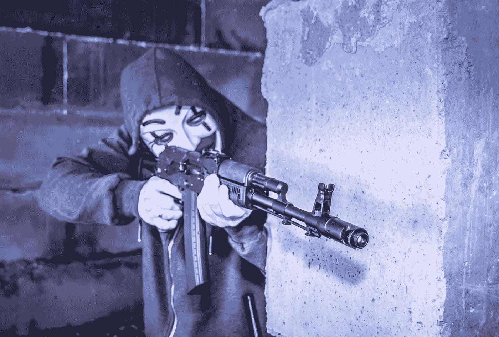

# 白人会是恐怖分子吗？

> 原文：<https://medium.datadriveninvestor.com/can-white-people-be-terrorists-2ed89dde4de4?source=collection_archive---------13----------------------->

## 在美国，答案似乎是否定的！

Photo by Bermix Studio on Unsplash

恐怖分子:使用非法暴力和恐吓，尤其是针对平民，以达到政治目的的人。

圣诞节那天在纳什维尔市中心引爆一辆房车的爆炸者名叫安东尼·奎恩·华纳。巨大的爆炸造成 3 人受伤，41 栋建筑受损。联邦调查局特工负责人道格·考内斯基承诺，联邦调查局将“调查所有可能的动机”华纳被称为“孤独者”，被描述为“低调而友好”，并且“非常照顾他的狗”他的邻居史蒂夫·施莫特说，“如果是他，他不想任何人受伤。”我们得到保证，华纳是“独狼”，单独行动。他从未被描述为恐怖分子。

前总统唐纳德·特朗普最近赦免了四名谋杀了 14 名伊拉克平民的男子。该公司雇用他们，然后命名为黑水，谁雇用雇佣军代表美国政府行事。他们的策略包括威胁、大规模破坏和谋杀。按照任何其他标准，他们都将被视为恐怖分子。但不是美国人。这四个人都是白人。

Dylann Roof 杀害了在南卡罗来纳州查尔斯顿的 Emanuel 非洲卫理公会主教堂与他一起祈祷的九名黑人信徒。他的社交媒体页面上散落着他和邦联旗帜的照片，他是一个白人至上主义者。未经检查，他立即被宣称患有精神病，但不是恐怖分子。

骄傲的男孩和布加洛·博伊斯是“好人”此时此刻，他们正计划带着武器出现在国会大厦，抗议总统选举的结果。泄露的执法文件显示他们被认为是“白人至上主义者”。“极端分子”和“帮派”没有使用的描述是恐怖分子。

无论描述是否恰当，棕色和黑色组织都很容易被宣布为恐怖分子。在弗吉尼亚州的亚历山大，美国政府指控 MS-13 的团伙成员犯有州际敲诈和恐怖主义罪。国际执法教育和培训协会告诉当地警方将黑人的命也是命视为[“策划暴力革命的恐怖分子”](https://apnews.com/article/police-guide-calls-blm-terrorist-group-8dc0afce2ce6b60dbaa0d1d9c53ce1e3)明尼阿波利斯警察联合会的主席称黑人的命也是命为“[恐怖组织”。](https://www.officer.com/command-hq/news/12215638/minneapolis-police-union-head-calls-black-lives-matter-terrorist-group)“唐纳德·特朗普承诺[将三 k 党定为恐怖组织](https://wgntv.com/news/trump-vows-to-designate-kkk-antifa-as-terrorist-groups/)；它从未发生过。

当你听到“恐怖分子”这个词时，你会想到谁？很有可能，这不是一个白人。在美国，关于袭击美国的恐怖分子的两种常见但虚假的叙述比比皆是。我们在电视、电影、新闻中看到它们，目前在特朗普政府中也是如此。首先是“恐怖分子总是(棕色)穆斯林。”第二是“白人从来都不是恐怖分子。”卡罗琳·马拉·科尔宾

在《福特汉姆法律评论》上，卡罗琳·马拉·科尔宾发表了一篇文章， [*“恐怖分子永远是穆斯林但绝不是白人:在批判种族理论和宣传的交汇点。”*](https://ir.lawnet.fordham.edu/cgi/viewcontent.cgi?article=5437&context=flr) 她描述了我们作为美国人通过看警匪剧和听我们的政客说话得到的灌输。我们从未见过白人恐怖分子，当白人实施恐怖行为时，他们会被解释为精神病、独狼或其他动机。白人并没有发明恐怖主义，但是他们在过去的几个世纪里变得非常擅长恐怖主义，并且总是伴随着这样的信息，那就是恐怖主义不是它本来的样子。

 [## 全民或跨州的国营保险私人医疗保险:经济学…

### 我们目前生活在一个所有非医疗行业都痴迷于…

www.datadriveninvestor.com](https://www.datadriveninvestor.com/2020/05/21/state-run-insurance-for-all-or-across-the-state-lines-private-healthcare-coverage-economics-politics-social-mix-up/) 

白人机构普遍支持白人的恐怖主义。由于拒绝承认系统性的种族主义和维护现状，黑人牧师和教会退出了南方浸礼会大会。特别是，南方的白人浸信会教徒在奴役黑人的问题上盖上了基督教的认可印章，从而使这一问题变得可以接受。在内战结束奴隶制后很长一段时间里，领导他们成员的同一批人是三 k 党和白人委员会的成员，他们恐吓黑人。然而，它以各种形式延续了很久。我不是说所有的白人都是恐怖分子；我是说，白人允许白人恐怖分子继续存在，甚至通过另一种方式繁荣发展。

当凯尔·里顿豪斯在威斯康星州基诺沙被指控谋杀时，他从伊利诺伊州出发，在一次黑人枪击事件后的抗议活动中杀死了两人，基督教筹款网站 Give Send Go 筹集了超过 27 万美元来支持里顿豪斯。在格雷戈里和特拉维斯·麦克迈克尔因谋杀慢跑者艾哈迈德·阿贝里而被捕后。一个脸书·佩奇，格雷戈里和特拉维斯·麦克迈克尔的正义，”[在一天之内增加了 80，000 多人](https://thegrio.com/2020/05/09/ahmaud-arbery-suspects-gofundme-facebook/)。参与杀害埃里克·加纳和乔治·弗洛伊德的警察在他们的 GoFundMe 网页上筹集了数十万美元。

美国白人不仅无视白人恐怖分子；他们受到至少一部分美国白人的积极支持；有多大比例尚未确定，但超过 7000 万人投票给唐纳德·特朗普，他帮助传播了白人恐怖分子是好人的信息。他告诉骄傲的男孩们“退后，袖手旁观”，目前正在倡导他们在 2021 年 1 月 6 日来到华盛顿特区，“为他而战”

有白人恐怖分子这种东西。国会通常忽略它们，而现任总统欣然接受它们。是时候让人们知道他们的意愿并要求他们成为执法的目标了。当然，七千万人表达了他们的意愿；该组织中白人恐怖分子的支持度仍未确定。1 月 6 日，我们将看到美国愿意忍受多少？

 [## 选举团:针对白人的平权行动

### 从技术上讲，选举团并不为所有白人服务；从来没有。它最初的目的是限制…

medium.com](https://medium.com/the-polis/the-electoral-college-affirmative-action-for-white-people-628db1a0a1fd)  [## 当你白了太久

### 白色让你不受差异和特权的影响

medium.com](https://medium.com/our-human-family/when-youve-been-white-too-long-91f50b4142fc) 

**进入专家视角—** [**订阅 DDI 英特尔**](https://datadriveninvestor.com/ddi-intel)