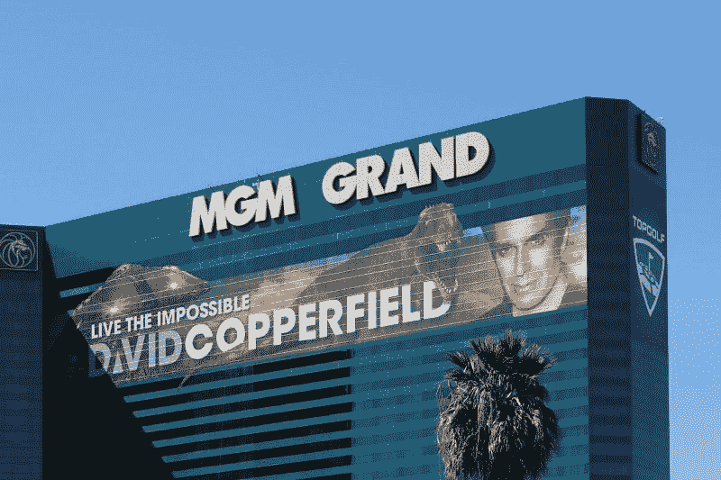
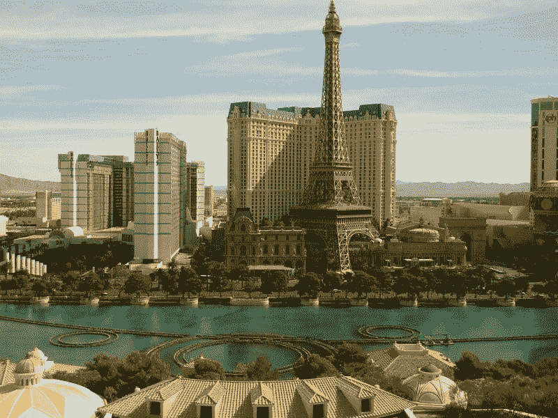
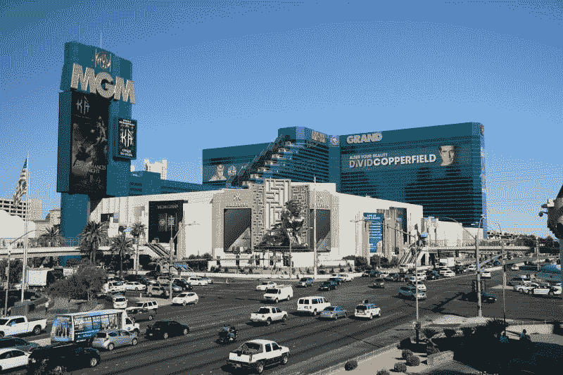
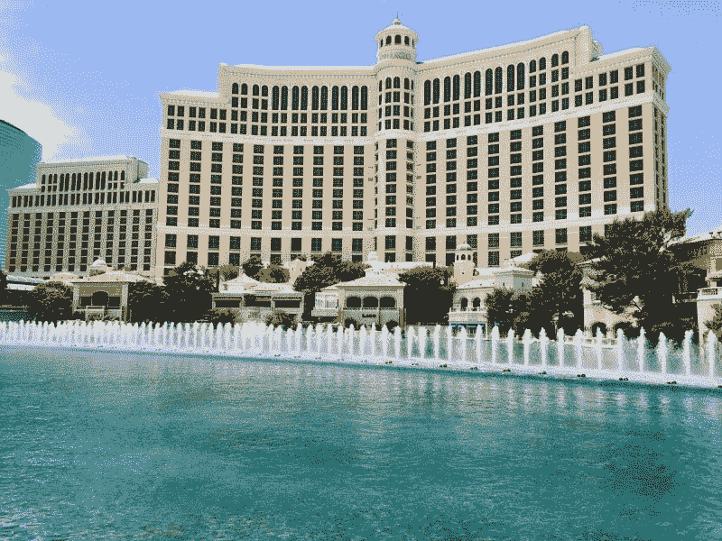
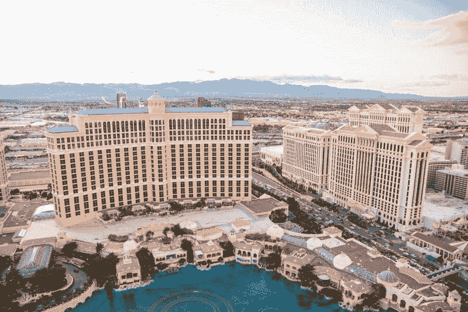
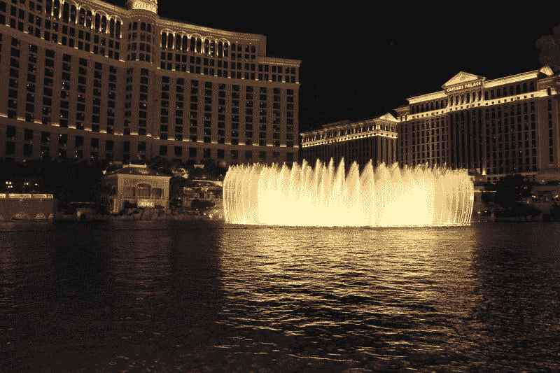

# 在拉斯维加斯工作能拯救米高梅度假村吗？—市场疯人院

> 原文：<https://medium.datadriveninvestor.com/can-work-from-vegas-save-mgm-resorts-market-mad-house-478900893b58?source=collection_archive---------18----------------------->

绝望的赌场运营商**米高梅度假村国际集团(纽约证券交易所代码:米高梅)**本可以找到拯救旅游业和赌场免于被遗忘的商业计划。

“拉斯维加斯的工作”将赌客打包，让他们飞往罪恶之城，住在米高梅的贝拉焦赌场、火烈鸟赌场、米高梅大赌场和艾瑞亚赌场。在“[维加斯](https://therealdeal.com/2020/08/09/mgm-desperate-for-cash-launches-work-from-vegas-program/?utm_source=internal&utm_medium=article_aside&utm_campaign=trd_list_posts&utm_content=trending_covid-19_news)工作”中，赌徒们白天可以在他们的套房工作，晚上则在赌场度过。

为了吸引富裕的远程工作者，**米高梅度假村集团(纽约证券交易所代码:米高梅)**提供诸如私人助理这样的额外津贴。此外，远程工作的鲸鱼可以通过直飞拉斯维加斯来保持社交距离。米高梅和航空公司 alle giant Travel Company(NASDAQ:ALGT)联手打造了这款来自拉斯维加斯的作品，即“飞行、工作和娱乐套餐”。

# 拉斯维加斯的工作是旅游业的未来吗？

米高梅和 Allegiant 正在向加利福尼亚芝加哥的富裕专业人士推销拉斯维加斯的作品；辛辛那提；印第安纳波利斯；伊利诺斯州的罗克福德和其他城市，据《今日美国》报道。Allegiant 从拉斯维加斯大道的麦卡伦国际机场出发，为 58 个城市提供服务。

Allegiant 和米高梅公司为期四天的“在拉斯维加斯工作”套餐收费 340 美元至 638 美元。价格取决于赌场，由赌客选择。老款的火烈鸟售价 227 美元，而米高梅在豪华的贝拉焦酒店“从拉斯维加斯工作”收费 638 美元。

首席营销官斯科特·迪安杰罗告诉《今日美国》“用公司卡支付的商务旅行者现在正让位于自费去离家很远的地方工作的个人旅行者。”。迪安杰罗认为赌场需要“在拉斯维加斯工作”,因为国际游客的收入减少了。

 [## 押注旅游公司|数据驱动型投资者

### 秘密度假被搁置已经不是什么秘密了。航空公司和旅游公司实际上已经处于停滞状态…

www.datadriveninvestor.com](https://www.datadriveninvestor.com/2020/08/18/taking-a-bet-on-travel-companies/) 

# 拉斯维加斯吸引不了游客

拉斯维加斯会议和旅游局估计，2018 年拉斯维加斯吸引了 300.9 万海外游客和 583.34 万国际游客。*

然而，美国政府阻止来自许多地区的旅行者；包括中国、欧盟、英国、爱尔兰和美国以外的巴西。因此，884.24 万游客无法到达拉斯维加斯和米高梅的桌子和老虎机。

此外，冠状病毒正在扼杀拉斯维加斯的会展业务。比如他们已经取消了著名的消费电子展(CEC) 2021。

取而代之的是，[消费者技术协会(CTA)将举办在线消费电子产品展览会](https://arstechnica.com/gadgets/2020/07/ces-2021-in-las-vegas-is-cancelled-event-moves-online/)， *Ars Technica* 报道。CEC 的取消对拉斯维加斯来说是一场灾难，因为电子行业最大的贸易展每年可以吸引超过 150，000 名游客。

由于美国未能遏制冠状病毒，CTA 取消了 CES。然而，如果冠状病毒得到控制，CES 可能会在 2022 年回归。

因此，在 2022 年之前，米高梅的拉斯维加斯赌场可能没有会展业务。因此，寻求新的市场，如“在拉斯维加斯工作”是明智之举。

# 米高梅度假村赚钱了吗？

米高梅度假村集团(MGM Resorts)需要新的市场，因为它的赌场在赔钱。例如，2020 年 6 月 30 日，米高梅公布了 10.35 亿美元的季度运营亏损。

相比之下，米高梅 2020 年 3 月 31 日的季度营业收入为 12.51 亿美元，2019 年 12 月 31 日的营业收入为 29.6 亿美元。此外，米高梅的季度毛利从 2019 年 12 月 31 日的 12.85 亿美元降至 2020 年 3 月 31 日的 8.1465 亿美元，至 2020 年 6 月 30 日的-8，456 万美元。

此外，米高梅的收入已经崩溃。米高梅的季度收入从 2019 年 12 月 31 日的 31.85 亿美元增长到 2020 年 3 月 31 日的 22.53 亿美元，再到 2020 年 6 月 30 日的 2.8981 亿美元。

令人吃惊的是，Stockrow 估计米高梅的收入在截至 2020 年 6 月 30 日的季度缩水了 91.01%。这是米高梅第二个收入崩溃的季度，截至 2020 年 3 月 31 日的季度收入下降了 29.09%。相比之下，在截至 2019 年 12 月 31 日的季度，米高梅的收入增长率为 4.33%。

最后，米高梅的季度共同净收入从 2019 年 12 月 31 日的 20.09 亿美元下降到 2020 年 3 月 31 日的 8.0687 亿美元，再到 2020 年 6 月 30 日的-8.2726 亿美元。因此，米高梅度假村在六个月内从 20.09 亿美元的普通净收入变为 857.26 美元的普通净亏损。

# 米高梅度假村产生了多少现金？

米高梅度假村(NYSE: MGM) 在六个月内从现金充裕变成烧钱。

**米高梅在 2019 年 12 月 31 日报告了 4.5429 亿美元的季度运营现金流。该季度经营现金流在 2020 年 3 月 31 日降至-4.2294 亿美元，在 2020 年 6 月 30 日降至-6.6257 亿美元。**

米高梅在 2019 年 12 月 31 日报告了 4.5429 亿美元的季度运营现金流。该季度经营现金流在 2020 年 3 月 31 日降至-4.2294 亿美元，在 2020 年 6 月 30 日降至-6.6257 亿美元。

米高梅可以筹集巨额资金。例如，米高梅度假村报告 2020 年 3 月 31 日的季度现金融资现金流为 17.45 亿美元。然而，2020 年 6 月 30 日，融资现金流降至-4.9693 亿美元。这意味着米高梅迅速偿还了债务。

米高梅也可以从投资中获得巨额利润。米高梅在 2019 年 12 月 31 日报告的季度投资现金流为 45.49 亿美元，到 2020 年 3 月 31 日降至 23.63 亿美元。然而，2020 年 6 月 30 日，季度投资现金流降至-2 197 万美元。

# 米高梅度假村有什么价值？

因此，**米高梅(纽约证券交易所:米高梅)**在 2020 年 3 月 31 日报告了 60.16 亿美元的现金和短期投资，在 2020 年 6 月 30 日报告了 48.36 亿美元的现金和短期投资。因此，米高梅可以产生大量的现金。

此外，米高梅有巨大的价值。截至 2020 年 6 月 30 日，米高梅的总资产为 374.71 亿美元。然而，这些资产从 2020 年 3 月 31 日的 391.19 亿美元下降。

我认为米高梅有足够的钱让《在拉斯维加斯工作》获得成功。然而，“在拉斯维加斯工作”是一个未经证实的概念。没有证据表明，任何人都会飞到拉斯维加斯工作和娱乐。

另一方面，我认为有数百万铁杆赌徒会喜欢“在拉斯维加斯工作”例如，需要离开孩子和丈夫的职业母亲。足球妈妈和她的女朋友们可以去度假。

同样，一对工作的夫妇可以飞到拉斯维加斯，把他们的孩子交给赌场的托儿所，而他们整天都在工作。或者，一位首席执行官可以让他的全体员工乘飞机去拉斯维加斯度假和开会。

因此，米高梅的明智之举是在其赌场中增加日托和儿童娱乐。因此，压力大的父母可以在他们的房间工作，而赌场看着孩子。

# 在拉斯维加斯工作能拯救旅游业吗？

奇怪的是，米高梅在拉斯维加斯的工作可以拯救整个旅游业。**迪士尼(纽约证券交易所股票代码:DIS)** 可以在迪士尼乐园、迪士尼世界或 EPCOT 中心提供“迪士尼作品”。

一个解决方案可以是旅游套餐，让父母在迪士尼酒店工作，而迪士尼员工照看孩子。例如，迪斯尼，或者米高梅，可以在他们的度假胜地为孩子们组织营地。它可以这样工作，孩子们可以在白天去露营，而他们的父母在酒店工作。

主题公园需要帮助，因为康卡斯特(NASDAQ: CMCSA) 环球影业将于 2020 年 8 月 21 日关闭两家奥兰多酒店。据*主题公园内部人士*报道， [Loewe's Sapphire Falls 度假村和环球公司的 Aventura 酒店将因缺少客人而暂时关闭](https://www.themeparkinsider.com/flume/202008/7654/)。此外，他们还没有重新开放两家奥兰多环球酒店；波多菲诺工资和无尽的夏天——码头边，因为冠状病毒。

奥兰多环球影城尽管对顾客有很大的折扣，但仍无法填满酒店房间。因此，环球需要寻求新的业务，如奥兰多的工作或主题公园的工作。

# 拉斯维加斯的工作是旅游业的未来

另一个可以从远程工作中获利的行业是游轮业。嘉年华公司可以提供海上工作。

在国内，酒店公司可以为那些想换换风景或离开孩子的远程员工提供纽约、迈阿密或洛杉矶的工作。冬天，滑雪场可以提供在斜坡上工作的机会。或者在维尔工作。

我预测工作假期将会很受欢迎，因为人们可以在他们喜欢的度假地点呆很长时间。例如，滑雪者或滑雪板爱好者可以在维尔度过整个冬天。此外，冲浪者可以在海滩度过整个夏天，而渔夫可以在鳟鱼溪度过几个月。

我认为酒店工作会有一个巨大的市场，因为远程员工不会回到办公室。[纽约市合作伙伴组织估计，2020 年 8 月 14 日，只有 8%的远程办公的纽约人回到了办公室。](https://therealdeal.com/2020/08/14/whos-returning-to-the-office-almost-no-one/?utm_source=internal&utm_medium=article_aside&utm_campaign=trd_list_posts&utm_content=trending_covid-19_news)

冠状病毒正在彻底改变旅游业。我认为未来的假期可能是长时间呆在一家旅馆里，在那里游客将工作和娱乐结合在一起。

# 米高梅度假村的股票有什么价值？

米高梅度假村国际集团(MGM Resorts International)可能是一项价值投资，因为它在股价暴跌时仍保留了一些价值。

例如，米高梅的股价从 2020 年 1 月 2 日的 33.66 美元跌至 2020 年 8 月 14 日的 21.81 美元，再跌至 2020 年 8 月 19 日的 20.90 美元。然而，米高梅将在 2020 年 9 月 15 日支付 2.5₵季度股息。总的来说，[Dividend.com 估计米高梅在 2020 年 8 月 14 日提供了](https://marketmadhouse.com/can-work-from-vegas-save-mgm-resorts/#tm=3-ticker-best-div-capture&r=ES::DividendStock::Stock%23MGM--NYSE&f_28=true&only=meta,data,thead)52₵的年化股息和 2.44%的股息收益率。因此，我认为米高梅是一只股息差的股票，但低股息给了它一点安全边际。

如果你正在寻找一只便宜但有风险的股息股票，并且有产生现金的历史，米高梅值得一看。特别是，米高梅似乎有一个积极进取的管理层，将改变其业务，以适应不断变化的条件。然而，只有能够承受损失的人才应该收购米高梅，因为没有证据表明“在拉斯维加斯工作”的计划会有回报。

* https://assets . simpleviewcms . com/simple view/image/upload/v1/clients/las Vegas/2018 _ Intl _ visitoration _ Country _ and _ World _ Region _ 6e1a 739 f-736 c-4f 27-ae74-1a 78 FFE 7d 590 . pdf

*原载于 2020 年 8 月 19 日*[*【https://marketmadhouse.com】*](https://marketmadhouse.com/can-work-from-vegas-save-mgm-resorts/)*。*

**访问专家视图—** [**订阅 DDI 英特尔**](https://datadriveninvestor.com/ddi-intel)