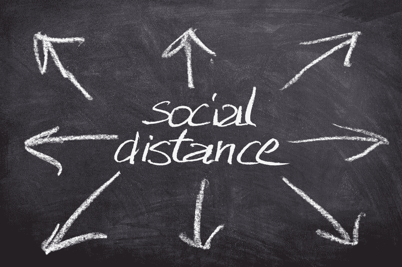

# WWE 能从冠状病毒上赚钱吗？—市场疯人院

> 原文：<https://medium.datadriveninvestor.com/can-wwe-make-money-from-coronavirus-market-mad-house-7287c2200c0c?source=collection_archive---------18----------------------->

对于世界摔跤娱乐公司来说，这是混乱的一年。美国顶级摔跤推广赚钱，即使它产生更多的争议。

例如，WWE 的季度营业收入从 2019 年 12 月 31 日的 9982 万美元降至 2020 年 9 月 30 日的 6338 万美元。同样，WWE 的季度毛利从 2019 年 12 月 31 日的 1.5126 亿美元下滑至 9 月 30 日的 1.1360 亿美元。

同样，WWE 的季度收入从 2019 年 12 月 31 日的 3.228 亿美元降至 2020 年 9 月 30 日的 2.2159 亿美元。加上 WWE 的季度运营现金流从 2019 年 12 月 31 日的 1.1942 亿美元下降到 2020 年 9 月 30 日的 1.1684 亿美元。

# WWE 在疫情期间增值

然而， **WWE (WWE)** 在 2020 年 9 月 30 日的季度末现金流为 9485 万美元。季度期末现金流从 2019 年 12 月 31 日的 1397 万美元上升。WWE 在 2020 年 6 月 30 日的季度融资现金流为 1.8657 亿美元，表明该公司借了一些钱。

有趣的是， **WWE (NSYE: WWE)** 在 2020 年 9 月 30 日有 6.3825 亿美元的现金和短期投资。现金和短期投资从 2019 年 12 月 31 日的 2.5048 亿美元。同期，WWE 总资产从 2019 年 12 月 31 日的 9.9223 亿美元上升至 2020 年 9 月 30 日的 13.54 亿美元。

因此，WWE 在疫情获得了一些价值。值得注意的是，Stockrow 估计 WWE 在截至 2020 年 9 月 30 日的季度中有一个收入增长率。该收入增长率从 2020 年 6 月 30 日的-16.89%上升，并从 2020 年 3 月 31 日的 59.5%下降。

# WWE 和数字未来

**世界摔跤娱乐公司(NYSE: WWE)** 是一只迷人的股票，因为它是仅存的几家纯娱乐公司之一。

相比之下，对于经营主题公园的迪斯尼集团来说，WWE 只提供娱乐。类似地，**康卡斯特(NASDAQ: CMCSA)** 拥有有线电视公司和主题公园，**在& T (T)** 拥有电话公司。

然而，美国电话电报公司、康卡斯特和迪斯尼都在模仿 WWE。早在 2014 年 2 月，WWE 就推出了流媒体服务 WWE Network。

迪士尼于 2019 年 11 月 12 日推出了 Disney+,康卡斯特于 2020 年 7 月 15 日推出了孔雀，美国电话电报公司于 2020 年 5 月 27 日推出了 HBOMax。因此，WWE 在流媒体视频方面走在了前列。

# WWE 网络是不是很失败？

但是，流媒体视频对 WWE 的帮助并不大。我认为 WWE 网络是流媒体视频未来的一个糟糕的晴雨表，因为它只提供一种娱乐摔跤。

值得注意的是，*摔跤公司*估计，2020 年第二季度，WWE 网络在全球只有[169 万订户](https://www.wrestlinginc.com/news/2020/07/updated-wwe-network-subscriber-count-673014/)。我认为 WWE 网络吸引力有限的一个原因是 WWE 未能利用它。

解释一下，WWE 未能在其网络中增加其他种类的娱乐。例如，WWE 可以提供非摔跤的卡通、老电影、戏剧或其他种类的运动。因此，WWE 网络只吸引摔跤标记。

WWE 网络的一个明智之举可能是播放一部正剧或喜剧。或者摇滚音乐会或单口喜剧。我认为未能实现多样化会扼杀 WWE 网络。

然而，WWE 网络的生存证明了流媒体视频是可行的，并表明你可以与**网飞(NFLX)** 竞争。迪斯尼、康卡斯特、AT & T 和其他地方的人们注意到了这一点。

奇怪的是，WWE 现在在 Peacock 上播放一些节目。因此，我认为 WWE 可以在某个时候放弃它的网络，向其他平台出售内容。

# WWE 和冠状病毒

奇怪的是，我认为冠状病毒可能对 WWE 有益。首先，冠状病毒迫使 WWE 关闭其大型巡回演出。那些铺张浪费是昂贵的，对公司来说价值不大。

第二，冠状病毒迫使 WWE 专注于数字内容。例如，WWE 现在所有的比赛都在奥兰多举行，该公司花了巨额资金建造了[雷电穹顶](https://www.insider.com/inside-wwe-thunderdome-a-futuristic-arena-for-the-coronavirus-era-2020-9)。Thunderdome 是一个巨大的房间，球迷可以通过 Zoom 和其他视频应用程序观看比赛。如果你看 WWE 电视，你会注意到粉丝的脸出现在墙上。

 [## 冠状病毒疫情正在重塑区块链吗？该技术如何帮助应对该病毒|数据…

### 当前的冠状病毒疫情已经严重影响了区块链和加密货币行业的方方面面…

www.datadriveninvestor.com](https://www.datadriveninvestor.com/2020/07/15/is-the-coronavirus-pandemic-reshaping-blockchain-and-how-can-the-tech-help-tackle-the-virus/) 

知情者指出，截至 2020 年 9 月，WWE 已经收到了 13 万份加入 Thunderdome 的申请。雷霆穹顶于 2020 年 8 月开始运行。

我认为 Thunderdome 可能是直播运动的未来。解释一下，我认为像棒球、篮球、曲棍球和赛车这样的运动会创造出雷雨球类型的环境。类似地，百老汇和音乐可以使用相同的格式来广播戏剧和音乐会。

因此，冠状病毒迫使 WWE 先于其他娱乐公司进入未来。正如伟大的摔跤解说员吉姆·罗斯；肌肉发达的摔跤手知道如何在疫情赚钱，而其他娱乐场所却做不到。

我认为冠状病毒使 WWE 处于一个有影响力的位置。具体来说，WWE 有资源在别人做不到的情况下快速创作大量原创节目。因此，WWE 可以为网络和流媒体服务提供数百小时的原创节目。

我预测我们会在电视和流媒体上看到更多的摔跤节目。不是因为人们喜欢摔跤，而是因为摔跤是唯一的原创娱乐节目。

# WWE 超级明星的反抗

奇怪的是，WWE 正面临着劳工骚乱和一些超级明星的反抗。例如，许多 WWE 明星不喜欢该公司禁止第三方社交媒体。

这项政策的主要受害者是泽琳娜·维加，她在 Twitch 和社交媒体上赚的钱比在 WWE 上赚的还多，《T2 摔跤观察家》的戴夫·梅尔策声称。WWE 于 2020 年 11 月 13 日解雇了 Vega。

维加得到了[‘美国演员工会——美国电视和广播艺术家联合会’，【T5’(SAG-af tra)联盟， *Sportskeeda* 声称的支持。SAG-AFTRA 主席 Gabrielle Carteris 在 Vega 获释后联系了她。](https://www.sportskeeda.com/wwe/news-labor-union-president-reaches-zelina-vega-release-wwe-problem)

失败的民主党总统候选人杨安泽也支持 WWE。杨已经成为 WWE 和的公开批评者。杨甚至上了的*谈是杰里科*播客来攻击 WWE。

杨告诉杰里科，他一直在接触不愉快的超级明星。杨声称，WWE 的一位超级明星发给他一份 WWE 合同的副本。律师杨认为 WWE 的合同是限制性的、不公平的，而且可能是非法的。

# 巨星的造反会毁掉 WWE 吗？

我不知道 WWE 明星的反抗会导致什么，但它让我想起了 20 世纪 40 年代末的明星反抗，那次反抗推翻了臭名昭著的好莱坞电影制片厂制度。

解释一下，在 20 世纪 30 年代和 40 年代，工作室。米高梅、华纳兄弟、雷电华广播电影公司、派拉蒙、环球和 20 世纪福克斯试图通过铁证合同保持对明星的完全控制。就像 WWE 试图通过铁证合同来控制摔跤手一样。

值得注意的是，工作室系统崩溃的一个原因是女演员奥利维亚·德·哈维兰对华纳兄弟提起的“德·哈维兰法律”诉讼。德哈维兰起诉是因为华纳兄弟让她停职。就像文斯今天让摔跤手停赛一样。

我怀疑 WWE 管理层需要做出让步来结束这场反抗。例如，WWE 可以让明星从社交媒体之外赚钱。因此，WWE 将需要与明星建立一种新的关系，这可能会重新定义行业，因为 20 世纪 40 年代的明星起义重塑了好莱坞。

德哈维兰法律颁布后的几年内，电影明星拥有了创作控制权，许多明星获得了总收入的分成；电影利润，其他人制作电影。就在几年前，演员的独立程度是前所未闻的。

只有时间才能证明超级明星的反抗是否会摧毁 WWE。然而，有一点是清楚的。WWE 将不得不重新定义其与明星的关系才能生存。

# WWE 有什么价值？

另一方面，我觉得 **WWE (WWE)** 是一只很烂的股票。我认为市场先生在 2020 年 11 月 25 日将 WWE 定价过高，为 41.97 美元。

然而，WWE 提供了一些价值。例如，它将在 2020 年 12 月 28 日支付 12₵季度股息。总的来说，WWE 在 2020 年 11 月 25 日提供了 [48₵年度股息和 1.16%的股息收益率](https://www.dividend.com/stocks/communications/media/publishing-broadcasting/wwe-world-wrestling-entertainment/)。

因此，WWE 是一个很好的廉价股息股。然而，我认为 WWE 是一个不稳定和快速变化的行业中的利基参与者。我认为聪明的投资者需要回避，因为我不知道这家公司有什么未来。

*原载于 2020 年 11 月 25 日 https://marketmadhouse.com***。**

## *访问专家视图— [订阅 DDI 英特尔](https://datadriveninvestor.com/ddi-intel)*