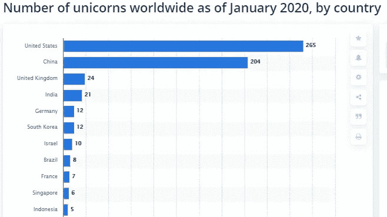

# 你能在世界上任何地方建立一个创业公司吗？

> 原文：<https://medium.datadriveninvestor.com/can-you-build-a-startup-anywhere-in-the-world-6ce609154546?source=collection_archive---------13----------------------->

## 换句话说，你准备好拆除一些成功的心理障碍了吗？

Photo by [Glen Carrie](https://unsplash.com/@glencarrie?utm_source=medium&utm_medium=referral) on [Unsplash](https://unsplash.com?utm_source=medium&utm_medium=referral)

100 米短跑比赛有 10 秒的心理和生理极限。早在 80 年代，这是一个如此关键的障碍，只有少数世界级的运动员才能超过 10 秒大关。

吉姆·海因斯在 1968 年第一次实现了短跑运动员无法实现的标志，并且在接下来的九年里无法重复，后来当这个极限开始被反复超越时，它成为了一个标准。在 2016 年里约奥运会上，六名不同的短跑运动员能够在 10 秒的限制下完成 100 米 *(Olympic.org，2016)* 。

对于初创公司来说，获得至少 10 亿美元的估值也是一个心理和技术挑战。当你的公司最终达到这个估值时，恭喜你！你现在被正式称为“独角兽”。

 [## 为什么那个创业者筹的比我多那么多？数据驱动的投资者

### 养多少既是一门艺术，也是一门科学，这个话题在许多其他帖子中有详细讨论。这篇文章将…

www.datadriveninvestor.com](https://www.datadriveninvestor.com/2020/06/14/why-is-that-entrepreneur-raising-so-much-more-than-me/) 

当风险投资家 Aileen Lee 在 2013 年第一次将独角兽这个词用于这些公司时，全球只有 39 家独角兽，因此这个名字的灵感来自于这种成功的罕见性*(范，2016)* 。然而，截至 2020 年 7 月，全球约有 500 家独角兽公司(Cbinsights，2020)。

就像在体育领域一样，越多的公司超越这个障碍，心理极限就变得越弱，而且更多的时候，公司开始超越这个极限。

Source [Statista](https://www.statista.com/statistics/1096928/number-of-global-unicorns-by-country/)

上图显示，只有十个国家拥有五只以上的独角兽。其他大多数国家要么有一只独角兽，要么根本没有。因此，这些国家的壁垒远未解除。

尽管成为科技独角兽变得越来越容易，但大多数国家仍然没有独角兽。有时，你所在的地方会给你带来界限和额外的挑战。

# 是什么助长了你的心理障碍？

尤其是在第三世界国家，成为独角兽似乎是一个无法实现的梦想。我的重点是在这一点上的心理障碍，向你们展示了推动它的潜在因素。以下是其中的一些:

*   获得资本
*   缺乏熟练员工
*   不成熟的创业文化和生态系统

# 获得资本

当你走进旧金山湾区的一家咖啡店时，很可能会看到一位企业家向风险投资家或天使投资人推销一个想法。这个地区到处都是有想法的企业家和寻找机会投资多余资金的投资者。

在发展中国家，由于不可预测的宏观经济条件和不稳定的当地货币，投资者更愿意投资于风险较低的资产。因此，他们大多更喜欢传统的投资选择，如股票、债券、大宗商品或房地产。

如果这些投资者有更高的风险偏好，他们可能会投资尚未上市的公司，但很可能已经盈利并以特定的速度增长。这是一个阻碍初创企业获得早期投资的选择，只有当你能够从家人和朋友那里筹集资金，直到实现盈利的阶段，你才能成为一名企业家。

# 缺乏熟练员工

所有国家的智商分布都很公平。每个国家都有有潜力做出改变的天才。然而，成为独角兽绝不仅仅是你有多聪明。**接受教育、在其他创业公司获得工作经验的可能性、获取知识等**。所有这些因素都需要培养这种智商，以创造出有技能的员工，进而创造出下一个独角兽。

尽管许多发展中国家拥有相当聪明和熟练的员工，但一些国家只为少数精英提供有利的机会。即使这些人是在可以与世界竞争的标准下长大的，他们对学习和取得更多成就的渴望也会导致他们移民到更发达的国家。最终，这一切导致人才外流，这些人在其他国家创造了他们的独角兽。

# 不成熟的创业文化和生态系统

另一个在你的国家的第一只独角兽前筑起一道墙的因素是文化。如果你像我一样，在一个经济环境不可预测的国家长大，你就会知道你的创业希望会被家人和朋友无数次地粉碎。

你总是会被告知，你应该拿着稳定的薪水工作，一生存钱，不是如果而是当经济不景气的时候。创业有很多起起落落，由于涉及风险，它不太可能为你提供一定的生活水平。因此，你的动力甚至在开始之前就被对未来的焦虑扼杀了。

这种不利的文化也影响了健康创业生态系统的创建。因为它被认为更多的是一时的心血来潮，而不是一个可感知的职业，它创造了更少的企业家、投资者、导师、孵化器等等。最终，它导致一个更小的生态系统。

# 是必须接受现状，还是有反击取胜的机会？

绝望到此为止，提到为什么特定的地理区域不能产生独角兽，我也想在这里给希望一瞥。

正如吉姆·海因斯(Jim Hines)证明 100 米跑低于 10 秒是实际可行的，许多短跑运动员后来超过了这一限制，这些国家的第一个坚定的独角兽激励了许多其他人。之后这些国家开始生产越来越多的独角兽。

# 关于巅峰会

为了让这个案例更具体，我想谈谈土耳其的第一个科技独角兽高峰游戏。成立于 2010 年，是一家设计和开发移动卡牌游戏的移动技术公司。

该公司以其手机游戏*玩具爆炸*和*卡通爆炸*而闻名，被全球游戏巨头 Zynga 以 18 亿美元 *(Peak，2020)* 收购。官方声明和金额直接来自公司本身。如果你感兴趣，你可以在这里查看他们的大量新闻稿。

如果你想更多地了解 Peak Games 及其与 Zynga 的交易，并且不想阅读他们长达 7 页的新闻稿，你也可以查看下面的视频，了解交易的亮点，并听取 Peak 战略总监的故事。

上面列出的所有障碍，如获得资本、缺乏熟练员工、不成熟的创业文化和生态系统，都是 Peak Games 和土耳其任何科技公司的有效借口。然而，Peak Games 对移动游戏开发的坚持不懈带来了令人瞩目的退出，而移动游戏在土耳其并不是一个实质性的产业。

# 这一切是怎么回事？

当然，不能保证 Peak Games 的显著成功会让土耳其出现无数独角兽。然而，可以肯定的是，手机游戏现在是一个备受关注的行业。

媒体对创业公司的报道比以往任何时候都多。最重要的是，Peak Games 打破了一个心理障碍，即不可能成为土耳其的科技独角兽。

最初，匹克可能没有多少机会进入首都。他们的潜在雇员可能更喜欢在他们的基地之外寻找职业。甚至他们的产业或企业家精神在他们的地理位置上也可能被低估。**然而，他们还是做到了！更重要的是，如果他们做到了，你现在知道你也可以。**

我讲匹克的故事不是为了给你一个框架去复制。完全相反。他们之所以成功，是因为他们不听别人的话，不顾外界条件，追逐自己的信念。

无论你的创业公司在哪里，只要你打破障碍，相信自己，你就会以自己独特的方式找到成功之路。

> 如果你不相信你自己，那么谁会相信你呢？下一个人的方法不一定适合我，所以我必须创造我自己的方法。迈克尔·科尔达

下次见！

同样来自作者:

 [## 我尝试了三种商业模式，直到我的创业彻底失败

### 在承认彻底失败之前，以下是我从每一次失败中学到的东西。

medium.com](https://medium.com/datadriveninvestor/the-3-business-models-i-tried-until-my-startup-completely-failed-d8232c2af84) 

特别感谢我的朋友 Harun reit Aydin 用他宝贵的想法启发了这件作品！

# 参考

 [## 1 亿男子

### 访问 2016 年里约夏季奥运会男子 100 米比赛的官方结果，并观看视频…

www.olympic.org](https://www.olympic.org/rio-2016/athletics/100m-men) 

规范独角兽:公开和新的私有经济。BCL Rev. 57 (2016): 583。

 [## 独角兽公司的完整列表

### 独角兽公司是估值超过 10 亿美元的初创公司。这是一个正在进行的名单，所有独角兽公司在…

www.cbinsights.com](https://www.cbinsights.com/research-unicorn-companies) 

**访问专家视图—** [**订阅 DDI 英特尔**](https://datadriveninvestor.com/ddi-intel)