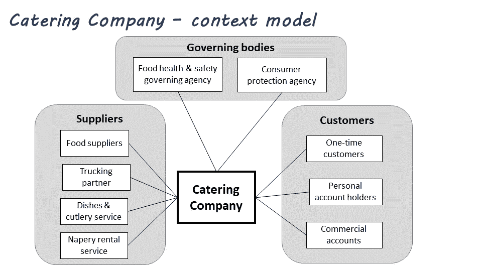
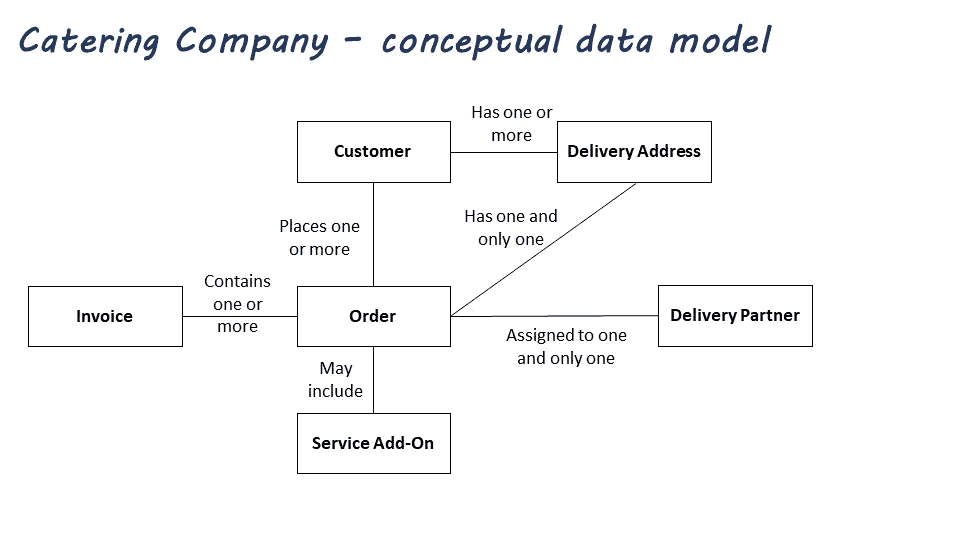
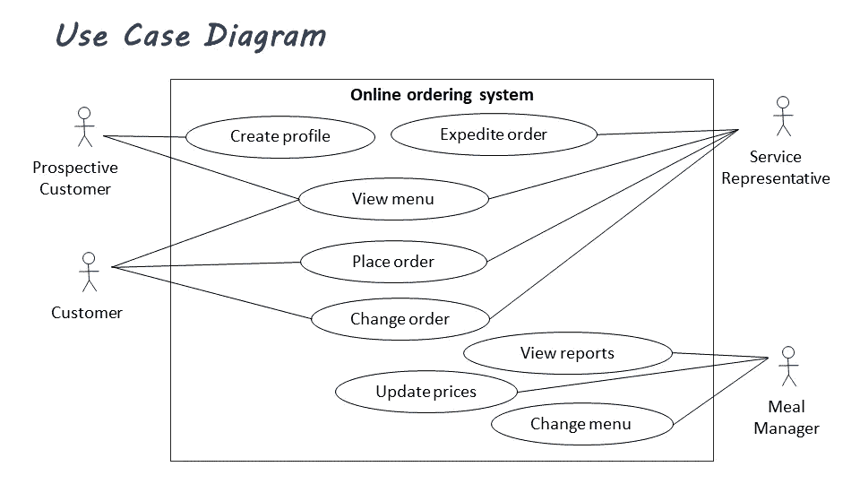
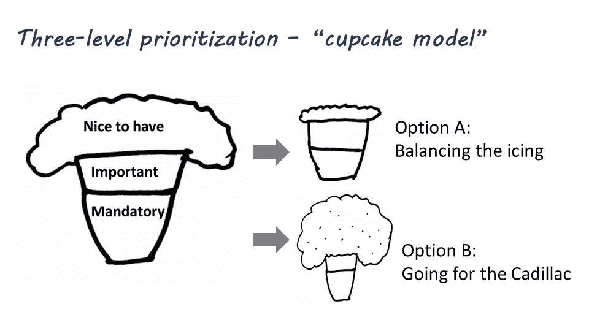
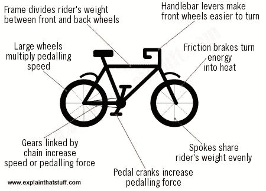

# 你能在没有图片的情况下解释自行车是如何工作的吗？

> 原文：<https://medium.datadriveninvestor.com/can-you-explain-how-a-bicycle-works-without-a-picture-c8535a2df1d4?source=collection_archive---------5----------------------->

## 祝你好运！

Photo by [Milada Vigerova](https://unsplash.com/@mili_vigerova?utm_source=unsplash&utm_medium=referral&utm_content=creditCopyText) on [Unsplash](https://unsplash.com/s/photos/bike-gears?utm_source=unsplash&utm_medium=referral&utm_content=creditCopyText)

我女儿本质上不是机械师。但是有一天，她决定学习自行车实际上是如何工作的。不，她没有试图拆开一个——她谷歌了一下。

她怒气冲冲地来找我:

> 我试过查自行车是怎么工作的，有些网站连图片都没有！没有图怎么解释这个？

的确，你怎么能呢？

即使你相信你可以不用图片来解释这个，别人会理解你的解释吗？

你曾经试图向任何人描述一个困难的概念吗？你是拿了一张纸，还是拿了一支记号笔到白板上？我一直都这么做。这通常对演讲者和他们的观众都有好处。

许多人发现通过画一张地图，或者一个模型，或者一个小流程图来解释一些事情要容易得多。画图更快，它可以让你直接抓住要点，只需要花三分之一的时间就可以构成复杂的句子。它可以用一条线或一点颜色让一些东西变得更清晰。

 [## 2020 年最佳短期投资选择精选资源|数据驱动型投资者

### 投资是增加你净财富的一个好方法。如果你通过遵循一个严格的…

www.datadriveninvestor.com](https://www.datadriveninvestor.com/2020/03/28/handpicked-resources-for-the-best-short-term-investment-options-of-2020/) 

然而，视觉效果和图表在商业环境中往往没有得到充分利用，而在商业环境中它们是无价的。

一个利益相关者的影响分析在一个背景模型下会更有意义:

Picture by author

术语表的定义和规则可以压缩到一个表格中，并辅以一个概念模型:

Picture by author

新系统范围的详细描述可以用用例图来代替:

Picture by author

一幅幽默或愚蠢的图片有助于一场关于美好需求价值的艰难讨论:

Picture by author

我不知道你，但我从来没有听到有人抱怨太多的图表。没有要求摆脱一个令人困惑的图片，只是用简单的英语写下它的意思。通常是反过来的。

企业架构委员会、战略委员会、项目办公室和业务分析团队可以在模型、地图和图表的帮助下更有效地交流。

谁能帮忙呢？

业务分析师和架构师是可视化交流复杂概念的专家。他们的工作包括各种分析和建模活动:

*   在业务能力图中捕获业务的当前状态
*   描述和分析流程
*   理解(并向他人解释)业务实体和概念之间的关系
*   调查问题的根本原因
*   创建未来产品或流程的愿景
*   捕捉用户体验
*   故事板游戏和互动

制作传达信息的图片和视觉材料[不是黑暗艺术](https://why-change.com/2019/05/28/the-dark-art-of-modeling/)。这是一种可以学习的技能，即使你认为你不会画画。

你可以从任何标准的办公软件开始，比如 MS Office。即使是 MS PowerPoint 也能满足 80%的基本图表需求。对于高级建模，市场上有多种工具支持 [UML](https://www.visual-paradigm.com/guide/uml-unified-modeling-language/what-is-uml/) 、 [BPMN](http://www.bpmn.org/) 、 [TOGAF](https://pubs.opengroup.org/architecture/togaf9-doc/arch/) 或 [ArchiMate](https://pubs.opengroup.org/architecture/archimate3-doc/) 符号。学习这些建模符号将在许多情况下给你带来竞争优势。

如果今天我能让你相信一件事，那就是:

> 每当你需要传达一个困难的概念时，用视觉来补充它。

你的大多数观众都会欣赏它。

添加一个视觉效果可能会让你的解释缩短几百个字，甚至是众所周知的一千个字。

> "在我们所有的大众传播发明中，图片仍然是最普遍理解的语言."—华特·迪士尼

在我忘记之前，这里有一个很好的图片，适合需要了解自行车力学基础的人。我在一个有很多图片的网站上找到了它，非常贴切地命名为[explainthatstuff.com](https://www.explainthatstuff.com/bicycles.html)。

[https://www.explainthatstuff.com/bicycles.html](https://www.explainthatstuff.com/bicycles.html)

*我写的是商业分析师的思维模式、架构、变化、沟通和浪费。我喜欢图片和模型。如果你对此感兴趣，加入我的* [*邮件列表*](http://eepurl.com/gXw695) *进行实用分析&架构洞察。*