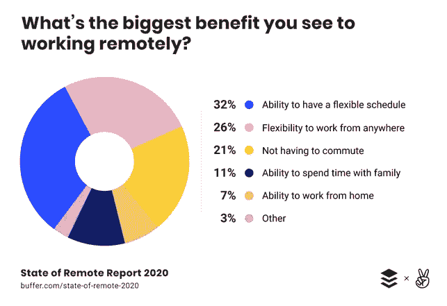

# “你能听到我说话吗？”远程工作的好处

> 原文：<https://medium.datadriveninvestor.com/can-you-hear-me-ok-the-benefits-of-remote-work-524fa9bc38ee?source=collection_archive---------20----------------------->

当我 2003 年开始学习计算机科学时，为一家大型科技公司工作对我来说是一个几乎不可能实现的梦想。我在西班牙出生和长大，那也是我上大学的地方。在远离硅谷 5000 英里的地方学习对我有一个有趣的影响，我会看苹果的科技活动和微软的产品发布会，就好像它们是好莱坞电影一样。我从没想过自己会成为他们中的一员。

大型科技公司感到遥不可及的主要原因是，它们在西班牙都没有软件开发中心。作为一名软件工程师，为微软或谷歌这样的公司工作的唯一方式是搬到另一个国家，这使得这个梦想在已经充满挑战的面试过程中变得更加遥不可及。在西班牙，许多人才没有得到开发，许多梦想在硅谷获得机会的工程师从未得到机会。

 [## 人工智能如何在全球创造数百万个远程工作岗位|数据驱动的投资者

### 当人们谈论人工智能和就业市场时，他们经常谈论人工智能将如何从…

www.datadriveninvestor.com](https://www.datadriveninvestor.com/2020/02/26/how-ai-is-creating-millions-of-remote-jobs-around-the-world/) 

多年来，亲临办公室是一项工作要求。大型科技公司卖掉了总部，作为对新员工的激励；许多这样的校园变成了充满活力的小城市，有公司住宅、早餐吧、餐馆、购物区、健身房和剧院，所有这些都被别致的装饰所包围。当然，在浮华的背后有一个功能性的目的；面对面会议产生的协同效应。大型科技园区被认为是创新和社区驱动力。

十年后，新冠肺炎·疫情在全球范围内改变了社会。尽管如此，如果有一个行业能够抵御冠状病毒危机，那就是科技行业。当在家工作和就地安置订单开始在各国蔓延时，大型科技公司率先将员工带到了在家工作的环境中。使其规模化成为可能的技术已经存在多年了；许多较小的公司已经证明了对工作灵活性的需求是存在的，并且在完全远程的团队中生产力可以[保持稳定](https://www.businesswire.com/news/home/20200519005295/en/)。

*‘*[*The 2020 State of Remote Work*](https://buffer.com/state-of-remote-work-2020)*‘ survey by Buffer & AngelList*

在疫情开始近五个月后，科技行业开始为未来做准备，在找到有效疫苗或治愈方法之前，许多员工不会回到办公室。一些大玩家，如 Twitter 或脸书，开始允许员工永久在家工作，可以肯定地说，许多其他人将会效仿。许多员工可能会错过他们在工作场所获得的额外津贴和社会关系，但他们现在可以选择在无数的地方工作，只要他们有互联网连接。经理们意识到，一旦所有的会议都通过视频会议完成，管理一个住在同一城市的团队实际上就相当于管理一个跨不同地点和时区的团队。工程师们正在挤压通信应用程序提供的价值，以便保持联系、合作和取得进展。

然而，Steve LeVine 从理论上认为[远程工作可能会摧毁硅谷](https://marker.medium.com/what-silicon-valley-loses-if-everyone-goes-remote-761b398dc9fb)，他说“*几乎在每个行业，首席执行官都要支付数百万的咨询、设计和建筑成本，以增加和优化他们最具创造力的员工之间的偶遇次数——并希望从可能产生的轰动一时的新产品中获利*”。有理由得出这样的结论:由于缺乏面对面的会议而产生的意外收获危机可以通过一种新发明的通信产品来解决。

虽然通信挑战将继续存在于远程工作环境中，如跨非重叠时区的协作，但这些都可以通过技术来缓解。与此同时，吸引全球最优秀的人才是一个更难的问题。考虑到成本的高昂，公司谨慎地决定在哪里发展他们的企业形象。基于候选人的接近程度和生活成本等因素，企业花费了数百万美元来接近多元化的人才库。招聘人员安排了每年一次的旅行，接触国内外最好的大学。大型科技公司最终在这些招聘之旅中争夺学生的注意力，特别是在访问可以帮助他们提高员工多样性的地区或国家时。

多元化的团队提高了公司的创新率和产品质量；社会少数群体在组织中的适当代表意味着更好的产品设计，因为他们考虑了更广泛的客户需求。这正是科技行业花费如此多的精力和资源将世界各地的人们聚集在一起的原因。现在，距离和地理位置在面试候选人时变得越来越不重要，新的机会向所有招聘人员和招聘经理敞开了大门:你团队中的下一个最佳表现者可能正在另一个国家等待被发现。

例如，在新冠肺炎之前，雇佣墨西哥大学毕业生的机会取决于每年一到两次的大学招聘之旅。在我们的新现实中，大多数面试都是远程进行的，一旦数据证明招聘质量保持稳定，这一趋势可能会继续下去。公司只需要在一个给定的地点有一份工资单，就可以向该地区的顶尖人才发出邀请。以前，团队经常提供“搬迁套餐”，而很快他们将提供“工作灵活性”。参与其中的每一方都开始意识到这是一种双赢的局面:薪资可以更好地适应不同的地点，办公费用可以重新用于员工的福利(包括定期旅行和活动，让团队有面对面的乐趣)，公司可以接触到更广泛的有才华的工程师，来自小城市或偏远城市的候选人可以获得与居住在硅谷等地的候选人类似的机会。

假设“工作弹性”意味着“在家工作”是一个容易犯的错误。一旦可以安全地恢复社交活动，远程工作将在它所支持的可能环境中大放异彩:在公园、咖啡店、公司的正式办公地点，甚至是你的家庭办公室。工作/生活平衡有了新的含义，因为原本在夏威夷度过的两周假期现在可以变成一个月的旅行，其中一半时间用于在酒店的商务中心、公共图书馆或 Airbnb 物业的房间里工作。

一些大型科技公司通过暑期实习开始尝试这种远程工作环境。来自美国各地的实习生与传统科技中心的团队一起工作；早上的站立会议由工程师组成，他们可能在几栋大楼之外，或者几个州之外。而这仅仅是开始。世界可能会在几年内恢复正常，但随着人们意识到，由于远程工作提供的自由，员工可以保持更快乐的水平，科技行业将永远改变。

当然，这并不意味着大型科技公司将摆脱其具有吸引力的校园，或者员工将被迫远程工作。这意味着拥抱一种工作环境，在这种环境中，物理存在是一种选择，而不是一种要求。这意味着接受一种分布式文化，这种文化有利于团队创新和向客户交付价值。这意味着最终打开了一个真正多元化行业的大门。

你喜欢这篇文章吗？ [**订阅**](https://geekonrecord.com/subscribe/) **通过邮件获取新帖。**

*标题照片由微微摄影于*[*Pexels.com*](https://www.pexels.com/photo/eco-grass-laptop-meadow-3129/)

*原载于 2020 年 7 月 24 日 http://geekonrecord.com***。**

## *访问专家视图— [订阅 DDI 英特尔](https://datadriveninvestor.com/ddi-intel)*