# 你能用机器学习预测客户的贷款违约吗？

> 原文：<https://medium.datadriveninvestor.com/can-you-predict-customers-loan-default-using-machine-learning-be774489b8f5?source=collection_archive---------0----------------------->

## 机器学习算法根据客户的财务信息和历史数据预测哪些客户将会拖欠贷款

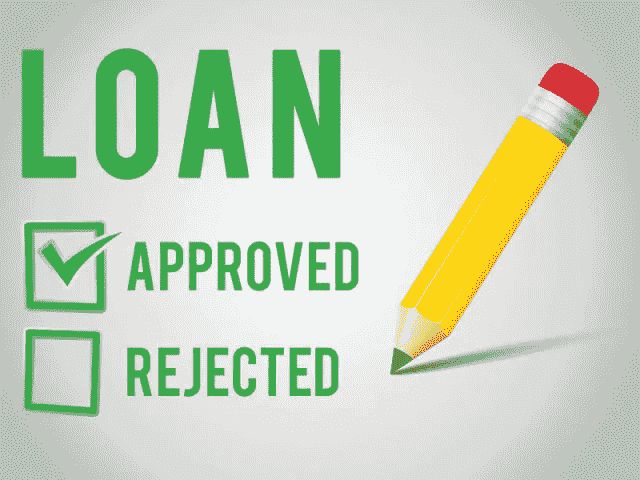

Image from Medical Tourism Corporation

贷款已经成为组织和个人日常生活的重要组成部分。随着金融界竞争的日益加剧，由于大量的财务限制，贷款活动或多或少已变得不可避免。世界各地的个人依赖于贷款活动的原因，如克服他们的财务限制，以实现他们的一些个人目标。同样，银行，无论是小型企业还是大型企业，都依赖贷款活动来实现管理自身事务的基本目的，并在金融紧缩时期顺利运作。

尽管这对借贷双方都是有利可图的。然而，它带有很大的风险，这在贷款领域被称为贷款风险。世界各地的行业专家和研究人员给个人分配被称为信用分数的数字分数，以衡量风险和他们的信誉。

多年来，机器学习算法一直被用于通过评估个人的历史数据来计算和预测信用风险。这项研究回顾了目前使用机器学习算法预测风险评估模型的文献。

从字面上看，这可以通过以下措施进行局部控制；

*   应对潜在借款人进行信用分析，以判断与借款人相关的信用风险，并做出贷款决定。

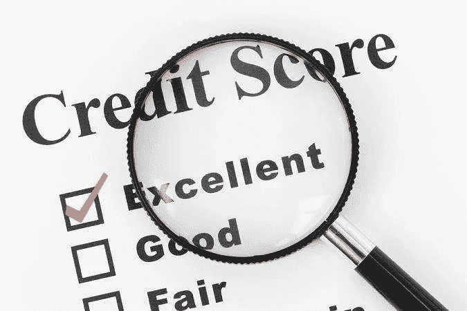

Image from Ringgitplus

*   应监控贷款偿还情况，一旦客户违约，应采取措施。因此，银行应该避免贷款给有风险的客户，监控贷款偿还情况，并在客户陷入困境时重新协商贷款。
*   不良贷款可以通过确保贷款只发放给有能力偿还且不太可能破产的借款人来限制。

对于这项任务，银行希望根据客户的财务信息预测哪些客户会拖欠贷款。

## 我是这样做的

**数据来源**:根据提供的数据(Zindi 上的贷款违约预测)，训练和测试数据各有 3 个不同的数据集；

> 人口统计数据，
> 
> 性能数据
> 
> 以前的贷款数据。

在这个目录下，有客户的信息，如银行帐户类型、教育程度客户、就业状况客户、出生日期、贷款金额、总到期日、创建日期、批准日期、期限、总到期日、首次到期日、贷款号码、经度 gps、纬度 gps、好的坏的标志等等。

数据清理:我们必须合并三个数据集中的重要特征。清理是通过使用集中趋势的属性填充丢失的值，导入**日期时间**以便处理日期相关的变量，日期时间的**时间戳**将日期特征转换为以秒为单位的时间，将分类列转换为数字列，将数据转换为机器学习算法可以处理的形式。

你知道吗？

**只有少数客户违约(Good_bad_flag)。**

(好=按时结清贷款；坏账=没有按时结清贷款)-这是我们需要预测的目标变量。

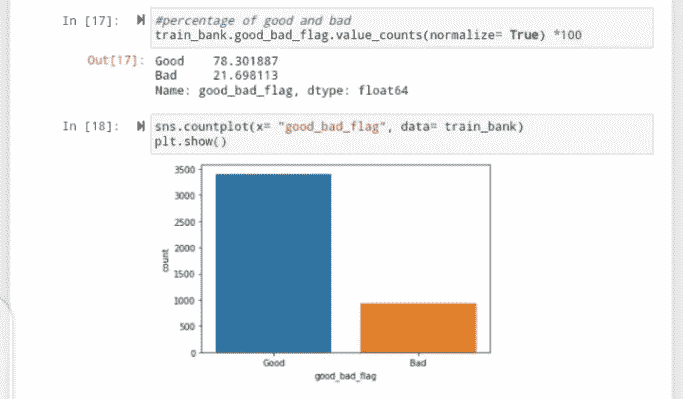

Good bad flag visualization

**见解/探索性数据分析(EDA)**

*   78.3%的客户没有违约，而 21.7%的客户违约。

**大部分违约者拥有储蓄账户(银行 _ 账户 _ 类型)。**

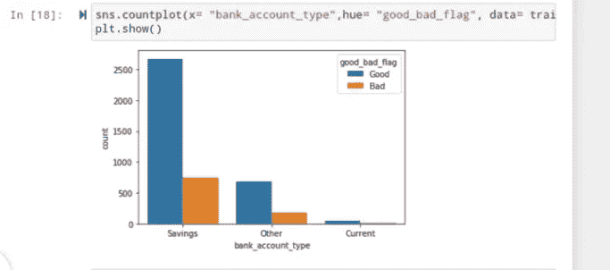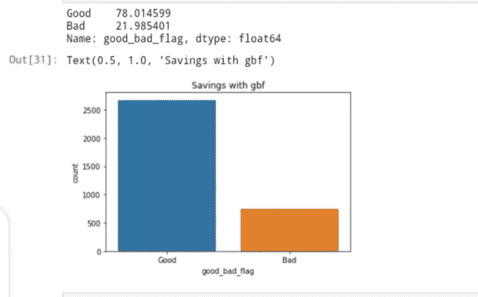

Bank account type visualization

**洞察/EDA**

*   更多的违约者有储蓄账户。经常账户持有人几乎不会违约。
*   申请贷款的储蓄账户持有者中，78%没有违约，而 21%违约。
*   85.7%申请贷款的经常账户持有人没有违约，而 14%的人违约。

**违约者多为毕业生(学历 _ 客户)。**

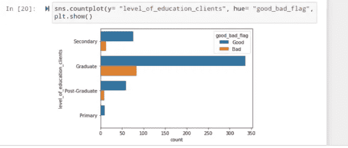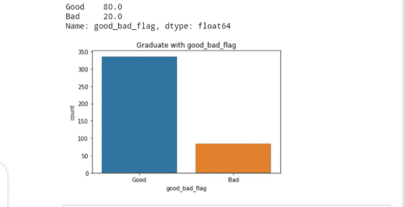

Level of education clients visualization

**洞察/EDA**

*   申请贷款的毕业生中，80%没有违约，20%违约。
*   85%的中学生没有违约，而 15%的学生违约。
*   86%的研究生偿还了贷款，而 13%的人违约。
*   所有申请贷款的小学生都没有违约。

**失业人员违约最多(就业 _ 状态 _ 客户)。**

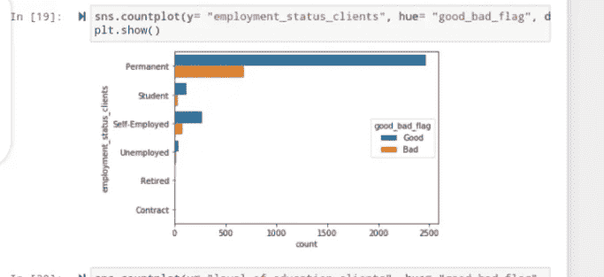

Employment status client visualization

**见解/EDA**

*   申请贷款的永久工人中，78%没有违约，而 21%违约。
*   80%申请贷款的学生没有违约，而 19%的学生违约。
*   申请贷款的失业者中，73%没有违约，而 26%违约。
*   申请贷款的个体户中，78%没有违约，20%违约。
*   所有合同和退休客户都成功偿还了贷款。

## 酷，现在怎么办？

如果你想预测可能违约的客户，这些变量有多重要

这是我们接触机器学习的地方，我们将训练模型来预测一个新客户，如果根据历史数据发放贷款，他可能会违约。

我们使用**RandomForestClassifier(RF)**、 **AdaBoostClassifier(Ab)** 、**GradientBoostingClassifier(GBR)**来确定我们的模型有多精确。然而，RF 被认为具有 0.795 的精度，Ab 具有 0.802 以及 GBR。看起来 Ab 和 GBR 的准确性击败了其他机器学习算法。

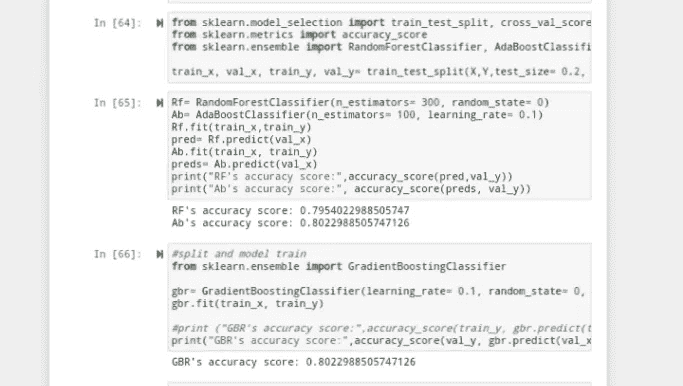

Models accuracy

随机森林是最流行的机器学习方法之一，因为它具有相对较好的准确性、鲁棒性和易用性。它还提供了两种简单的特征选择方法:平均减少杂质和平均减少精度。让我们看看 Rf 认为哪些变量在预测贷款违约方面最重要。

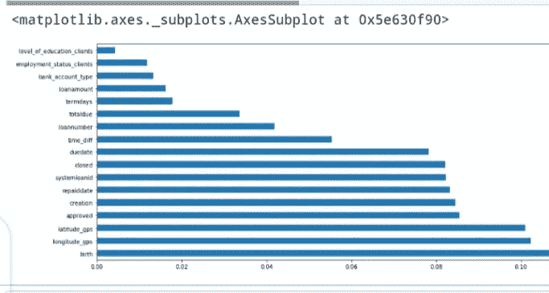

Rf feature importance

我们看到，非常简单和无聊。相对重要性在 0.06 (60%)以上的变量相当多；客户的出生日期、经度和纬度 GPS、贷款批准日期、创建日期、偿还日期、到期日期、关闭日期等等。

既然经度和纬度具有相当高的重要性，那么它们能告诉我们关于贷款违约的什么信息？

纬度和经度是地理坐标系统中表示坐标的单位，您只需进行搜索，使用地点、城市、州、地址的名称来检测或跟踪每个客户的位置。

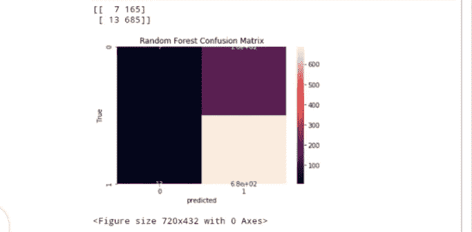

Rf Confusion Matrix

根据随机森林混淆矩阵，1.5% (13/870)的客户没有偿还贷款，但预计不会违约，即**假**正**。**

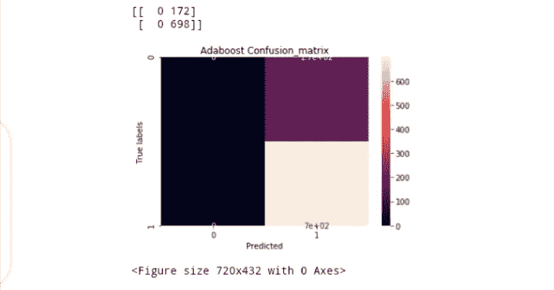

Ab Confusion Matrix

哎呀，有了 AdaBoost，我们使假阳性的数量从 13 下降到 0，这看起来像一个欣欣向荣的预测。

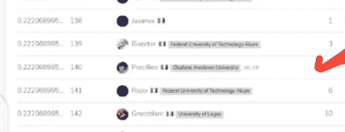

在 [Zindi](https://zindi.africa/competitions/data-science-nigeria-challenge-1-loan-default-prediction/leaderboard?page=2) 上提交后，排行榜上的分数(0.2220)从 85 到 151 不等。

这是一个相当不错的预测！

## 注意事项

*   数据中有一些差异。数据差异是很常见的，误解会导致错误的结论。这意味着我在本质上被方法、估计和误差所束缚。例如，数据显示所有申请贷款的小学生都没有违约。我宁死也不相信那是真的。
*   没有一种方法可以确定客户是否会停止还款，即使有方法，也很难准确预测。然而，一些因素可能有助于客户的还款潜力。

点击 [**此处**](https://github.com/Precillieo/SCA-mp-C2-Assignments/blob/master/Last%20Project/Loan%20CrPd.ipynb) 查看 Github 上的所有代码。

## 感谢

这描述了我作为 She Code Africa 的学员在数据科学领域的最后一个项目。非常感谢我的导师阿米努·伊斯雷尔为这次成功所付出的不懈努力和鼓励。