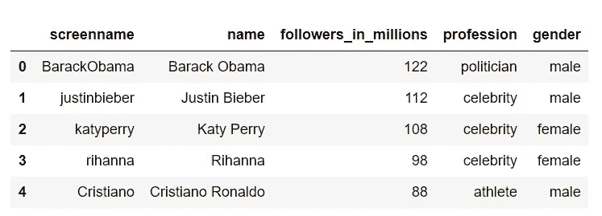
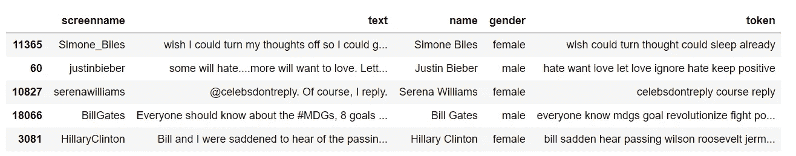
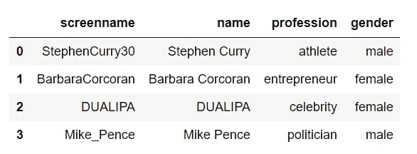
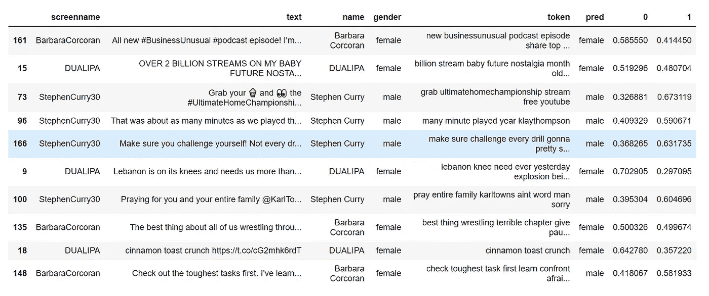
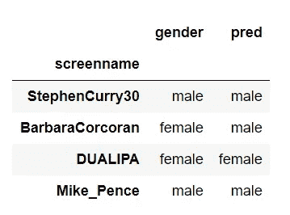

# 你能根据推文判断一个人的性别吗？

> 原文：<https://medium.datadriveninvestor.com/can-you-tell-someones-gender-based-on-tweets-8a65a32f9873?source=collection_archive---------9----------------------->

根据有限的可用信息预测某人的人口属性一直是一个热门话题。使用人的姓名、种族、地点和图片来训练可以辨别性别的模型是很常见的。你真的能仅凭某人在 Twitter 上分享的内容就猜出他的性别吗？在本文中，我们将使用 NLP 技术对此进行探索。

最后，我们得出结论，仅凭一条推文预测某人的性别是一个相当大的挑战。然而，通过组合同一个人的许多推文的预测结果(类似于 bagging 等集成技术)，我们可能会达到更好的性能。


Image from teenvogue. LYDIA ORTIZ

# 道德或非道德

预测某人的种族或性别是一种道德行为吗？我们应该相信结果还是会给模型带来不必要的偏差？

答案是视情况而定。开发一个以性别、种族和年龄为特征的统计模型来确定员工晋升的可能性可能是不合适的。在这种情况下，用于训练的历史数据很可能在性别和种族方面高度不平衡，这将导致有偏见的预测。更重要的是，性别、种族和年龄不会增加选择标准的价值。

另一方面，有时如果一个模型可以相当准确地说出某人的性别或其他人口统计信息，这将极大地有助于了解他们的客户并推动业务决策。想象一下，一家时尚公司正在 Twitter 上发起一场社交媒体营销活动，他们特别想锁定女性客户。如果一个模型可以使用推文、个人资料和图像来判断 Twitter 帐户的性别，它将为企业节省大量成本，并向正确的受众群体传递更有效的信息。即使预测准确率不是很大，但还是比对受众一无所知，胡乱猜测要好得多。

# 数据采集

我们从[维基最受关注的 Twitter 账户列表](https://en.wikipedia.org/wiki/List_of_most-followed_Twitter_accounts)中手动收集了 37 个 Twitter 账户，并标注了性别。本研究只考虑二元性别，即女性(0)和男性(1)。以下是一些例子:



然后，我们搜集了他们最近的推文，收集了 23454 条分享推文。这些都是原创推文，没有转发。

# 文本预处理

文本预处理是将文本从人类语言转换成机器可读格式以便进一步处理的过程。以下是推文的预处理步骤:

1.  将所有单词转换成小写
2.  删除非字母字符
3.  删除短单词(长度小于 3)
4.  标记化:将句子分解成单词
5.  词性标注:将单词按其语法类别分类的过程，目的是理解它们在句子中的作用，如动词、名词、形容词等。词性标注为词汇化提供了语法环境。
6.  词汇化:将一个单词转换成它的基本形式，例如`car, cars, car’s` 到`car`
7.  去掉常见的英语单词，如 a，the，of 等。，并删除对我们的分析没有什么价值的常用词，如 com、twitter、pic 等。

```
**import** **nltk**
**from** **nltk.corpus** **import** stopwords, wordnet 
**from** **nltk.stem** **import** WordNetLemmatizeradditional_stop_words=['twitter','com','pic']def get_wordnet_pos(word):
    """
    Map POS tag to first character lemmatize() accepts
    """
    tag = nltk.pos_tag([word])[0][1][0].upper()
    tag_dict = {"J": wordnet.ADJ,
                "N": wordnet.NOUN,
                "V": wordnet.VERB,
                "R": wordnet.ADV} return tag_dict.get(tag, wordnet.NOUN)def text_cleanup(text):  
    '''
    Text pre-processing
        return tokenized list of cleaned words
    '''
    # Convert to lowercase
    text_clean = text.lower()
    # Remove non-alphabet
    text_clean = re.sub(r'[^a-zA-Z]|(\w+:\/\/\S+)',' ', text_clean).split()    
    # Remove short words (length < 3)
    text_clean = [w for w in text_clean if len(w)>2]
    # Lemmatize text with the appropriate POS tag
    lemmatizer = WordNetLemmatizer()
    text_clean = [lemmatizer.lemmatize(w, get_wordnet_pos(w)) for w in text_clean]
    # Filter out stop words in English 
    stops = set(stopwords.words('english')).union(additional_stop_words)
    text_clean = ' '.join([w for w in text_clean if w not in stops])

    return text_clean# Preprocess tweets
all_tweets_df['token'] = [text_cleanup(x) for x in all_tweets_df['text']] 
```

我们只接受超过 20 个字符的经过处理的推文，因为一条推文太短，没有什么意义。

```
tweets = all_tweets_df[all_tweets_df['token'].apply(len)>20]
```

经过预处理后，19，663 条推文保留在训练数据集中，看起来女性和男性很平衡。

```
>>tweets.gender.value_counts(normalize=True, sort=False)female    0.496313
male      0.503687
Name: gender, dtype: float64
```

预处理后的推文示例:



# 使用 TF-IDF 特征训练逻辑回归

## TF-IDF 功能

我们使用 TF-IDF(术语频率-逆文档频率)作为特征输入到模型中。

[](https://www.datadriveninvestor.com/2020/07/23/learn-data-science-in-a-flash/) [## 一瞬间学会数据科学！？数据驱动的投资者

### 在我之前的职业生涯中，我是一名训练有素的古典钢琴家。还记得那些声称你可以…

www.datadriveninvestor.com](https://www.datadriveninvestor.com/2020/07/23/learn-data-science-in-a-flash/) 

TF-IDF 将`TF x IDF`计算为字典中每个单词的权重，代表该单词在文本/推文中的出现频率乘以该单词在所有文本/推文中的独特程度。TF-IDF 权重突出了 tweet 中不同的词(相关信息)。

```
text_transformer = TfidfVectorizer()
X = text_transformer.fit_transform(tweets[‘token’])
y = tweets[‘gender’]
```

## 模特培训

我们将训练数据分开，保留 20%进行验证。

```
X_train, X_val, y_train, y_val = train_test_split(X, y, test_size=0.2, stratify=y, random_state=39)
```

使用基本的逻辑回归算法作为分类器。

```
logreg = LogisticRegression()
logreg.fit(X_train, y_train)LogisticRegression(C=1.0, class_weight=None, dual=False, fit_intercept=True,
                   intercept_scaling=1, l1_ratio=None, max_iter=100,
                   multi_class='auto', n_jobs=None, penalty='l2',
                   random_state=None, solver='lbfgs', tol=0.0001, verbose=0,
                   warm_start=False)
```

通过将模型应用于验证数据集，我们可以检查模型的性能。

```
y_val_pred = logreg.predict(X_val)
```

这里是混淆矩阵和 F1 分数，它们通常用于评估分类准确度。F1 得分为 0.7699 (1.0 是完美的精度和召回率)。还不错。

```
>>confusion_matrix(y_val, y_val_pred)array([[1539,  413],
       [ 492, 1489]], dtype=int64)>>f1_score(y_val, y_val_pred, average=’micro’)0.7698957538774472
```

# 根据测试数据预测性别

我们收集了以下四个 Twitter 账户的推文进行测试。他们都不在我们的训练数据集中。



经过同样的预处理步骤后，我们有 208 条测试推文。女性和男性的比例再次平衡。

```
female    0.504808
male      0.495192
```

我们为测试数据构建了 TF-IDF 特征，并应用了训练逻辑回归模型。这是测试数据的表现。 **F1 得分为 0.5913** 。这不是一个很大的数字，但比 50-50 的随机猜测要好 10%。

```
>>confusion_matrix(test_tweets.gender, pred)
array([[58, 47],
       [38, 65]], dtype=int64)>>f1_score(test_tweets.gender, pred, average='micro')
0.5913461538461539
```

让我们来看一些例子。



> 所有新的#商业不寻常#播客插曲！我分享我的最佳建议，为秋天做准备&回答你的问题……[https://t.co/vBXPbCDkA6](https://t.co/vBXPbCDkA6)

它来自芭芭拉·科克兰(女性)，我们的模特也说是女性。

> 我的宝贝未来怀旧超过 20 亿次！！！只有 4 个月大，她正在做她的小 thaaaang！我太公关了……[https://t.co/vZL9KSClJY](https://t.co/vZL9KSClJY')

它来自 DUALIPA(女性),我们的模特也说是女性。

> 首先检查最困难的任务。我已经学会面对我害怕做的事情，并把它解决掉。…[https://t.co/0zvFir96TM](https://t.co/0zvFir96TM)

它来自芭芭拉·科克兰(女)而我们的模特说是男的。不正确。

如果我们将每个测试 Twitter 帐户的所有预测结合起来，并通过多数投票对帐户进行性别预测，下面是结果。**4 个中有 3 个是正确的**！一点也不差。



# 结束语

在这项研究中，我们应用了一些 NLP 技术(即文本预处理和 TF-IDF 特征)，并建立了一个预测模型，可以仅根据某人的推文来判断其性别。单条推文的预测精度为 0.59，略好于 50-50 的随机猜测。通过合并同一个人的更多推文，并利用多数投票，我们能够取得更好的结果。

社交营销专业人员可以利用这些信息来选择目标女性/男性受众，并在 Twitter 上发起更有效的营销活动。

在今后的工作中，我们可以尝试以下方法来提高预测精度:

*   引入更多用于培训的推文
*   除了基本的逻辑回归，尝试其他模型，如 XGBoost
*   向数据集添加其他特征，如用户名、个人简介等

所有代码都可以在 [GitHub](https://github.com/wangpengcn/Gender-Prediction-Based-On-Tweets) 上找到。

感谢阅读。如果您有任何反馈，请在下面留言，通过我的博客[https://ai-journey.com/](https://ai-journey.com/)联系我，或者通过 [LinkedIn](https://www.linkedin.com/in/peng-wang-cpa/) 给我发消息。

## 访问专家视图— [订阅 DDI 英特尔](https://datadriveninvestor.com/ddi-intel)