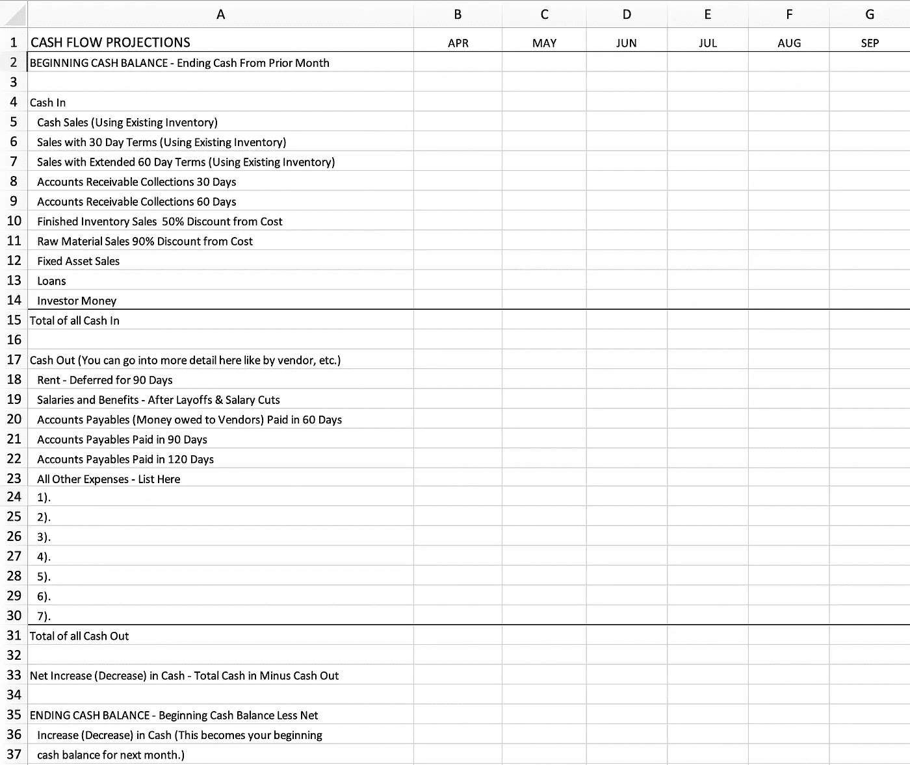

# 你的公司还有救吗？

> 原文：<https://medium.datadriveninvestor.com/can-your-company-be-saved-4309707f00fe?source=collection_archive---------13----------------------->

[Road Trip with Raj@roadtripwithraj](https://unsplash.com/@roadtripwithraj)

在接下来的几周里，一个朋友的生意将会关闭。他们的客户取消了所有未完成的订单。留给他们的唯一渠道就是网上销售，他们的毛利率是 4%。是的，毛利率，不是净利润率。与此同时，他们的管理费用有增无减，像吃豆人一样以极快的速度吃掉所有可用的现金。如何拯救这家公司？

我想起了 1952 年在《妇女家庭杂志》上开始的现已幽灵般的专栏“这场婚姻还有救吗”？很久以前，当我还是个小女孩的时候，我每个月都会读我妈妈的书。惊讶于丈夫和妻子如此恶劣地对待彼此，我非常肯定地认为，我永远不会结婚。但如果我做了，我绝不会让我的配偶如此不公平地对待我！

即使在今天，如果你用谷歌搜索“这段婚姻能被挽救吗”，会有超过 800 万个结果，从深层心理探索到解读“迹象”到进行突击测验，表面上是因为你看不懂这些迹象。

 [## 2020 年最佳短期投资选择精选资源|数据驱动型投资者

### 投资是增加你净财富的一个好方法。如果你通过遵循一个严格的…

www.datadriveninvestor.com](https://www.datadriveninvestor.com/2020/03/28/handpicked-resources-for-the-best-short-term-investment-options-of-2020/) 

如果你在谷歌上搜索“这家公司还有救吗”，很少有结果。大多数都是为了省钱，当然这是一个组成部分，但并不是真的为了拯救整个公司。问题是，我对这个问题不感兴趣，*这家公司能得救吗？我对*如何拯救这家公司更感兴趣。**

*在过去的几周里，我有十几个以前的客户和朋友打电话给我。他们担心自己的公司能否生存下去，这是可以理解的。在新冠肺炎时代，在美国和世界其他地方被封锁的时候，这是每个人都在想的事情。从首席执行官和投资者到簿记员和运输员，每个人都是如此。我想好消息是我们都在一起，在某种程度上，我们可以用这种情况下的友情来安慰自己。但如果你拥有或经营一家公司，最重要的问题是，它能挽救吗？又该如何挽回？*

*道格·雅可拉已经在著名的管理咨询公司[麦肯锡&公司](https://www.mckinsey.com/business-functions/strategy-and-corporate-finance/our-insights/ten-tips-for-leading-companies-out-of-crisis)经营恢复项目二十多年了。在一篇关于带领公司走出危机的帖子中，他解释说，即使是优秀的经理也经常在一套不再适用的范式下工作，同时让惯性的力量带着他们前进。没有什么比全球范围的关闭更能改变你的范式了。好消息是，我们都知道规则已经改变了。我们到了，*现在我们做什么呢*？*

> *领导者需要做出艰难的决定并迅速行动。*

*为了渡过这个充满挑战的时代，行政领导需要做出艰难的决定，快速行动，并记住首要目标是拯救公司，同时最大限度地减少对社区和工人/员工的附带损害。诚然，每个企业都是不同的，但这些经典的转型策略几乎适用于所有企业。我已经概述了一些让你开始的步骤，下面还有更多细节。即使你没有自己的公司，你也可以为你的家庭采用这些策略。*

1.  *别冻僵了。*
2.  *估计低迷会持续多久。*
3.  *收集和囤积现金。*
4.  *挽救未完成的订单。*
5.  *预计会有现金流入。*
6.  *计划现金支出——计算你的跑道。*
7.  *探索现金的替代来源。*
8.  *减少或减缓现金支出。*
9.  *淘汰利润率较低的产品或服务。*
10.  *你应该留住的员工。*

**

*Photo by [Alex Block](https://unsplash.com/@alexblock?utm_source=unsplash&utm_medium=referral&utm_content=creditCopyText) on [Unsplash](https://unsplash.com/s/photos/vintage-husband-and-wife-illustration?utm_source=unsplash&utm_medium=referral&utm_content=creditCopyText)*

***不要冻结。我知道你现在可能会感到麻痹，但最重要的是行动起来——不是动作，而是行动。有什么区别？James Clear 在他的书《[原子习惯](https://jamesclear.com/atomic-habits)》中完美地解释了这一点运动是一个计划的过程，一个思考，一个仔细考虑的过程。行动其实就是在做。假设你想写一篇文章。运动就是坐着思考它。在你的脑海里翻着这个故事。甚至可能做研究或做笔记。但是到了一定的时候，你不得不坐下来写。这就是行动。如果你想生存，你必须像耐克的伟大口号一样行动起来，“只管去做”。***

*估计这次衰退会持续多久。你可能是错的，但你可能是对的或者只是略有错误。尽可能收集所有信息，然后尽最大努力进行评估。不管怎样，这就是预测——你对将要发生的事情的最有根据的猜测。如果你至少有一套假设和基于这些假设的行动，那么做出调整比从头开始或没有任何计划更容易。*

*收集和囤积现金。看看你有多少现金。这包括支票和储蓄账户、银行信贷额度、信用卡、手头现金和投资者承诺。(确认这些承诺。)如果你有应收账款或应收贷款(你的客户或其他人欠你公司的钱)的话，算一算。尽可能快地收集所有这些，如果你现在能得到一大部分，甚至提供折扣。如果你有开放的信用额度，借最大额度，然后把它藏起来。记住，困难时期，现金为王。讽刺的是，我最近写了一篇关于这个的文章。这里可以找到[。](https://medium.com/@cynthiawylie/why-cash-is-king-and-how-to-get-more-of-it-961b3ce46896)*

*举个例子，上周，当我的一个大租户要求他的月租金打五折时，我提出，如果他全额支付我 4 月份的租金，我将免除接下来两个月的租金。这将为他带来 66%的折扣。但我要先拿到现金。谁知道呢？下个月他可能会倒闭。他的公司也许无法挽救。*

***抢救未完成订单**。使用现有库存可以节省多少订单？不要做任何新的存货，除非你有一个会用掉所有存货的好价钱的订单。给你所有的顾客打电话。也许给他们额外的条件。让他们知道，如果他们今天接受你的货物，你会给他们 60 天甚至 90 天的时间付款。如果他们现在购买，你会给他们一个折扣。最好为你的库存准备一些东西，而不是放在仓库里。*

***项目现金流入。在电子表格或一张纸上，写出每个月的名字，直到你认为它会结束。如果你认为这将在六个月内结束，那么在接下来的六个月内——四月、五月、六月、七月、八月、九月、十月——写下你对你的现金收入的最佳估计(基于你刚刚通过询问你的客户收集的数据)——不仅仅是你的销售额——还包括你何时能收到钱。也包括现金，你认为你将在你认为你将收集他们的那个月收集的应收款项的数量。这是现金流量表的第一部分——现金流入的时间。对自己超级诚实和现实。我构建了一个基本的现金流预测，你可以用它作为下面的模板。***

***项目现金流出**。如果你不做任何改变，在现金支出的那个月，你的支出是多少？看看留住你所有的员工，全额支付你的租金，工资税，水电费，佣金，运费，邮费等。从你的估计收入中减去你每月的花费。看看你每个月的亏空是多少。如果你每个月有 10，000 美元的缺口，而你有 30，000 美元的现金，那么你有三个月的时间。这是你最坏的情况。现在是重要的部分——让我们改进一下。改进的两个主要类别是什么？增加或加快现金流入。或者减少或减缓兑现。*

***探索现金的替代来源**。举个例子，找出你能从 SBA(小企业管理局)得到多少钱。小企业管理局为公司担保贷款，如果你能留住你的员工，它就变成了一笔赠款(这意味着你不必偿还)。在你可以放心地假设你会收到现金的那个月，对现金进行调整。你能清算你的存货吗？如果你没有足够的销售额来用完你现有的库存(手头或仓库中的商品)，那么看看你是否可以以“清仓”价格出售它们——这通常意味着每美元 10 美分至 50 美分。如果你正在制作一个价值 1 美元的小玩意，你会以 50 美分的价格出售。你所在的行业有清账公司。我保证。谷歌一下。问问友好的竞争对手。他们在外面。你会登记亏损，但我们关心的是现金，而不是亏损。*

***削减或减缓套现**。如果你能减缓你的应付款项(你欠的人)，或者协商更长的期限，或者如果你欠了钱，给你的银行一个更低的利率，或者延期租金，或者降低运输成本，或者任何你能省钱的地方——去做吧，不要等待。像我的朋友一样，如果你所有的销售现在都在网上，那么看看你的服务器成本(信不信由你，可能会有巨大的差异)，深入了解你的运输成本，(让联邦快递与 UPS 或 USPS 竞争)，这是一个简单的方法，可以很容易地委托。如何在包装上省钱？盒子？标签？如果是一家食品公司，隔夜保存你的物品可能比买干冰便宜。要有创意。思考装运箱之外的问题。*

***淘汰利润率较低的产品或服务**。看看你的产品组合。你应该知道每个产品/产品线的毛利是多少。毛利是产品或服务的销售价格减去生产或提供它的成本。如果低于销售额的 30%，就考虑放弃。举个例子，如果你的主要产品是比萨饼，但你用沙拉和鸡翅来补充，你的鸡翅毛利率为 30%，沙拉毛利率仅为 20%，那么考虑从你的产品线中去掉沙拉。我很痛苦地说，因为我是素食者，但我不是你的顾客，对吗？相信我，还是有很多人买披萨的。如果你不知道你每种产品的利润率，请一个好的簿记员。我可以推荐一个。或者请你的会计师帮你(延期付款或者甚至易货)。终身免费披萨！双关语。是的，不要失去你的幽默感，不是现在，因为你可能需要一些轻松来平衡压力。*

***你应该留住的员工**。如果你是一家向其他零售店销售产品的消费品公司，那么你的销售人员就是黄金。如果你在网上销售，那么你的营销人员就是黄金。看看你的公司现在在哪里，解雇那些你现在不直接需要的员工*。当一切恢复正常时，你可以重新调整你的员工组合。一句话:请尽量把这作为你最后的选择。我们都在一起，裁员会产生连锁反应。如果可以的话，也许可以试着付给每个人一半的薪水。**

**在你检查了所有这些之后——这不是一个直觉的情况，这是一个信息收集和数据处理的情况，制定一个计划并与你的利益相关者会面。他们可能包括董事会、投资者和合伙人。带上你六个月的计划和假设。乐于助人。如果你有完全诚实和深思熟虑的信息和研究来支持一个总体规划，他们将更有可能支持你。**

**与你的银行安排一次会面。如果你需要他们借给你更多的钱，并向他们展示你的现实和保守的总体规划，你有更好的机会。如果你不能及时付款，那就告诉他们。作为一名前银行家，我可以告诉你一个重要的事实:银行不喜欢惊喜。**

**是的，是真的。如果你与你的银行、投资者或保理商会面，他们会更有可能支持你，手中紧握着你的总体规划，掌握着最新的财务状况。这是*而不是*一个带有十年前照片的网上交友简介。他们不希望你胡说八道；他们不仅希望你成功，他们也需要你成功。他们也不想被蒙在鼓里。提前给他们真实的信息，并以令人难以忍受的频率更新信息。至少每周一次，必要时每天一次。你宁愿他们讨厌你——“天哪，又是她”——也不愿他们想，“她到底怎么了？”我已经几个月没有她的消息了！”可能不舒服，但总会好一点。**

**我最后给你三个字:计划，计划，计划。你必须有计划地开始和结束。保守一点(提供一个缓冲)。一边走一边改。传达给所有相关的人。记住，这一切都会过去。**

**这是我提到现金流模板:**

****

**Cynthia Wylie 是企鹅兰登书屋出版的儿童书籍作者，她拥有乔治敦大学的经济学硕士学位。她为数据驱动投资者撰写商业和经济方面的文章。当她不写作的时候，她为 TheProjectConsultant.com 的**做商业咨询和扭转战略。****

***由 Dennis P. Kamoen 主编，创始人&主编，项目顾问。***