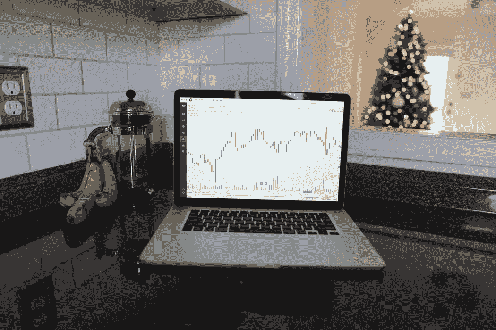

# 2021 年，中医科(ZOM)能否成为股市怪兽？

> 原文：<https://medium.datadriveninvestor.com/can-zomedica-zom-become-a-stock-market-monster-in-2021-ca4f2011b35c?source=collection_archive---------3----------------------->

Image via [Unsplash- MayoFi](https://images.unsplash.com/photo-1606189933777-a56d876d692d?ixid=MXwxMjA3fDB8MHxwaG90by1wYWdlfHx8fGVufDB8fHw%3D&ixlib=rb-1.2.1&auto=format&fit=crop&w=1050&q=80)

## 即将推出其预期的诊断平台 TRUFORMA，人们的期望越来越高

股票市场可能会波动。大收益是可能的，但大损失也是可能的。对细价股来说尤其如此，这类股通常是不太知名的公司，根据其领导能力和产品的生存能力，股价可能会飙升，也可能会下跌。Zomedica (ZOM)是 2021 年仙股突破的早期竞争者，它即将发布一款备受期待的兽医诊断工具，可能会使其股票飙升。

Zomedica Corp .是一家处于[发展阶段的公司](https://robinhood.com/stocks/ZOM)，专注于临床兽医尚未满足的需求。该公司成立于 2013 年，总部位于密歇根州安阿伯市，注册地位于加拿大。最近一次[股东投票](https://finance.yahoo.com/news/zomedica-remain-domiciled-canada-135300103.html)否决了公司本土化到特拉华州的提议。

在多年的幕后工作后，Zomedica 似乎真的在 TRUFORMA 的开发中发现了一些东西。该公司将他们的产品描述为“TRUFORMA 引入了高度敏感的物种特异性检测，用于诊断狗和猫的甲状腺疾病以及狗的肾上腺疾病。TRUFORMA 提供您所需的精确度和性能，以及您所需的便利性和易用性。在患者就诊期间获得完整的甲状腺和肾上腺检查结果意味着宠物、宠物主人和兽医卫生保健团队的压力会更小。”

TRUFORMA 采用一次性试剂盒，可以在 20 分钟或更短时间内提供犬猫甲状腺和肾上腺的准确结果，而不是兽医采集生物样本和处理实验室结果，这可能需要数天时间。不用说，这是兽医科学领域的一个游戏规则改变者，2020 年美国兽医科学领域的[负责](https://www.ibisworld.com/industry-statistics/market-size/veterinary-services-united-states/#:~:text=The%20market%20size%2C%20measured%20by,decline%20%2D7.7%25%20in%202020.)约 420 亿美元的业务。

职业教育和培训科学的诊断部分是它自己强大的利基。*环球新闻网* [报道](https://www.globenewswire.com/news-release/2020/11/13/2126325/0/en/Zomedica-Sets-March-30-2021-as-Expected-Commercialization-Date-for-TRUFORMA.html)该市场的特定部分预计将从 2019 年的 17 亿美元增长约 50%，至 2024 年的 28 亿美元。其中很大一部分可能来自这款新产品。狗和猫越来越成为家庭动力的一部分，一些对保护它们的健康和幸福如此有帮助的东西可能是一个真正的全垒打。

 [## 收盘，但没有雪茄-股票市场目标在停滞的 COVID 救济中创新高|数据驱动…

### 专家聊天程序:一个协作市场，在这里人们可以和能够解决他们问题的专家聊天。是……

www.datadriveninvestor.com](https://www.datadriveninvestor.com/2020/08/18/close-but-no-cigar-stock-market-targets-record-highs-amidst-stalled-covid-relief/) 

TRUFORMA 完全是独一无二的，[采用了由 Qorvo 开发的](https://www.marketwatch.com/press-release/zomedica-sets-march-30-2021-as-expected-commercialization-date-for-truformatm-2020-11-13-6184037?siteid=bigcharts&dist=bigcharts&tesla=y)体声波(BAW)技术。Zomedica 使用它来建立一个可供兽医在护理点使用的平台。他们制造了完全属于他们自己的产品，因为他们已经用与其开创性工作相关的 70 项现有和正在申请的专利保护了他们的专有权利。这也得到了美国食品和药物管理局的批准。这让他们处于一个令人羡慕的位置，因为他们准备在 2021 年 3 月 31 日正式启动销售。

ZOM 股票交易量非常大，平均每天超过 5000 万股。这说明了它的波动性。然而，已经开发的产品的潜力有助于一些非常有利的可能结果。因此，许多分析师认为这是一笔可能的好买卖。

ZOM 目前的交易价格约为每股 0.23 英镑，任何想挖掘其潜力的人都买得起。投资中肯定没有确定的事情，但任何寻找低成本股票机会的人都可能希望了解这家即将在蓬勃发展的市场推出前所未有的产品的公司，并对其进行尽职调查。

*免责声明:作者不是财务顾问或专家。本文中表达的观点仅用于一般教育目的和娱乐，不以任何方式为任何个人或任何特定的证券或投资产品提供具体的建议或推荐。个人投资者对自己的资金和投资决策负责。作者在文章中讨论的产品中占有很小的位置。*

## 获得专家视图— [订阅 DDI 英特尔](https://datadriveninvestor.com/ddi-intel)