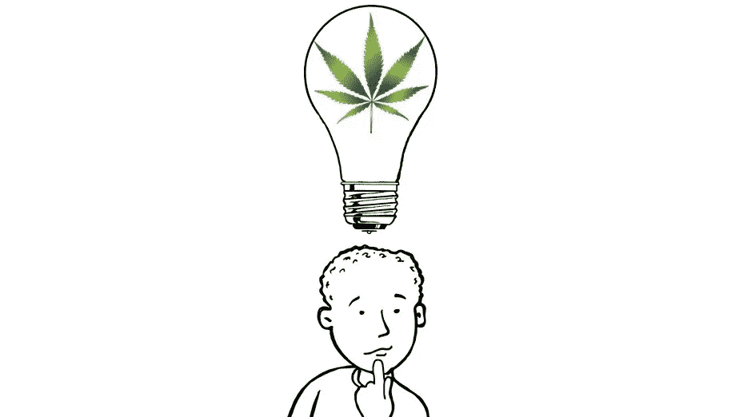
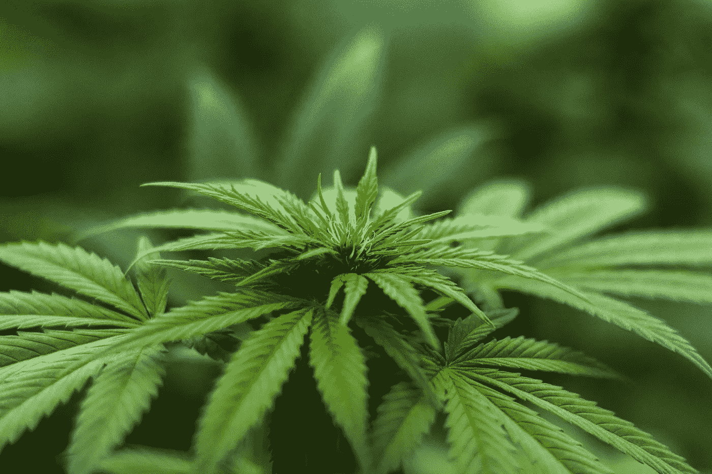
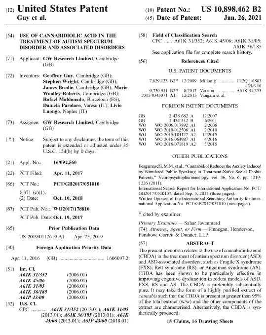
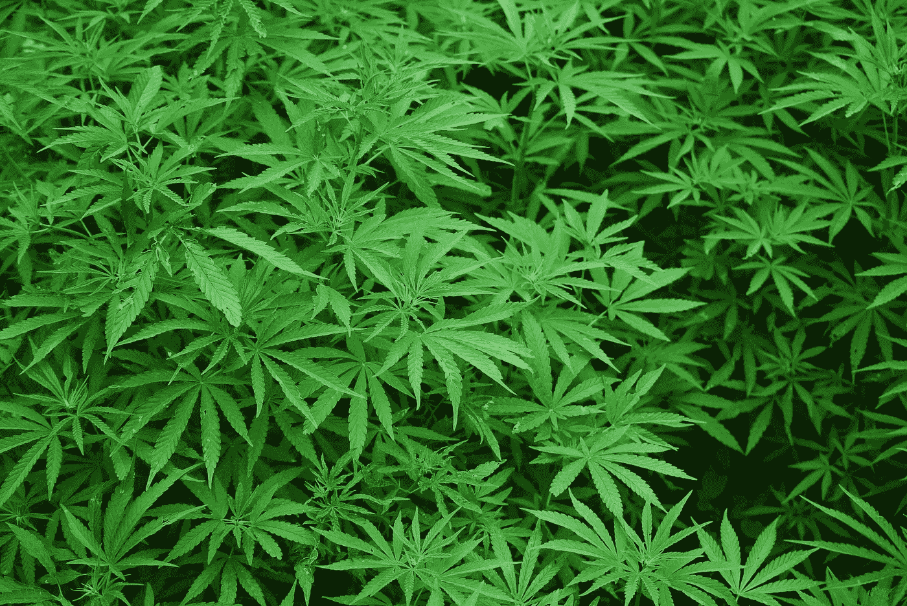
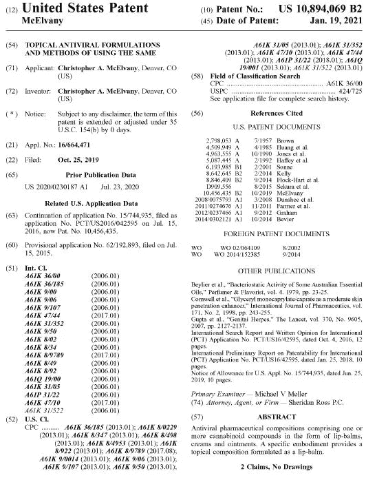
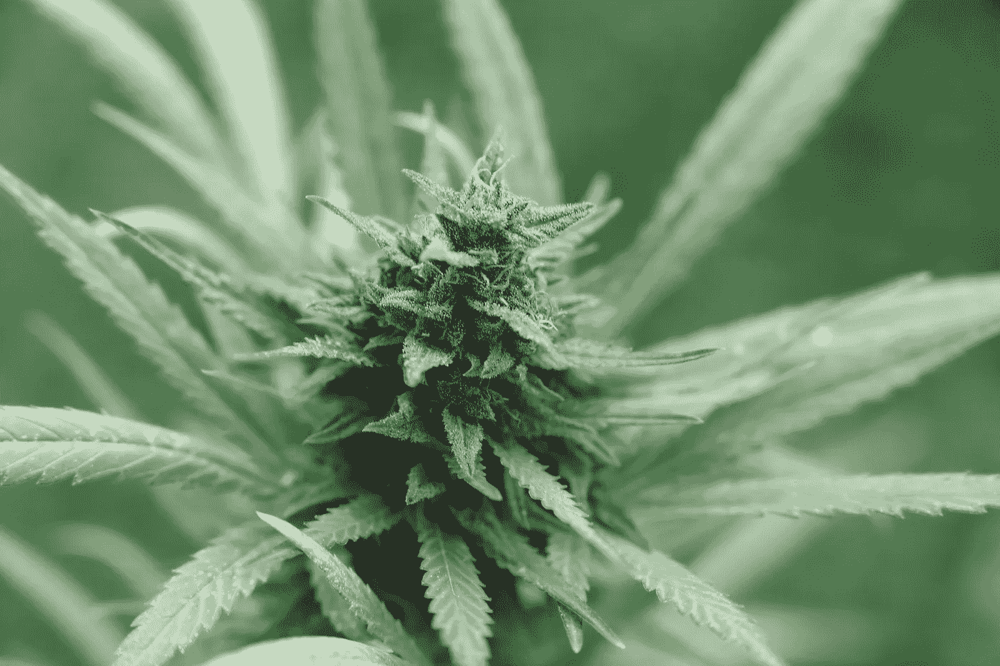
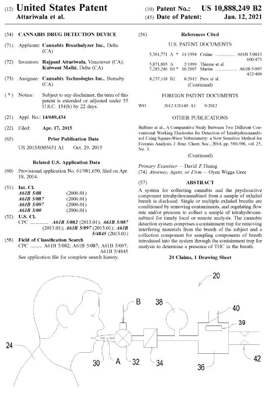

# 大麻创新:大麻相关的自闭症治疗、抗病毒润唇膏和 THC 呼气测醉器

> 原文：<https://medium.datadriveninvestor.com/cannabinnovation-autism-treatments-antiviral-lip-balms-and-thc-breathalyzers-fff9dd8eb330?source=collection_archive---------7----------------------->

## 大麻|创新

## 2021 年 1 月发布的精选大麻相关美国专利。

Image by author, made from [Pixabay](https://pixabay.com/) images

虽然与大麻和大麻衍生产品相关的联邦商标仍被禁止，但美国专利商标局(USPTO)仍在快速颁发大麻领域的专利。

这种差异的原因是，联邦商标不能授予不能合法跨州销售的产品，根据《受管制物质法》，大麻或大麻衍生产品(目前)就是这种情况。就专利而言，没有这样的禁令。

为了了解一些即将推出的大麻相关创新，我在美国专利商标局的数据库中搜索了上个月发布的专利，这些专利包含以下任何一个词:“大麻”、“大麻”、“大麻素”、“大麻二酚”、“CBD”、“四氢大麻酚”或“四氢大麻酚”。

我发现的包括大麻的[新品种](https://patents.google.com/patent/US10888060B1/en?oq=10888060) [和](https://patents.google.com/patent/US10888059B1/en?oq=10888059)[大麻植物](https://patents.google.com/patent/USPP32725P2/en?oq=PP32%2c725)的品种，新的[种植方法](https://patents.google.com/patent/US10881055B2/en?oq=10881055)，以及从大麻和大麻中提取 [和提纯](http://patft.uspto.gov/netacgi/nph-Parser?Sect1=PTO1&Sect2=HITOFF&d=PALL&p=1&u=%2Fnetahtml%2FPTO%2Fsrchnum.htm&r=1&f=G&l=50&s1=10882808.PN.&OS=PN/10882808&RS=PN/10882808) [化合物](http://patft.uspto.gov/netacgi/nph-Parser?Sect1=PTO1&Sect2=HITOFF&d=PALL&p=1&u=%2Fnetahtml%2FPTO%2Fsrchnum.htm&r=1&f=G&l=50&s1=10888595.PN.&OS=PN/10888595&RS=PN/10888595) [的](http://patft.uspto.gov/netacgi/nph-Parser?Sect1=PTO1&Sect2=HITOFF&d=PALL&p=1&u=%2Fnetahtml%2FPTO%2Fsrchnum.htm&r=1&f=G&l=50&s1=10888596.PN.&OS=PN/10888596&RS=PN/10888596) [新的](http://patft.uspto.gov/netacgi/nph-Parser?Sect1=PTO1&Sect2=HITOFF&d=PALL&p=1&u=%2Fnetahtml%2FPTO%2Fsrchnum.htm&r=1&f=G&l=50&s1=10894224.PN.&OS=PN/10894224&RS=PN/10894224)[方法。](http://patft.uspto.gov/netacgi/nph-Parser?Sect1=PTO1&Sect2=HITOFF&d=PALL&p=1&u=%2Fnetahtml%2FPTO%2Fsrchnum.htm&r=1&f=G&l=50&s1=10899728.PN.&OS=PN/10899728&RS=PN/10899728)

有新的[大麻素和](http://patft.uspto.gov/netacgi/nph-Parser?Sect1=PTO1&Sect2=HITOFF&d=PALL&p=1&u=%2Fnetahtml%2FPTO%2Fsrchnum.htm&r=1&f=G&l=50&s1=10894780.PN.&OS=PN/10894780&RS=PN/10894780) [大麻素化合物](http://patft.uspto.gov/netacgi/nph-Parser?Sect1=PTO1&Sect2=HITOFF&d=PALL&p=1&u=%2Fnetahtml%2FPTO%2Fsrchnum.htm&r=1&f=G&l=50&s1=10882838.PN.&OS=PN/10882838&RS=PN/10882838)，[新的大麻素](http://patft.uspto.gov/netacgi/nph-Parser?Sect1=PTO1&Sect2=HITOFF&d=PALL&p=1&u=%2Fnetahtml%2FPTO%2Fsrchnum.htm&r=1&f=G&l=50&s1=10898463.PN.&OS=PN/10898463&RS=PN/10898463) [配方和](http://patft.uspto.gov/netacgi/nph-Parser?Sect1=PTO1&Sect2=HITOFF&d=PALL&p=1&u=%2Fnetahtml%2FPTO%2Fsrchnum.htm&r=1&f=G&l=50&s1=10888117.PN.&OS=PN/10888117&RS=PN/10888117) [剂型](http://patft.uspto.gov/netacgi/nph-Parser?Sect1=PTO1&Sect2=HITOFF&d=PALL&p=1&u=%2Fnetahtml%2FPTO%2Fsrchnum.htm&r=1&f=G&l=50&s1=10905730.PN.&OS=PN/10905730&RS=PN/10905730)，[使用大麻素的新疗法](http://patft.uspto.gov/netacgi/nph-Parser?Sect1=PTO1&Sect2=HITOFF&d=PALL&p=1&u=%2Fnetahtml%2FPTO%2Fsrchnum.htm&r=1&f=G&l=50&s1=10881637.PN.&OS=PN/10881637&RS=PN/10881637)，以及用大麻素冲泡饮料的新方法。

甚至还有用于检测大麻素、[蒸汽相关](http://patft.uspto.gov/netacgi/nph-Parser?Sect1=PTO1&Sect2=HITOFF&d=PALL&p=1&u=%2Fnetahtml%2FPTO%2Fsrchnum.htm&r=1&f=G&l=50&s1=10898827.PN.&OS=PN/10898827&RS=PN/10898827)、[物品](http://patft.uspto.gov/netacgi/nph-Parser?Sect1=PTO1&Sect2=HITOFF&d=PALL&p=1&u=%2Fnetahtml%2FPTO%2Fsrchnum.htm&r=1&f=G&l=50&s1=10897925.PN.&OS=PN/10897925&RS=PN/10897925)和[使用大麻籽粉的害虫控制成分](http://patft.uspto.gov/netacgi/nph-Parser?Sect1=PTO1&Sect2=HITOFF&d=PALL&p=1&u=%2Fnetahtml%2FPTO%2Fsrchnum.htm&r=1&f=G&l=50&s1=10893677.PN.&OS=PN/10893677&RS=PN/10893677)的[传感器。](http://patft.uspto.gov/netacgi/nph-Parser?Sect1=PTO1&Sect2=HITOFF&d=PALL&p=1&u=%2Fnetahtml%2FPTO%2Fsrchnum.htm&r=1&f=G&l=50&s1=10907163.PN.&OS=PN/10907163&RS=PN/10907163)

我选择了三个最有趣的来仔细观察。

Image by [Herbal Hemp](https://pixabay.com/users/herbalhemp-6915040/?utm_source=link-attribution&utm_medium=referral&utm_campaign=image&utm_content=2915337) from [Pixabay](https://pixabay.com/?utm_source=link-attribution&utm_medium=referral&utm_campaign=image&utm_content=2915337)

# 大麻二酚酸在治疗自闭症谱系障碍和相关障碍中的用途

## [美国专利第 10898462 号](http://patft.uspto.gov/netacgi/nph-Parser?Sect1=PTO1&Sect2=HITOFF&d=PALL&p=1&u=%2Fnetahtml%2FPTO%2Fsrchnum.htm&r=1&f=G&l=50&s1=10,898,462.PN.&OS=PN/10,898,462&RS=PN/10,898,462)

这项专利由 GW Research Limited 所有，其母公司 GW Pharmaceuticals 是迄今为止唯一一家在美国获得批准上市大麻二酚(CBD)用于治疗某些疾病的公司。

具体来说，美国美国食品药品监督管理局(FDA)已批准 GW Pharma 的 Epidiolex(CBD 的纯化形式)用于治疗与 Lennox-Gastaut 综合征、Dravet 综合征和结节性硬化症相关的癫痫发作。

Image public domain from the [USPTO](http://patft.uspto.gov/netacgi/nph-Parser?Sect1=PTO1&Sect2=HITOFF&d=PALL&p=1&u=%2Fnetahtml%2FPTO%2Fsrchnum.htm&r=1&f=G&l=50&s1=10,898,462.PN.&OS=PN/10,898,462&RS=PN/10,898,462)

在他们的新专利中，他们声称使用大麻二酚酸(CBDA)治疗自闭症谱系障碍(ASD)或 ASD 相关疾病的方法，大麻二酚酸是 CBD 的有效化学前体。权利要求中具体列举的 ASD 相关疾病为脆性 X 综合征、Rett 综合征和 Angelman 综合征。

他们要求保护的方法包括治疗如下症状:1)社会互动或交流中的质量损伤；2)重复和刻板的行为、兴趣和活动模式；和 3)在跨环境的社会交流和社会互动中的持续缺陷，其不能被一般的发展延迟所解释。

还提出了各种亚症状，如社会情感互惠、用于社会互动的非言语交际行为以及发展和维持关系的缺陷。

要求 CBDA 以高纯度大麻提取物的形式存在，其中 CBDA 大于总提取物的 95%(w/w)。权利要求还包括大于 0.01 毫克/千克/天的剂量，或者介于 1 至 30 毫克/千克/天之间的剂量。

这项专利符合 GW Pharma 的整体产品系列，包括基于大麻的多发性硬化症治疗方法的后期试验和治疗自闭症和精神分裂症的候选药物。加上 Epidiolex 等现有产品，GW Pharma 的产品组合非常有价值，足以赢得 Jazz Pharmaceuticals 最近宣布的 72 亿美元的收购。

Image by [Rex Medlen](https://pixabay.com/users/rexmedlen-1940097/?utm_source=link-attribution&utm_medium=referral&utm_campaign=image&utm_content=1157792) from [Pixabay](https://pixabay.com/?utm_source=link-attribution&utm_medium=referral&utm_campaign=image&utm_content=1157792)

# 局部抗病毒制剂及其使用方法

## [美国专利第 10894069 号](http://patft.uspto.gov/netacgi/nph-Parser?Sect1=PTO1&Sect2=HITOFF&d=PALL&p=1&u=%2Fnetahtml%2FPTO%2Fsrchnum.htm&r=1&f=G&l=50&s1=10,894,069.PN.&OS=PN/10,894,069&RS=PN/10,894,069)

最近的研究表明 [CBD 是一种有效的广谱抗生素](https://medium.com/beingwell/cbd-found-to-be-effective-as-a-broad-spectrum-antibiotic-ded362f50e47)，这项专利针对的是含有一种或多种大麻素化合物的抗病毒润唇膏、乳膏和软膏。

Image public domain from the [USPTO](http://patft.uspto.gov/netacgi/nph-Parser?Sect1=PTO1&Sect2=HITOFF&d=PALL&p=1&u=%2Fnetahtml%2FPTO%2Fsrchnum.htm&r=1&f=G&l=50&s1=10,894,069.PN.&OS=PN/10,894,069&RS=PN/10,894,069)

权利要求包括基本上由大麻、聚氧乙烯醚、丙二醇和/或聚乙二醇以及至少一种选自卵磷脂、硬脂酸、棕榈酸、棕榈油、氢化棕榈仁油和鳄梨油的化合物组成的乳液。

在一项具体的索赔中，大麻被指定基本上由 CBD 或四氢大麻酚(THC)组成。

该专利与 2019 年 10 月 29 日发布的美国专利第 10，456，435 号有关，该专利对一种主要由大麻、茶树油、蜂蜡、羊毛脂蜡和可可脂中的大麻素组成的棒或笔提出了一项权利要求。

这项专利由总部位于科罗拉多州的奥加纳品牌(Organa Brands)的联合创始人克里斯托弗·麦克埃尔瓦尼(Christopher McElvany)所有，他目前是全球俚语(SLANG Worldwide)的董事会成员(T2)。

Image by [Rolf Hansen](https://pixabay.com/users/surfwiz17-32719/?utm_source=link-attribution&utm_medium=referral&utm_campaign=image&utm_content=3871901) from [Pixabay](https://pixabay.com/?utm_source=link-attribution&utm_medium=referral&utm_campaign=image&utm_content=3871901)

# 大麻毒品检测装置

## [美国专利第 10888249 号](http://patft.uspto.gov/netacgi/nph-Parser?Sect1=PTO1&Sect2=HITOFF&d=PALL&p=1&u=%2Fnetahtml%2FPTO%2Fsrchnum.htm&r=1&f=G&l=50&s1=10,888,249.PN.&OS=PN/10,888,249&RS=PN/10,888,249)

Cannabix Technologies Inc. 是一家总部位于不列颠哥伦比亚省的公司，致力于为执法部门和雇主开发工具，以测试个人体内是否存在四氢大麻酚。

Image public domain from the [USPTO](http://patft.uspto.gov/netacgi/nph-Parser?Sect1=PTO1&Sect2=HITOFF&d=PALL&p=1&u=%2Fnetahtml%2FPTO%2Fsrchnum.htm&r=1&f=G&l=50&s1=10,888,249.PN.&OS=PN/10,888,249&RS=PN/10,888,249)

1 月 12 日，他们获得了一项专利，该专利涉及一种用于检测受试者呼吸中四氢大麻酚的单一设备大麻检测系统。

权利要求规定该设备必须包含:1)外壳；2)一个接口；3)收集阱(从呼吸中过滤唾液)；4)在接口和封闭阱之间的非再呼吸阀；以及 5)外壳内的收集部件，用于对引入系统的呼吸成分进行采样，以进行分析来确定 THC 的存在。在一些权利要求中，该设备还包括用于调节引入系统的呼吸压力的压力调节器。

使用以下中的至少一种来分析采样的呼吸的成分:液相色谱传感器、质谱传感器、离子共振室、磁共振室、光谱传感器、能够视觉检测 THC 的外观变化材料或纳米颗粒过滤器。

权利要求还包括检测大麻使用的方法，该方法通过使用要求保护的装置分析受试者的呼吸来检测受试者呼吸中 THC 的存在。

Cannabix 已经生产出了呼气测醉器，它应该可以将 THC 的鉴定过程从几天缩短到几秒钟。公司官员表示，他们将继续努力缩小设备尺寸，降低生产成本。