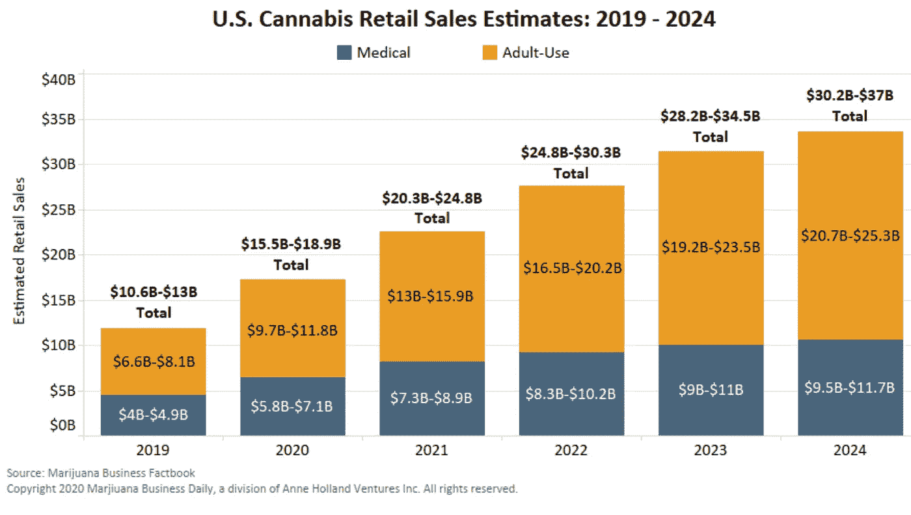

# 即使在新冠肺炎期间，大麻产业也将如日中天

> 原文：<https://medium.datadriveninvestor.com/cannabis-industry-on-track-to-fly-high-even-during-covid-19-db3edd3feb5e?source=collection_archive---------14----------------------->

正如我们看到的科罗拉多州今年夏天创纪录的销售，甚至没有一个疫情可以阻止大麻浪潮。2020 年，成人医疗和娱乐用大麻将成为 150 亿美元的产业，最近的预测表明，到 2024 年，这一产业将超过 300 亿美元。投资者和企业主如何解读相互冲突、令人困惑的监管框架，从而赚大钱？

该行业的零售额在 2020 年比 2019 年增长了 40 %( T1 ),尽管隐喻性地用一只脚跳着，双手被绑在背后，但仍在增长。随着整个过程受到严格审查和政治化，任何失误都可能产生重大影响。这就是法规遵从性如此重要的原因。错误可能会造成巨大的损失，甚至可能引发犯罪。

[https://mjbizdaily.com/exclusive-us-retail-marijuana-sales-on-pace-to-rise-40-in-2020-near-37-billion-by-2023/](https://mjbizdaily.com/exclusive-us-retail-marijuana-sales-on-pace-to-rise-40-in-2020-near-37-billion-by-2023/)

在一个完美的世界中，我们会看到一个全面的联邦框架，或者至少是一致的州级大麻相关业务监管准则。相反，每个管辖区都认为自己知道该行业应该如何运作的秘方。

我在最近的一期 Tech on Reg 节目中深入探讨了所有这些问题，该节目名为[Out of the Weeds:How to Smart on 大麻](https://provoke.fm/out-of-the-weeds-how-to-get-smart-about-cannabis/)，由 Fyllo 首席战略官兼 RegTech 的创始人 Amanda Ostrowitz 主持。拥有法律学位的前银行监管者阿曼达发现技术可以跟踪和理解行业复杂的规则和法规网络，于是创建了 CannaRegs。

大麻企业面临许多独特的挑战。支付处理和银行业务可能是一场噩梦，看不到尽头，因为自 2019 年 9 月以来，《安全银行法》一直停留在参议院。根据美国国税局的规定，企业甚至不能在商品成本之外扣除普通和必要的业务费用。

 [## 现在去哪里投资？数据驱动的投资者

### 当今时代充满了不确定性。这也适用于投资领域。大部分份额…

www.datadriveninvestor.com](https://www.datadriveninvestor.com/2020/08/18/where-to-invest-right-now/) 

对大麻公司来说，一个不协调的、拼凑起来的监管框架让这个行业变得更加复杂。当然，大麻在联邦一级仍然是非法的，这就把立法和监管留给了各个州。拥有不同许可类别和资格的州立项目看起来一点都不像。还有大约 900 个与大麻相关的法案搁置在各州立法机构和国会的地板上。

这意味着，即使是法律和监管专家也经常发现自己在寻找答案时抓耳挠腮。如果律师感到困惑，企业主和投资者也会感到困惑。所有的消费者想要的是一些便宜的菠萝库什。但合规成本的增加会慢慢影响销售价格。

当疫情来袭时，这个行业意外地碰上了一点运气。随着三月份禁售的开始，州政府认为药房在大多数大麻合法的州是必不可少的。尽管大麻公司没有根据《关怀法案》获得 [PPP 资金，](https://news.bloomberglaw.com/banking-law/pot-sector-cut-off-from-federal-pandemic-loans-turns-to-states)成人医疗和娱乐用大麻仍在逐年健康增长。

***未来会怎样？***

阿曼达表示，对于那些希望国会或行政部门转向蓝色可能会推动政府将大麻合法化的人来说，合规问题得到了解决，但事实可能并非如此。

虽然大麻的非刑罪化可能会使银行和支付过程变得更容易，但国家框架很可能会保留下来。各州投入了时间、金钱和资源到他们的秘方中，天哪，他们将会使用它。(我的话，不是阿曼达的。)然而，领导层的变动肯定会给该行业一些急需的喘息空间，以便像其他行业一样发展壮大。

与此同时，RegTech 来救援了。利用正确的技术来穿越合规迷宫的公司将在一个即将腾飞的行业中获利，即使道路上有各种障碍。

听听最近的[走出杂草:如何聪明对待大麻](https://provoke.fm/out-of-the-weeds-how-to-get-smart-about-cannabis/)。

订阅 Tech On Reg，了解法律、技术和高度监管行业的最新动态。

**访问专家视图—** [**订阅 DDI 英特尔**](https://datadriveninvestor.com/ddi-intel)