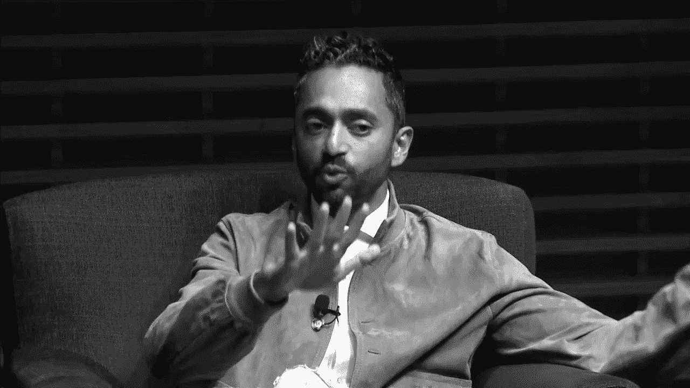

# 资本作为变革的工具

> 原文：<https://medium.datadriveninvestor.com/capital-as-an-instrument-for-change-12bfb9de4908?source=collection_archive---------2----------------------->

> “金钱驱动世界变好或变坏。钱是要被制造和分配的——你有道德义务去得到它，然后用它来有所作为。”Chamath Palihapitiya

Chamath Palihapitiya at Stanford [Photo credit: Stanford]

著名投资人 Chamath Palihapitiya 曾于 2017 年在斯坦福发表过一次颇有见地的演讲，在演讲中他阐述了自己对硅谷的亵渎观点。在他的职业生涯中，他在脸书担任过高级职位，是创始董事会成员之一，也是社会资本的创始人。以下是他对硅谷的一些看法:

# “不能吃 IRR”

硅谷的大多数投资者使用 IRR ( *内部收益率*)作为标准衡量标准来决定投资的成功与否。这一指标的问题在于，它倾向于将注意力集中在短期收益上，可能会危及公司的长期成功。

投资者总是会问年收入增长率有多高。如果它符合他们的期望，你可能会收到资本。但是他们的参与将需要进一步的发展。你如何实现这种 80%的高需求增长？

这种预期导致了营销和销售方面的大量支出，因为每个投资者都要求公司一轮又一轮地实现更多增长。

 [## 风险投资家在给创业公司播种时会考虑什么标准？数据驱动的投资者

### 2017 年，风险投资资金攀升至十年来的最高水平。你的创业公司目前吸引风险投资的机会是…

www.datadriveninvestor.com](https://www.datadriveninvestor.com/2018/04/20/what-criteria-do-venture-capitalists-consider-when-seeding-a-startup/) 

但是，创业公司不应该把投资花在更多的脸书和谷歌广告上，而是应该专注于产品的市场适应性，创造可持续的竞争优势。风险资本应该只是营销和销售的工具，而不是 R&D 和商业化的工具。

> “当你拆开包装时，你会意识到，快速的资金回报会彻底侵蚀长期思维和合理判断。适度增长，适度复利，这是关键。那是金子。”Chamath Palihapitiya

# “快速失败”不能启动严肃的项目

“快速失败”已经成为硅谷的传统智慧。当谈到消费者业务和应用程序时，这是完全有意义的，因为你必须跟上消费者不断变化的口味和欲望。昨天是 Snapchat，明天是抖音。对于查马斯来说，脸书作为一个社交媒体平台，完全是在“利用心理学”。它试图产生紧迫感，经常检查并保持更新。

他说，这个公式不适用于“T0”任何真正重要的事情。真正的创新需要人们花大量的时间去创造非常有价值的东西。大多数人把颠覆说成是一场革命，而事实上它是一场缓慢但稳步前进的进化。这是我们最终实现更美好未来的唯一途径。正如彼得·泰尔的名言:“*我们想要会飞的汽车，但我们得到了 140 个角色*(彼得·泰尔)。

> 这不是解决糖尿病的方法。这不是你如何使用精准医疗来治愈癌症。这不是你教育世界广大人口的方式。”Chamath Palihapitiya

# 幸运风险投资

成功的风险投资是关于定期识别赢家。硅谷的大多数风险投资公司都不是这种情况。事实上，在对估值超过 500 亿美元的最大成功初创企业进行首批投资的风险公司中，有很小一部分重叠。

> “如果有人看着你，告诉你他们知道自己在做什么，那他们就是在撒谎。”Chamath Palihapitiya

# 金钱是变革的工具

查马斯的最后一个见解最具影响力。他说，在自由派圈子里，鄙视金钱可能是一种时尚，但“它驱动着世界变好或变坏”。金钱会被制造和分配，你有道德义务去赚钱，用它来表达你的世界观。在我们的社会中，它增加并支持你的世界观。金钱必须被用作一种工具:

> “金钱驱动世界变好或变坏。钱是要被制造和分配的——你有道德义务去得到它，然后用它来有所作为。”Chamath Palihapitiya

目前，极少数男人(*大部分是男人*)在主宰世界，根据查马斯的说法，他们不是科技企业家，而是寡头。他们决定资金如何流动和分配。他们的世界观被放大了。因此，成为他们中的一员并根据你的世界观重新分配是很重要的。

> “我现在的全部目标就是。它能够聚集足够多的世界资本，然后按照我的世界观重新分配。”Chamath Palihapitiya

所以，拿着钱，用它来表达你的世界观。

这是真正的多样性。

表明立场！