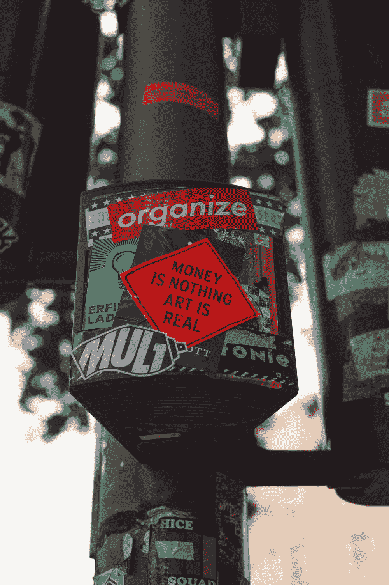

# 资本主义和民主是相互排斥的

> 原文：<https://medium.datadriveninvestor.com/capitalism-and-democracy-are-mutually-exclusive-240bc5033c24?source=collection_archive---------6----------------------->

*这篇简短的问答最初发表在巴尔干邮报上:*[*http://Balkans Post . com/article/876/capitalism-and-democracy-is-mutual*](http://balkanspost.com/article/876/capitalism-and-democracy-are-mutually-exclusive)

**BP:你如何描述高度资本主义化的经济体系，即美国的经济体系，对生活在这个国家的普通人的生活产生的影响？**

威廉·霍斯:嗯，美国个人收入的中位数大约是每年 31000 美元。相对而言，与世界上大多数人相比，这个数字很高。美国的问题是生活成本太高，包括房租、食物、医疗保健等等。这会吞噬掉储蓄、投资和退休的所有机会。取决于你住在哪里，房租或抵押贷款可能会吃掉你三分之一甚至一半的工资，因为房地产太贵了。

普通工人和公民感到意志消沉，想当然，无能为力。人们已经退出了公共生活，这是可以理解的原因:这里几乎没有社区或社会安全网。几乎每一个大城市都有不合格的学校和破败的基础设施，农村的贫困依然普遍存在。人们感觉到事情正在变得越来越糟，但在大多数情况下，他们甚至试图忽略或逃避谈论关键问题，当他们这样做时，它被扭曲，被调解，并通过媒体叙事或美国大选的奇观过滤。目睹这一切是痛苦和压抑的。在我看来，所有这些影响的结合创造了历史上最孤独、同质、墨守成规、专制和无聊的社会。

就财富和资源的分配而言，资本主义创造了一种人为的稀缺系统，在这种系统中，除非人们能够支付商品和服务，否则人们无法获得这些商品和服务。因此，公民变得依赖于一种制度，在这种制度下，他们要么工作，要么无家可归，忍饥挨饿。

**BP:你对资本主义国家的不平等、不公正和公司权力有什么看法？这些问题如何影响一个社会？**

威廉·霍斯:这些特征都是资本主义经济的一部分。他们的前身在以前的制度中显而易见，如封建主义和古代帝国:几千年来一直有严格的劳动分工，种姓制度和等级制度，以及垄断权力。过去的公地，如用于种植粮食或放牧牲畜的公共土地，或用于狩猎和采集的公共森林，被统治阶级窃取并私有化，然后统治阶级利用私有财产法实施对土地和资源的盗窃。当代的不同之处在于，全球化在全世界传播了一个神话，即自由市场总能比其他任何模式更好地提供基本商品和服务。

这种影响真的不能被夸大。当几代人之间的主仆关系将人们分成统治阶级和工人阶级时，最终发生的是统治阶级变得麻木，对下层人民的命运漠不关心。一种优越感出现，然后诉诸种族、民族、种姓或部落/氏族，被用来实施不平等，披着爱国主义宣传的外衣。另一方面，工人阶级变得太穷，没有组织，生病，或残疾，或幻灭忍受他们生活的苦役，定期组织和反击；尽管我们从历史中知道，非暴力的直接行动以及被压迫者的暴力反抗和革命通常是使社会更加公平的主要驱动力。

与旧制度相比，资本主义的另一个不同之处是，它成功地创造了庞大的中产阶级，中产阶级成功地创造了更大的生产体系，在某些情况下减少了最严重的贫困，以及表面上的政治民主。然而，我们的社会没有经济民主，只有在工作场所做出所有决定的资本主义企业主，以及他们的利益与劳动人民的利益截然相反的傀儡政客。

不幸的是，美国的中产阶级从根本上来说是工人，并不拥有生产资料，由于专制、等级划分的劳动和阶级，以及我们社会中的唯物主义和消费主义趋势，他们在不同程度上认同统治阶级。这种情况发生了几代人:经济和政治精英使用煤气灯和沙文主义宣传灌输他们的公民，并声称其他国家和少数民族是敌人。随着时间的推移，6000 年的文明确实在晚期资本主义中得到了强化，这产生了一种集体斯德哥尔摩综合症效应；大多数人并不比中世纪的农奴和农民更有发言权，但他们仍然将统治阶级的统治者视为英雄和救世主:那些美好而仁慈的“就业创造者”。统治阶级粉碎希望和梦想，降低期望，让工人阶级听命于他们，同时喋喋不休地说资本主义的“自由民主”是有史以来最好的制度。

英国石油公司:资本主义和全球变暖之间有什么联系？说资本主义是这种现象背后的主要因素是否正确？

**威廉·霍斯:**资本主义依靠无止境的增长来延续。为了保持增长和利润，企业依赖最便宜的能源形式——在过去 200 年的大部分时间里是化石燃料——来运营工厂、运输货物、为仓库和办公楼供暖和照明等。

资本主义要求企业的所有收益——利润——归企业所有者所有，同时将风险和成本转嫁给公众和环境。自从工业革命开始以来，资本主义公司以煤、天然气和石油的形式出售能源，并获取全部利润。与此同时，露天开采、石油泄漏、水力压裂、空气和水道污染以及二氧化碳增加的影响，都留给了公众去处理。有时，公司支付微不足道的罚款或实施微薄的计划来恢复受损的栖息地，但它永远无法偿还真正的成本，因为没有办法用货币价值来说明生态系统的健康。我们称之为经济学的伪科学证实了这一点:他们声称私营公司可以获得所有收益，而做生意的成本——污染、大气变暖等——是公正和明智的。——是他们的模型中无法解释的“外部性”。

化石燃料公司使用的其他机制是贿赂、游说、渗透和强迫国家补贴他们的企业、提供税收减免、放松监管、阻止立法和司法监督，以及解散或在必要时谋杀反对活动团体。

当然，资本主义是罪魁祸首，这是关键因素。这就是为什么资本主义精英们一有机会就疏远自己——他们生活在封闭的社区里，和他们的同类生活在一起，雇佣私人保安，雇佣军队——总的来说，和我们普通人相比，他们生活在不同的领域。为什么？因为他们知道他们要对制造和/或加剧所有这些相互关联的危机负责。

BP:资本主义和民主是对立的吗？

**威廉·霍斯:**是的，资本主义和民主是相互排斥的。问问你自己，在大公司里，工人们对谁、什么、何时、何地、如何以及为什么产品是这样制造的有投票权或发言权吗？或者决策是由所有权和一小部分高管和经理决定的？资本主义从根本上疏远和剥削工人，将他们视为可互换的一次性物品。

在美国，我们有寡头政治。在其他高度不平等的社会中，同样的问题出现了，寡头斗争并赢得政府的让步，对穷人实施放松管制、私有化和严厉的紧缩措施，对富人实施税收减免和漏洞。因此，全球各地的经济都在边缘徘徊，专制、蛊惑人心的伪民粹主义正在崛起:最好的例子是特朗普、欧尔班、杜特尔特、博尔索纳罗、埃尔多安和莫迪。

资本主义社会将私有财产权置于一切之上。西方人享有的有限政治权利和相对体面的工资类似于胡萝卜；但是，当工人们开始鼓动争取经济权利、种族平等和性别平等时，当权者很快就会拿出大棒。资本主义天生就是专制的。

举一个简单的外交政策例子，资本主义强国用来伤害他人的每一个借口都是他们自身恶意的投射。例如，2003 年在伊拉克，萨达姆被指控拥有大规模杀伤性武器。嗯，美国在伊拉克使用了大规模杀伤性武器——炸弹、导弹、白磷和贫化铀。在阿富汗，塔利班被指控庇护恐怖分子。美国是世界上对和平的最大威胁，它在世界上大多数国家庇护、雇佣、武装和使用恐怖分子和黑色行动。美国在 130 多个国家的境外有 800-1000 个基地(真实数字是保密的)。

在美国生活最令人沮丧的事情之一是两党制是如何欺骗几乎所有人的——阶级从来都不是根本问题。自由派把一切出了问题都归咎于保守派，保守派则归咎于自由派，并把他们贬为“激进的社会主义者”。很难扩大讨论的范围来表明真正的问题是资本主义。双方都同意我们“生活在民主中”，但事实并非如此。美国人有一种奇怪的想法，认为只有极权主义的独裁政权才是不民主的，事实上，我们被允许选择我们的工作和购物，这使得美国成为一个“自由的国家”

事实是，我们确实生活在一个独裁政权中:一个金钱独裁政权。美国人仍然通过冷战宣传的镜头来看待威权主义和独裁的概念:任何拥有中央计划经济和政治局的国家都是“不民主的”，但拥有“自由市场”和“公平选举”的美国是一个自由民主的国家。事实是，我们有一个财阀、军事和情报领导人以及政治家的轮换阵容，他们都为万能的美元服务。这种轮换提供了一种民主的幻觉——因为没有一个团体仍然掌权，没有人对这个系统承担责任——一个“自由社会”的幻象持续存在。因此，因为没有一个群体是永久的掌权者，所以很少有人认识到问题的规模和根源:资本主义。总统不能从根本上控制经济或对经济负责(他们可以修改税收、关税、利率，但只能在有限的程度上)，企业精英不能直接控制政府的三个分支(他们通过捐赠、游说和贿赂秘密地做到这一点)，军队也不能主导这两个分支(不像世界其他地方的政变和军政府)，因此公众被灌输了这样一种思想，即实际上存在制衡和不同的利益集团来统治美国。最终，公众对寻找问题的真正根源(以工业为基础的资本主义)感到厌倦，并诉诸两党争吵以及民族主义和种族主义宣传来缓解焦虑。

尽管如此，仍有理由保持乐观——西方工人阶级正在觉醒和动员起来，美国和欧洲已经打破了反对严肃对待社会主义的禁忌。反资本主义的批评正变得越来越被广泛接受，我们在西方仍然享有的政治权利以及相对不受审查的数字媒体为左翼群众运动和组织提供了很快获得严重势头的可能性。

英国石油公司:美国帝国主义的干涉如何影响目标国家和整个世界？

威廉·霍斯:嗯，这是我希望新一代活动家和学者能够帮助回答的问题之一，因为这里有太多成熟的领域可供调查。首先，读者可能想了解一些关于这一主题的最受欢迎和最容易理解的北美作家:诺姆·乔姆斯基、迈克尔·帕伦蒂、威廉·布鲁姆、米歇尔·乔苏多夫斯基、纳奥米·克莱恩和约翰·珀金斯。

美国从一开始就是一个帝国。二战后，美国理所当然地成为世界霸权，并利用其军事、经济和政治力量将其影响力扩展到世界的每一个角落。作为拥有无与伦比的影响力和几乎取之不尽的资源的全球大国，美国利用其多种形式的杠杆来胁迫、贿赂和偷窃，以及管理和干涉其他国家的事务。

像古代帝国一样，今天的美国以各种形式从其附庸那里获取贡品:化石燃料、债务偿付、矿产资源、利用外国银行购买我们的债务并支撑我们的货币，等等。这些影响是悲剧性的和毁灭性的:想想我们的帝国战争中所有的死伤者，所有被赶出家园的人，所有在全球为西方跨国公司服务的奴隶劳工和不人道的工作条件。西方资本家和我们的军事帝国也要对数不清的环境破坏负责，这不可避免地导致了许多世界健康危机，包括癌症、糖尿病和各种慢性病的发病率上升；美帝国主义使世界变得更加贫穷、更加病态、更加危险。