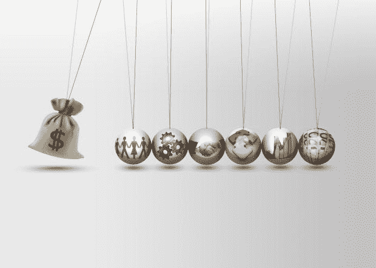
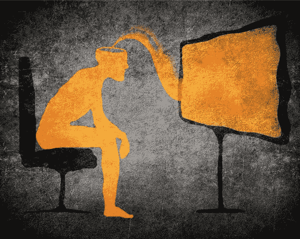

# 资本主义和假现代性

> 原文：<https://medium.datadriveninvestor.com/capitalism-and-fake-modernity-7147fff9c4c5?source=collection_archive---------4----------------------->

## 具有讽刺意味的是，保守经济学家崇拜资本主义

Image by [Skitterphoto](https://www.pexels.com/@skitterphoto), from Pexels

资本主义是一种财富私有化的经济，因为个人拥有生产商品的手段并从中获利。这种经济体系在历史上显示出高度的创新性，因为一些利润可以被再投资以改善业务，而私有制导致公司之间通过满足或创造新需求来解决问题的竞争。

有些经济学家和商人实际上崇拜资本主义。他们看到了快速的技术进步，创造了巨大的财富，以及部分财富的渗透，这些财富消除了许多世界贫困，创造了“第一世界”的所谓“中产阶级”。

我们认为这种进步是理所当然的，因为我们不再熟悉资本主义所征服的古代世界，在这个世界里，权力和财富的分配是如此不平等，以至于妇女、外国人和奴隶连个人权利都没有，更不用说财产和创业的机会了。

古代世界的主要人口中心属于不同的帝国，或者刘易斯·芒福德称之为“巨型机器”这位君主掌握着绝对的权力，并开始了建造金字塔等虚荣的工程壮举，或者发动战争扩张帝国。国王或皇帝与他的家人和执法人员过着奢侈的生活，而大多数人扮演着农民、劳工或士兵的角色，他们的劳动所得很少。

在我们的术语意义上，没有“人”这样的东西，因为古人不认为他们自己具有共同的本性，我们的基因连续性也没有被发现。在公元前一千年的轴心时代革命中，我们共同的权利和目的的意识爆发了。然而，在很大程度上，皇室被视为神，而女人和奴隶则被视为财产。

因此，资本主义和现代工业是自由人文主义革命的一部分，在这场革命中，科学粉碎了支撑古代帝国的非人化神话，而哲学家和经济理论家承诺了世俗社会像众所周知的凤凰涅槃一样崛起的途径。

不是君权神授，而是纯粹的个人和动物自私将是进步的引擎。正如亚当·斯密(Adam Smith)所言，让个人在一场有组织的斗争中相互对抗，允许他们保留自己在这一过程中生产的大部分产品，整个社会就会繁荣起来，就好像有一只“看不见的手”在确保结果一样。

考虑到这一长远观点，将资本主义视为神圣不可侵犯或将“自由市场”视为灵丹妙药显然有些讽刺意味，仿佛资本主义需要像古代帝国主义一样对待，需要用神奇的思维和蒙昧主义的咆哮来捍卫；相反，社会进步是不言自明的。因此，让我们通过考虑资本主义的几个明显缺陷来探究这一讽刺。

# 可持续性和环境危机

君主们经常试图通过征服领土和奴役当地部落来扩大他们的势力范围，但从长远来看，他们的进步受到了他们过度扩张趋势的制约，因为专制君主的集权使他们变得颓废和短视。此外，一个暴君可能得到的，下一个可能会失去，因为统治的能力是继承的而不是赢得的。例如，亚历山大大帝的全球帝国在他死后不久就崩溃了。

资本家还寻求扩大他们的业务范围，以最大限度地增加利润，保护他们免受竞争对手的影响，因此资本主义经济体专注于增长的理想。还是那句话，在古代世界，领土的增长是为了荣耀神灵和帝国的宗教烙印，以及奉承专制者的虚荣心。但在资本主义社会，增长是由自私的民主化引起的，这刺激了对技术进步和为每个自由公民和工人划分领地的需求。

古代世界对财富的囤积限制了整个文明的发展，因为大多数工人都习惯于认为他们不配像国王一样生活。但是，资本主义的自由主义动力要求，即使是奴隶在人格上也等同于贵族，这意味着我们应该努力建设一个我们都有家，每个家都是我们的城堡的社会。

将古代精英主义平均主义通缩与资本主义的创新优势结合起来，你会发现，我们会多么迅速地与地球维持经济冒险的能力发生冲突。古代世界灭绝了动物物种，也砍伐了森林，但没有科学和资本主义工业所提供的超人的效率。

那么，问题在于，这种效率可能和推动现代长期进步的自私一样短视。诚然，我们有人文主义和民族主义等公民意识形态，这促使我们认同群体，为更大的事业而奋斗。但是这些替代宗教是对古代原始宗教的苍白模仿，而科学和哲学使古代原始宗教声名狼藉。在任何情况下，这些统一的意识形态都被有形的社会分裂所掩盖，因为利润被私有化，生产者和消费者变得嫉妒他们邻居的财产，而那些跟不上的人屈服于抑郁、焦虑或阿片成瘾。

如果经济增长的目标是满足大众的自私，并且这种增长与地球的有限资源相冲突，那么资本主义本身可能是不可持续的。至少，如果经济增长的自由主义理想被假定为无限的，那么这种增长将很快不得不在世界之外进行，这是一个可疑的命题；否则，全球变暖的后果将使资本主义的发展难以为继。

# 可持续性和工人异化

对资本家来说，还有第二个不可持续的威胁，卡尔·马克思解释了这一点，尽管他最好的洞察力与他对这个问题将不可避免地如何解决的推测混在了一起。

马克思指出，在资本主义中，所有者和工人,“资产阶级”和“无产阶级”之间存在着固有的二分法。尽管在资本主义社会，每个人都有合法权利开公司，但每个人都可能是所有者或狭义的“资本家”这一概念甚至在理论上也不一致。如果你创办了一家企业，并取得了成功，你将需要那些无法成为企业所有者的员工。

此外，我们的技能和兴趣之间的天然差异，以及运气在我们事务中始终存在的作用，意味着一些企业会比其他企业更成功，在竞争中，一些人将不得不满足于工资微薄的工作。

对马克思来说，这种二分法的结果是，下层阶级将无法满足，并与他们控制自己创造的东西的自然动力疏远。工人们因为他们的劳动而得到工资，但是大部分的利润都到了所有者的手里，他们可以自由地将这些钱进行再投资或者用来过国王般的生活。资本主义有一个劳动分工，所以工人加入一家公司，必须执行他们的卑微任务，而决策是在执行层面上做出的。工人们把他们生产的东西交给公司，当然，因为工人们不拥有公司、材料或设备。

但是资本主义不仅仅是劳动分工。对马克思来说，这一体系中的利润概念本质上是剥削性的，因为所有者以工人为代价榨取剩余价值并使利润最大化，必然付给他们低于其工作价值的报酬。说劳动力的价值是主观的几乎没有什么可辩护的，因为这只会提出一个问题，为什么所有者在决定支付他们什么报酬时会选择忽视工人带来的如此多的价值，包括他们的教育、生活经历和在社区中的角色。无论对工人对公司价值的评估是客观的还是任意的，考虑到利润不归工人所有，工资都是剥削性的。

然而，所有者并不完全是坏人，因为资本主义制度对所有者和工人都施加了限制。如果老板付给工人更多的工资，公司可能无法与更无情的公司竞争。

无论如何，古代社会也有劳动分工，工人也有类似的退化或自我异化，但是古代和现代社会有一些重要的区别。首先，古人有可操作的神话和宗教来证明他们的阶级划分是合理的，而现代和科学世界观往往会剥夺我们的这些防御。

例如，我们可以*说*我们在比赛中得到了我们应得的，这取决于我们努力的程度，但这种熟悉的理由证明是极其站不住脚的。运气和不劳而获的自然差异意味着市场不像国际象棋或棒球这样完全公平的游戏。用科学术语来说，我们的技能没有内在价值。我们最终的财富差异可能就像我们身高的差异一样是残酷的事实:这些并不完全是我们应得的或合理的，而是我们必须接受的客观结果。资本主义的斗争促进了我们性格的影响，使我们能够利用它们，或者因为它们而彻底失败。

古代和现代劳动分工的第二个不同是由于自由个人主义的兴起:古代世界的工人无权上诉、反抗或联合起来抗议他们的工作条件。他们有能力这样做，但是他们会被他们的神权文化所束缚。相比之下，自由市场中的工人有权通过成立工会、罢工、抵制公司或非暴力反抗来抗议他们受到的不公平待遇。

因此，马克思的预测是，工人们最终会更进一步，完全抛弃资本主义和资产阶级，转而支持一种共产主义制度，在这种制度下，工人们拥有生产资料的一部分，阶级差异被消除。这里我们不必关心马克思理论的细节。但是，资本主义涉及阶级斗争的主要观点是，阶级斗争为资本主义在另一种生产方式中的终结埋下了种子，这并不像许多狭隘的资本主义捍卫者所认为的那样牵强。

互联网和社交媒体等技术进步实际上已经建立了一个集体主义体系，它更像一个巨大的图书馆，而不是一系列企业。此外，目前全球草根阶层强烈反对资本主义的新自由主义共识，尽管这种强烈反对是由右翼民粹主义者领导的，而不是由左翼资本主义批评者领导的。

# 自律资本主义的诡计

第三种批评可能会提出资本主义是否会在共产主义崛起或民粹主义回归神权或盗贼统治中戏剧性终结的问题，即资本主义一直是一种诡计。

不仅仅是像马克思说的资本主义天生不稳定；相反，资本主义从来没有像我们被误导的那样具有革命性。是的，在资本主义下，有私人利润和企业所有权，以及惊人的创新和财富创造。但是，处于资本主义核心的自私一直与这种经济将自我调节以及资本主义社会将在文化上与自由主义兼容的承诺相冲突。

自我监管和自由主义真的会是革命性的，但是尽管资本主义在将科学进步应用于技术产品方面很神奇，但它强加了几乎不加掩饰的前现代阶级划分。

资本主义的一个惊人之处在于，为了避免经济灾难，必须让所谓的“看不见的手”变得可见。对市场的管制越放松，企业就越是时好时坏，陷入繁荣与萧条的循环，甚至可能导致萧条或失败的政府。政府不得不进行干预，帮助某些政党摆脱困境，重振经济。例如，大萧条的结束是由于政府在二战中的支出和动员。

因此，早期现代的承诺是，释放大众的自私会产生最好的结果，因为竞争者会努力满足需求。例如，如果你在市场上想买一个三明治，你会有很多选择，有很多竞争者出售，每一个都根据市场的承受能力合理定价。如果你发现一个定价过高或有其他缺陷的三明治正在出售，你可以在未来避开该生产商，如果有足够多的顾客这样做，这将向三明治卖家发出信号，她最好修改她的技术或停业。

但在实践中，竞争者之间的斗争使价格下降，产品质量提高，这只是资本主义发展的初始阶段或人为阶段。往往会发生的情况是，赢家和输家自己解决问题，赢家通过收购或破产竞争对手来巩固他们对市场的控制，直到获胜的公司成为垄断企业或寡头企业，它们太大而不能倒闭，甚至比政府更强大。政府不得不再次干预反垄断法规，以维持其在社会中的权力。

沃尔玛、亚马逊、脸书、迪斯尼、可口可乐，以及更早的时候，美国烟草公司、洛克菲勒的标准石油公司和卡耐基的钢铁公司——一旦这些庞然大物形成，它们就变成了寄生性的，而不是自我调节的，为了公众的利益，政府可能不得不解散或以其他方式进行改造。

# 自由人文主义的诡计

弗洛伊德之后，公司不再视顾客为王，努力满足市场上现有的需求，而是认识到他们可以通过销售产品来制造需求。你可以销售相关的性感，而不是仅仅销售一瓶啤酒。这是对资本主义自由主义大吹大擂的嘲弄，因为商业和广告不再以个人消费者是自主、理性和道德的理念为前提。

请记住，资本主义是精英革命的一部分，将推翻腐朽的贵族统治，迫使每个人努力工作谋生。然而，美国中产阶级与其说是由自由市场资本主义产生的，不如说是由新政和美国在两次世界大战后的优势产生的。放松管制的“自由意志主义”精神削弱了政府，并使其变得愉快，这有助于为财阀统治和强大的特殊利益集团控制监管机构扫清道路。这些利益集团不受文化制衡，变得越来越傲慢和腐败，直到他们的短视行为导致经济崩溃，就像美国 2001 年(互联网泡沫)和 2008 年(房地产泡沫)发生的那样。

从 1980 年开始，实体经济变得相形见绌，金融和用于投机或存放在对冲基金或股票回购的数万亿美元的租金收入相形见绌。正如一篇文章所说，金融、银行业已经“加速了从为生产性投资提供信贷到为非生产性投资的短期收益提供资金的‘缓慢撤退’。”

此外，“资本流入的逆转引发资产价格的大幅下跌，通常会引发系统性问题，有时会通过剧烈的价格波动破坏实体经济的稳定，或者更糟糕的是，可能需要数年才能恢复的灾难性金融危机。”此外，“过度膨胀的金融部门从实体经济中吸走了金融资源和人才。”

简而言之，尽管资本主义被宣扬为对古代帝国主义和大众精英堕落的自由人文主义挑战，但资本主义实际上重新强加了同样的阶级划分。我们有富豪，而不是君主；而不是王国、垄断或寡头垄断；取代帝国的是跨国公司；取而代之的是奴隶，我们的工薪族被困在没有出路的工作中，他们的未来被亿万富翁掠夺性金融家和投机者的阴谋集团所掌控，他们每十年摧毁经济一次。

# 资本主义的双重讽刺

这就好像有一个默认的，不人道的社会秩序，在数百万年的统治等级演变中拼凑起来，这渗透到任何进步的尝试中，重新建立了怪诞的社会不平等，尽管所有的自由主义者，社会主义者，甚至共产主义者的言论。又一次，极少数超级富豪过着神仙或皇帝般的生活，亿万富翁和普通工人的平等理论人格——尽管生产率提高了，但他们的工资在美国已经停滞了几十年——几乎没有什么值得庆祝的。

工作的自动化有助于完成新封建主义和伪现代性的图景，正如尤瓦尔·赫拉利所说，当数亿工人变得无用，与权势人物无关时。很久以前，奴隶和农民对皇室来说是可有可无的，很难看出自由主义的空洞言辞如何能够阻止类似的残酷现实的回归。

那么，在自由意志论者或新古典经济学家对资本主义奇迹的信仰中，存在着双重讽刺。再一次，资本主义被认为终结了必须由宗教宣传支持的古代巨型机器，因为资本主义的进步将是世俗的和明显的。但是对于所有的企业私有制和个人自由来说，旧的社会划分以新的外衣再次出现。

那么，第一个讽刺是，现代进步必须由一种神学来补充，由经济学家和新自由主义政治家对资本主义的神圣化来补充。但第二个讽刺是，毕竟，这种对资本主义的神奇思考可能是恰当的。让我们假设一个放松管制的市场是自治的，并倾向于达到有利的平衡，让我们庆祝我们作为人的平等权利和自由——就像古人遵从他们的神话来忽视他们的社会安排的严重不公正一样。

*原载于 2020 年 4 月 13 日*[*【https://www.datadriveninvestor.com】*](https://www.datadriveninvestor.com/2020/04/13/capitalism-and-fake-modernity/)*。*