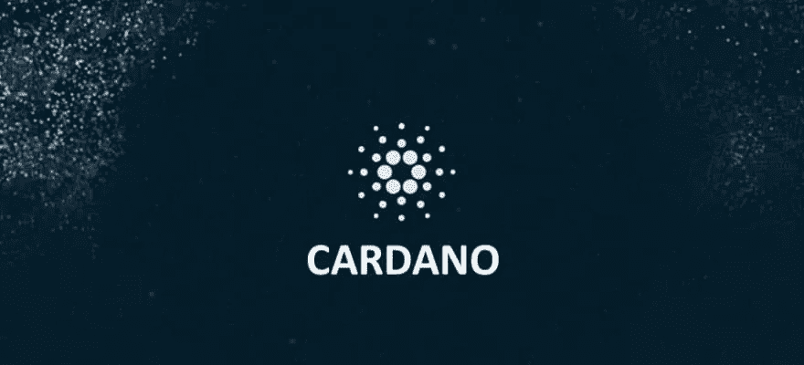

# 卡尔达诺解构

> 原文：<https://medium.datadriveninvestor.com/cardano-deconstructed-612a13d2d0d4?source=collection_archive---------10----------------------->

Cardano 项目是一个开源的区块链项目，由以太坊的联合创始人之一 Charles Hoskinson 于 2015 年创立。

与大多数项目不同，卡尔达诺完全是在坚实的科学和数学基础上从零开始建造的。该项目始于对加密货币的第一原理基础研究，并受到该行业不寻常和适得其反的增长的启发。团队开始一次解决一个概念，研究并撰写同行评审的论文，真正理解需要解决的问题——不仅仅是技术问题，还有社会学、文化、法律等。

这使得 Cardano 获得了学术上的优势，并且对于每一个发布的项目，都会进行严格的同行评审。同行评审并不局限于开发人员或 Cardano 社区，而是以科学论文的形式提出理论，并由学术界的科学家和程序员在会议上进行评审。为了防止偏见或负面后果，作者和审稿人彼此都不认识。到目前为止，Cardano 已经发表了 100 多篇同行评议论文。

卡尔达诺将自己描述为继比特币和以太坊之后的第三代区块链。比特币引入了去中心化数字硬币的概念，以太坊将用例扩展到了智能合约。Cardano 的优势在于吸取了以前区块链平台的缺点，旨在解决与可伸缩性、互操作性和可持续性相关的问题。Cardano 设计为模块化，基于两层:结算层“Cardano SL”和计算层“Cardano CL”。

与比特币类似，Cardano SL 处理交易。然而，最显著的区别是，比特币使用的是工作共识算法证明，而不是股权证明。由于其高能耗和交易费用的增加，工作证明给可伸缩性带来了主要问题。利害关系证明通过达成分布式共识解决了这个问题。这意味着矿工是根据随机选择和持有的硬币数量来选择的。Cardano 运行的是一个名为 Ouroboros 的协议，这个协议是用一种叫做 Haskell 的语言从头开始构建的。Ouroborous 位于 Cardano SL 的核心，是第一个将利益相关共识证明的效率与比特币挖掘的安全性相结合的安全协议。

“Cardano CL”的目标是允许技术和非技术背景的用户使用一个完全定制的虚拟机(称为 IELE，是同类最先进的虚拟机之一)在 Cardano 网络上创建和执行功能性智能合同。主要的“DAO hack”以及其他发生的黑客事件提高了人们对智能合约当前实现的漏洞的认识。Cardano CL 提供了一个更安全、适应性更强、对开发者更友好的解决方案。

分层是为了允许发生变化或“软分叉”,而不会破坏安置层或导致网络分裂。与整个分类帐相比，它还允许仅访问相关数据，这节省了能源和资源。然后将在覆铜板和 SCL 上构建层或“侧链”。这种设计使得保留下来的遗留系统对生态系统中发生的一切都完全透明。

卡尔达诺内部的加密货币叫做 ADA。每位 ADA 持有人都被激励参与经营股权池或将其 ADA 委托给现有股东。参与其中任何一项都将获得 ADA 形式的奖励。ADA 将很快在 Cardano 上用于各种应用和服务。Daedulus 是 Cardano 的桌面钱包，也是 ADA 的家。它经过高度设计，具有最大的安全特性和先进的加密技术。随着 Cardano 的发展，代达罗斯将成为一个通用的加密货币钱包，具有自动加密货币交易和加密货币到法定货币的交易。

卡尔达诺项目是由最聪明的人在坚实的基础上从零开始设计和建造的。它不仅遵循独特的学术方法，而且它包括一个伟大的开发团队，并将是第一个使用多层的区块链。卡尔达诺也没有规模限制，运行在一个共识机制上，比老区块链更公平，更环保。它承诺提供*“一个更加平衡和可持续的生态系统，更好地满足其用户和其他系统的需求”*随着 ADA 攀升至世界前三大加密货币，这一承诺非常有前途。

 [## 动机

### Cardano 是一个始于 2015 年的项目，旨在改变加密货币的设计和开发方式。的…

why.cardano.org](https://why.cardano.org/en/introduction/motivation/) 

https://pos-haskell-prototype.readthedocs.io/en/latest/