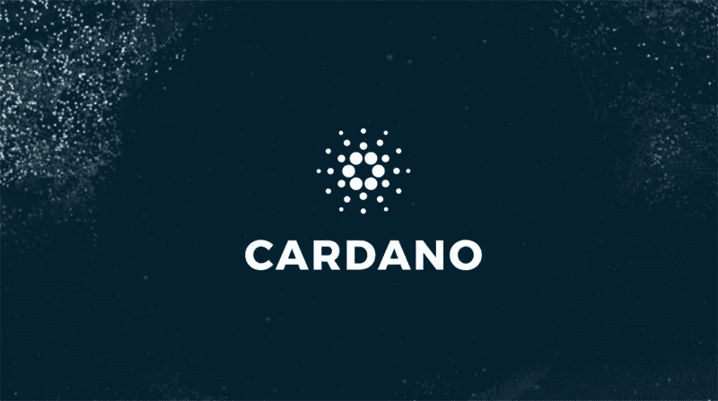

# 卡尔达诺 DeFi —可能在邦德利

> 原文：<https://medium.datadriveninvestor.com/cardano-defi-possible-on-bondly-93bcdc42878f?source=collection_archive---------6----------------------->

Cardano 以 Goguen 的名字发布了一个更新包。这些更新包括智能合约、分散式应用程序和使用本机令牌的能力。10 月，该团队宣布了 Goguen 的发布时间表，预计将在 2021 年 2 月底之前发布。

Cardano 的创造者 IOHK 现在在推特上说，Bondly 正在为其平台带来新的 DeFi 功能。他称这种合作关系是公司使命中的“一大步”。通过 Bondly 合作伙伴关系，Cardano 现在有了一些从一开始就已经在实施的东西。

Bondly Finance 以其分散金融(DeFi)应用平台 Polkadot 而闻名，它将 Cardano 配对视为对其当前基于以太坊和 TRON 的产品的补充。在 2 月份发布之前，Bondly 将把它的 BONDLY token 导入 Cardano。其他步骤包括整合 BSwap 和 Bondly 的交易平台 BONDProtect，以及分散托管和买家保护产品。

与卡尔达诺的联系对邦德来说意义重大。在以太坊上，目前使用 ETH 的交易优先于使用其他令牌的交易。这个限制在卡尔达诺是不存在的。因此，当 Goguen 上线时，Cardano 可能会成为以太坊的一个大竞争对手。

 [## 波尔卡多特是新的以太坊黑仔

### 商业杂志《彭博》选择波尔卡多特作为新的以太坊黑仔。

medium.com](https://medium.com/coinmonks/polkadot-is-the-new-ethereum-killer-556a3f7cc7d7) 

IOHK 还在 12 月 8 日宣布，它将与另一家公司合作开发其项目 Catalyst。例如，DeFi lending market Liquid 将是第一家与 IOHK 合作的公司。Catalyst 项目的愿景是为 Cardano 社区实现更多的开放和民主。这种液体已经在 Cardano 环境中发挥作用，为用户提供一种借出和借入资产的方式。

卡尔达诺此举正值分散化金融领域迅速发展之际。几乎在任何增长的市场，新的机会正在出现。根据 Dappradar 的说法，以太坊是区块链最具挑战性的地方，价格昂贵。当然，这是一个大问题，尤其是在一个以降低交易成本为基本理念的行业。在某种程度上，DeFi 的开发是为了解决基于法定货币的财富转移成本过高的问题。此外，成本问题直接影响 DeFi 项目。根据 Dappradar 的数据，以太坊中 85%的日常活跃钱包都是 DeFi 应用。

 [## DeFi 中的非永久性损失-提供流动性所涉及的风险|数据驱动的投资者

### 非永久性损失也称为发散性损失，是当你在 AMM 中持有代币时…

www.datadriveninvestor.com](https://www.datadriveninvestor.com/2020/11/11/impermanent-loss-in-defi-the-risks-involved-in-providing-liquidity/) 

以太坊的活动也达到了历史最高水平。一年多来，活跃 ETH 地址的数量和百分比一直在稳步增长。根据 Dappradar 的数据，交易量也在上升，11 月底同比增长了 1784%。

Cardano 凭借其新的更新进入了一个充满潜力的激动人心的市场。

我在每月的[时事通讯中分享了更多私密的想法，你可以在这里查看](https://mailchi.mp/bf8f8e8ed697/keep-in-touch-with-lukas)。请在评论中告诉我，并在各种社交媒体平台上加入我:

[推特](https://twitter.com/WiesfleckerL) ● [Instagram](https://www.instagram.com/lukaswiesflecker/) ● [脸书](https://www.facebook.com/lukaswiesfleckerr)●[Snapchat](https://www.snapchat.com/add/luggooo)●[LinkedIn](https://www.linkedin.com/in/lukas-wiesflecker-1b11251a5/)

无论你做什么，都要带着爱和激情去做！

## 访问专家视图— [订阅 DDI 英特尔](https://datadriveninvestor.com/ddi-intel)