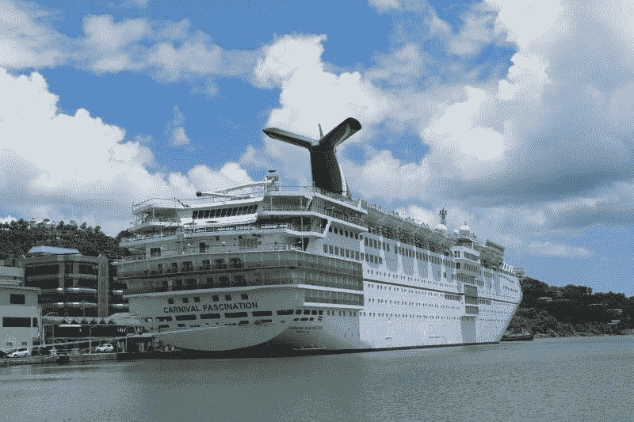
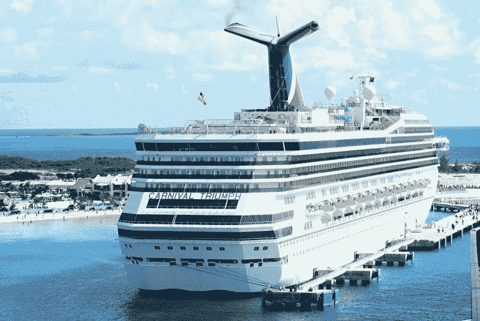
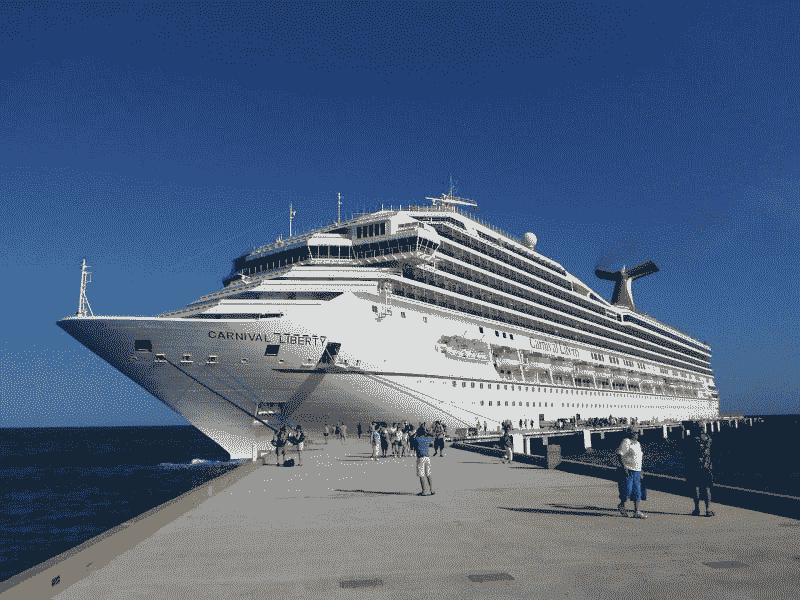

# 嘉年华公司和邮轮业注定要失败——市场疯人院

> 原文：<https://medium.datadriveninvestor.com/carnival-corp-and-the-cruise-industry-are-doomed-market-mad-house-2b596880bac2?source=collection_archive---------6----------------------->

冠状病毒可能会扼杀游轮业和嘉年华公司。例如，嘉年华在 2020 年 1 月 2 日以 51.31 美元的股价开始，在 2020 年 4 月 24 日跌至 11.91 美元。

最早的几个；最引人注目的是，新冠肺炎疫情袭击了游轮。例如，四月初，四人死于荷兰美洲航线的 *MS Zaandam* ， *Forbes* 。此外，Zaandam 女士上的 200 人报告了医生归因于冠状病毒的流感样症状。

此外，NBC 新闻报道，截至 2020 年 4 月 2 日，珊瑚公主号上有两名乘客死于冠状病毒。珊瑚公主号上至少有 12 人的新冠肺炎病毒检测呈阳性。

# 邮轮业有一个疫情问题

美国疾病控制和预防中心(CDC)在 2020 年第一季度的三艘游轮上，实验室确认了超过 800 例冠状病毒。

新冠肺炎病毒在中国以外的第一次爆发发生在 2020 年 1 月 20 日停靠日本的*钻石公主号*上。疾控中心估计*钻石公主号*3711 名乘客和机组人员中有 19.2%感染了冠状病毒。

疾控中心报告称，37 名钻石公主乘客因冠状病毒需要重症监护，8 人死亡。总的来说，疾病预防控制中心估计超过 800 人在两艘游轮上感染了冠状病毒，分别是*大公主号*和*钻石公主号*。

 [## 投资区块链前要问的三个简单问题(也是一个困难的问题)|数据…

### 现在是了解区块链的最佳时机。不同货币之间的增长率，比如…

www.datadriveninvestor.com](https://www.datadriveninvestor.com/2020/03/12/three-simple-questions-and-one-difficult-one-to-ask-before-investing-in-a-blockchain/) 

数据显示，游轮是冠状病毒和其他疾病的完美传播机制。因此，我认为会有人呼吁禁止游轮或禁止游轮进入许多港口。

# 嘉年华公司赚钱了吗？

考察嘉年华公司(NYSE: CCL) 是考察邮轮行业盈利能力的绝佳方式。具体来说，嘉年华在美国海岸运营着 28 艘船。

嘉年华在冠状病毒之前一直在亏损，尽管它的收入在增长。在截至 2020 年 2 月 29 日的季度中，Stockrow Carnival 的收入增长率为 2.48%。

然而，嘉年华公司报告该季度运营亏损 7.11 亿澳元，普通净亏损 7.81 亿澳元。总体而言，嘉年华在该季度的收入为 47.89 亿美元，总利润为 12.68 亿美元。

相反，嘉年华在最后一个季度产生了现金。截至 2020 年 2 月 29 日，嘉年华的运营现金流为 9.16 亿美元，融资现金流为 10.89 亿美元，期末现金流为 13.68 亿美元。

令人印象深刻的是，嘉年华在 2020 年 2 月 29 日有 13.54 亿美元的现金和短期投资。这一数字从 2019 年 11 月 30 日的 5.18 亿美元和 2019 年 2 月 28 日的 6.49 亿美元有所增长。

我认为嘉年华的财务数据显示，在冠状病毒出现之前，游轮是一个糟糕的行业。解释一下，我不认为游轮能赚钱。

# 游轮是一个泡沫

我认为在冠状病毒之前，巡航是一个泡沫。例如，*邮轮市场观察*2018 年有 314 艘邮轮，载客量为 537，000 人。

具体来说，*邮轮市场观察*估计嘉年华的 26 艘船在 2018 年的载客量为 71000 人。总的来说，邮轮国际协会(CLIA)预测 2019 年将有 3000 万人乘坐邮轮。CLIA 估计，这一数字从 2018 年的 2820 万乘客和 2009 年的 1780 万乘客增长而来。*

我认为这些数字表明，在新冠肺炎之前，巡航游是一个泡沫。运营商非常渴望吸引乘客，他们举办噱头巡游，如职业摔跤和老电影之旅。

游轮公司采用这些噱头，因为它们无法吸引固定乘客。因此，在冠状病毒出现之前，邮轮行业很难装满船只。

# 邮轮乘客还会回来吗？

我认为，在新冠肺炎时代，邮轮业面临两大威胁。首先，许多人会因为害怕流行病而不敢巡游。

特别是老年人；邮轮业最受欢迎的乘客阶层将不敢上船。老年人害怕巡游，因为疾病预防控制中心老年人是严重新冠肺炎病例的高风险人群。因此，许多老年人会害怕巡游。

第二，我预测许多政府会阻止游轮进入港口。此外，在许多国家，将有强大的政治压力阻止游轮进入。

因此，游轮运营商可能会发现许多目的地离他们很近。这种关闭将使邮轮更难销售，因为大多数乘客不想在海洋中转圈航行。

因此，我预测他们将在未来几年废弃许多游轮。此外，我认为我们会看到**嘉年华公司**消失。

# 嘉年华公司是廉价股票吗？

因此，我认为市场先生在 2020 年 4 月 24 日高估了嘉年华公司(NYSE:CCL)11.91 美元的价值。嘉年华一文不值，因为我觉得它会死。

如果你不同意我的预测，嘉年华可能是一个非常划算的交易。解释一下，嘉年华很便宜，而且在新冠肺炎之前就产生了现金。

此外，嘉年华于 2020 年 2 月 20 日支付了 50₵季度股息。总体而言，Dividend.com 嘉年华的股息收益率为 17.18%，2020 年 4 月 24 日的年化股息为 2 美元。此外，嘉年华提供了五年的股息增长。

因此，如果人们忘记了新冠肺炎斋戒的影响，嘉年华公司可能是一只廉价股票。然而，我认为嘉年华会死，因为人们会在未来几十年记住冠状病毒。

*[https://cruising . org/news-and-Research/-/media/CLIA/Research/CLIA-2019-State-of-the-industry . pdf](https://cruising.org/news-and-research/-/media/CLIA/Research/CLIA-2019-State-of-the-Industry.pdf)

*原载于 2020 年 4 月 24 日*[*【https://marketmadhouse.com】*](https://marketmadhouse.com/carnival-corp-and-the-cruise-industry-are-doomed/)*。*