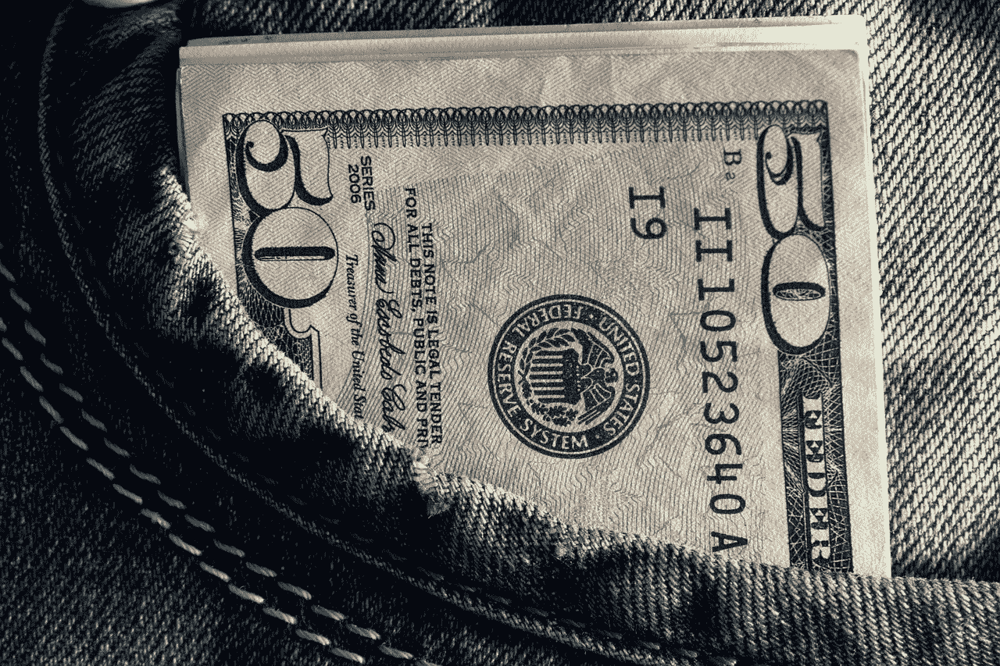

# 现金与选举:金钱如何说话。

> 原文：<https://medium.datadriveninvestor.com/cash-elections-how-money-literally-talks-f303f603f126?source=collection_archive---------26----------------------->

## 筹款是赢得选举的关键，乔·拜登刚刚在 8 月份创造了新的纪录，特朗普的竞选团队越来越紧张。

Is it all about the money? ( source: Alexsander-777 / Pixabay )

巴拉克·奥巴马是由自由派捐赠者带入白宫的，伯尼几乎是在他的草根运动的帮助下进入白宫的，而乔·拜登刚刚在为他的竞选筹款方面创下了新纪录。

特朗普已经向他的支持者发送了一封信，要求更多的财政支持，并指责好莱坞和其他大捐赠者从他那里偷走了选举。

这些关于金钱的讨论凸显了美国民主最荒谬的一面:金钱万能。

 [## 区块链投票和美国选举|数据驱动的投资者

### 在不到 70 天的时间里，这个世界上最古老的民主国家将以前所未有的方式面临最大的摊牌…

www.datadriveninvestor.com](https://www.datadriveninvestor.com/2020/08/26/blockchain-voting-and-the-american-elections/) 

募集资金最多的一方将比另一方获得更多的选民。金钱决定了一场竞选能向观众展示多少广告，决定了听到候选人陈述的人数，同时也质疑民主的理念。

如果每个候选人在全国电视上有同样多的播出时间不是很好吗？难道没有更好的方法来使用数十亿美元，而不是固执地用无数的广告漂浮在媒体上吗？

随着政党试图摆脱大公司捐款，在基层竞选中筹集更多资金，我想知道这是否是走向民主的道路。

## 为所有这些买单真的是选民的责任吗？

乔·拜登在 8 月份筹集了 3 亿多美元来推动他的竞选活动。可以预料的是，在金钱问题上，特朗普也将努力跟上拜登的竞选。

这可能是有史以来最昂贵的选举。如今，捐款似乎比投票更重要。为候选人投票是一回事，但我们真的要为他们的广告付费吗？

当数百万人害怕被驱逐和失去工作时，政客们觉得有权要钱？唯一从中获利的是竞选经理和媒体网络。民主应该是这样运作的吗？

在一个完美的世界里，政治家们会同意拥有相同数量的曝光率，让选民决定他们想要支持哪些观点和观点。相反，我们付钱给可疑的营销专家，让他们用操纵广告制造恐惧、愤怒和分裂，而这些广告并不回避对观众撒谎。

在这一点上，候选人正在互相侮辱，使这次选举看起来像摔跤狂热。这不再是有效的争论，这已经变成了情绪战。

政治家和选民不再互相交谈，他们谈论对方。同理心丧失，变成了互相仇视的双方的战斗。

## 花在这些竞选活动上的钱越多，选举后这个国家就会越分裂。

已经可以预见的是，到年底，这个国家的一半人会非常失望，我们只是不知道是哪一半人。

我们用自己的捐款为此付出了代价。

当这个噩梦结束时，我们将不得不谈论改革选举进程。如果我们继续走这条捐款和操纵广告的道路，下一次选举对选民来说将更加昂贵。

我很高兴听到乔·拜登正在加紧努力，因为我希望他获胜，但看到中产阶级工人家庭感到有责任为民主买单，我很伤心。

投资这场我们称之为选举的表演真的是选民的工作吗？

**进入专家视角—** [**订阅 DDI 英特尔**](https://datadriveninvestor.com/ddi-intel)