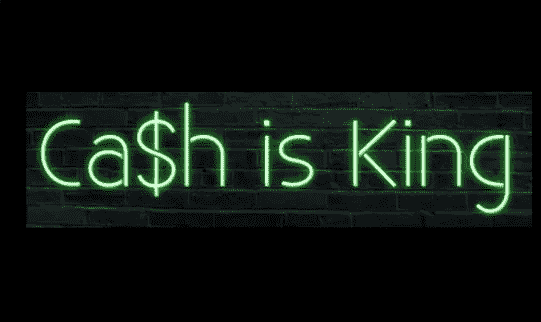

# “现金为王”和沃伦·巴菲特的其他投资经验

> 原文：<https://medium.datadriveninvestor.com/cash-is-king-and-other-investment-lessons-from-warren-buffet-45a384670b77?source=collection_archive---------6----------------------->

Photo credit: Pinterest

上次我离开时向你们强调了一些在经济衰退或危机中有利可图的投资机会。我提到了；资本和货币市场、农产品交易、运输和物流、城市蔬菜种植和自我投资。

但在过去几周，我在收件箱和 WhatsApp 上收到了一些信息，大多是关于资本市场的——投资股票或购买股票。许多人在问:我如何投资股票/股份，我可以从哪里购买，它们是否有利可图，股份多少，最赚钱的公司是什么，等等。

 [## 利用股市相关性的最佳方式|数据驱动的投资者

### 当阿尔弗雷德·温斯洛·琼斯开创了世界上第一个“对冲”基金(后来“d”被去掉了)时，他让其他投资者大吃一惊…

www.datadriveninvestor.com](https://www.datadriveninvestor.com/2020/02/02/the-best-way-to-use-stock-market-correlations/) 

这向我表明；(1)人们正在阅读我在那里发布的内容，(2)这也意味着知识差距，因为许多人都对投资股票感兴趣，这没什么，因为不是每个人都知道所有事情的一切。

在封锁后，我将组织一个信息会议或小型培训，上帝保佑我们！

事实上，投资资本市场(甚至是货币市场)需要钱，很好的钱。最低限额是 10 万乌干达先令，但事实是，你需要大笔资金，或者从小额资金开始，然后不断提高限额；让它累积起来。

“现金为王”。这句话你已经听过好几次了，我来告诉你为什么。如果你是那种喜欢做一个连续的企业家或投资者，并且喜欢股票的人，那么这是给你的。然而，寻求股权融资的被投资者和初创公司也应该注意，因为你可能会有所选择。

时局艰难，企业现金告罄——在这场看不到尽头的衰退中，企业现金流为负甚至为零。对于全球范围内的小型创业公司来说，正常业务的未来看起来很黯淡。大型“男孩”公司也未能幸免。企业正在削减成本；员工工资，因为收入低，销售额减少了。Equity Kenya 刚刚宣布裁员 60 人！

我和一些客户一起工作，他们急需融资，因为他们提供的服务或产品非常重要。我还知道一些人甚至在新冠肺炎疫情袭击之前就已经在寻找融资。他们坚持住了。自 2018 年以来，我还知道一些人想出售他们的业务。

如果你是一个风险偏好很高的投资者，并且对收购或投资现有业务感兴趣，这是最好的时机。但是一定要遵守规则——现金为王。当你有现金时，你可以做任何事，但不道德。不要贿赂酒店员工让你跳过新冠肺炎强制隔离区开车回家。

最近，中国一直在收购美国、意大利、法国甚至一些非洲公司的全部或部分股份。然而，一些收购可能是由于未履行贷款义务。这让红龙看起来像一个全球性的高利贷者或放债人。问题是，它有太多的现金和现金等价物，既不能购买也不能借出。

把它带到个人层面，你会看到我所说的可能性。

比如伯克希尔·哈撒韦公司的沃伦·巴菲特。在上一篇文章中，我离开时告诉你，我正在阅读某本书和巴菲特给股东的关于 2019 年业绩的信，因为他将它与其他标准普尔(S&P) 500 指数公司进行了比较。

巴菲特和他的公司增加了超过 1250 亿美元的现金和现金等价物，他有能力收购或拥有其他比他们大但比他们小的公司超过 50%的股份，如麦当劳、埃隆马斯克的特斯拉、星巴克、T-Mobile、通用电气、通用汽车等。

他的诀窍是，他总是认为保留一定比例的现金是不可触及的，他向股东承诺至少持有 200 亿美元的现金等价物，以防范意想不到的灾难——就像这次新冠肺炎事件；拨出部分留存收益以备不时之需。

正是这种持有现金的能力，让你可以在别人苦苦挣扎的时候购买任何你想要的东西。由于许多公司现金短缺，巴菲特借机通过购买它们的股份来充当道具。

最终，他设法购买了摩根大通的股份，摩根大通是美国最大的投资银行，被标准普尔 500 评为资产基础价值 2.7 万亿美元，美国银行是美国另一家大型商业银行，通用汽车是 GMC 汽车和零部件的制造商，也是金融服务的投资者。

另一个是克罗格——美国最大的零售和国内消费超市之一；相比之下，东非的 Uchumis 或 Shoprites。国产耗材上市公司是大事。如果你要买股票，瞄准这样的公司(银行和公用事业)——只要人们还在消费和订购产品，它们就会一直卖。

你会意识到，银行或金融服务行业是任何上市股票市场中最热门的行业之一，因为它具有很高的盈利能力。只要看看东非的几个股票市场，大多数上市公司都是银行，股东对这些股票有很高的亲和力。银行业也刺激经济增长，除非情况不同，否则他们肯定会盈利。

**巴菲特是怎么做到的，他依据的是什么？**

我要你从这里挑选一些东西。

巴菲特的投资评估技巧简单，在投资/金融领域常见；再加上他的投资头脑和创业经验，他就成了另外一个人。在他投资任何一家公司或收购它之前，他大多基于这三(3)个参数；

1.被投资者必须对其运营所需的净有形权益/资本有良好的回报——投资回报

2.被投资者必须由能干而诚实的经理管理——公司治理

3.被投资者或股权/股份必须以“合理的价格”——公司或企业价值——获得

我的简单阐述。

有形权益或资本回报率(ROTE 或 ROTC)是净利润(扣除利息和税后)占平均有形权益或股东资本的百分比。有形权益或资本是净资产或权益减去无形资产，如商誉等。它增加了有形投资(资本)的运营利润，公司管理层必须产生该利润。

它只是衡量公司在有形资产如库存、财产、厂房和设备(PPE)的每一先令投资中获得的利润。最好是公司经营机械和重型设备，如运输车辆、油罐车、拖运卡车、物流、建筑设备租赁——手杖、平地机等。

例如，在像 cab(优步)、taxi 或 matatu 这样的运输企业中，更容易确定投资的 ROTC。让我们假设一个现有的 matatu 企业需要投资 5000 万 UGX 来购买一辆额外的 14 座货车，但你没有给现金，而是投资了一辆价值相同的新货车。

然后，我们称您的货车权益(有形资本)为添加到车队中的资产。假设货车在坎帕拉行驶至 Kiira、Namugongo 等地。而回到坎帕拉中央商务区(CBD)，每天至少会赚 8 万到 12 万乌干达先令。还是拿最低的吧(ug80000)；也就是每月 200 万乌吉亚减去两天，每年 2400 万乌吉亚。

然后，ROTC 将 24，000，000 除以 50，000，000 得出 0.48 (48%)。这是衡量盈利能力的标准。所以，积极的结果越高，投资那个家伙的出租车生意就越有利可图。这就像投资回报率。这是你在将辛苦赚来的钱投入任何企业之前应该使用的标准之一，无论是作为一个实体还是个人。

公司治理是管理层级、政策和法规以及管理组织的程序。在创业投资中，是“团队”部分，或者说是推介过程中的幻灯片。上市公司必须与董事会或董事会打交道，并遵循问责制、公平性、透明度和责任感等原则。

投资者，即使是在结构和内部控制、风险政策并不重要的创业领域，也需要看看你的团队(联合创始人和员工)的构成。人们投资于人。我还将试图向你展示公司治理如何影响“合理价格”或公司或企业的价值。

就投资决策而言，公司治理发挥着巨大的作用。很好，简介经理向员工、客户，当然还有股东灌输信心。最近的一个例子是，Patrick Mweheirwe 于 3 月份被任命为 Stanbic 集团驻肯尼亚负责人，一天后，Stanbic 乌干达公司的股价从 24.35 乌干达先令上涨到 24.4 乌干达先令。

价格上涨 0.17%。对经验丰富的员工、总经理、首席执行官等更有信心。因此，在投资初创公司或上市公司时，甚至在收购其他企业之前，都要留意这些因素。

新的或改组的管理层可以估计公司未来的公司治理绩效，即公司当前价格或价值所隐含的预期，以及公司计划中要求的自己的预期，如人员重组等。

如果行业或市场预期显得沉闷和不谦虚，那么管理层就有机会传递信息或数据，使市场能够提高其预期。此类数据分析有助于显示内部绩效或管理能力与股东或投资者可能获得的回报之间的经济联系。

在《合理的价格》中，巴菲特试图用寓言说话。他只是说，该公司的价值(潜在被投资者或收购对象)应该是便宜的，而且是在计划收购的当前时间。当缺乏可以购买或投资的企业时，不要购买，而是持有现金一段时间。因为卖的不多；也没有多少人购买。

当价格低(合理)和非常糟糕的时候(像现在)，每个人都不卖，只有少数人在买；然后成为少数几个以“合理价格”买入的人之一，因为你有大量现金以备不时之需或未来投资。

拥有相当一部分留存收益是以非常低的“合理价格”收购或投资你选择的其他企业或你一直关注但无力负担的企业的先决条件。

留存收益是有力量的。向沃伦·巴菲特学习吧。它们很重要，但如何使用它们至关重要。它们通常是剩余的资金，被重新投资到企业中，或用于通过收购收购新企业。它们代表了健康的现金流状况或周期。

就个人而言，假设你的净工资为 50 万乌吉亚，扣除房租(15 万乌吉亚)、吃饭(10 万乌吉亚)、交通(15 万乌吉亚)等基本支出(运营支出)，你的留存收益只有 10 万乌吉亚(甚至更少)。越大越好。

然而，在个人理财中，这是不可取或不可接受的，“留存收益”或储蓄在任何其他基本支出之前首先被扣除。因此，这是你的储蓄，你将在雨天被覆盖，并作为你的业务启动资金的来源。

让我希望这个类比有一定的道理。

你应该怎么做？

无论是作为个人还是企业，拥有现金或接近现金/流动形式的资产会让你在市场或行业中比同行更有优势。在经济低迷时期，你可以买到曾经很贵的东西。所以，一定要保留现金和其他东西，比如银行里的现金、手机钱包、借记卡等等。

注:这篇文章也由同一作者发表在 WordPress 上。点击[这里](https://consultmasaba.com/cash-is-king-and-other-investment-lessons-from-warren-buffet/)

***关于作家***

Julius Masaba 是一名私人投资研究员和商业顾问。他还是 Ablestate、[*https://www.ablestate.org/*](https://www.ablestate.org/)*的业务开发主管，也是一名关于创业、创业、商业和金融的 WordPress 作家/博客作者。他热爱科技。访问:*[*https://consultmasaba.com/*](https://consultmasaba.com/)