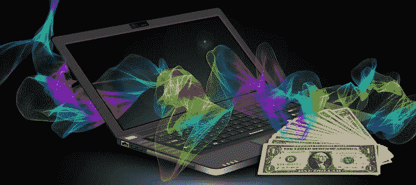
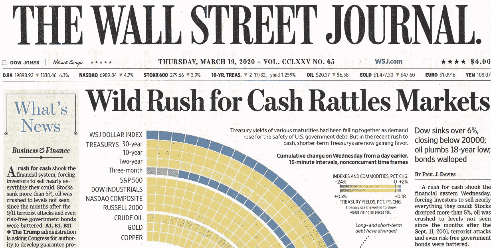
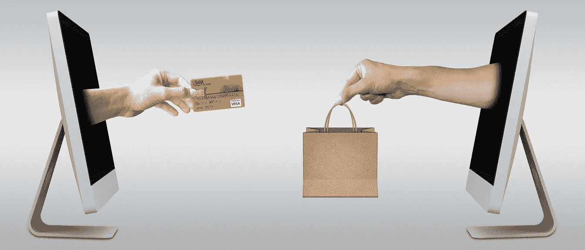
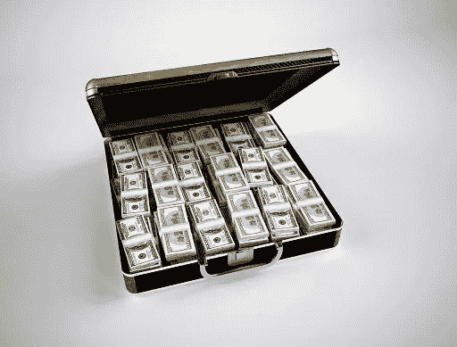
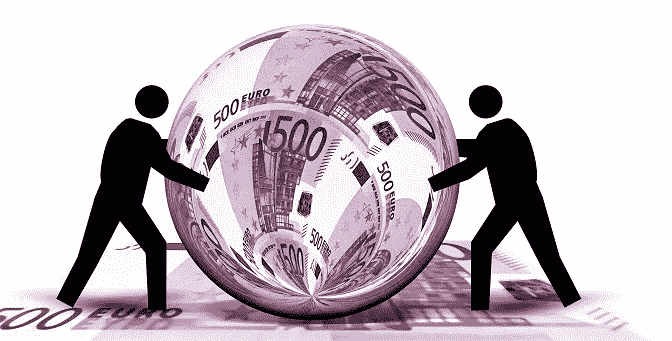
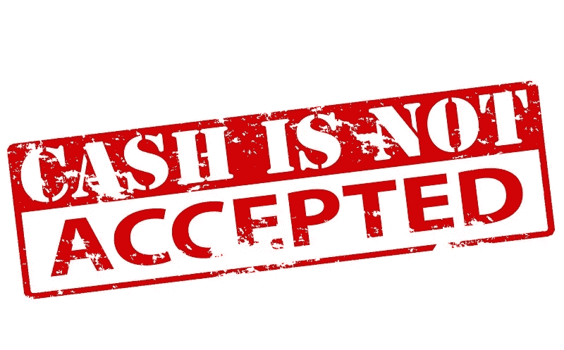
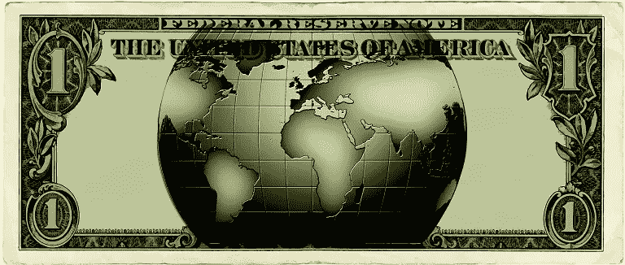

# 现金为王，比我们想象的更有效

> 原文：<https://medium.datadriveninvestor.com/cash-is-king-more-potent-than-we-think-98f422843a7a?source=collection_archive---------10----------------------->

2020 年 3 月 12 日，在川普总统宣布新冠肺炎进入全国紧急状态的前夕，纽约时报[报道](https://www.nytimes.com/2020/03/12/upshot/markets-weird-coronavirus.html)华尔街发生了一些奇怪的事情，交易员们纷纷抢购现金。他们抛售一切可能的东西，包括黄金，在动荡时期，黄金通常被认为是一种安全的投资。在此前的三天内，黄金价格从每盎司 1675 美元跌至每盎司 1610 美元。一周后，华尔街日报[在其标题中宣称](https://www.wsj.com/articles/markets-enter-new-phasewhere-cash-is-all-that-matters-11584546863)“对现金的疯狂追逐扰乱了市场。”黄金价格跌至每盎司 1500 美元以下。

# 为什么现金更好

我们都享受无现金经济的便利。当一切运行良好时，那是美妙的。在动荡时期，手头的现金是我们所需要的。当我在当地超市时，人们争着买卫生纸，警察被叫来让他们冷静下来，我去了街尾银行的自动取款机。没有人在那里。我提取了一点额外的现金。很难想象新冠肺炎会给我们带来什么障碍。但我知道，我手中钞票的沙沙声会让我得到我可能需要的东西。

由我们支配的钱，就像在支票账户中一样，其价值仅次于现金。交易者卖出黄金，因为他们知道股票会因为新冠肺炎的动荡而贬值，但是一旦病毒被抑制，他们就会反弹。他们希望手头有钱，以便在市场好转前低价买入。专业交易者并不是唯一看到这个获利机会的人。在危机时刻，我通过电话与更多的朋友和家人交谈，这是很自然的。他们中的一些人提到，他们利用市场崩溃的机会将资金存入他们的个人退休帐户或购买一些股票。这意味着他们手头有钱。通常情况下，那些手头有一点额外现金的人最终会有更多的钱。

 [## 另一场精心策划的全球经济危机正在逼近？如果我们的数据经济可以帮助它|数据…

### 我们的 DApp 的开发，称为 DECENTR，目前正与我们的 R&D 同步进行，作为我们即将到来的…

www.datadriveninvestor.com](https://www.datadriveninvestor.com/2019/03/06/another-engineered-global-economic-crisis-looming-not-if-our-data-economy-can-help-it/) 

# 我们囤积现金

有人可能会认为，有了电子支付，流通中的现金应该会减少。最近，华尔街日报[报道](https://www.wsj.com/articles/the-worlds-cash-is-disappearing-bankers-arent-sure-where-it-went-11576184491)说事实恰恰相反。更多的实物货币被释放出来，然后消失在某个地方。这意味着

人们比以前更多地囤积现金。深入探究这种对现金的意想不到的吸引力，我们可以了解关于全球经济、政治和我们的金融的有趣的事情。

美联储银行的报告让我们对正在发生的事情有了一些了解。预计流通中的现金量会随着经济的增长而增加。在美国，这反映在低面额纸币数量的增加上。例如，与 2014 年底相比，到 2018 年底，流通中的 20 美元钞票增加了约 16%，这是美国最受欢迎的钞票面额。除了 100 美元纸币之外，其他纸币的发行量飙升了 32%，是其他纸币的两倍，其他纸币的增幅类似或更小。据《华尔街日报》报道，专家估计，约 75%的 100 美元钞票离开了美国。

# 每个人都藏钱

《华尔街日报》的同一篇文章称，这个问题是全球性的。去年秋天，一名德国男子起诉他的朋友，要求赔偿塞在一个有故障的锅炉里的大约 50 万€，但没有成功。当他在度假时，他的朋友点燃了锅炉来取暖，烧掉了现金。德国央行估计，德国人有 1500 亿€装在阁楼或地下室，埋在花园里或塞在信封里。银行家们知道这一点，因为人们会带来被老鼠啃过的、掩埋时腐烂的或装在不小心撕碎的信封里的替换货币。但是当银行家问公众，“每个人都说他们没有囤积现金，但钱显然在某个地方，”欧洲央行的一位高管抱怨道。

# 外面有多少现金？

没人知道。据估计，德国人囤积的 1500 亿€相当于每人 1800€(接近 2000 美元)。经历了同样现象的澳大利亚人统计，他们每人有多达 2000 美元(约 1200 美元)藏在某个地方。在报告这一点时，澳大利亚储备银行行长补充说，他手头没有这笔钱。《华尔街日报》提到的一篇文章报道称，新西兰的银行家只能持有该国约 25%的现金。

根据[美联储银行](https://www.federalreserve.gov/faqs/how-long-is-the-life-span-of-us-paper-money.htm)的说法，5 美元纸币的寿命最短，略低于 5 年，而最少使用的 100 美元纸币的寿命接近 23 年。但是保险箱或鞋盒里的现金可以保存更长时间。它经常会丢失，因为主人可能会在没有让任何人知道秘密藏身之处的情况下死去。可毁于火而不报。老鼠可以吃它，或者它可以腐烂。澳大利亚银行家估计，大约 8%的现金以这种方式流失。

# 现金去了哪里？

没人告诉你。个人现金储蓄是最大的谜团，因为很难估计他们有多少钱。不多

更容易发现企业保留了多少现金作为储备。例如，[新闻报道](https://www.cnbc.com/2020/01/28/apple-q1-2019-cash-hoard-heres-how-much-cash-apple-has-on-hand.html)称苹果拥有大约 2000 亿美元现金。其中一部分是短期证券，很容易兑换成现金，但更大一部分投资于长期有价证券。看看苹果的[财务](https://www.apple.com/newsroom/pdfs/Q1%20FY20%20Consolidated%20Financial%20Statements.pdf)报表，人们可以发现，到 2019 年底，现金和现金等价物只有大约 400 亿美元。此外，本报表中的“现金”可以指企业经营账户中的资金，而不是实物现金。简而言之，除了首席执行官蒂姆·库克，可能很少有人知道苹果在遍布世界各地的银行和办公室的金库里有多少现金。银行家很可能只能猜测。

适用于苹果的东西适用于所有企业。上市公司需要披露他们的财务状况。私有公司不需要这么做。每个企业主都需要准备好应对意想不到的障碍。它可能是一个错误的决定，一场诉讼，或一个优越的力量，如新冠肺炎，可以威胁到企业的生存。在这种情况下，银行往往不愿意发放信贷，更不用说有时银行里的可用资金可能会被冻结，以确保潜在的债务。在这样的时刻，没有什么比无人知晓的实物现金更有用了。

# 千禧一代也藏钱

正如欧洲银行家指出的，人们对抽屉、鞋盒或银行保险箱里的现金保持沉默。我们可以偶然得知，他们用现金支付了第一笔抵押贷款的首付款。这种情况比人们想象的更常见，尤其是在第一代移民中。

千禧一代被认为不成熟、不墨守成规、不负责任；因此，人们可能会认为他们在处理金钱方面是鲁莽的。恰恰相反；与老一代人相比，千禧一代手头持有更多现金。他们可能仍然和父母住在一起，还有未偿还的大学债务，但是他们已经明白了现金是王道。这可能是千禧一代的一个方面，我们仍然需要了解更多。

# 可疑的生意

庞大的现金储备是所有可疑商业运作的必备条件。塔利班或伊斯兰国等组织需要用现金购买武器。试图规避俄罗斯、伊朗或委内瑞拉贸易限制的公司如果不想被抓住，就需要处理实物现金。前面提到的美联储银行的报告显示，许多丢失的 100 美元钞票最终在俄国。金融市场评论员声称是 661，500 磅，相当于 315 亿美元。正如他们所说，*“如果你是伊朗，如果你是委内瑞拉，如果你是俄国，你要么已经被切断，要么可以被切断*”与国际银行体系的联系。在这种情况下，实物现金是开展业务的唯一途径。

# 逃离绝望

当阅读有关来自叙利亚或其他苦难地区的难民的报道时，我们往往没有足够重视这些人需要现金来行贿、走私和资助旅行。据估计，从墨西哥非法偷渡到美国每人要花费【4,000 到 10000 美元。不接受信用卡，只接受现金。数百亿美元，如果不是数千亿美元，被藏在世界各地，仅仅是为了满足数百万人逃离绝望的愿望。

# 罪犯也喜欢现金

不言而喻但需要提出来。100 美元钞票最受欢迎。欧洲银行家注意到，那里的罪犯也喜欢€500 的钞票。因此，他们[在 2019 年停止发行](https://www.investopedia.com/articles/investing/021816/why-governments-want-eliminate-cash.asp)这些纸币，但它们仍然是法定货币。瑞士政府一直在流通 1000 瑞士法郎的钞票，现在价值略高于 1000 美元。

# 现金战争

取消€500 纸币是银行和政府对货币流动实施严格控制的协调努力的一部分。政府希望让影子经济和犯罪分子更加艰难。带电子

付款，更容易跟踪资金流动和执行应纳税款。随着现金在大多数商业活动中的消失，人们可以认为很大一部分现金交易可能是非法的。对银行来说，无现金服务更简单、更便宜。对于营销人员来说，电子交易是有用信息的金矿。对于服务行业，无现金操作简化了防止员工盗窃现金的保护。因此，无现金操作被视为进步的标志。对顾客来说不太好。

# 现金是自由和隐私

[Pedro Escudero](https://medium.com/@Pedro_Escudero) 在他关于媒介的[短文](https://medium.com/predict/why-we-should-defend-the-physical-money-f32a81742242)中解释了这一点。我们的现金购买是匿名的。像亚马逊这样的公司开发了算法，允许他们在我们意识到我们需要它之前预测我们可能会买什么。有时候，这可能是一个有用的推动，但会导致我们购买他们想卖的东西，而不是我们需要或想要的东西。我们用现金购买的越多，营销就越不准确，也越容易被我们拒绝。

公司可以利用我们的电子采购数据来对付我们。最近，国家公共电台[报道了](https://www.wbez.org/shows/wbez-news/how-your-private-illinois-tollway-data-is-shared-with-cops-and-divorce-lawyers/cea68ea0-4b13-481a-80a1-50bf0e9db738)关于伊利诺斯州自动收费的记录被发布给了一个与收费者无关的团体。例如，一个跟踪狂得到了他前女友的信息。

一个错误，技术上的困难，琐碎的诉讼，或者任何其他不幸的事情都可能会限制我们获得资金

银行存款或信用卡存款。坏运气的规则是，通常当另一个不幸袭击我们时，我们就会陷入这样的困境。偷钞票是最直接的补救措施。

最后，无现金经济让我们任由运营商摆布。即使是最先进的技术系统也会失灵，让我们无法获得自己的钱。此外，中央控制系统可能被滥用来限制我们的自由。我们中的一些人可能会被限制购买特定的商品，在特定的商店或特定的区域购买。有些人可能会说，这种滥用权力的情况可能发生在极权国家，而不是在美国。在我看来，如果存在技术可行性，我们的政治家就会找到使用它的正当理由。

# 美元的独特作用

由于美国经济的规模和相对稳定性，美元成为全球贸易的货币。如上所述，它也受到参与可疑和纯粹犯罪活动的人的青睐。人们认为这是一种可靠的财富储蓄，他们可能会在信封里放几百美元，以防万一，还有一些人和组织在只有他们知道的地方藏了大量的 100 美元钞票。

20 年前推出的欧元渴望成为类似的国际货币。它已经夺走了美元作为全球货币的部分角色。随着中国经济的增长，人民币的作用将会

增加。《华尔街日报》前面提到的文章指出，澳大利亚和新西兰的货币也用于国际贸易，很可能是在该地区。

这意味着美元作为全球货币的主导地位将会减弱。然而，只要美元被视为财富的安全避风港，它将在未来几十年保持这种状态。但如果世界各地的人们对美国政治体系的稳定性失去信心，他们就会远离美元。这可能引发灾难性的通货膨胀，意味着我们所知道的美国的末日。

# 口袋里 100 美元的魔力

我曾经被指派给一个青春期的男人做助手。他最近高中辍学，来自一个贫困的家庭，住在一个糟糕的社区。他身上没有 5 美元买午餐。带着失败者的心态，他已经相信美国的机会远远超出了他的能力。看到他有些街头小聪明，我问他能否设法弄到 100 美元现金。他说他可以。我让他把这 100 美元放在口袋里，这样他就能感到富有，知道他能买多少东西。但是，我让他不要花这 100 美元，除非他能把钱包装满，除非是紧急情况。我向他解释说，感觉和变得富有的秘密在于手头总是有一点额外的现金。

事情发生在很多年前，我们在一起工作才一天；因此，我不知道这个人的结局如何。但我们初次相遇几个月后，在办公室短暂见过一面。他很乐观。他把我拉到一边，打开他的钱包，给我看了里面的五张 20 美元的钞票。“这很有效，”他说。

*原载于 2020 年 3 月 26 日*[*【https://www.datadriveninvestor.com】*](https://www.datadriveninvestor.com/2020/03/26/cash-is-king-more-potent-than-we-think/)*。*