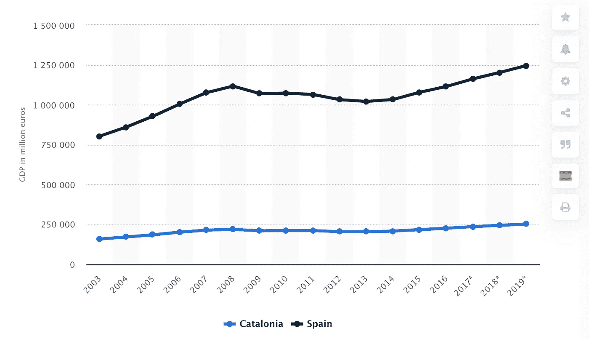
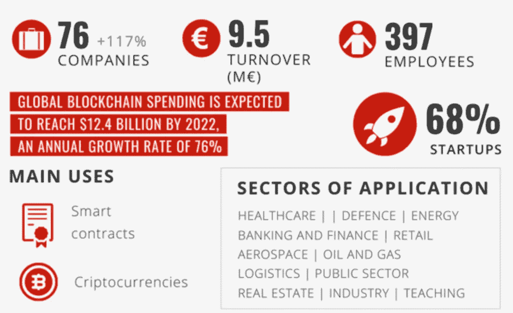

# 加泰罗尼亚采用区块链技术

> 原文：<https://medium.datadriveninvestor.com/catalonias-adoption-of-blockchain-technology-81085e31d3ed?source=collection_archive---------29----------------------->

[2 分钟视频，了解加泰罗尼亚成为欧洲区块链目的地的雄心](https://youtu.be/CHgHQTI5VoY)

多年来，加泰罗尼亚一直希望脱离西班牙。2019 年，加泰罗尼亚的国内生产总值为[€2423 亿](https://www.statista.com/statistics/327063/gross-domestic-product-in-catalonia-and-spain/)，而整个西班牙的国内生产总值为€1.2 万亿欧元。加泰罗尼亚也热衷于拥抱区块链技术。

加泰罗尼亚的 GDP 对西班牙的 GDP

Source: [Statista](https://www.statista.com/statistics/327063/gross-domestic-product-in-catalonia-and-spain/)

在谈到区块链技术[时，加泰罗尼亚数字保险政策和公共管理部长 Jordi Puignero](https://smartassets.one/catalonia-state-leverages-blockchain-for-digital-independence/) 表示，*“仅仅因为网络给我们带来了共同的连接，区块链将为我们带来新的共同治理。这将对政府的管理产生影响，将对金融系统产生影响，并将对我们社会中一个至关重要的因素产生影响:信仰。信仰是影响金融交易的因素，也是影响居民和当局之间联系的因素”。*加泰罗尼亚使用区块链技术已经有一段时间了。2018 年 7 月，[加泰罗尼亚政府批准了 GOV/65/2018](https://politiquesdigitals.gencat.cat/web/.content/Telecomunicacions/Blockchain/destacats-informes-descarregues/Estrategia-Blockchain-a-Catalunya-VF_1_EN.pdf) 号协议，以在其公共管理中推广区块链技术，并设立了一系列目标:

将加泰罗尼亚定位于区块链技术使用和发展的前沿；

促进公共行政部门使用区块链技术，以提供更好、更透明的服务；

促进区块链技术领域的知识、培训和人才培养；

通过关注公共行政部门、公司、大学和民间社会，促进区块链技术的研发；

支持区块链技术作为新兴产业的发展；

鼓励公民参与并采用区块链技术。

在此基础上，加泰罗尼亚政府在 2019 年 6 月[宣布，它将开始以各种方式使用区块链技术，相信该技术能够增加透明度，从而获得公民的更多信任。政府的声明包括，“*这些技术因此特别适合管理公共服务和实施公民参与进程*”。它还建立了](https://catalangovernment.eu/catalangovernment/news/364964/catalan-government-approves-first-blockchain-strategy-and-prepares-to-start-deployment-in-public-administration)[Centre block chain de Catalunya](https://translate.google.com/translate?hl=en&sl=ca&u=https://blockchaincatalunya.org/&prev=search&pto=aue)，该中心定期举办一系列活动，以帮助会员以及越来越多参与区块链技术的企业和个人。

 [## 面向开发者的区块链；API 提供商的重要性|数据驱动的投资者

### 在过去的几年里，区块链突然成为这个领域最热门的新技术。每一个…

www.datadriveninvestor.com](https://www.datadriveninvestor.com/2020/11/25/blockchain-for-developers-the-importance-of-api-providers/) 

最近，在 2019 年 9 月，加泰罗尼亚政府推出了区块链驱动的 [IdentiCAT，](https://politiquesdigitals.gencat.cat/en/detalls/Noticia/El-Govern-presenta-el-projecte-IdentiCAT-un-nou-model-didentitat-digital-autosobirana-que-converteix-el-ciutada-en-propietari-gestor-i-custodi-exclusiu-de-la-seva-identitat-i-dades)，旨在成为欧洲第一个公共数字身份，并由其公民自我管理。那些使用 IdentiCAT 的公民将能够证明他们身份的不同属性，但仍然保持个人数据的保密性和安全性。因此，不需要给出出生日期或地点就可以证明法定年龄。此外，IdentiCAT 符合 IDAS 和欧洲的法律，因此可以用来证明加泰罗尼亚人在其他欧盟成员国的身份。此外，还有各种其他项目已经确定了区块链技术的实施。其中包括:

在废物管理方面，确保透明度和可追溯性

器官接受者的选择更快更精确

使患者能够授权第三方出于研究目的查阅其病历

点对点分享太阳能电池板产生的电力

一种内部 web 服务，用于在议会和加泰罗尼亚政府之间安全地发送和存储消息以及跟踪数据。

加泰罗尼亚的区块链

Source: [Blockchain in Catalonia report](http://catalonia.com/.content/documents/2020/blockchain-in-catalonia.pdf)

毫无疑问，其他政府将密切关注加泰罗尼亚如何实施区块链技术。该地区的大都会首府巴塞罗那拥有大量精通技术的学生，这一事实应该有助于加泰罗尼亚的发展

立志成为欧洲的领导者，吸引最好的人才和公司到这个西班牙东北部的自治社区。

**进入专家视角—** [**订阅 DDI 英特尔**](https://datadriveninvestor.com/ddi-intel)