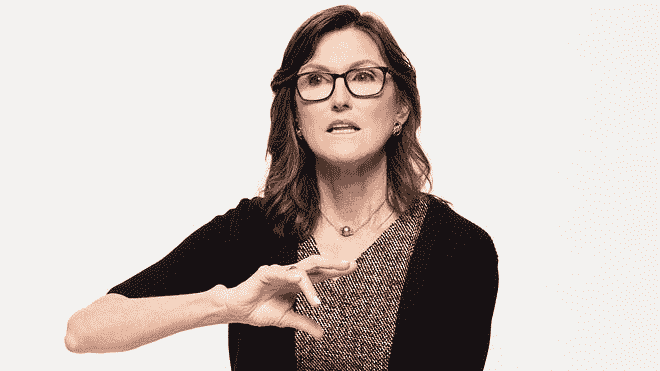
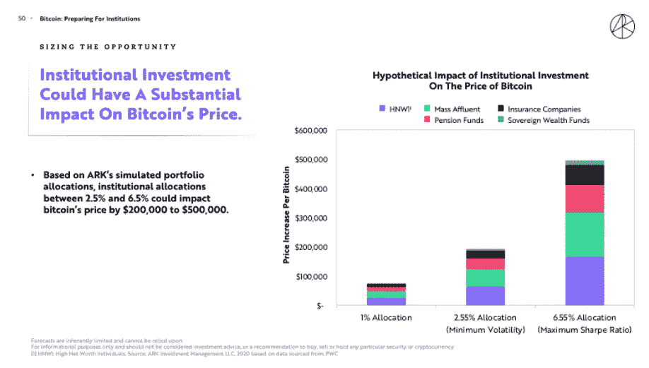
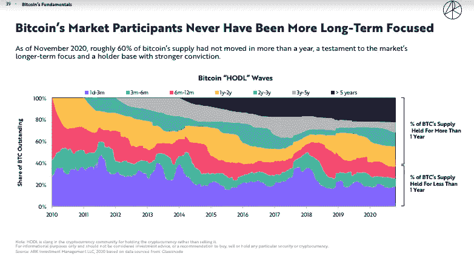

# 凯西·伍德非常看好比特币

> 原文：<https://medium.datadriveninvestor.com/cathie-wood-is-extremely-bullish-on-bitcoin-850f1d4f44fa?source=collection_archive---------5----------------------->

## 她有数据支持的理由会说服你投资这种加密货币

Source: [ARK invest](https://ark-invest.com/the-ark-difference/)

凯茜·伍德(Cathie Wood)是最近投资界的超级明星，她对比特币颇有好感。这不是没有原因的。

在 2020 年之前，凯西在华尔街人士中被认为是一个足够疯狂的人，他给特斯拉设定了 4000 美元的目标价格。2021 年 1 月，她的[预言提前两年](https://markets.businessinsider.com/news/stocks/tesla-stock-analysis-cathie-wood-ark-prediction-just-came-true-2021-1-1029944356)实现。凯西在 2014 年创立了 ARK Invest，其 ETF 产品专注于颠覆性和创新性公司。她的 ETF 在 2020 年的表现令人印象深刻，自 2019 年以来取得了超过 100%的回报，并使方舟管理的资产(AUM) [从 50 亿美元增长到 400 亿美元](https://www.thestreet.com/etffocus/trade-ideas/7-ark-etfs-100-2020)。

特斯拉不仅巩固了她作为一名有能力、有远见的基金经理的声誉。她也让许多人意识到破坏性投资的潜力。凯西认为比特币和区块链在未来具有惊人的潜力。

# 企业已经开始接受比特币

最近涌入比特币的不仅仅是机构投资者。

凯西发现了另一个有趣的现象。

在最近与 Bitcoin.org 在 T4 的一次视频通话中，凯西评论道。

> “我们看到了企业——我们没有预料到这一点——我们期待机构的兴趣。但我们没想到企业会用比特币代替现金。”

Cathie 进一步提到了她的基金投资组合中的一家公司 Square 如何将 5%的资产投入比特币(后来我查了一下，[截至 Q2 2020 年，这一比例为 1%或 5000 万](https://squareup.com/us/en/press/2020-bitcoin-investment))。)她还提到，像 Paypal 这样更大、更成熟的公司已经开始在其平台上实现比特币交易。

根据 Cathie 的说法，当 S&P500 公司将 1%的现金投入比特币时，它的价格可以增加到 4 万美元。它基于 2021 年 1 月 8 日达到价格里程碑[之前开发的模型。](https://finance.yahoo.com/news/bitcoin-hits-40-000-first-205409917.html)

> “价格将达到 4 万美元。如果公司投入 10%来代替，比特币可以达到 40 万美元。”

如果公司、银行和机构投资者接受比特币，其对比特币价格的影响将是指数级的。

在《2021 年大创意报告》中，ARK 展示了一个蒙特卡洛模拟，模拟了当机构大量涌入比特币时会发生什么。正如你在下图中看到的。

Source: [Big Ideas Report 2021](https://ark-invest.com/big-ideas-2021/).

# 比特币作为其他加密货币的储备

2018 年初，当比特币从 19000 美元的旧历史高点暴跌至 4000 美元时，凯西·伍德(Cathie Wood)认为这是另一回事。

> 2017 年以来，我们对它(比特币)的信心上升了。因为当它从 20，000 下降到 4，000 以下时，我们看到的是比特币在加密资产生态系统中的份额从网络价值的 30%下降到 70%。这告诉了我们什么？
> 
> 这在我们心中证实了比特币是加密生态系统的储备货币。

意思是比特币就像整个股市的防御型股票。当基金经理感觉到市场即将崩溃时，他们会蜂拥而至。

与其他区块链相比，比特币拥有最安全的机制，这一事实也支持了比特币作为储备货币的地位。而且在市值和知名度上也是第一。

# 比特币正在走向成熟

方舟的《2021 年大创意》报告展示了比特币投资者在过去几年中似乎变得更加成熟。波动性减少了，更注重长期，围绕它的炒作似乎也受到了遏制。

Source: [Big Ideas Report 2021](https://ark-invest.com/big-ideas-2021/).

# 她对现政府抱有希望

监管一直是拥有比特币的障碍之一。Cathie 提到她不得不出售投资组合中的比特币，因为美国国税局的法律规定比特币属于不合格收入，回报率不能超过 10%。

然而，这一次凯西相当乐观。

她提到[新任命的 SEC 主席加里·甘斯勒](https://www.forbes.com/sites/sarahhansen/2021/01/18/who-is-gary-gensler-bidens-pick-to-run-the-sec/?sh=219fa1bf315b)，他非常熟悉加密货币的工作原理。

> “有趣的是，在政府任职期间，他在麻省理工学院待过一段时间，非常支持比特币。所以他更懂。”

这有望让比特币在监管机构眼中获得更多认可、关注和可信度。

在她看来，比特币要想得到政府的关注——用她的话说:SEC 会对它更友好——就必须提高其市值或网络价值(目前为 6000 亿英镑。Cathie 估计需要 1 万亿美元的市值，这样基金经理才有可能创建比特币交易所交易基金。

除了上面提到的，Cathie 还简要提到了比特币在新兴国家的应用。EM 的适应也可以起到催化剂的作用。像美国这样的发达国家迟早需要效仿。

比特币和加密货币前景光明。将一部分投资配置在加密货币上是明智之举。正如凯西经常说的那样，站在变革和创新的正确一边很重要。

*免责声明:本文仅用于教育和信息目的，并非专业投资建议。*

*每周，我都会尝试在我的 newslette* *r 上分享科技+投资的文章* [*，但语气更轻松，还带有一些个人色彩，同时仍然很有见地，发人深省。请考虑订阅，谢谢。*](https://anninw.substack.com/subscribe)