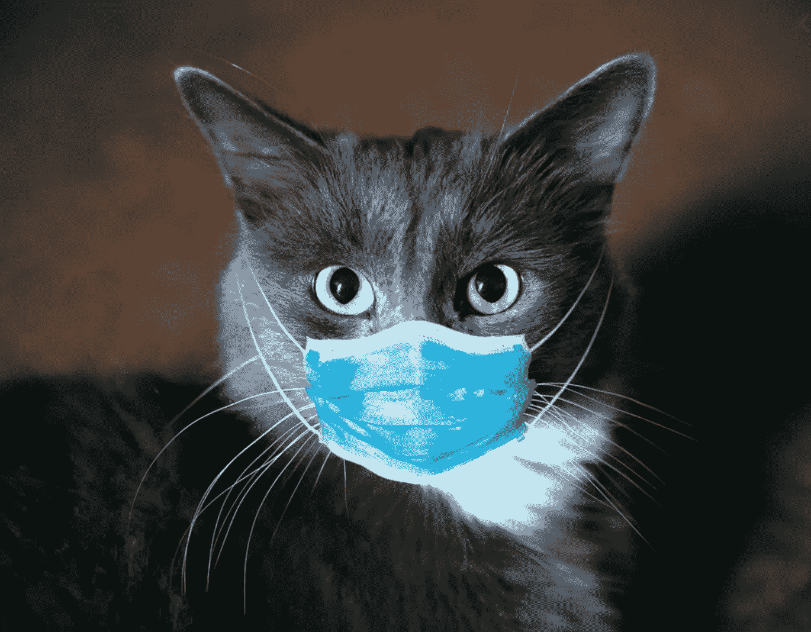

# 社交距离:是时候把你的小猫赶出家门了吗？

> 原文：<https://medium.datadriveninvestor.com/cats-and-covid19-time-to-kick-your-kitties-out-of-the-house-2d3b4e2b291a?source=collection_archive---------18----------------------->

四只猫被检测出 COVID19 阳性，它们相互传染。

(Image credit-Deccan Herald)

***千万不要给你的猫戴上面具！***

威斯康星大学 Yoshihiro Kawaoka 教授最近完成的一项研究报告称，猫可以感染冠状病毒(COVID19)，也可能会将其传播给其他猫。

作为研究的一部分，将来自人的 SARS-COV2 引入 3 只猫，3 天后所有的猫都被感染。

接下来，将未感染的猫与每只感染的猫一起关在单独的笼子中，6 天后所有的猫都检测出 COVID19 阳性。

这并不是第一例针对猫科动物的 COVID19 研究，此前在纽约布朗克斯动物园就有老虎被检测出 COVID19 阳性。

 [## 冠状病毒；惊慌失措；字里行间的 z |数据驱动的投资者

### 围绕冠状病毒的话题；更准确地说，新冠肺炎几乎占据了整个新闻预报的头条…

www.datadriveninvestor.com](https://www.datadriveninvestor.com/2020/03/23/coronavirus-a-to-panic-z-between-the-lines/) 

《科学》杂志上也有一项研究强调，猫和雪貂可能因空气中的病毒颗粒而被感染。

这种研究以前在狗、黑猩猩和猪身上做过，但是没有一只感染了这种病毒。

Image credit- Economic Times

## 猫传染人类的可能性有多大？

好消息是。

威斯康辛大学的研究表明，被感染的猫只通过唾液传播病毒颗粒，并且大多没有症状。所有 6 只被感染的猫几乎没有表现出任何症状，并且恢复得很快。

最重要的是，猫不太可能传染给人类。

这样你就可以把你的猫养在家里了！

酪这里有一个条款。

> 人感染猫的可能性比猫感染人的可能性更大。

## 保护你的猫的安全。

威斯康星的研究对所有的猫爱好者/主人/邻居提出了一些明确的要求，不管你和猫的关系如何。如果你遵循这些，你和你的猫就是快乐安全的一家人。

1.  如果您的 COVID19 检测呈阳性，请与您的猫保持一定距离。
2.  这些毛茸茸的猫科动物往往会趾高气扬地从一家走到另一家。在目前的情况下，猫的自由也必须受到限制。我们不知道猫要去哪里，也不知道它是否接触过被感染的人，甚至不知道被感染的人打喷嚏的街道，你的猫可能会把病毒带回家。

归根结底，这个疫情是我们最需要保护动物的时候，不管是猫、狗、雪貂还是鸡。请保护您和您的动物/宠物的安全。

> 正如 PETA India 所说,“在冠状病毒引起的危机期间，我们作为一个社会尽一切努力保护我们的伴侣和社区动物免受神话传播造成的潜在虐待，这一点很重要”