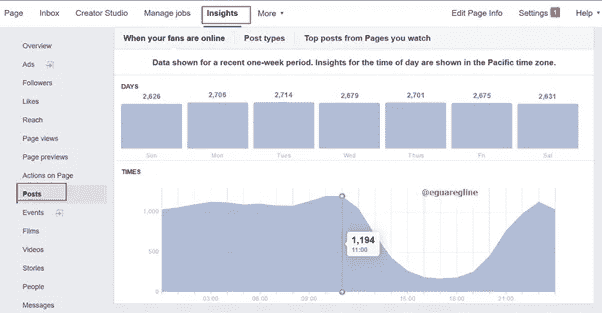
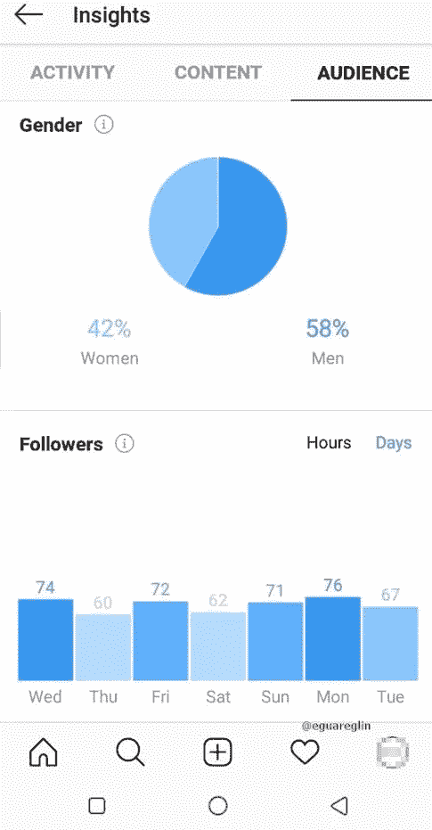

# 在暴风雨中，保持冷静，倾听

> 原文：<https://medium.datadriveninvestor.com/caught-in-a-storm-stay-calm-and-listen-2e088e6998aa?source=collection_archive---------10----------------------->

## 最佳媒体实践拯救混乱中的企业

Photo by Torsten Dederichs on Unsplash

尤其是当企业不得不从店面经营转向在线经营时，企业家会寻求社交媒体的专业知识。

[Egline Samoei](https://twitter.com/EguarEglin) 享受帮助公司保持乐观的机会。这位数字营销策略师兼顾问是[萨摩数字代理](https://samodigitalagency.com/)的创始人和[品牌莫兰](https://www.brandmoran.com/)的联合创始人，他为这一场合整理了一份技能清单:

*   网站内容管理
*   [搜索引擎优化](https://www.datadriveninvestor.com/2018/12/29/for-seo-the-words-are-key/)与管理
*   展示广告
*   谷歌分析
*   Google Adwords
*   社交媒体账户管理
*   [文案](https://medium.com/datadriveninvestor/nail-messages-with-the-write-stuff-163f5df3124f?source=friends_link&sk=560f2b0f9a10ad78af06703444b1c7b9)
*   数字品牌

在一次[非洲推特聊天](https://twitter.com/AfricaTweetChat)中，萨莫伊讨论了混乱中企业的社交媒体最佳实践，包括为什么上网首先是重要的。

 [## 提高你的眼界，让你的顾客兴奋

### 利用社交媒体提升客户体验

blog.markgrowth.com](https://blog.markgrowth.com/raise-your-sights-excite-your-customers-5869f0d3b9f6) 

“社交媒体对企业至关重要，”她说。“它使他们能够与世界各地的客户接触，了解客户的旅程，建立品牌知名度，提供客户支持，并促进销售线索和销售。"

其中最重要的一个考虑因素就是先注册哪个社交网络。

萨莫伊说:“这因企业和目标受众而异。”。“做初步研究，找出您的客户和更大的行业在哪里有相关的对话。然后你就可以发现在哪里建立自己的形象最有意义，比如脸书、Instagram 或其他地方。”

# 服务社区

在线策略应该包括企业应该发布和分享什么样的内容。

萨莫伊说:“通过发布有价值的信息内容来帮助你的在线社区。”“很好的例子是公司更新、提示、照片更新、引人入胜的视频、引人入胜的内容(如测验和投票)、激发情感的内容以及与您所在行业相关的文章链接。”

她列举了有助于充分利用社交媒体活动的具体做法:

*   有策略和计划
*   了解目标受众的人口统计数据
*   为每个平台定制消息
*   为目标受众量身定制广告
*   分析和优化活动
*   对评论和答复的回应
*   监控活动

 [## 快乐的顾客让你的生意成功

### 卓越的服务超越期望

medium.com](https://medium.com/datadriveninvestor/happy-customers-make-your-business-a-success-3d58e34e9827) 

负面情绪在社交媒体上很常见，企业应该做好应对的准备。

萨莫埃说:“要冷静，倾听，理解，高效回复。”“承认问题，并提供解决方案。

“在你的回答中表现出同理心，让那些有问题的人感觉到你的关心，”她说。“个性化信息。使用直接信息。如果谈话非常私人或复杂，就把它下线。”

Facebook Insights

内容发布有最佳时间和频率，而不是一天 24 小时。

萨莫伊说:“每个社交媒体平台的时机因行业和受众而异。”“利用你的页面洞察力来了解你的追随者何时在线最多。至于频率，积极主动，始终如一就好。”

Instagram Insights

她建议“根据你发布的内容量，每小时、每天、每周”监控社交媒体账户。通过 [Hootsuite](https://twitter.com/hootsuite) 、[萌芽社交](https://twitter.com/SproutSocial)等网站使用内置工具和第三方监控。”

萨莫伊说，在危机中，企业应该确保走正道。

“张贴积极、有益的信息，”她说。“牢记目标受众的观点。与消费者建立人际关系。随时了解社交媒体的变化，比如脸书提醒广告审批延迟。”

**关于作者**

吉姆·卡扎曼是拉戈金融服务公司的经理，曾在空军和联邦政府的公共事务部门工作。你可以在[推特](https://twitter.com/JKatzaman)、[脸书](https://www.facebook.com/jim.katzaman)和 [LinkedIn](https://www.linkedin.com/in/jim-katzaman-33641b21/) 上和他联系。