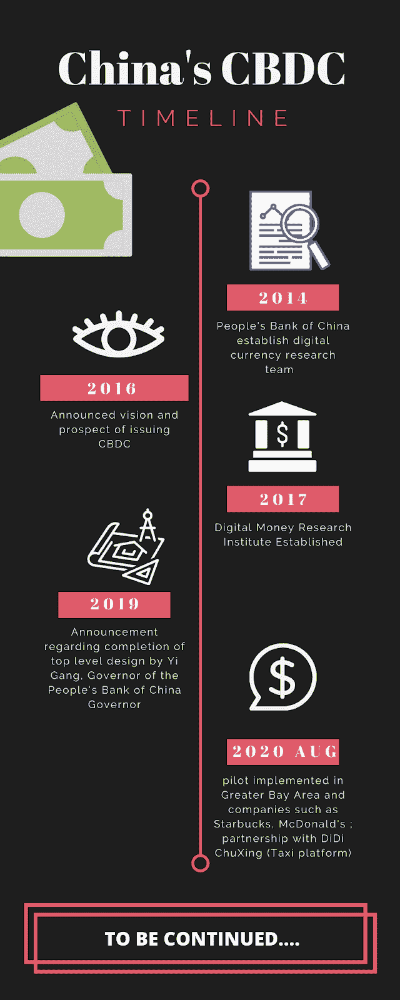
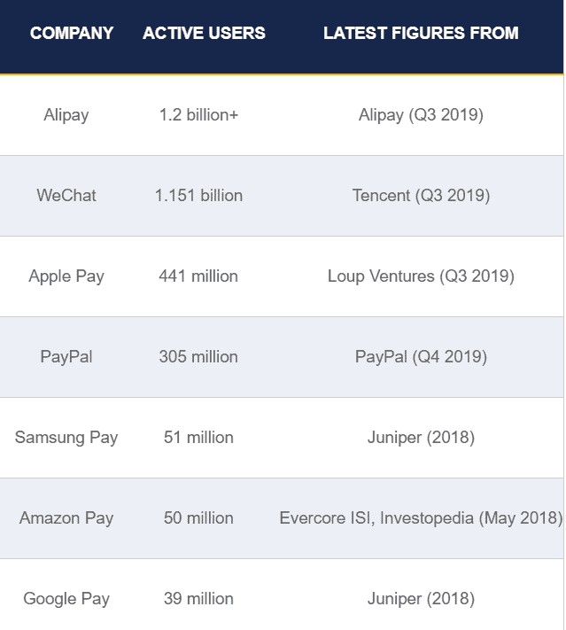
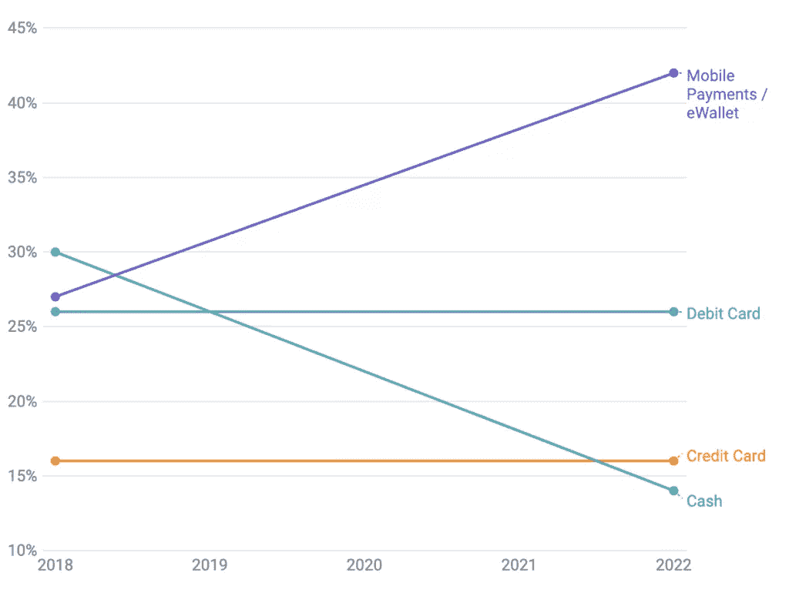
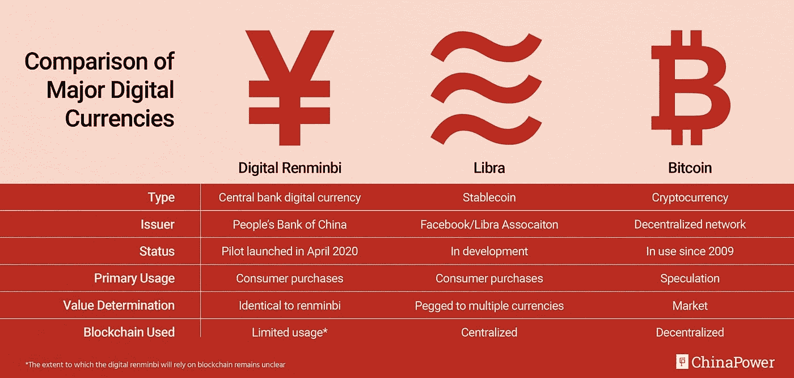
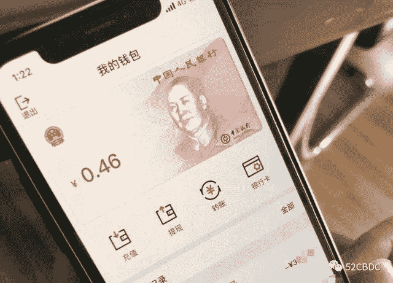

# CBDC 揭秘:中国央行数字货币背后的“为什么”

> 原文：<https://medium.datadriveninvestor.com/cbdc-unmasked-the-whys-behind-chinas-central-bank-digital-currency-bae1f77632a6?source=collection_archive---------13----------------------->

为什么中国要加速其央行数字货币的发展？CBDC 背后的动机是什么？

> 深入了解中国的 CBDC

自 2014 年以来，中国人民银行投入大量资源研究推出央行数字货币(CBDC)的可能性。尽管面临巨大的法律制度和公共政策框架挑战，六年后，2020 年 5 月，CBDC 终于在大湾区试运行。滴滴出行、美团点评等几家大公司已经与中国政府建立了战略合作伙伴关系，以推出更大规模的 CBDC 试运行。

作为首批行动者之一，中国已经认识到数字化经济对 CBDC 的需求，但推动中国建立 CBDC 的潜在力量是什么？有哪些可能的动机？

timeline of China’s CBDC (by Americana Chen)

# **数字支付环境**

Image source: *Merchant Savvy*

中国正在引领向象征性、无现金经济的转变。2019 年，中国的近距离支付用户数量增长了 10%，达到**5.774 亿**，这是全球最大的用户群，在最受欢迎的移动支付服务提供商中，来自中国的支付宝和微信以**13 亿活跃用户总和**位居前两位。预计在 2022 年，**移动支付将占据支付交易的 40%以上**，超过亚太地区所有其他传统支付方式。而在美国，成熟便捷的信用卡支付系统减缓了数字钱包的采用率。

Image source: *Merchant Savvy*

> “从长远来看，CBDC 的晋升将对整个社会产生深远的影响。在微观层面，首先是我们将逐渐进入一个无现金社会”
> 
> —徐苑，北京大学数字金融研究中心高级研究员

# **来自天秤座的压力**

在这样的环境下，中国政府比其他国家更早决定研究这一领域也就不足为奇了。然而，研究进展缓慢，直到脸书确认在 2019 年推出其加密货币——**Libra**，中国政府才开始通过推出 CBDC 的多项试点试验来推动和加快发展，并试图将该项目变为现实。

中国对加密货币交易所有严格的监管，自 2017 年以来，中国禁止首次发行硬币，但 Libra 是一个不同的故事。它是一种**“稳定币”**，意味着它是与一篮子法定货币挂钩的**，这意味着 libra 将不仅仅是另一种投机性的加密货币，而是可能被广泛用于消费者购买。它的多种货币篮子清楚地表明了它的愿景:成为一种全球货币。这对中国的资本管制政策构成了威胁，资本外流有可能变得难以控制，**资本外逃**可能会发生，因为公民将他们的资产转换成 Libra 数字货币。为了消除这种担忧，只与人民币挂钩的 CBDC 将实行资本管制政策，这让中国政府放心，它有权监督资本外流。**

Image source: China Power

# 人民币国际化

此外，成为世界上第一个发行央行数字货币的国家可能有助于人民币保持其目前在全球货币市场的**地位。由于资本管制政策以及 SWIFT 和 CHIPS 的主导地位，人民币在全球货币市场中的角色一直是中国货币政策制定者的心头大患。2020 年，尽管中国贡献了 10%的全球贸易，但使用**人民币支付仅占 1.76%** 。自 2000 年代末以来，中国中央政府对人民币国际化一直雄心勃勃，但进展缓慢。由于 SWIFT 向美国提供交易数据，而且有 12/25 的董事来自美国及其盟友，中国发现，在这样的环境下，很难为中国的出口商和进口商建立一个更好的竞争环境。据 SWIFT 预测，2023 年，**中国预计将占全球贸易的 15%**，这进一步促使中国加快人民币国际化。这可能会降低中国出口商和进口商的汇率风险，并确保他们有更好的确定性。支付交易成本的降低不仅会提高金融稳定性，还会带来更多的贸易机会，加强国内生产商与贸易伙伴的关系。**在这样的目标下，建立以 CBDC 为中心的全球货币清算网络和国际支付体系对人民币加快国际化至关重要。

# 促进金融包容性

数字化已经证明了其推动中国金融包容性的力量，与其他国家相比，中国的进步令人印象深刻。2009 年至 2016 年间，最大的 P2P 贷款平台 Lending Club 已经发放了近 160 亿美元的贷款；而在中国，阿里巴巴的蚂蚁金服已经为公众提供了总计超过 6000 亿元人民币(约 1000 亿美元)的服务。过去几年，阿里巴巴和微信支付扩展到提供易于获取的金融服务，在促进金融包容性方面非常有效。然而，这些金融服务没有得到中国政府的支持，它们所能提供的产品是有限的。现在，CBDC 承诺**将帮助 2 . 25 亿没有银行账户的中国公民直接获得央行提供的金融服务，而无需在中间商业银行开立账户。**只需在智能手机上轻点几下，你就可以获得政府支持的安全金融服务。它还是政府向公众分配社会福利、经济刺激方案、退税和其他财政支持的一种**便捷方式，并改善底层民众获得政府支持的途径。**

在提高金融包容性方面，其汇总个人支付交易历史和现金流的能力**为中国的社会信用体系提供了大量数据，以提高信用评级的准确性**。社会信用体系是“一个统一的记录系统，用于跟踪和评估个人、企业和政府的可信度。”。有了这种集中的现金流记录，系统能够准确反映个人信用的程度大大提高，因此许多面临限制借贷条件的低收入公民可以获得更多的融资服务。

image source: WeChat — 52CBDC

# 对比微信支付和支付宝

但这对两个最广泛采用的移动支付钱包提供商支付宝和微信支付意味着什么？它们的区别是什么？

最明显的区别是 CBDC 将被接受为官方货币，这意味着它将**被接受用于纳税**，而微信支付和支付宝没有资格。此外，为了促进其广泛采用，中国政府制定了强制性要求，规定所有接受任何形式的数字支付的商家都必须接受 CBDC。在公布的法律草案中，似乎还禁止任何第三方试图发行其他可能“取代”CBDC 的人民币盯住美元的货币。

其运作机制区别于微信支付和支付宝的另一个关键特征是，它支持一种**“双离线”模式**。北京大学数字金融研究中心高级研究员徐苑表示，使用支付宝和微信支付需要在交易过程中连接互联网，而 CBDC 允许在没有互联网连接的情况下使用智能手机**的近场通信功能完成交易。**

Image source: Lau Ka-kuen, SCMP

从过去的报道及其运作机制来看，中国政府似乎是要利用 CBDC 来重新获得对经济中支付流的实时监控和控制，并限制微信支付和支付宝的双头垄断权力。然而，官方已经证实，这两家支付提供商将参与 CBDC 的试点项目。在第二届上海外滩峰会上，长春表示， **CBDC 将分配到这些数字钱包:**

> “他们不属于同一个维度。微信和支付宝是钱包，而数字元是钱包里的钱。”

然而，中国何时开始进一步大规模试点 CBDC，以及它需要多长时间才能被公众广泛采用，仍是一个问题。虽然中国人民银行在 10 月初公布了一份法律草案，为 CBDC 建立基本的监管框架和合法性，但 CBDC 何时向公众开放仍不明朗。之前的报道雄心勃勃地计划在 2022 年北京冬季奥运会之前正式开始公开、大规模发行 CBDC **，目前，中国银行、中国建设银行、中国工商银行和中国农业银行正在与中央政府合作，在中国的几个主要城市(包括苏州、深圳、广东和北京)进行进一步的试运行。就目前的试点速度、合作关系的建立、银行的合作来看，实现这一时间表似乎是一个非常容易实现的目标。**

# **参考文献:**

1.  “50 全球移动支付统计、数据和趋势(2020 年 2 月)。”*商人精明*，2020 年 10 月 28 日，[www.merchantsavvy.co.uk/mobile-payment-stats-trends/.](http://www.merchantsavvy.co.uk/mobile-payment-stats-trends/.)
2.  北、多光、华城。“中国的数字金融普惠”*中国金融普惠研究院*2019、[www.cafi.org.cn/upload/file/20190410/1554862364355125.pdf.](http://www.cafi.org.cn/upload/file/20190410/1554862364355125.pdf.)
3.  CBNEditor 等《CBNEditor》*中国银行业报*，2020 年 4 月 23 日，[www . chinabankingnews . com/2020/04/23/Peking-university-professor-says-launch-of-China-central-bank-digital-currency-will-be-history-defining-event/](http://www.chinabankingnews.com/2020/04/23/peking-university-professor-says-launch-of-chinas-central-bank-digital-currency-will-be-history-defining-event/)。
4.  陈，维塔。"中国 CBDC:为什么这位专家说数字元是“绝对必要的”. "《财富》杂志，2020 年 7 月 30 日，fortune.com/2020/07/30/china-digital-currency-yuan-cbdc/.
5.  "随着国有银行的大规模测试，中国的数字货币越来越近."*南华早报【2020 年 8 月 6 日[www . scmp . com/economy/China-economy/article/3096296/China-digital-currency-edges-closer-large-scale-test-four。](http://www.scmp.com/economy/china-economy/article/3096296/chinas-digital-currency-edges-closer-large-scale-test-four.)*
6.  "央行数字货币将如何推进中国的利益？"*中国电力项目*，2020 年 8 月 26 日，chinapower.csis.org/china-digital-currency/.
7.  贾加蒂，设拉子。"中国的数字元 CBDC 已经很近了，但许多细节仍不为人知."Cointelegraph，2020 年 8 月 17 日，coin telegraph . com/news/China-digital-yuan-cbdc-已经接近，但许多细节仍不为人知。
8.  哈德森洛科特。“中国的数字货币计划是什么？”*订阅阅读|金融时报*《金融时报》2019 年 11 月 25 日[www.ft.com/content/e3f9c3c2-0aaf-11ea-bb52-34c8d9dc6d84.](http://www.ft.com/content/e3f9c3c2-0aaf-11ea-bb52-34c8d9dc6d84.)
9.  迈克尔。"中国国家数字货币 DCEP / CBDC 概述." *Boxmining* ，2020 年 10 月 30 日，box mining . com/dcep/# Why _ is _ China _ coming _ up _ with _ a _ digital _ currency。
10.  史蒂文森、亚历山德拉和保罗·莫祖尔。"中国给企业打分，低分数可能成为贸易战的武器."*《纽约时报》*《纽约时报》2019 年 9 月 22 日[www . nytimes . com/2019/09/22/business/China-social-credit-business . html](http://www.nytimes.com/2019/09/22/business/china-social-credit-business.html.)
11.  “中国的数字元对支付宝和微信支付意味着什么？”*南华早报*2020 年 9 月 5 日[www . scmp . com/business/banking-finance/article/3100285/what-will-China-central-bank-digital-currency-mean-支付宝。](http://www.scmp.com/business/banking-finance/article/3100285/what-will-chinas-central-bank-digital-currency-mean-alipay.)
12.  EUROPLACE，2015 年，*全球货币使用和趋势:SWIFT 与伦敦金融城和巴黎合作编写的信息文件*，【www.swift.com/node/19186\. 