# 从 Mysql 到雪花的 CDC 管道

> 原文：<https://medium.datadriveninvestor.com/cdc-pipeline-from-mysql-to-snowflake-58a01d4d596a?source=collection_archive---------3----------------------->

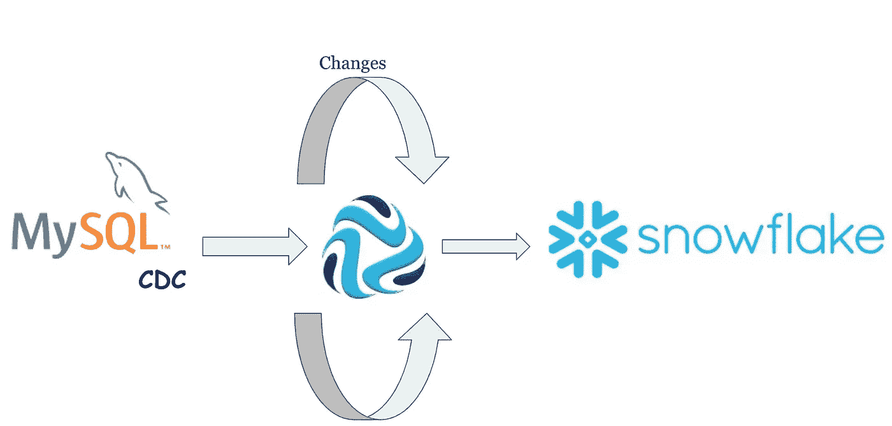

MySQL 是一个开源的关系数据库系统，是当今大多数企业技术的一部分。在一般的体系结构中，MySQL 被用作带有独立数据仓库的事务数据库，以支持分析和报告或其他下游应用程序需求。

**Change-Data-Capture** (CDC)允许从数据库实时捕获提交的更改，并将这些更改传播到下游应用程序或其他目标数据库。

***雪花*** 最近越来越受欢迎，因为它提供了企业分析数据库的所有功能，以及许多附加的特殊特性和独特功能。

在这篇博客中，我们将学习如何创建一个流集数据收集器(SDC)管道，将插入、更新和删除操作从 MySQL BinLog 传播到雪花。

**MySQL 使用二进制日志捕获变更数据**

MySQL 二进制日志提供了一种非常有效的方法来跟踪数据变化。它们包含描述数据修改的事件。简而言之，二进制日志包含从服务器启动开始跟踪服务器全局状态所需的所有信息。

我们将设置 MySQL 并启用二进制日志。出于演示目的，将使用 docker 图像

在使用这些二进制日志应用程序之前，使用下面的代码片段来更改 MySQL 服务器配置以启用二进制日志。

```
$cat my.cnf[mysqld]

server-id  = 1

log_bin  = /var/lib/mysql/mysql-bin.log

expire_logs_days = 10

max_binlog_size  = 100M

binlog-format    = row
```

让我们启动 Mysql docker 容器并启用 binlog

```
$ docker run -d --name mysqlcdc -p 3306:3306 -e MYSQL_ROOT_PASSWORD=root -v /Users/rishijain/my.cnf:/etc/mysql/my.cnf -v /tmp/mysql:/var/lib/mysql mysql:5.7 mysqld --datadir=/var/lib/mysql --user=mysql
```

现在让我们设计一个 MySQL CDC 到雪花的实际管道

# 管道概述

以下是从 MySQL BinLog 读取行并将插入、更新和删除操作传播到雪花的管道的高级概述:

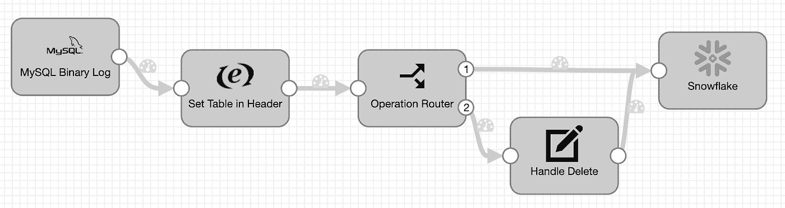

您可以从这里的链接[下载示例管道](https://github.com/rishi871/Blog.git)

注意:我使用了最新的流集数据收集器 3.21.0

# MySQL BinLog 起源

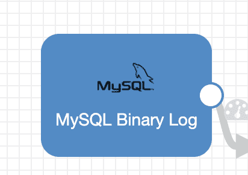

[MySQL BinLog Origin](https://streamsets.com/documentation/datacollector/latest/help/datacollector/UserGuide/Origins/MySQLBinaryLog.html) 配置如下:

# MySQL BinLog 选项卡属性

设置 MySQL 主机或 IP 地址、端口和唯一的服务器 ID (SDC 将充当复制客户端的角色):

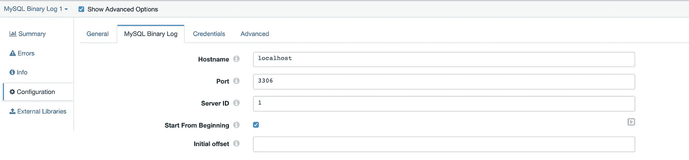

# 高级选项卡—最大批量

*   将“高级”选项卡上的最大批处理大小至少设置为 20000，以便在写入雪花时获得最佳性能。该值将相应地受到 sdc.properties 文件中设置的 production.maxBatchSize 的约束

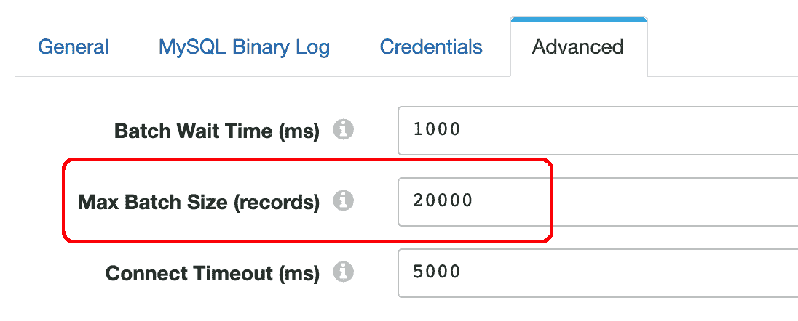

# 高级选项卡—包括/忽略表格

默认情况下，MySQL BinLog 源将捕获对所有表的更改。若要筛选表的子集，请使用 database.table 表示法指定要包含或忽略的表。您还可以使用通配符“%”来匹配任何子字符串。下面的示例将捕获表 demo.test_1 和 demo.test_2

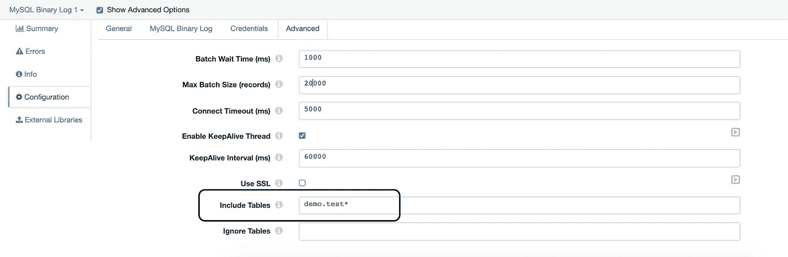

# 在页眉中设置表格


Set Table in Header 步骤是一个表达式求值器，它将表名从记录体复制到记录头，因此我们可以保留雪花目标的表名，即使在我们修剪记录之后。

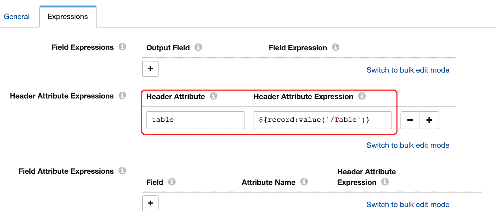

# 操作路由器

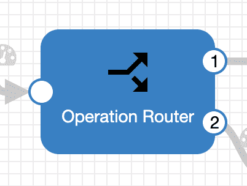

操作路由器是基于操作类型进行路由的流选择器:

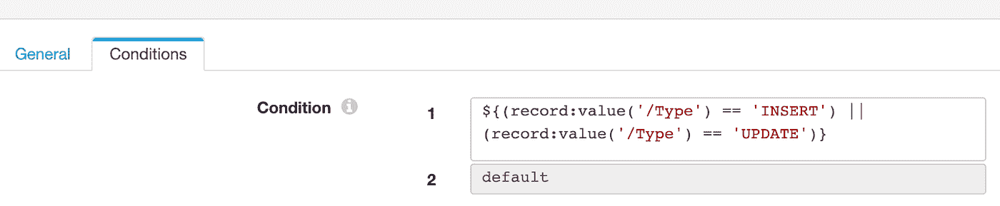

插入和更新操作被直接路由到雪花目的地；删除操作需要额外的转换。

您应该不需要更改此设置。

# 处理删除

Handle Delete 是一个字段重命名器，它只是将 OldData 字段重命名为 Data，以便雪花目标可以找到用于删除操作的 PK 字段:

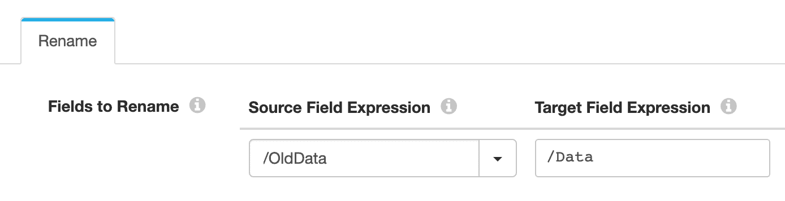

您应该不需要更改此设置。

# 雪花的目的地


雪花目标具有以下配置:

# 雪花连接信息

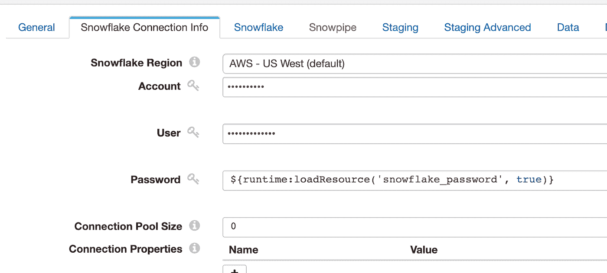

指定帐户和用户属性。

雪花密码从磁盘中读取的方式与上述 MySQL 密码相同。确保在磁盘上创建 snowflake_password 文件，创建方式与上面 MySQL BinLog 阶段的凭证部分中描述的文件相同。

# 雪花标签

用您自己的设置替换下面的仓库、数据库和模式设置。

表格属性是从我们之前设置的记录标题中选取的。

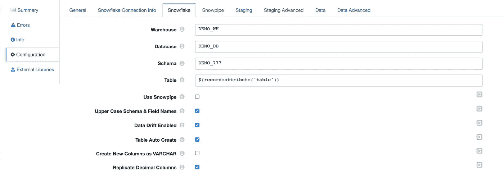

# 分段选项卡

您可以使用雪花的任何一个暂存位置:

*   亚马逊 S3
*   Azure Blob 存储
*   雪花内部阶段

出于演示目的，我使用雪花内部用户阶段，但是，您可以使用任何阶段位置

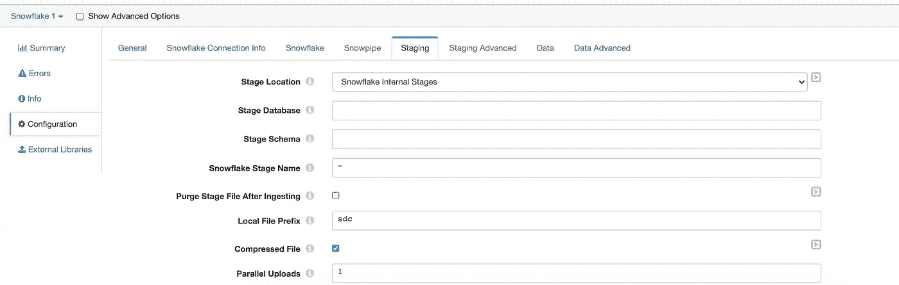

对于外部雪花阶段，需要提前创建，一旦存在，请在下面指定其名称。如果您在具有 IAM 角色的节点上运行以读写 S3，您可以将这些键留空。如果您需要提供密钥，请在磁盘上创建 aws_access_key 和 aws_secret_key 文件，创建方式与上面 MySQL BinLog 阶段的凭证部分中描述的方式相同。同样，你需要为微软 Azure 进行配置

# 数据选项卡

这些是数据选项卡中的关键设置。确保设置 CDC 数据复选框！

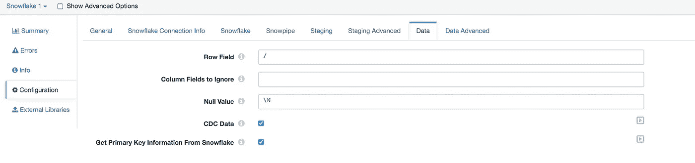

/Data row 字段是 MySQL BinLog 中数据的显示方式；您不应该更改该设置。

您可以从 snowflake 获取主键信息，也可以手动提供静态键。

# 数据高级选项卡

以下是一些有用的设置:

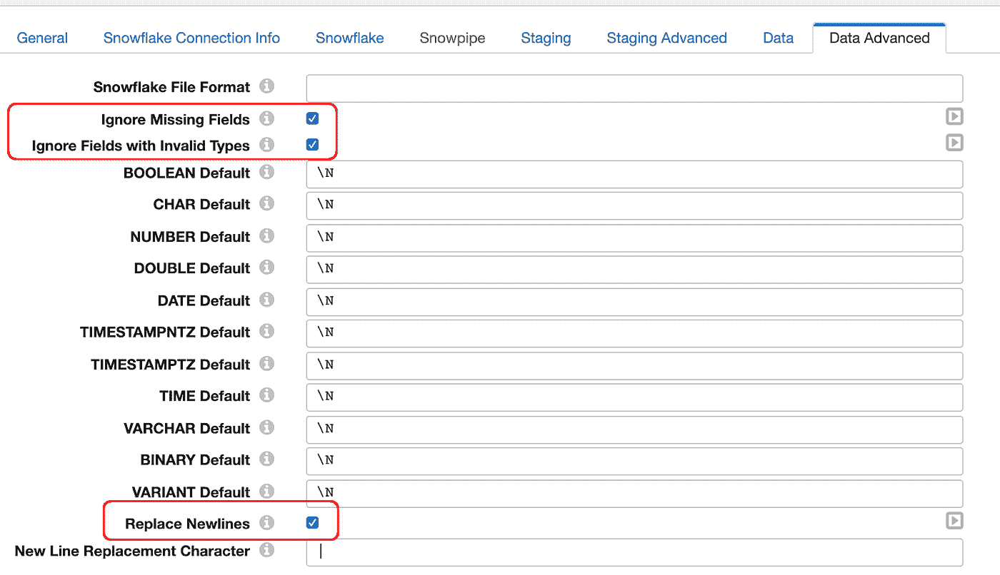

# 验证管道

配置管道后，单击 SDC GUI 右上角的复选标记图标，确保验证成功:

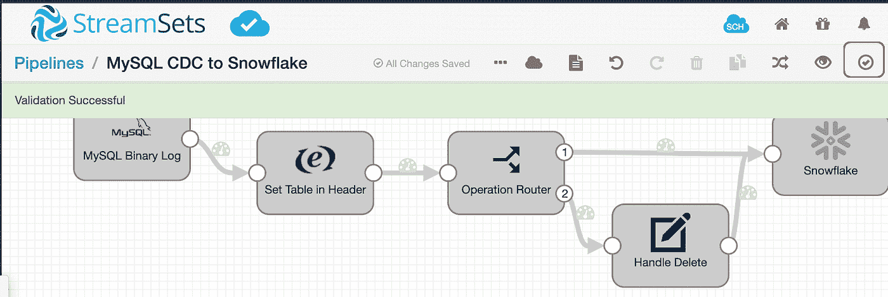

# 运行管道

如果验证成功，运行管道并检查雪花中的数据:

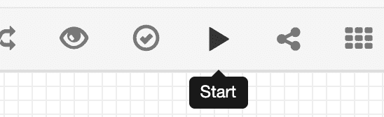

如果一切顺利，您应该看到以下内容:

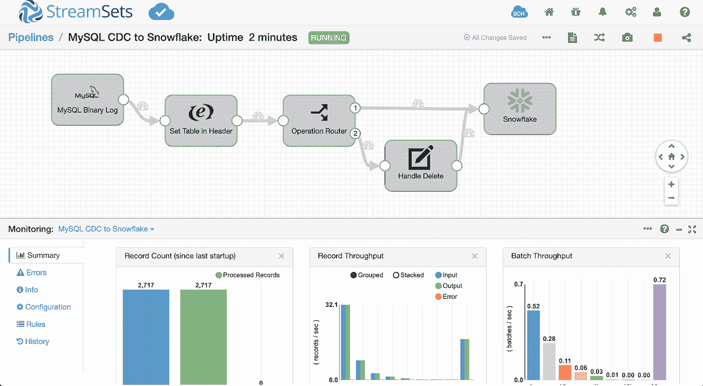

**结论**:在本教程中，我们学习了如何创建一个到雪花的 Mysql CDC 管道。请在评论中告诉我你是如何创建 MySQL CDC 到雪花数据管道的。