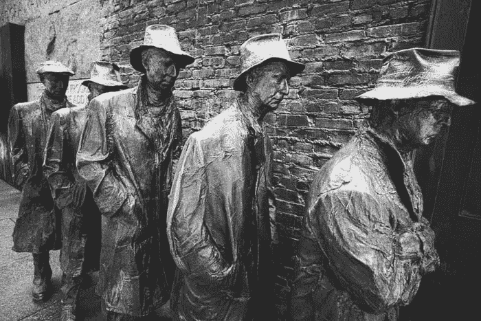

# 停火:关于新冠肺炎、经济和潜在党派暴力的真正对话

> 原文：<https://medium.datadriveninvestor.com/ceasefire-real-talk-on-covid-19-the-economy-and-potential-for-partisan-violence-3e5d03a62fec?source=collection_archive---------8----------------------->

## 除非现在加以控制，否则双方的破坏性言论本身将导致死亡人数不断增加。

[Depression Breadline sculpture by George Segal](https://www.google.com/url?sa=i&url=https%3A%2F%2Fwww.alamy.com%2Fthe-depression-breadline-sculpture-by-george-segal-part-of-the-fdr-memorial-washington-dc-usa-image209668757.html&psig=AOvVaw0yF0BHyCSf_EpzjBkIgvFf&ust=1587394151753000&source=images&cd=vfe&ved=0CA0QjhxqFwoTCIDP55be9OgCFQAAAAAdAAAAABAY), courtesy of Unsplash

当我试图保持政治平衡时，我并不总是成功的，但我会在这里试一试。

上图为乔治·席格的雕塑，目前矗立在华盛顿特区？

如果这是我们现代瘟疫的结果，一个人的个人政治一点也不重要。

我需要你帮我。我们需要喘口气。

我们越来越危险，你和我。我们在从新冠肺炎到经济的一切问题上的言论已经完全政治化，我们的观点很大程度上是党派性的。

 [## 保护主义、政治和经济动荡|数据驱动的投资者

### 美国股市昨日出现 400 多点的大幅反转，为未来的事情发出了警告信号。市场…

www.datadriveninvestor.com](https://www.datadriveninvestor.com/2018/06/28/protectionism-politics-economic-turmoil/) 

我们都有自己的观点，表达这些观点是好的，但是如果我们的激情压倒了我们的常识，党派暴力的威胁越来越大，这些观点就会变得毫无意义。

我们需要后退一步，停止相互挑衅。

## “布加洛”

昨天，当我读到 NBC 新闻的以下文章时，我感到很不安:

 [## 在特朗普的“解放”推文中，极端分子看到了拿起武器的呼声

### 当唐纳德·特朗普总统在推特上发布“解放明尼苏达州！”星期五早上，他的一些最狂热的支持者…

www.nbcnews.com](https://www.nbcnews.com/tech/security/trump-s-liberate-tweets-extremists-see-call-arms-n1186561) 

我对所谓的“布加洛”做了一些研究，发现了这篇来自同一来源的早期文章:

 [## 什么是‘布加洛’？网上呼吁暴力起义是如何冲击主流的

### 主张针对自由政治对手和法律的暴力起义的反政府运动…

www.nbcnews.com](https://www.nbcnews.com/tech/social-media/what-boogaloo-how-online-calls-violent-uprising-are-getting-organized-n1138461) 

“布加洛”被认为源自唐纳德·特朗普(Donald Trump)的极右翼支持者，并受到他们的威胁，它实际上是第二次内战的号召。不管一个人的政治立场如何，如果我们不能同意这是社会精神错乱的行为，而且它没有被这样对待，那么我们可能会在 11 月见证一个历史性的爆发点。

目前，当局正在密切关注，并为候选人在即将到来的选举中失败后可能发生的边缘起义做准备。

但是这个边缘到底有多大呢？这正是那些监督和负责这些事情的人所担心的。

针对那些政治光谱的另一面，我昨晚午夜时分在脸书上发了以下内容，然后为了支持这篇文章而删除了它:

*让我们把它放在那里。*

*我很难随意或开玩笑地阅读我的页面或其他地方的帖子，希望川普的支持者、共和党人和其他人去死*

我们比这更好，我不会容忍的。

*相信我，正如我之前提到的，我会生气。见鬼，我是这里的愤怒领袖，如果有的话，在接下来的几个月里我会更加直言不讳地谈论我的政治。*

但是我的愤怒是为了让唐纳德·特朗普下台，而不是对他的支持者造成身体伤害。我对他最右翼的谄媚者或崇拜者没有任何耐心，我相信他们中的许多人正在通过标榜国家留在家中的命令伤害我们所有人，因为一些人拿着武器摆姿势，但我不希望他们“死”。

*我们都需要共存，坦率地说，我们需要小心谨慎。十一月即将来临。美国发帖希望任何人受到伤害，或者更糟，这只能证明这些精神错乱的极端分子呼吁“内战”，伤害“自由主义者”和其他垃圾是正确的，因为我们实际上正在做同样的事情。火上浇油是适得其反的；我们的斗争应该是投票让特朗普下台。*

*剩下的将由负责此事的人处理。*

希望这是我对此事的唯一评论。

这是什么意思？这意味着我这边的人也一直在挑起暴力，不管是有意还是无意。

结局是什么？

## 经济

经济不是“封闭的”。不这样认为是不承认一个简单的短语。许多美国公民目前正在工作，太多的人——疫情期间迄今已有 2200 多万人——申请失业。

我们可能不赞成它的状况，它正朝着另一场大萧条的方向缓慢前进，但我们的经济仍然是一个“开放”的经济。我们都想并且需要工作。

但是，要明确的是…

1.尽管那些抗议“呆在家里”命令的人发表了各种观点和言论，但经济永远不会“关闭”。**这是真理，与政治派别无关。**

 [## 密歇根的抗议者们，你们的不适并不等同于在纳粹德国被杀害的犹太人

### 将你的困境与纳粹德国的受害者相提并论，是对那些死去和幸存的人的侮辱。其余的可能证明…

medium.com](https://medium.com/@joeleisenberg/michigan-protestors-your-discomfort-does-not-equate-to-jews-killed-in-nazi-germany-12c864c66e7c) 

2.如果你拥有一家企业，除非你能在财务上有效地提供商业服务，否则你现在可能会有麻烦。**这是真理，与政治派别无关。**

3.如果你为一家公司工作，而那家公司现在已经关门了，如果你的公司还在营业，你所认为的“重新开放经济”可能会有所帮助。如果没有，就不会。**这是真理，与政治派别无关。**

4.如果你的公司倒闭了，或者你失业了，失业就会向你招手。在你看来，“重新开放经济”对你没有任何好处，除非就业机会有所改善。**这是真理，与政治派别无关。**

5.你工作的许多公司一直依赖小型企业管理局的贷款来维持业务…而这笔钱在本周用完了。也就是说，绝大多数提出申请的公司都不会收到救命钱。其中一定比例的公司可能会倒闭。不管一个人的政治倾向如何，这都是真理。

所以我们总结一下。实际上，除非你是一个幸运的人，有一份工作仍然空缺，或者你已经通过虚拟化(这将大部分业务排除在外)成功维持了自己业务的收入流，“重新开放经济”不会成为任何形式的快速解决方案。

事实上，这将是一个缓慢而漫长的过程。

不是万灵药。

## 新冠肺炎（新型冠状病毒肺炎）

新型冠状病毒是一种正在杀死共和党人和民主党人的疾病。

不管你是一头大象还是一头驴子，不管你是红色还是蓝色。

我昨晚——2020 年 4 月 18 日——收到了这条评论，它的无知令人震惊:

*“3.3 亿美国人
65 万 w/病毒
.00183%几率感染。
就为了这个你毁了国计民生？？?"*

我的回答是:

*这就是逻辑？1)目前有未知数量的患病或曾经患病的美国公民，包括我的朋友，他们没有接受测试，因为没有测试可用，但他们已经住院治疗 Covid 症状和疾病，如双肺炎；2)疗养院中的许多人仍未接受检测；3)每天都有数以千计的新病例出现，全球范围内的病例数超过 200 万。*

教育。这不是工作，这是一次冒险。

我的结论？考虑到*以上的所有*？

健康第一。如果你已经死了，不能工作了，那你就倒霉了。

感谢您的阅读。

**如果你发现了这个有价值的故事，欢迎在 Medium 上推荐、分享和关注我，我每天都会发布各种主题的新故事。**