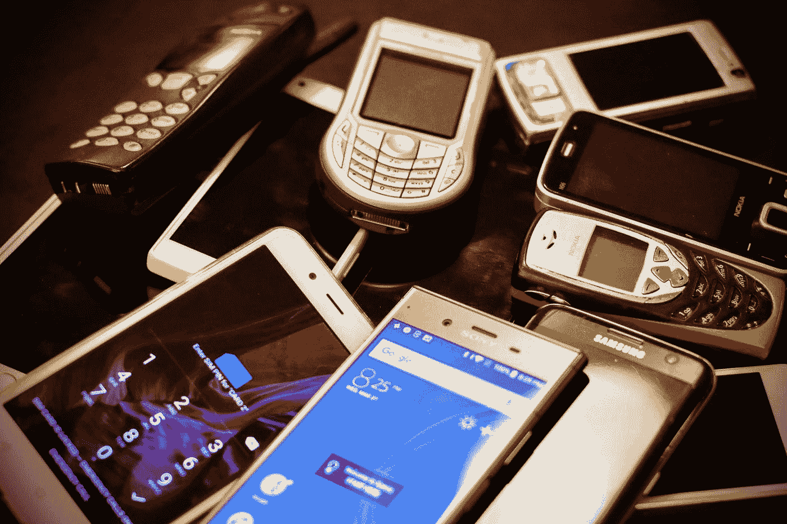

# 手机技术应该是在二战后引入的

> 原文：<https://medium.datadriveninvestor.com/cell-phone-technology-should-have-been-introduced-after-wwii-e3adcc4f79e4?source=collection_archive---------9----------------------->

## 一个 40 年的开端是如何被搞糟的，它教给我们什么

Photo by [Eirik Solheim](https://unsplash.com/@eirikso?utm_source=medium&utm_medium=referral) on [Unsplash](https://unsplash.com?utm_source=medium&utm_medium=referral)

1945 年的某一天，一名美国政府官员在接受采访时向一家较小的报纸宣布了一项新的惊人技术。正如你可能认为的那样，这次揭露与核能或核武器无关。这位官员是联邦通信委员会(FCC)的 J.K. Jett，他的公告是关于蜂窝技术的。

> “关于移动技术，我们都记得没有手机之前的世界，但我们大多数人可能不记得手机的基本概念是 1945 年在《周六晚邮报》的一篇文章中首次向公众介绍的。正如前 FCC 首席经济学家托马斯·黑兹利特(Thomas Hazlett)在他的书《政治光谱》(The Political Spectrum)中讲述的故事，时任 FCC 主席杰特(J.K. Jett)预测，数百万美国人很快就会使用“手持通话器”，而且发放使用这项新技术的许可证的过程“不会很困难”“—[FCC 总委员会 Thomas m . Johnson Jr .在佛罗里达州经济俱乐部的演讲](https://docs.fcc.gov/public/attachments/DOC-355127A1.pdf)，2018 年 11 月

奇怪的是，技术和想法就在那里。那时，美国电话电报公司垄断了电话服务，固定电话是语音通信的主要来源。我相信你现在一定很挠头。发生了什么事？

正如 Matt Ridley 在他的书[中解释的那样，创新是如何工作的](https://www.amazon.com/How-Innovation-Works-Flourishes-Freedom/dp/0062916599):

> “移动电话的历史是政府在各种游说团体的授意下强加的官僚拖延的非凡故事……我们本可以比现在早几十年拥有手机。”

根据 Thomas Hazlett 在《理性杂志》上的文章，1945 年宣布蜂窝技术的联邦通信委员会在 1947 年拒绝了美国电话电报公司的申请。当时的联邦通信委员会认为这种蜂窝技术主要是一种奢侈品，是方便使用的利基产品。频谱可以更好地用于其他方面——主要是电视。

 [## 认知计算——一套被广泛认为是……

### 作为它的用户，我们已经习惯了科技。这些天几乎没有什么是司空见惯的…

www.datadriveninvestor.com](https://www.datadriveninvestor.com/2020/02/19/cognitive-computing-a-skill-set-widely-considered-to-be-the-most-vital-manifestation-of-artificial-intelligence/) 

在各自领域拥有垄断地位的大企业也不介意。他们喜欢现状，并不热衷于革命性的技术。

最奇怪的是，公众从来没有真正注意到这一事件。

# 什么是蜂窝技术？

这听起来可能是一个愚蠢的问题——毕竟，我们每天都在使用它。但是，你真的知道它是如何工作的吗？我当然不知道。因此，让我们简要了解一下这项常用技术是如何工作的。

> “当你对着手机说话时，听筒里的一个微型麦克风会把你声音的起伏转换成相应的电信号起伏模式。手机内部的一个[微芯片](https://www.explainthatstuff.com/integratedcircuits.html)将这些信号转换成一串数字。这些数字被打包成无线电波，从手机的[天线](https://www.explainthatstuff.com/antennas.html)发射出去(在一些国家，这种天线被称为天线)。无线电波以光速在空气中传播，直到到达最近的手机天线。——[克里斯·伍德福德](https://www.explainthatstuff.com/chris-woodford.html)，“手机如何工作[”](https://www.explainthatstuff.com/cellphones.html)

科学作家克里斯·伍德福德解释说，手机是低功率无线电发射机，向“桅杆”发送信号，而“桅杆”是高功率发射机。该主站将把信号发送到本地基站，该基站将路由一条路径到其最终目的地。显然，这有点过于简化，但它表达了重点。

伍德福德提到，由于无线电信号的流量，单个网络被分解成更小的“单元”。这使得足够的信号可以不受干扰地来回传递。想象一下，一个大城市有数百万部电话同时使用。现在，把这个城市分成许多更小的单元，它变得更容易管理。

这听起来有点麻烦，但它的工作非常无缝。此外，这比你去哪里都背着一个装有大型无线电发射机的巨大背包要好。不要笑，你很快就会发现，对于今天的一些技术，这可能是一个要求。

# 电视给予了光谱的运行

Photo by [Franck V.](https://unsplash.com/@franckinjapan?utm_source=medium&utm_medium=referral) on [Unsplash](https://unsplash.com?utm_source=medium&utm_medium=referral)

Hazlett 在他的文章中说，蜂窝电话实际上将被给予一小块无线电频谱来运行。他们有一个被称为“陆地移动”的类别，占据了整个可用带宽的 4.7%。然而，电视会受到联邦通信委员会更好的对待。他们将获得近 60%的频谱来工作。不幸的是，这将超过他们可以使用。

> “这个光谱有多空？在美国 210 个电视市场中，最初分配给电视的 81 个频道为电视台创造了大约 17010 个位置。由此，FCC 在 1952 年计划授权 2002 家电视台。到 1962 年，只有 603 家在美国播出。——托马斯·黑兹利特，理性杂志

电视网也极力保护他们的频段。他们请求联邦通信委员会停止允许超高频频段用于移动电话服务。

# 现有技术的干扰

蜂窝技术不仅面临来自电视的挑战，还面临来自陆地移动的其他力量的抵制。有一种移动电话服务(MTS)，它使用古老的技术，需要带有大型发射机的通信系统(还记得背包天线图像)。

这项技术非常昂贵，而且只能支持小型用户群。它将主要用于大型企业。据 Hazlett 称，到 1968 年，整个美国将只有 62，000 名用户。这些用户将在美国电话电报公司和 500 家较小的供应商之间分配。每个市场将允许两个无线电公共载波(RCC)。

RCCs 将获得 90%的陆地移动频谱，他们的无线电和发射机都是由摩托罗拉制造的，每个造价数千美元。摩托罗拉和 RCCs 也将保卫他们的领土，抵御新生的蜂窝技术。他们可以很容易地看到手机的好处，以及它会如何摧毁他们的行业。

奇怪的是，即使美国电话电报公司的贝尔实验室开发了蜂窝技术，该公司也会扼杀自己的发明。美国电话电报公司垄断了固定电话，也没有推动新的移动电话技术。他们最终在 1958 年提出了蜂窝分配的请求，并最终在 10 年后得到了 FCC 的回应。

到 1970 年，联邦通信委员会终于开始分配更多的带宽给移动电话，1972 年，第一个移动电话由摩托罗拉的首席执行官拨打。然而，他们的律师也将努力扼杀这项技术，联邦通信委员会的中央规划也将继续减缓发展。

Hazlett 解释说，从这项技术诞生到第一部商用手机上市需要 37 年的时间——就是 1987 年电影《华尔街》中挥舞的那部手机。

# 对当今世界的警告

Photo by [Christopher Gower](https://unsplash.com/@cgower?utm_source=medium&utm_medium=referral) on [Unsplash](https://unsplash.com?utm_source=medium&utm_medium=referral)

> “在互联网诞生之初，出现了一场只有律师和柏拉图式的哲学家才会喜欢的辩论(这场辩论在某些地区延续至今):互联网接入更像是电话服务还是有线服务，还是一种全新的服务？我们是否应该把互联网视为一种公用事业，就像老牌垄断企业马贝尔电话网一样，完全具备价格监管和公共运输要求的潜力？幸运的是，当时的监管者很有远见，没有把互联网和传统的电话服务同等对待。相反，他们谦逊地认识到，也许这个新兴市场不需要严厉的政府监管就能让消费者受益……结果不言自明:宽带提供商投资超过 1.5 万亿美元建设新网络，将美国人与新产品和服务连接起来；互联网和社交媒体彻底改变了我们的互动方式和我们生活的世界；互联网经济为消费者创造了数百万个新工作岗位和数万亿美元的价值。”—2018 年 11 月，联邦通信委员会总理事会小托马斯·m·约翰逊在佛罗里达经济俱乐部

你可能已经阅读了这篇文章的大部分内容，并对自己感到疑惑，怎么会有人如此目光短浅。怎么会有人把后来成为手机的惊人技术藏起来呢？我们这些热爱科技的人今天绝不会这么做。

你就大错特错了。Matt Ridley 在他之前提到的书中展示了无数现代世界如何扼杀创新的例子。他将这种现象称为“创新饥荒”。他特别提到了欧洲。

他解释说，欧盟的法规如此可怕，扼杀了创新，就像严厉的联邦通信委员会扼杀了手机一样。他列举了这些惊人的数据来支持他的观点:

*   在欧洲 100 家最有价值的公司中，每一家都超过 40 年。
*   在德国 DAX 30 指数中，只有两家公司是在 1970 年后成立的。
*   在法国的 CAC 40 指数中，只有 1 家公司是在 1970 年后成立的。
*   在瑞典排名前 50 的公司中，没有一家成立于 1970 年之后。
*   没有欧洲版的科技巨头谷歌和脸书。

雷德利还指出，许多大公司口口声声说着创新，但却经常反对创新。大公司喜欢监管，因为监管会扼杀更小更尖锐的竞争对手。他还解释了由于缺乏创新，美国和日本正在输给中国。

根据里德利的说法，中国在商业政策上实际上是相当自由的，只要你不与共产党政府发生冲突。中国政府对待现代经济的方式与美国最初对待互联网的方式非常相似。结果，他们看到了与早期信息高速公路一样的繁荣。雷德利继续说:

> “创新是自由之子，繁荣之母。总的来说，这是一件非常好的事情。我们放弃它，后果自负。”

在我们努力监管技术以创造一个更安全的世界时，我们最好记住这一点。我们的规划和监管可能会扼杀下一个蜂窝技术，或者扼杀下一个可以让世界变得更好的创业公司。不过话说回来，就像手机孵化了 37 年一样，我们可能永远不会注意到。