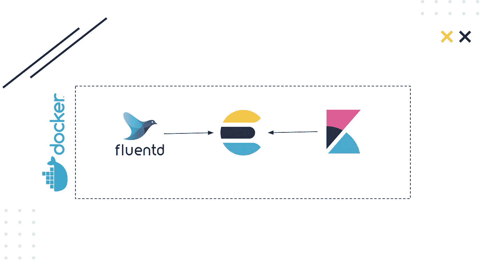
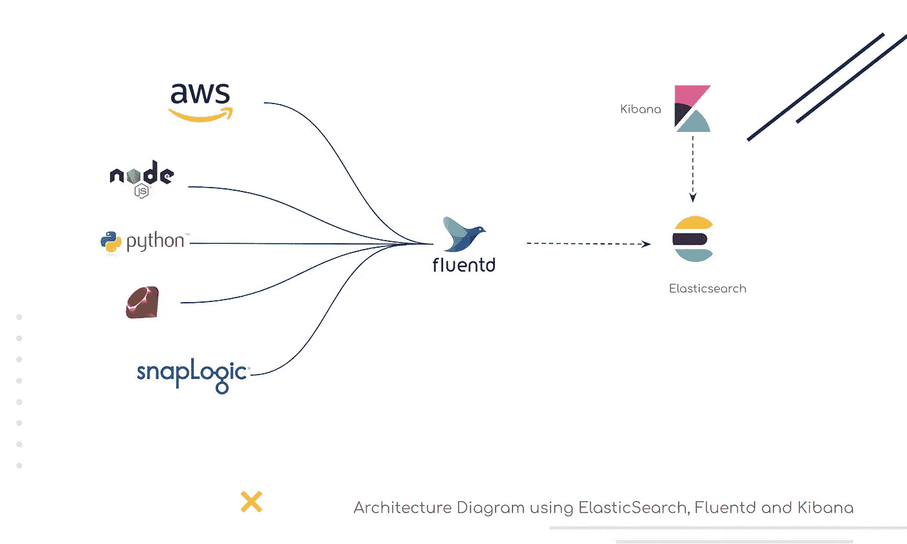
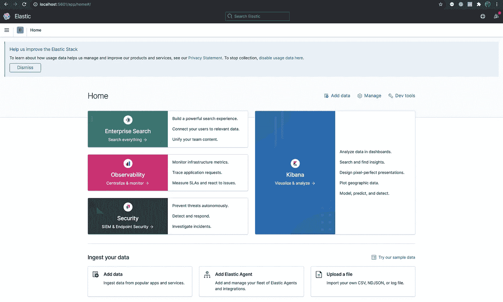
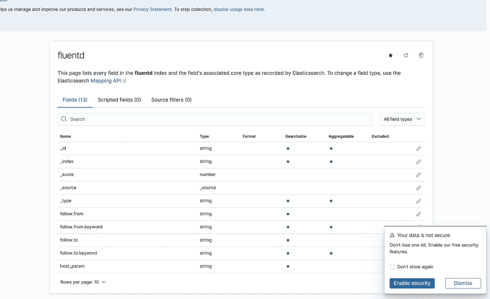
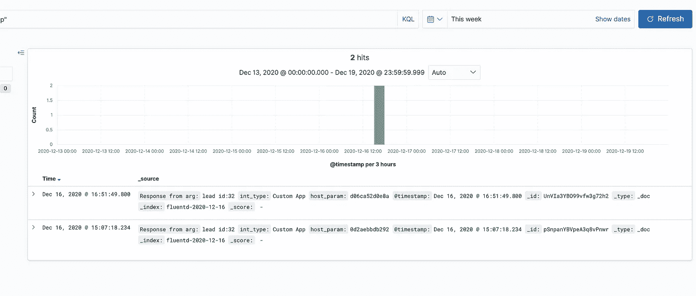

# 使用 EFK 堆栈和 Docker 的集中式日志管理(CLM)

> 原文：<https://medium.datadriveninvestor.com/centralised-log-management-clm-using-efk-stack-and-docker-32b693df9432?source=collection_archive---------6----------------------->

## 第二季|第一集

拥有适当的集中式日志管理基础设施将有助于我们调查或调试系统中出现的问题。此外，借助 CLM，我们可以提高应用程序/系统的安全性。在本地设置之前，让我们看看什么是日志记录和跟踪，



## **1。伐木业**

它是一段时间内事件的记录，或者是带有相关时间戳的截屏。

## 2.描摹

简单来说，这就像是坠机时的飞机黑匣子。它有助于您了解碰撞过程中的情况，并发现导致问题的一连串事件。简而言之，您将获得应用程序的 360 度视图。

在这个博客中，我们正在使用 Fluentd、Elasticsearch 和 Kibana 构建一个 CLM。让我们看看这些服务是什么，

1.  1.**弹性搜索**

这是一个高度可扩展的开源全文搜索和分析引擎。它允许您快速、近乎实时地存储、搜索和分析大量数据。

1.2.**基巴纳**

Kibana 是一个免费开放的用户界面，可以让你可视化你的 Elasticsearch 数据并浏览 Elastic Stack。

1.3.**流体**

它是一个开源数据收集器，使您能够统一数据收集和消费，以便更好地使用和理解数据。

有许多数据收集器可用，但我选择 fluentd 是因为它的可靠性和性能得到了验证。

## 体系结构



## 本地设置

我们将暂时使用 Docker 来管理我们的服务。

## 先决问题

从 Docker hub 下载所有三张官方**图片**

1.  [基巴纳](https://hub.docker.com/_/kibana)
2.  [弹性搜索](https://hub.docker.com/_/elasticsearch)
3.  [流动的](https://hub.docker.com/r/fluent/fluentd/)

这里的版本是 7 . 10 . 1(kibana 和 elastic search 都有)，fluentd 是最新版本。注意-确保使用相同版本的 Kibana 和 Elasticsearch。

## 弹性搜索

使用以下命令运行 ElasticSearch。

```
docker run -p 9200:9200 -p 9300:9300 -e "discovery.type=single-node" --name myES [docker.elastic.co/elasticsearch/elasticsearch:7.10.1](http://docker.elastic.co/elasticsearch/elasticsearch:7.10.1)
```

现在我们可以使用下一个 curl 来检查容器状态

`curl -X GET "localhost:9200/_cat/nodes?v&pretty"`

## 基巴纳

使用下面的命令运行 Kibana，这里我们已经使用`--link`命令将弹性搜索与 kibana 链接起来

```
docker run --link myES:elasticsearch -p 5601:5601 [docker.elastic.co/kibana/kibana:7.10.1](http://docker.elastic.co/kibana/kibana:7.10.1)
```

现在，当我们访问时，我们会看到这样的基巴纳仪表板

`[http://localhost:5601/app/kibana](http://localhost:5601/app/kibana)`



Kibana Dashboard

## 流体 d

我们将创建 fluentd 容器及其依赖项，而不是构建一个定制的 Docker 映像。因为这是一个简单的方法，所以我像这样运行我的数据收集器，但是你可以选择你最好的方法！

在此创建带有所需输入插件的配置文件；我的配置文件包含了 **HTTP** 和 **forwards** 输入插件。

发布此命令后，运行以下命令来启动 fluentd docker 映像

```
docker run -ti --rm -p 9880:9880  -p 24224:24224 -v /{fluentd_config_file_path}/:/fluentd/etc fluentd  sh -c "fluent-gem install fluent-plugin-elasticsearch --user-install;/usr/bin/ruby /usr/bin/fluentd -c /fluentd/etc/fluent.conf -p /fluentd/plugins"
```

CLM 基础设施准备张贴数据；一旦你完成了输入[插件](https://docs.fluentd.org/input)的配置并发布了数据，按照下面的步骤在 kibana 中可视化你的日志。

现在可以管理空间并单击索引模式来创建新的索引


Index pattern creation

单击下一步；现在，您已经成功地创建了一个默认索引名为 fluentd 的索引模式；对于自定义索引名称，您必须在运行 fluentd 容器之前在 fluentd 配置文件中指定。弹性搜索使用动态映射来预测索引拥有的字段。下面的截图将帮助你理解映射。



Elasticsearch Mapping

您可以导航到 discover 部分，然后选择过滤器来查看您发送的日志。



Kibana Dashboard

要区分收到的日志/添加验证/添加标记或标签，请参考 fluentd 官方[文档](https://docs.fluentd.org/configuration)。

就这样了，伙计们。我们的 CLM 从这里准备好了；您可以为您的用例实现这一点。我参考了一些官方文档和许多博客，并以这种简化的方式创建了这个博客。如有任何反馈，请通过 [Twitter](https://twitter.com/muni_offl) 或 [Linkedin](http://linkedin.com/in/muniyappanmani/) 联系我。谢谢！