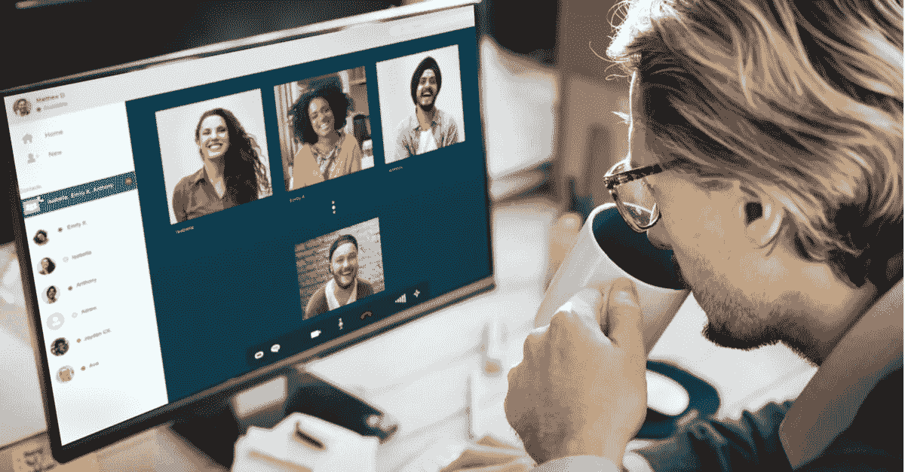

# 首席执行官、首席营销官和人力资源携手实现快速复苏

> 原文：<https://medium.datadriveninvestor.com/ceos-cmos-and-hr-together-for-a-fast-recovery-305694b6656d?source=collection_archive---------6----------------------->

办公室的大部分人都是负责任的 WFH。我看到许多人分享他们显示器的照片，与另外十个人进行视频通话。这是一个良好的开端，但如果你想让你的团队在新的领域有所作为，这还不够。通往高绩效的道路需要几个坚实的步骤，从赋予每个员工工作的意义开始。它还需要技能培养、正确的领导和技术准备。首席执行官、首席营销官和人力资源主管一起工作，可以创造品牌忠诚度和员工支持相互促进的工作空间，即使在危机时期也能取得巨大的成果。通过这样做，他们将加快复苏的步伐。

**目的**

在过去的十年里，营利性公司踏上了重塑自我的旅程，并接受了一个比利润更重要的目标，以围绕他们的产品激励客户和员工。成功转型的人有机会立即为员工提供他们非常渴望的福利，并有更大的机会击中当今最紧迫的领导力挑战——提高员工参与度。这种优势就是远程工作，如果您想充分利用这些优势，成功的实施需要技术和技能发展的正确组合。CMOs 和 CPO 是时候携手合作了。

 [## 跑步摆脱疯狂:锻炼如何提高你的生产力|数据驱动的投资者

### 没有比锻炼更好的方式来开始一天的工作了。我试着一周至少做四天，在…

www.datadriveninvestor.com](https://www.datadriveninvestor.com/2018/10/23/running-to-get-rid-of-the-crazy-how-working-out-increases-your-productivity/) 

在这个新的十年里，品牌需要一个目的作为进入游戏的标志。在 2018 年名为[*From Me to We:The Rise of The Purpose-led Brand，*](https://cts.businesswire.com/ct/CT?id=smartlink&url=https%3A%2F%2Fwww.accenture.com%2Fus-en%2Finsights%2Fstrategy%2FBrand-purpose%3Fc%3Dstrat_competitiveagilnovalue_10437227%26n%3Dmrl_1118&esheet=51908984&newsitemid=20181205005061&lan=en-US&anchor=From+Me+to+We%3A+The+Rise+of+the+Purpose-led+Brand%27&index=2&md5=7b94c7eab1e210caf51fcb5eb5559b22) 的研究中，埃森哲的主要发现是——*“目的现在是一种强大的力量，帮助企业建立更深层次的消费者联系，提高竞争力。* " *全球百分之六十二(62%)的消费者希望公司在他们关心的社会、文化、环境和政治问题上表明立场。此外，报告称，65%的人表示他们的购买决定受到公司领导人的言论、价值观和行动的影响。MarketingDive 对该事件的分析称——*埃森哲发现，与目的相关的信任度下降会阻碍品牌的竞争力，并可能导致数十亿美元的收入损失。但今天，拥抱目标也不仅仅是简单地分享对一个及时问题的看法，更多时候是要求对公司核心受众关心的事业做出有意义的承诺。*“这也直接反映在品牌价值上。Kantar Consulting 发现，在过去 12 年中，具有高度使命感的品牌经历了 175%的品牌估值增长，而增长率中值为 86%。*由自由球员 NFL 四分卫和社会正义活动家科林·卡佩尼克主演的耐克最近的“Just Do It”活动已经成为品牌在其营销中成功传达目的的领头羊* [*同时也推动了业务成果*](https://www.cesarkeller.us/articles/nike-great-marketing-is-a-guide-for-corporate-survival) *。然而，正如许多研究人员指出的，包括 Forrester 和现在的 Accenture，目的导向的方法必须超越一次性的活动和声明，才能读起来可信。例如，MarketingDive 表示，根据全日空的新闻稿，耐克承诺向致力于结束枪支暴力的组织捐赠 500 万美元**

**关怀型领导和员工参与度**

目的的影响不仅仅是建立消费者联系。这也有助于创造更健康的工作场所。企业可以向非营利组织学习，找到捷径来扭转目前的脱离水平。在 2011 年的一项名为[参与非营利员工:使命、管理和情感](https://www.gcn.org/sites/default/files/ctools/OK_Engaging_the_Nonprofit_Workforce_Report.pdf)(来自 opportunityknocks 和内华达大学)的调查中，一个关键的发现是“*参与和使命依附直接相关。员工希望为这样一个组织工作，他们相信这个组织的使命，他们觉得他们所做的工作直接有助于推进组织的使命。雇主需要关注为员工创造有意义工作的策略。”*他们还得出结论，*“与直接上司的积极关系与员工参与度正相关。我们强调管理培训的重要性，因为经理是员工和组织领导层之间最直接的联系，对普通员工的工作经历影响最大。*“这也是非营利组织得分高于营利性组织的一个方面，员工们觉得领导者真心关心他们。富有爱心和信任的领导者是吸引员工和团队的最佳代理人。

不用说，高度敬业的员工会带来更好的业绩。哈佛大学的一项研究显示，员工敬业度和客户忠诚度之间有很强的相关性，这会直接影响业务成果。因此，为现实设定一个目标会引发商业的良性循环。它提高了员工的参与度，从而提高了客户忠诚度。这也吸引了更多人性化的领导者，他们是员工参与度的主要驱动力。另一方面，客户觉得这些员工能更好地为他们服务，公司的价值观也能更好地代表他们。这个循环是这样的——目标推动参与，吸引更好的领导者。它们共同提高了客户忠诚度，从而带来更好的结果。

**远程工作**

现在，让我们看看哪些报告阐述了远程工作对于提高员工参与度的重要性。"*参与不是让员工感到快乐的一种练习，而是获得更好业务成果的一种策略。的确，敬业的员工更热情、更有活力、更积极，对自己的工作和工作场所感觉更好，身体也更健康，但敬业并不是领导者分发的额外津贴，而是领导者改善 KPI 的一种方式。几十年来的盖洛普研究表明，当员工积极参与时，他们的绩效会大幅提升:高度参与的工作场所的缺勤率会降低 41%，质量缺陷减少 40%，盈利能力提高 21%。工作灵活性增加了参与度。”*

继续*,“盖洛普发现，当员工花一些时间远程工作，花一些时间与同事一起工作时，敬业度会上升。每周与同事和经理面对面的时间似乎会影响敬业度:当员工花 60%到 80%的时间在异地工作时，或者一周五天工作制中的三到四天，敬业度会得到最佳提升。值得注意的是，五年前，也就是 2012 年，远程工作时间不到 20%的员工获得了最佳的敬业度提升。”*

如果我们展望未来，越多的领导和团队成员适应远程工作，熟悉使能技术和开发的新技能，就需要越少的办公室访问。在[工作场所 21](https://wp21.com/) 看我们的案例。我们一起工作了两年多一点，在此期间我们从未在同一个房间里。我们的团队遍布西雅图、SLC、多伦多、迈阿密和其他国际地点，但我们仍然有一个高度功能化和协作的团队。我们可以做很多事情，每个人都感到有效率和有能力。作为一名领导者，我衡量高能量水平和参与度。我们创建更好的工作场所的目的和我们对帮助团队实现高绩效的关注是我们享受高参与度的燃料。

正确装备你的队伍

远程工作可以提高团队生产力、参与度和绩效。团队需要被它的目的所驱使，并且为成功做好准备，去实现那些承诺。有效地规划和开发基本技能是保证团队在虚拟环境中良好沟通和协作的关键任务。同样至关重要的是，要支持领导者创造信任的工作环境，并指导他们在设定具有挑战性和可实现的目标时变得更加人性化和富有爱心。拥有为不同团队的现实定制的正确的技术组合也是使它们发挥作用的必要条件。协作工具、文件共享、虚拟工作空间和少量 KPI 仪表板有助于团队成员即使相距数英里也能彼此归属。

**立即行动**

在远程工作是强制性的时候，快速行动为高团队绩效创造合适的条件是至关重要的，也是最佳领导者如何脱颖而出的关键。

*原载于*[*https://www . Cesar Keller . us*](https://www.cesarkeller.us/articles/ceos-cmos-hr-together-for-a-fast-recovery)*。*