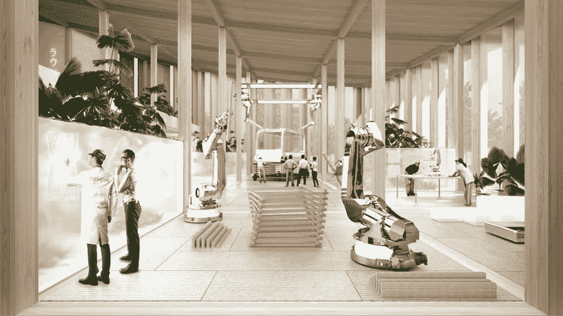
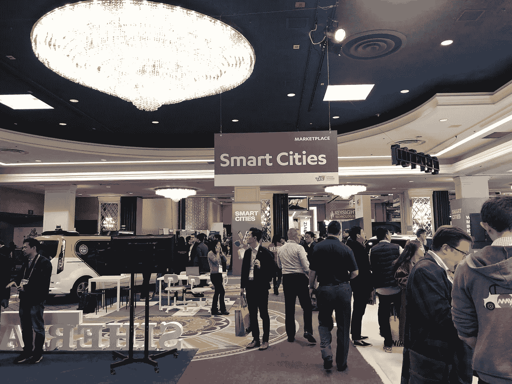
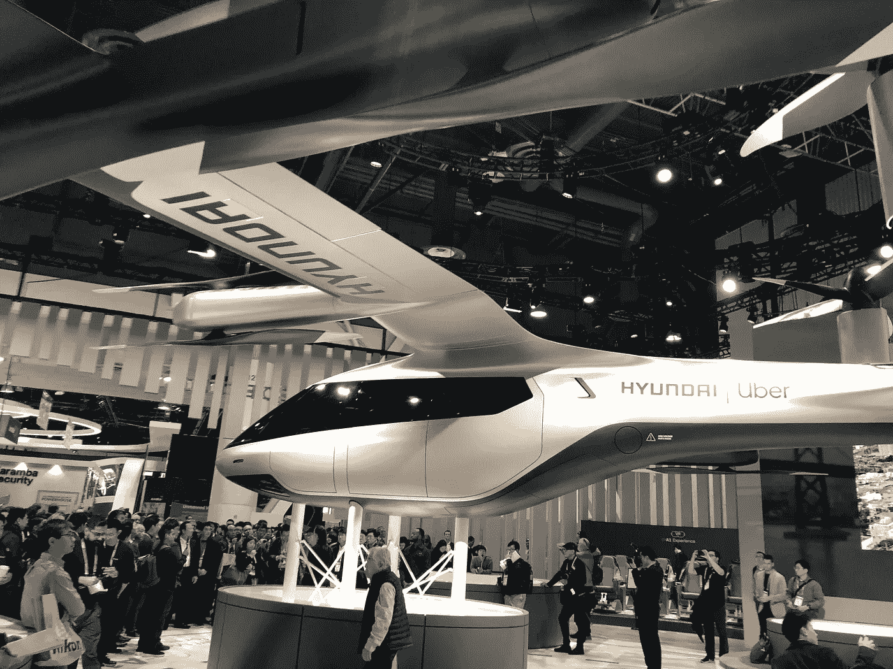
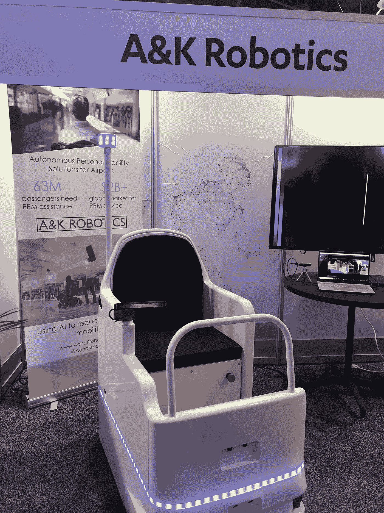
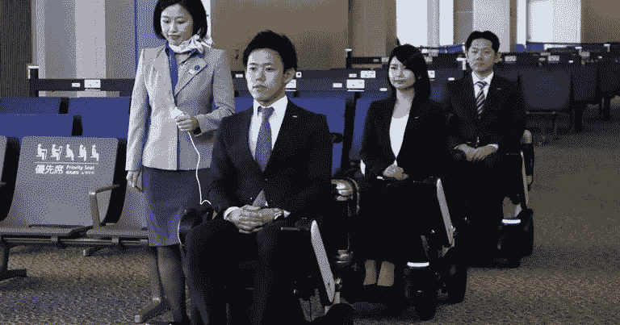

# CES 2020:智慧城市绿洲

> 原文：<https://medium.datadriveninvestor.com/ces-2020-a-smart-city-oasis-befe7b10dac1?source=collection_archive---------10----------------------->

就像主办消费电子展(CES)的城市一样，展会现场有很多噪音。即使对于最有经验的 CES 与会者来说，筛选灯光、声音和人物也是一项艰巨的任务。隐藏在拉斯维加斯会议中心(LVCC)北大厅后面的是一条通往位于西门酒店的科技绿洲的走道。这个承载智能城市/物联网创新的新区域让人想起旧的[尤里卡公园](https://ces20.mapyourshow.com/8_0/floorplan/?hallID=M&st=category)，那里有折叠桌和舞厅地毯。这类企业需要有自己的区域，与 LVCC 的大厅和金沙酒店的创业馆分开，这一事实表明，人工智能正在如何重新定义城市化。

许多高管天真地将人工智能归为一类，将智能城市发明作为一个利基用例。然而，正如丰田首席执行官丰田章男上周在消费电子展上所言，情况正相反。这家汽车制造商提出的“[编织城市](https://www.woven-city.global/)”倡议表明，自动驾驶汽车、物联网设备和智能机器人是社会的附庸，因此需要它们自己的“活实验室”。丰田章男大胆地描述了一个距离东京 60 英里的未来城市的新颖建设项目，“通过数据和传感器，人、建筑和车辆都相互连接并相互通信，我们将能够在虚拟和现实世界中测试人工智能技术，最大限度地发挥其潜力。我们想把人工智能变成放大的智能。”Woven City 将包括富士山山麓一个 175 英里英亩的场地(以前是丰田工厂)上的 2000 名居民(大多数是现有和以前的员工)，为学者、科学家和发明家提供真实的测试环境。

丰田已经聘请荷兰建筑公司 Bjarke Ingels Group (BIG)设计其城市生物圈。根据 Bjarke Ingels 的说法，“编织城市中的家庭将成为新技术的试验场，例如帮助日常生活的家用机器人。这些智能家居将利用基于传感器的人工智能的完全连接来自动做事情，比如给你的冰箱重新进货，或者倒垃圾——甚至照顾你的健康状况。”虽然建设将于 2021 年开始，但建筑师已经在吹嘘:“在这个时代，技术、社交媒体和在线零售正在取代和消除我们的自然聚会场所，编织城市将探索刺激城市空间中人类互动的方法。毕竟，人与人之间的联系是一种能激发幸福、生产力和创新的联系。”

从西门走回 LVCC，我听到了丰田章男在我脑海中的主题——“全民移动”——形成了一个观看展览其余部分的棱镜。看过去现代/优步庞大的空中出租车和欧姆龙的乒乓打球机器人；数千名西装革履的高管带领我从 LG 的电视瀑布下来到中央大厅。隐藏在一个不合适的达美航空休息室后面，我发现了一个机器人创业公司已经实现了编织城市的各个方面。总部设在 T2 的 A K 机器人公司展示了一项为日益膨胀的老年人口服务的自主移动解决方案。美国人口普查局预计，65 岁以上的公民将从“2018 年的 5200 万增加到 2060 年的 9500 万”(或接近全国人口的四分之一)。这一统计数据与大多数第一世界国家的其他全球人口趋势相一致。在日本，目前的老年人口已经超过其人口的 28%,超过 70，000 人超过 100 岁。当 A & K 首次推出其公司时，它销售了[转换套件](https://robotrabbi.com/2018/12/17/cleaning/)，用于将手动工业机器转换成自动驾驶汽车。今天，加拿大团队正将其对无人驾驶系统的热情用于改善最弱势群体——残疾人——的生活。正如首席运营官的杰西卡·叶(Jessica Yip)所解释的，“当我们成立公司时，我们就开始开发并首先在工业环境中证明我们的技术，移动大型清洗机，因为它们的尺寸非常大，所以必须精确。现在，我们正在将这一经过验证的系统应用于与面临移动性挑战的人一起工作。”该公司计划首先向机场出售其优雅的自动驾驶轮椅(如下所示)，这是一个 20 亿美元的机会，为全球 6300 万乘客提供服务。

在美国，作为 1986 年[航空公司准入法案](https://en.wikipedia.org/wiki/Air_Carrier_Access_Act)的一部分，联邦政府要求航空公司在路边和客舱座位之间提供“免费、及时的轮椅协助”。自从该法案通过以来，随着航空公司努力实现强制免费服务，机场轮椅援助已经迅速发展到几乎无法服务的程度。残疾倡导组织“开门”的埃里克·利普在回顾航空公司的表现时抱怨道:“百分之九十的轮椅问题之所以存在，是因为没有钱。我不是 100%确信航空公司高管真的愿意为这项服务付费。”为了平衡利润和无障碍性，航空公司雇佣了无技能、低工资的工人将残疾乘客推到座位上。K 的解决方案既有解放乘客的潜力，也有提高航空公司底线表现的潜力。叶认为，“我们正着手让人们出行，从机场开始，让长途旅行变得更愉快、更有力量。”

A&K 加入了越来越多的科技公司行列，共同应对机场流动性问题。从 2017 年开始，[松下](https://news.panasonic.com/global/press/data/2017/08/en170808-6/en170808-6.html)与全日空航空公司(ANA)合作，在东京成田国际机场试点自动驾驶轮椅。正如全日空高级副总裁 Juichi Hirasawa 所说:“全日空与松下的合作将使成田机场变得更受欢迎、更方便，这两点对于保持机场在未来几年作为国际旅行枢纽的地位至关重要。机器人轮椅只是全日空全方位改善空中和地面服务的最新元素。”去年 12 月，阿布扎比国际机场公开展示了一周由美国[制造的自动轮椅。阿布扎比机场代理首席运营官艾哈迈德·阿尔·沙米西(Ahmed Al Shamisi)断言:“便利是当今旅客体验中最重要的因素之一。我们希望让乘客更轻松地享受我们的机场。通过这些试验，我们证明了行动受限的乘客及其家人可以享受更大的行动自由，同时仍然确保该技术可以在我们的设施中安全可靠地使用。”WHILL 的 Takeshi 上田热情地补充说:“看到个人体验从安全到登机的无缝旅行体验的好处是如此值得，我们渴望将这种体验推广到全球各地的机场。”](https://whill.us/about-company/)

在丰田章男讲话的最后，他开玩笑说，“所以现在，你可能在想，这家伙是不是疯了？他是日本版的威利·旺卡吗？”随着笑声弥漫剧院，他兴奋地承认，“也许，但我真的相信，这是一个可以造福所有人的项目，而不仅仅是丰田。”当我乘飞机回家时，我离开了拉斯维加斯，对未来更加充满信心，今天的企业家们正专注于比机器人更大的事情。用 Yip 的话说，“作为一家公司，我们希望为所有人服务，并在战略上专注于机场，以此作为迈向智能城市的一步，在智能城市中，每个人都有机会以他们感兴趣的任何方式充分参与社会。不管年龄、身体状况或其他因素如何，我们都希望人们能够走出家门，进入他们的社区。能够随时见面、互动、上班或旅行。”

*立即注册参加下一届机器人实验室活动论坛，主题为* [*【自动化农业:从圣地到黄金之州*](https://www.meetup.com/RobotLab/events/267302463/) *】，2 月 6 日在纽约市举行。*