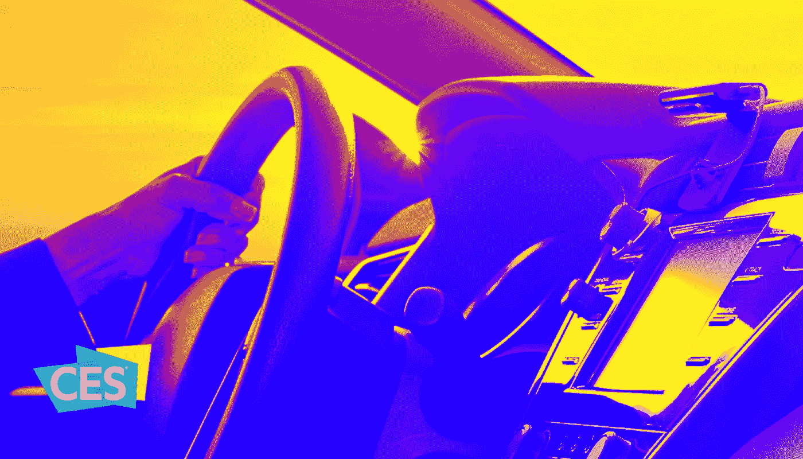

# CES 2020:不断发展的车内体验

> 原文：<https://medium.datadriveninvestor.com/ces-2020-evolving-in-car-experiences-f5a0187cf932?source=collection_archive---------10----------------------->

一年一度的[拉斯维加斯 CES 活动](https://www.ces.tech/)刚刚开始，亚马逊就在[发布了一项重大公告](https://blog.aboutamazon.com/devices/new-automotive-products-and-solutions-at-ces-2020)，暗示了语音优先的世界:新的基于语音的产品和解决方案将鼓励汽车中的语音/对话商务。这个消息尤其及时，据凯捷称，预计到 2022 年，近 95%的消费者将在汽车中使用基于语音的数字助理(如 Alexa)。

据亚马逊称，2020 年即将推出的新功能将使司机更容易从他们的汽车上购物。根据亚马逊:

> 今年晚些时候，客户将能够说，“Alexa，支付汽油费”，轻松地在所有 11，500 个埃克森和美孚加油站购买燃料。这项 Alexa 新功能的交易是通过亚马逊支付进行的，由全球金融服务技术提供商 Fiserv 提供支持。

此前，亚马逊与埃克森美孚在 2019 年建立了关系，允许司机使用语音命令在美国超过 11，500 个埃克森和移动加油站支付汽油费。现在，在 2020 年，在车载信息娱乐系统中安装了 Alexa 的司机(或使用 Echo Auto 智能扬声器或其他支持 Alexa 的设备，包括智能手机)将能够使用这项服务。

 [## 不管准备好了没有，革命就在我们面前|数据驱动的投资者

### “对于技术如何影响我们的生活和重塑经济，我们必须形成全面的全球共识……

www.datadriveninvestor.com](https://www.datadriveninvestor.com/2019/02/12/ready-or-not-the-revolution-is-upon-us/) 

# **亚马逊、苹果、谷歌汽车之战**

这一消息是亚马逊、苹果和谷歌之间争夺汽车语音激活体验的重大进展。近年来，每家公司都发布了关于在汽车上安装语音助手的公告。在很大程度上，三大技术专家专注于与汽车制造商建立关系，将他们自己的语音助手(Alexa、Siri 和谷歌助手)嵌入汽车驾驶体验。

苹果和谷歌一直依赖于他们并不秘密的武器，苹果地图和谷歌地图，作为他们语音助手的入门产品。这些导航应用程序对苹果和谷歌来说是天赐之物，因为语音正变得越来越完整，可以更安全、更方便地在我们的汽车中行驶。

使用 Siri 和谷歌助手导航让苹果和谷歌更加无处不在，并为这些公司提供有价值的消费者使用数据。([正如零售跳水](https://www.retaildive.com/news/amazon-broadens-in-car-services-with-major-alexa-expansion/569946/)中提到的，“据[咨询公司麦肯锡](https://www.mckinsey.com/industries/automotive-and-assembly/our-insights/monetizing-car-data)估计，到 2030 年，联网汽车的数据货币化将成为 7500 亿美元的产业，包括向消费者直接营销产品和服务，以及销售数据和定向广告。”)

反过来，汽车制造商可以为客户提供语音优先的解决方案，使汽车所有权更具吸引力——这在美国汽车销售停滞不前的时候至关重要。

# **亚马逊的王牌**

亚马逊的解决办法是推出 [Echo Auto](https://www.amazon.com/Echo-Auto-Add-Alexa-your/dp/B07VTK654B) ，这使得人们有可能绕过 Siri 和谷歌助手[，在苹果的 iOS 和谷歌的 Android 操作系统中使用 Alexa 进行导航](https://www.amazon.com/gp/help/customer/display.html/ref=hp_200127470_echo_auto_img?nodeId=GGQNAZAQA5KAMVKH)。但是亚马逊真正的王牌是让从我们的车上买东西变得更容易。在很大程度上，人们继续使用他们的声音来做简单的命令，如导航或寻找企业的位置。但通过与埃克森美孚的关系及其 CES 公告，亚马逊将自己置于驾驶员的位置，以鼓励来自汽车的实际商业。

亚马逊还发布了其他几项声明，以加强其对汽车体验的控制，包括与凯迪拉克和 ZeroLight(提供汽车配置软件)的关系，以展示以凯迪拉克 XT6 为特色的新的购车概念；请记住，这是除了与其他主要汽车制造商的合作伙伴关系，将 Alexa 语音助手带到福特，奥迪，宝马和丰田的新车型上。这种关系建立在亚马逊的云平台亚马逊网络服务(AWS)之上。据亚马逊称，“该展厅使用一系列引人入胜的个性化数字体验来指导客户完成购车的每个阶段。”[我们经常争辩说](http://www.moonshotio.com/2017/12/01/amazon-strengthens-super-platform/)亚马逊一直在建立一个支持语音的超级平台，利用 Alexa 和 AWS 的力量。在这里，我们看到亚马逊将这个平台扩展到了汽车领域。

根据凯捷的数据，2020 年，预计苹果和谷歌将以同样的方式做出回应，因为 62%的消费者更喜欢拥有相同的数字助理来集成他们的汽车、家庭和移动设备体验。汽车与(语音/对话)商务的结合将是一场激动人心的竞赛，参与者众多:科技公司、零售商，最重要的是消费者。