# 实施 QANet 模型面临的挑战及其解决方案。

> 原文：<https://medium.datadriveninvestor.com/challenges-faced-while-implementing-the-qanet-model-and-its-solutions-1e9d17c3b563?source=collection_archive---------7----------------------->

嗨，我所有的深度学习爱好者们。

最近，我使用 SQuAD 数据集实现了问答系统的 QANet 模型。并在实施过程中面临许多挑战。

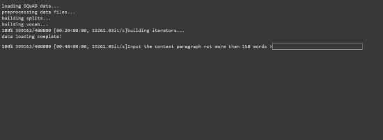

Demo :- Question Answering system.

我不打算解释我是如何实现这个模型的。

但是我将向您介绍我解决问题和优化模型的步骤。

单独解释优化过程的主要原因如下。

1.在*如何使用 Pytorch* 实现 QANet 中有很多资料。但是，当我在实现模型时遇到一些问题时，几乎没有可用的材料来纠正这些问题，我花了很多天的时间来研究解决这个问题，但是没有一个问题是在一个地方解决的。

2.如何减少 QANet 模型的内存大小？

3.如何有效降低损耗值？

# **QA net 模型介绍**

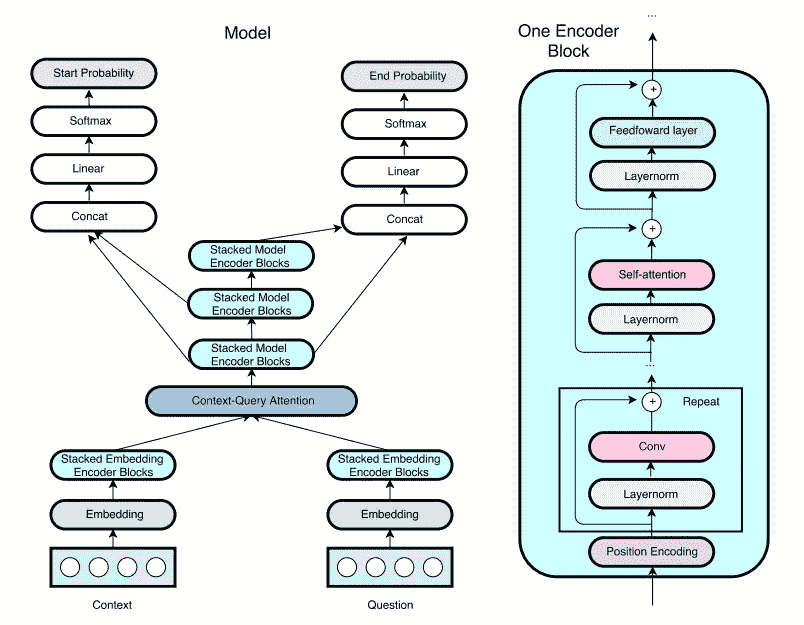

QANet 模型是使用**BIDAF**(**BID**directional**A**tten tion**F**low)方法的变压器版本。
顾名思义，BIDAF 模型主要被构建为使用不仅从上下文到问题，而且从问题到上下文的注意流机制。

在传统的问答系统中，注意力流仅用于从问题到上下文。但在这里，它是双向的。

这种基线 BIDAF 方法最初仅被建议用于 RNNs (LSTM)网络，但是为了利用变压器的计算和并行处理能力，相同的方法后来被扩展到变压器。

许多 QANet 模型在斯坦福官网的 SQuAD 数据集的评分板上领先，直到 BERT 模型的出现，基本上超越了所有其他模型。

我使用了来自这些 GITHUB 链接的一些补充功能的代码。但是我基本上是从头开始写模型框架部分和其他功能的代码。

1.  [*比达夫 LSTM 模型*](https://github.com/galsang/BiDAF-pytorch)
2.  [*变压器*](https://github.com/SamLynnEvans/Transformer)

现在我们直接进入我在实现模型时所面临的问题。

# 挑战 1

大多数试图从研究论文中实现模型的人都经历过这种情况。

> “我们从哪里开始？”。

我的建议是开始为模型的基本结构编写代码，包括更大的组件，比如模型编码器、多头注意力等等..,

为这些组件指定一个对象名，并给出模型的基本结构。不要担心那些单个组件或其他子组件的代码，我们稍后会处理它。

一旦模型的基本结构形成。然后开始为每个组件及其子组件编写代码，因此基本的**自底向上的方法在这个场景中是有效的。**

# 挑战 2

## 内存不足问题

一旦我完成了编码部分，模型就用正确的尺寸正确地初始化了。

我在模型运行时遇到了一个大问题 ***内存不足*** 。

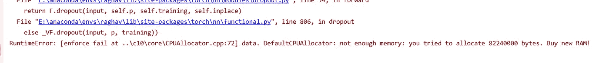

Out of Memory error

发生这个错误是因为内存的整体执行大小超过了你的 RAM 内存大小，
当你使用像 SQuAD 2.0 这样的大型数据集时，这些模型会变得非常庞大。

> 相信我，我有一个 16GB 的内存在我的电脑中，但仍然“内存不足”的错误抛出。即使使用 Google colab 提供的 GPU，我也面临着同样的问题。

所以每当我们面对这个问题时，第一步就是找出程序的哪个部分消耗了更多的内存。
在这种情况下，我们确实有一个基本的想法，即由于数据集规模巨大，数据集处理可能会消耗更多内存。

解决这个问题最简单的方法是**减少数据集的大小**，因此我们也可以减少模型的大小。

但是变压器模型通常是一个数据饥渴模型，为了让它有效地学习，我们需要给它提供更大的数据集。

所以我决定不改变数据集的大小，而是希望减少处理的大小。

但是万一你不确定哪个进程占用更多的 RAM 空间，我遵循的最简单的方法是在模型中的每个主要组件后添加一个 print 语句并运行程序。

在 Windows 中打开任务管理器(ctrl + shift + Esc ),然后单击性能选项卡检查 RAM 的内存使用情况。

由此我们可以很容易地找出哪个进程使用了更多的 RAM 内存，因为它会在那个特定的进程上稳步增加。

 [## 一瞬间学会数据科学！？数据驱动的投资者

### 在我之前的职业生涯中，我是一名训练有素的古典钢琴家。还记得那些声称你可以…

www.datadriveninvestor.com](https://www.datadriveninvestor.com/2020/07/23/learn-data-science-in-a-flash/) 

## 解决方案 1

所以第一步是把组件分成尽可能多的子模块。
一旦对象或内存失去作用域，Python 就会释放对象或变量的内存。
所以把程序分成小函数的好处是，一旦函数的执行结束，函数内部所有的变量/对象内存都被释放。
同时也提高了函数的可读性和可重用性。

## 解决方案 2:-

在实现了解决方案 1 之后，几乎没有什么不同。我仍然面临着内存不足的问题。然后我开始手动释放变量的内存，这将是一个巨大的数据，但不会在程序中使用。

为了实现这个解决方案，我使用了下面的函数，

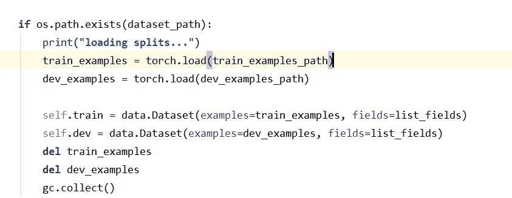

Usage of del and gc.collect() in code as an example

**del 和 gc.collect()**

**del** 功能将删除变量。

**gc.collect()** 会释放那个被删除变量的内存。

> 注意:-
> 不要在模型中使用这个 del 和 gc.collect()，这样做不仅会释放张量/变量的值，还会释放张量的梯度，
> 导致模型具有不稳定的梯度下降，并且还会显著增加执行时间超过 200%。我在这里使用过这个函数，只是在数据处理阶段。

如果你想了解更多关于 python 中垃圾回收的知识。点击查看

我真的用了将近一周的时间来解决这个问题。相信我，用这个会让你免除很多痛苦。

## **解决方案 3:-**

检查具有许多迭代的过程，如果您正在处理巨大的数据集，这将导致内存增加。
在这个 QANet 中，我们结合了预训练的单词嵌入(手套向量)和字符嵌入。

对于字符嵌入，我们使用 2D 卷积神经网络将其与单词嵌入相结合。所以这个 2D 卷积将对上下文和问题中的每一个字母进行。因此，这个 2D 卷积将具有最大的迭代次数和处理时间。

将 2D CNN 改为 1D 深度方向可分离 CNN 减小了模型的尺寸。
我们将在下一部分讨论这种 1D 深度可分离 CNN，因为这种解决方案也减少了执行时间并提高了性能。

在应用了所有这 3 个解决方案之后，我能够使用批量大小为 50 的 GPU 运行程序，而没有任何内存不足的错误。

# 挑战 3

## 模型的执行时间很长

我使用批量为 50 的 GPU 使用 Google colab 运行模型。

但是对于每 100 个批次，即使在使用 GPU 之后，也要花费近 10 分钟，并且几乎有 1200 个批次，每个批次大小为每个时期 50 个。

所以每个时期需要将近 2 个小时。Google colab 一天只提供 12 小时的 GPU 运行时间。
因此，即使将纪元保持为 8，我也无法及时运行模型。
一旦你在代码中遇到问题
或者在某个地方失败，或者你想对代码进行修改，你的一整天都会被浪费掉。

## 解决方案 1

Pytorch 为您提供了**torch . autograded . profiler . profile()**函数，该函数有助于分析模型中运行的流程，以及每个流程花费的时间和运行的次数。

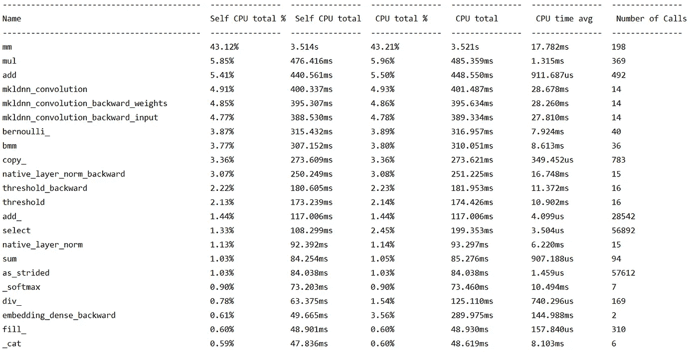

通过在如上所述的分析器下实现模型，我们能够发现哪个进程花费了很多时间。
我们可以寻找一种替代的内存高效方式来实现相同的过程。

**例如:-** 正如我在之前的挑战中提到的，将 2D 卷积网络更改为内存高效的 1D 深度可分离卷积网络增加了处理时间，同时也大大减少了内存大小。

要了解更多关于深度可分卷积
网络的信息，请点击[这里](https://www.geeksforgeeks.org/depth-wise-separable-convolutional-neural-networks/)

你也可以在这里查看**torch . autograded . profiler . profile()**[的实现。](https://gist.github.com/XinDongol/fe066cb76e1c5238ecbc0cb729806410)

## 解决方案 2

有时，您可能需要利用模型的准确性来平衡速度和性能。
所以从这个意义上来说，我们可以减少模型的维度来减少模型的整体执行时间。

因此，选择可以减少执行时间的单词和字符维数，但同时，准确性不会在很大程度上降低。

# 挑战 4

## 反向推进期间每个历元损失值的波动。

应用上述解决方案后，内存和性能问题得到了解决。但是我的损失非常巨大，如下图所示。

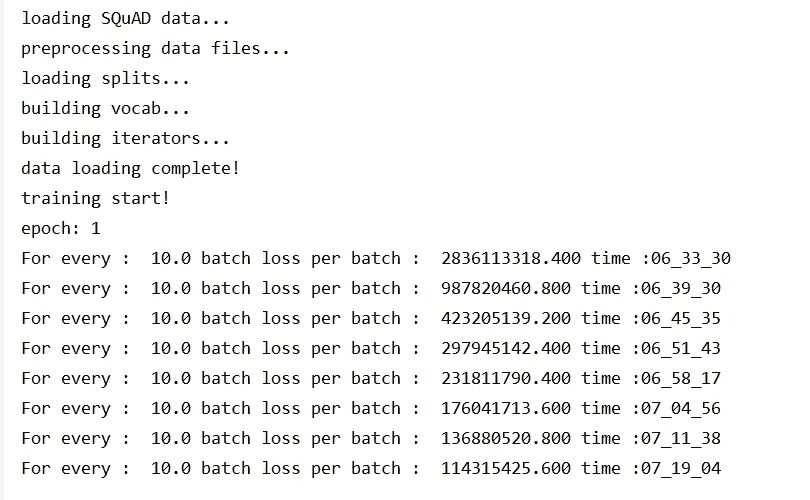

Higher Loss values

即使在将时期增加到 12 个之后，损失值仍然非常高，这是不寻常的。
损失值也没有减少，因为学习任何东西都更加不稳定。

## 减少损失价值波动的解决方案:-

我改变了基线 BIDAF 文件中给出的 Adadelta 优化器，用 ADAM 优化器
代替了它，并删除了 EMA(指数移动平均线)模块。波动略有减少，但差异可以忽略不计。

所以我做了很长时间的研究来找出这种行为的根源。

通过一层一层地仔细检查代码，我能够确定代码中的问题。

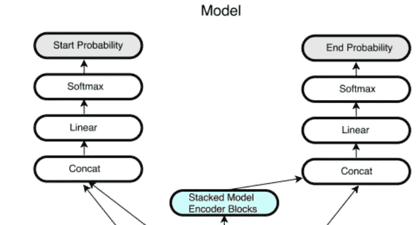

Fully connected layer.

基本上，QANet 论文希望在全连接层的末端有 softmax 函数。
但是在末尾有一个软最大值并将该值输入到交叉熵损失函数会产生反效果。

交叉熵损失是 softmax 和 NLL 损失的组合，因此我们只需要传递来自全连接层的原始逻辑。

移除 softmax 功能后，损耗在每个历元后开始下降，没有波动。

唷！！！

## 降低巨大损失价值的解决方案:-

在逐行分析和调试代码之后，我能够在程序中找到这种行为的根本原因。

在一个助手函数中，我从参考 transformer 模型代码中使用了这个函数，其中有一个模块叫做位置编码模块。

在该模块中，它将输入值放大维数的平方根。

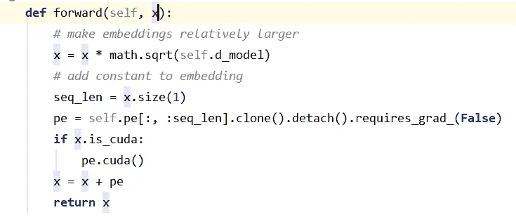

如果是嵌入层，这没问题，因为嵌入层的值会很低。并且其值的增加只会提高性能。

但是，当您在编码器模块中使用相同的函数时，其末端尺寸可能高达字尺寸的 16 倍，
在我的例子中，字尺寸是 100，1600 的平方根是 40，这对于放大来说是一个巨大的值。

我修改了这个函数，将这个放大限制在嵌入层，而在模型编码器层，这个将被忽略。

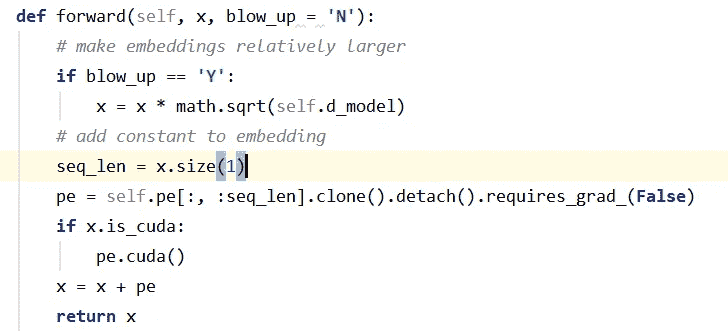

在这里提到这个代码问题的原因是，这个问题并不总是模型方面或实现方面的问题，但有时可能是由于我们可能忽略的一些基本问题。所以也要经常检查那些微小的事情，它们有时可能是更大问题的原因。

所以在代码中做了上述修改后，我的模型开始有一个正常的损失值，如下所示，在第一个时期，这确实是一个巨大的解脱。

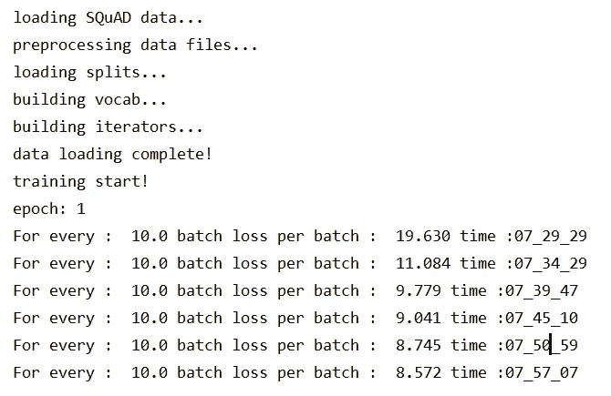

在实施了上述所有解决方案后，我的 EM 分数达到了 37.534，F1 分数达到了 49.802。

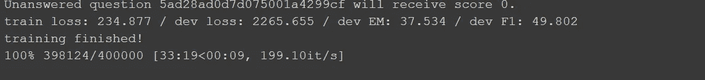

EM and F1 score.

与基线纸相比，它仍然是平均 F1 和 EM 分数。但是基线 QANet 论文要求字嵌入维度值为 300
并且 7 个堆叠编码器被用作模型编码器，而我在模型编码器中仅使用了 100 个维度和 4 个堆叠编码器。
为了减少训练时间，最大上下文长度保持在 150。

因为实现这样一个庞大的模型需要高 RAM 内存的 GPU，并且应该有利用更长处理时间的设施。
凭借 Google colab 提供的 12 小时 GPU 时间，我只能实现一个更轻便的模型。

无论如何，这个实现背后的意图，是学习和研究如何与庞大的数据集和庞大的模型大小的变压器工作。
从这个意义上说，它给了我很大的教训，将有助于我未来的努力。

尽管这让我有点抓狂，而且花了几周时间才完成这个项目。

最终结果令人满意！！！！。

我希望我的错误和解决方案给你一个想法，在实施研究论文时会有什么期望。
以及如何在实施过程中克服问题。

点击这里查看我在 GITHUB [中的全部代码](https://github.com/iam-Raghav/QANet-QuestionAndanswering-system)

喜欢就鼓掌，喜欢就评论。

和平！！！！

**访问专家视图—** [**订阅 DDI 英特尔**](https://datadriveninvestor.com/ddi-intel)