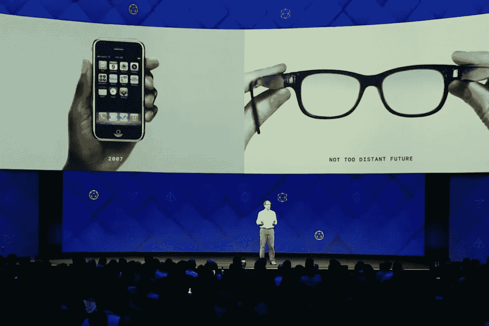

# 增强现实眼镜走向主流的挑战

> 原文：<https://medium.datadriveninvestor.com/challenges-for-augmented-reality-glasses-to-go-mainstream-bd8a48a77289?source=collection_archive---------8----------------------->

根据 Abrash 的说法，AR 眼镜可能会在 2030-2040 年取代智能手机

Oculus R&D 首席科学家 Michael Abrash 认为，AR 眼镜可能会在 5-10 年内成为主流。然而，要达到和太阳镜一样好并取代它们，还需要一二十年的时间。

 [## 人工智能和虚拟现实的融合-你能期待什么|数据驱动的投资者

### 在技术领域，融合是合乎逻辑的一步。就在几十年前，你可能需要一个专门的…

www.datadriveninvestor.com](https://www.datadriveninvestor.com/2018/08/30/the-convergence-of-ai-rv-what-you-can-expect/) 

> 为此，我们需要许多技术突破，同时，最有可能的方法是 **AR 眼镜将补充智能手机的功能，而不是取代它们**。—迈克尔·阿布拉什

据他所说，以下是 AR 眼镜面临的主要挑战

*   社会接受度——当前 AR/MR 眼镜的形状因素使得外行人经常会被佩戴者冒犯。当前的形状总是让它看起来好像对话是通过一个设备进行的，而机器是在看着你而不是人。
*   人体工程学——如果佩戴者不能佩戴超过一个小时，他们很可能不会被使用。要成为主流，它需要像太阳镜一样简单、轻便和时尚。句号。
*   人工智能和 BCI(脑机接口)——AR 眼镜不仅仅是为了在高科技实验室里佩戴。主流就是大众。而且在公共场所语音接口也不合适。想象一下每个人在路上喃喃自语。手势很烦人，还记得大猩猩手臂综合症吗？控制器可以在室内工作，而不是在室外。因此，需要有一种方法让眼镜知道用户的意图。也许 BCI 就是答案。这就回答了脸书收购 Ctrl+Labs 的问题。
*   用户体验(UX)—AR 内容的设计需要考虑媒体的空间方面。我的 [sketchnote](https://medium.com/@kumar.ahir/sketchnote-designing-ar-applications-google-i-o-2019-140d75ede700) 稍微谈到了这一点。逼真、逼真和沉浸感将推动 AR 内容的成功。

[*Kumar Ahir*](https://www.kumarahir.com/) *是一名独立顾问，从事沉浸式技术、产品设计、设计领导力和战略领域的工作。他正在通过积极举办关于设计思维、AR 和 VR 设计、混合现实技术原型制作的研讨会，传播沉浸式技术和 UX 的设计。*

他的目标是为沉浸式技术创造一个更好的设计生态系统。

*在*[*【KumarAhir.com】*](https://www.kumarahir.com/)*[*LinkedIn*](https://www.linkedin.com/in/kumarahir)*[*Twitter*](https://twitter.com/kernel_kumar)**