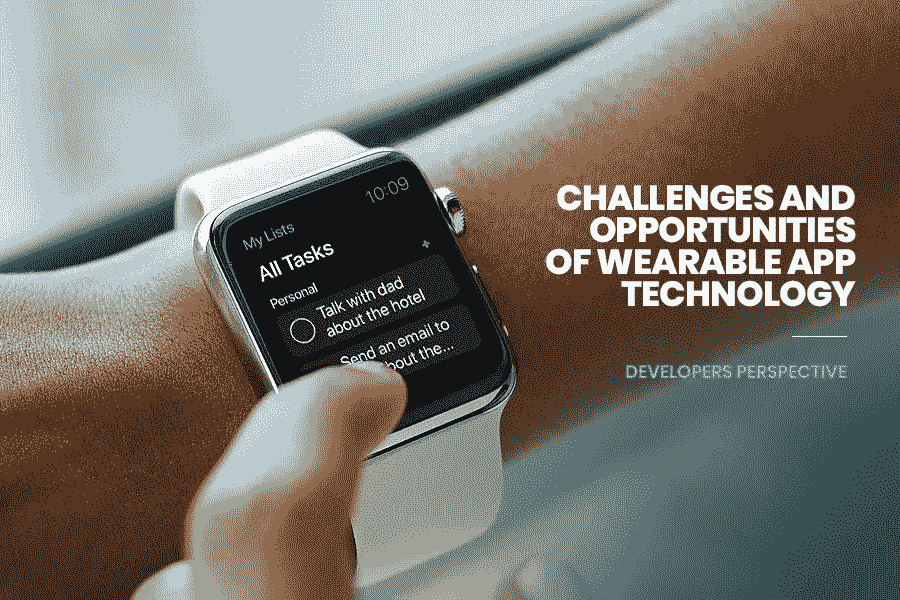

# 可穿戴应用技术的挑战和机遇——开发者视角

> 原文：<https://medium.datadriveninvestor.com/challenges-opportunities-of-wearable-app-technology-developers-perspective-700e817968ad?source=collection_archive---------16----------------------->

今天，在技术驱动的世界里，最新的技术与你的穿着息息相关。

可穿戴技术的出现点燃了人们对其相关性和重要方面前景的好奇——客户、企业和 [**应用开发公司**](https://www.xicom.ae/services/mobile-app-development/) 。

近年来，可穿戴技术(也称为可穿戴设备)的使用激增，并且由于其为客户提供的便利性，预计将会增长。

尽管目前客户很少在智能手机上使用可穿戴设备以及配套应用或设备，但他们将开始期待可穿戴设备成为智能手机和许多其他配套设备的替代品。

见证显著的增长为领先的技术先行者，如企业和客户，吸引了更多的可穿戴发展机会:

*   客户——寻找有形性和流动性，以及
*   业务—追求效率。
*   如果你仍然对可穿戴技术持悲观态度，那么是时候一窥统计数据了。
*   仅健身追踪器一项，可穿戴解决方案就几乎覆盖了 6 亿美元的市场。
*   可穿戴市场前景广阔，因为全球联网可穿戴设备的数量预计将在 2022 年达到 11 亿台，而电信技术正在从 4G 转向 5G。

尽管有这些有利的数据，可穿戴应用的开发并不像看起来那么容易。幸运的是，迪拜领先的 [**移动应用开发公司**](https://www.xicom.ae/services/mobile-app-development/) 正在克服可穿戴开发过程中的所有技术障碍。因为有许多平台可用于具有最少网络功能的可穿戴设备，但应用程序开发滞后，因为迪拜的[应用程序开发人员面临异议](https://www.xicom.ae/services/mobile-app-developers/)。

随着观众开始广泛使用可穿戴技术，他们希望各种应用都能与所有智能设备融合。这给以下领域的熟练应用程序开发人员带来了挑战和机遇。

但是，在开始应对挑战和解决方案之前，了解可穿戴应用技术的所有诀窍至关重要。

# 可穿戴应用技术——领先一步之前

可穿戴技术是一系列电子设备，可以作为附件佩戴，嵌入衣服，包含在用户体内，甚至纹在皮肤上。这些设备是具有实际用途的免提装置，由微处理器动态供电，并增强了通过互联网发送和接收数据的能力。

此类设备的显著增长已经在可穿戴技术领域，特别是在物联网(物联网)的前沿领域创造了一个利基市场。

# 可穿戴应用技术的工作原理

顾名思义，可穿戴技术据说自 13 世纪首次开发眼镜以来就存在了。在历史上，大约从 1500 年开始，小到可以佩戴的钟表就已经出现了。

然而，现代可穿戴技术被定义为结合了微处理器和互联网连接。

不可否认，移动网络的发展推动了可穿戴技术的发展。健身活动追踪器是可穿戴技术向消费者普及迈出的第一大步。接下来是腕带、蓝牙耳机和联网眼镜，允许人们从 Wi-Fi 网络接收和发送数据。

令人惊讶的是，游戏行业正在增加更多由增强现实和虚拟现实耳机等新兴技术支持的可穿戴设备。

因此，如果你是他们中的一员，想在繁荣的等级制度中塑造自己的名字，你需要做的就是在迪拜雇佣合适的 [**移动应用开发者**](https://www.xicom.ae/services/mobile-app-developers/) 。尤其是那些准备好克服可穿戴技术挑战的人，他们将帮助您的项目取得成功。

## 1.用户界面

用户界面是在后端和用户之间建立联系的一个重要方面。

但是，在可穿戴设备中，可能没有显示屏，或者显示屏很小，UI 元素无法拥挤，没有太多空间放置动画图标。相反，它应该具有吸引力并且易于操作。

因此，基于语音的命令可以更好地避免用户在小屏幕上的交互——他们配置的回复来电的手势，一个基于触摸的图标。通知以振动或声音的形式提供。

在开始项目之前，专业人员应该考虑这样一个事实，可穿戴设备是为了更快的交互和汇总信息。

为可穿戴设备制作和设计 UX 是最大的挑战。考虑到，屏幕尺寸小，开发一个 app 需要注意以下参数。

## 2.UX 设计

多种形状因素(圆形、椭圆形、方形等)。

*   显示屏尺寸可能会有所不同。
*   彩色和黑白显示器。
*   没有混乱的用户界面。
*   支持不同的平台。
*   屏幕上的图标设计能有效地向用户传达简洁的信息。

就 RTOS、Linux、Android 和 iOS 等操作系统而言，可穿戴设备行业是分散的。应用程序的开发必须考虑到这一特点，以便可移植性高，产生最佳的投资回报。目前，还没有一个混合应用程序开发框架来帮助构建可以在任何平台上运行的应用程序。

因此，在迪拜寻找精通创建混合应用程序的专家，他们是 iOS 和 [**Android 应用程序开发的奇才。**](https://www.xicom.ae/services/android-app-development/)

## 3.线段阵列

在目前的场景中，可穿戴设备已经渗透到几个细分市场，如医疗保健、生活方式、会计和金融、公共部门(包括警察)、工业等等。

随着创新速度的加快，人们迫切需要快速开发应用程序。创建应用程序的核心原因是为了占领更大的市场份额。

通常，开发过程伴随着工具可用性的挑战，如 UX 设计，IDE 产生的代码行覆盖通用代码，并允许开发人员改变或修改任何特定的逻辑。

## 4.最低功耗要求

如您所知，可穿戴设备依靠电池运行，消费者希望电池能够存活几周/几个月，甚至一年。

因此，对于开发人员来说，设计和开发功耗要求最低的可穿戴应用程序是一项艰巨的任务。这个过程包括避免在后台运行电池消耗功能，在不使用时关闭屏幕，以及使用平台提供的优化方法(对于 Android 来说是 Doze)。

## 5.安全性和隐私

安全性和关注度是开发任何 app 的两个决定性因素。

幸运的是，迪拜的 [**应用程序开发公司**](https://www.xicom.ae/services/mobile-app-development/) 首先考虑的是这一点。需要实施安全机制来保护关键数据，尤其是在财务和会计部门以及医疗保健行业。

## 6.与配套设备配对

伴侣设备将在大多数时候通过蓝牙技术与可穿戴设备通信。因此，不可否认的是，这两种设备的连接性和邻近性非常重要。

因此，如果配套设备超出范围，应该有一种机制来确保数据备份和传输。而且，为了不给错误留下空间，在迪拜 与 Android 和 [**iPhone 应用程序开发的技术专家合作是强制性的。**](https://www.xicom.ae/services/iphone-app-development/)

## 7.内存可用性低

由于成本和外形尺寸要求，可用内存将会减少。因此，应用程序需要设计为消耗尽可能少的内存(文件系统空间和 RAM)。

## 8.应用升级

如果用户想要升级他们现有的应用程序，以便继续使用相同的应用程序，该怎么办？

如果该功能过时了怎么办？

很简单，用户会卸载阻碍客户留存率、客户满意度下降的 app。因此，一定要与 iOS 应用程序开发公司 保持一致，该公司在技术领域拥有广泛的背景，旗下有几个成功的应用程序。

## 9.API 协议和标准不可用

众所周知，可穿戴应用开发是移动驱动时代最近开始的趋势之一。

因此，开发人员在他们的编码标准中会遇到特定的挑战。因此，不同的应用程序在某些特定设备上运行时会出现一些失误。

为了在许多其他设备和新平台上运行和操作应用程序，需要对 API 进行修改。它们需要为特定设备开发不同的 API，因为协议和编码参数不是预定义的。

因此，开发人员必须了解新兴技术。此外，要求 API 使应用程序与所有设备兼容，并通过使应用程序为未来做好准备来确保未来几年的成功。

**最后..**我们可以说“发展挑战促进创造性的问题解决”。

此外，在可穿戴设备大行其道的领域，还有什么比 Xicom Technologies 更好的合作伙伴来制作您的 nook 呢？他们的专家是技术奇才，特别是围绕可穿戴技术产生了两者的创造力激增——以客户为中心的业务和迪拜的 Android 和 iPhone 应用程序开发。

他们的团队通过实验已知的平台和技术，如腕带、智能手表、眼镜和服装，激发了 next 的灵感。作为技术世界的领跑者，他们的商业战略解决方案以创新的发展融合来迎合客户特定和独特的需求。

最后一个阶段“主要挑战来自开发参数”

根据专家的说法，关于客户如何、何时以及为了什么使用可穿戴技术的研究和信息的滞后起草了领先的发展异议。

作为最好的移动 [**应用程序开发公司**](https://www.xicom.ae/services/mobile-app-development/) ，Xicom 坚持为未来提供更好的技术和平台功能，这些都更容易解决。

因为早期的可穿戴应用程序已经开始提供有价值的课程，从而洞察他们的策略、方法和程序。现在是获得 [**免费评估**](https://www.xicom.ae/contact/) **的时候了，随着新的和更新的平台进入可穿戴设备领域，这将是一个竞争优势。**

*原载于 2020 年 3 月 13 日*[*https://www . xicom . AE*](https://www.xicom.ae/blog/challenges-opportunities-of-wearable-app-technology-developers-perspective/)*。*