# 后冠状病毒时代相对竞争力的变化:个人、行业和国家层面的思考

> 原文：<https://medium.datadriveninvestor.com/change-in-relative-competitiveness-post-coronavirus-individual-industry-and-country-level-fcb4af970f2f?source=collection_archive---------24----------------------->

Photo by [Felix Mittermeier](https://unsplash.com/@felix_mittermeier?utm_source=medium&utm_medium=referral) on [Unsplash](https://unsplash.com?utm_source=medium&utm_medium=referral)

**第一部分:个人等级效果**

冠状病毒事件会影响国家、公司和个人的相对竞争力吗？如果是，我们如何衡量这一点？我们怎样才能对这个问题做出至少一些合理的预测呢？

自下而上，个人定位将受到以下因素的影响:

个人的知识基础(a)

个人的经济组织(公司、组织等)(b)

个人的国家或相关上层建筑

全球发展(d)

有时被称为运气的古老的随机因素

虽然有时是最有效的，但让我们忽略随机事件和/或运气的影响，因为它很难量化但对所有其他因素都有效。基于这些因素的个人竞争力方程式如下:

((a x w1) x (b x w2) x (c x w3) x (d x w4) ) x e

在这个等式中，w 数字代表每个因素的相对权重，e 是整体效应。

为了正确理解这一点，让我们举三个实际例子。约翰是市中心一家繁忙餐馆的服务员，玛丽是一家视频会议公司的软件工程师，莎拉是一名重症监护专家的护士。对于这个例子，让我们把它们都放在伦敦。

 [## 危机？风投适应的 3 种方式|数据驱动的投资者

### 当我写这篇文章的时候，一场全球性的危机正在发生。这不是第一次，也不会是最后一次。很多事情已经…

www.datadriveninvestor.com](https://www.datadriveninvestor.com/2020/03/22/crisis-3-ways-vcs-adapt/) 

对于约翰:

约翰正在从事一项普通的工作，这项工作的工人可复制性高，进入门槛低。在 100 分的排名中，他的工作(a)得了 20 分。

餐饮业受到的冲击相对较大，但随着几个月后限制的放松，预计会出现明显的复苏(尽管在一些竞争对手退出的情况下，可能不会达到以前的水平)。在 100 分的排名中，餐饮业得分为 70 (b)。

我的假设是，英国和伦敦在疫情期间以及之后的表现不会产生实质性的正面或负面影响。因此，作为主要的全球位置之一，评级将为 100。

然而，随着全球旅游需求的下降，黄金地段的地位将受到负面影响，即使持续时间较短。这个因素的评分也是 70 分。(四)

单就约翰而言，这一特定业务领域最重要的因素如下:约翰的业绩 w1 (30%)，特定业务 w2 (40%)，w3 和 w4 各获得 15%。

对于玛丽:

玛丽现在有一份全球需求量很大的专业工作。在 100 分的排名中，这份工作(a)她得了 80 分。

视频会议软件正在经历一个繁荣期。在 100 的排名中，她的部门得到 100 (b)。

伦敦或任何其他城市都不是这个行业唯一定义竞争特征的城市，排名是 60。

全球对视频会议的需求很高，并有望上升。然而，激烈的竞争降低了这一评级。这个因素的评分也是 80 分。(四)

对于 Mary 来说，这个特定业务领域中最重要的因素如下:Mary 的业绩 w1 (30%)，特定业务 w2 (35%)，w3 最低获得 5%，w4 获得 30%。

给莎拉的:

莎拉现在有一份全球需求量很大的专业工作。在 100 分的排名中，这份工作(a)她得了 90 分。

萨拉工作的医院现在处于最前线，其他医院可能会聘用她。在 100 的排名中，她的部门得到 100 (b)。

伦敦作为一个大城市，相对来说更有活力，莎拉的工作机会也更多。

未来两年，全球需求仍将非常高，而且可能与国家流行病规划保持同步。但是，这个职业有一个很大的个人健康风险因素:80 (d)。

对于 Sarah 来说，这一特定业务领域中最重要的因素如下:Sarah 的业绩 w1 (15%)、特定业务 w2 (40%)、w3 获得 15%、w4 获得 30%。

如果我们将输入列表，这就是汇总输出:

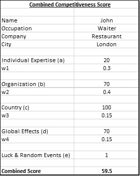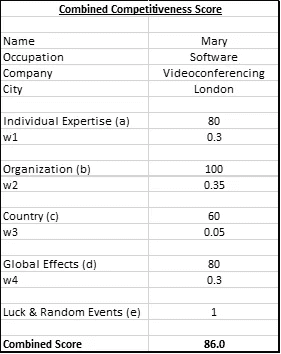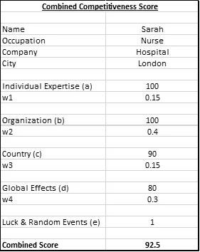

基于输出，可以做出以下推论:

每种职业以及从事这种职业的背景和全球趋势都需要不同的权重来分析。

不同工作的竞争力有明显差异。

然而，这是一个动态分析，因为有利或不利的因素会发生变化。例如，在像今天这样的高需求情况下，护士的表现不如他/她是护士这一事实重要。这种因素将正常化，在正常化的情况下，对性能的强调将占更大的比重。

总之，在冠状病毒发作之前，我们都知道不同的职业有不同的吸引力和竞争力。然而，冠状病毒放大了一些专业知识和部门。虽然这些影响中的大部分将随着时间的推移而正常化，但某些特别与数字专业知识相关的技能组合的流行以及对新工作模式的适应将发挥更大的作用。再加上总体商业周期的加快，强调新的商业模式(开会前的视频会议、文件远程协作等)，以及部门间相对增长差异的变化，将在不久的将来对个人竞争力产生深远影响。

…

**第二部分:公司/部门级定位**

我准备了一份对各种行业的主观评估，列出了影响所有行业的一些因素，并按照-10 到+10 的等级对它们进行了评级。数据表如下所示。

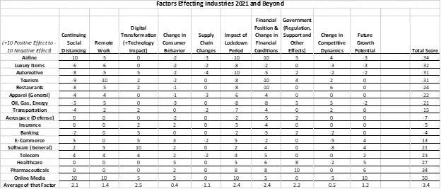

评估的有效性是主观的，我在冠状病毒事件上做的大部分工作，主要是为了促进对这个问题的进一步思考。为此，数据中有各种值得注意的观察结果:

总分存在巨大差异，航空公司、奢侈品、汽车、旅游和餐馆等行业受到重创，而在线媒体、制药、医疗保健、电信和软件受益于这种情况。

这再次证实了本文的前提，即尽管资本主义上层建筑将完好无损，但冠状病毒发作后赢家的相对分布将发生有意义的变化。

各种因素的个别影响值得关注，因为数字化转型和政府干预(大多数以不同的措施提供支持)将在总体上产生积极影响。

该表并未预测长期增长潜力或消费者行为的变化。

然而，正如预期的那样，目前的措施正在并将对某些行业产生重大影响。

…

第三部分:国家一级的竞争力

我研究了 GDP 的变化和每个国家在全球 GDP 中的相对份额，以了解国家一级竞争力的历史变化。虽然可能有其他更好的因素来解释相对竞争力的变化，但在 10 年或更长时间内，GDP 表现将是一个全面的通用指标，反映大多数其他因素的总和。

我们先来看数据。请注意，数据主要来自世界银行，我已经用 Countryeconomy.com 的数据更新了 2019 年的数据。

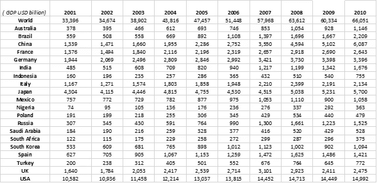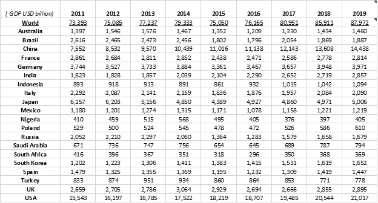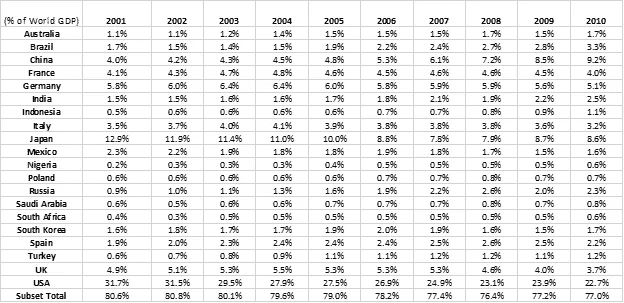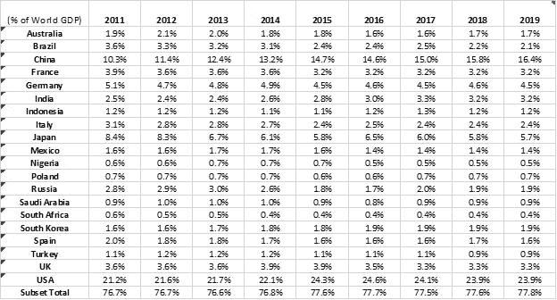

在这一部分，重点将放在历史背景上，前提是当前的条件可以加速历史因素(在相同或相反的轨迹上——但更快)。因此，这是数据显示的一般情况:

从 2001 年到 2019 年，最显著的变化是中国从占世界 GDP 的 4%上升到 16.4%。

印度和一些新兴市场也出现了类似的相对大幅增长，但幅度较小。

在此期间，相对损失主要由美国和日本承担。

然而，一旦我们将范围改为 2009 年至 2019 年，情况就不同了。比如，美国同期占世界 GDP 的 23.9%。中国上升了 7.9%——这次是来自日本和欧洲。

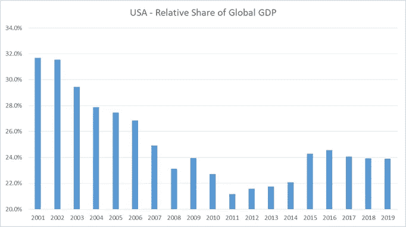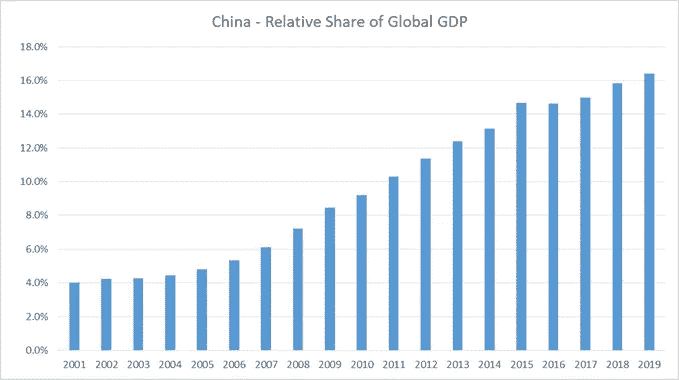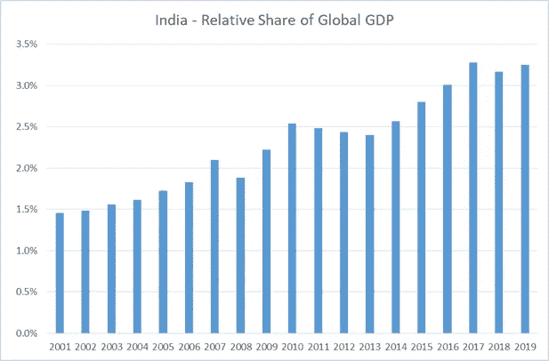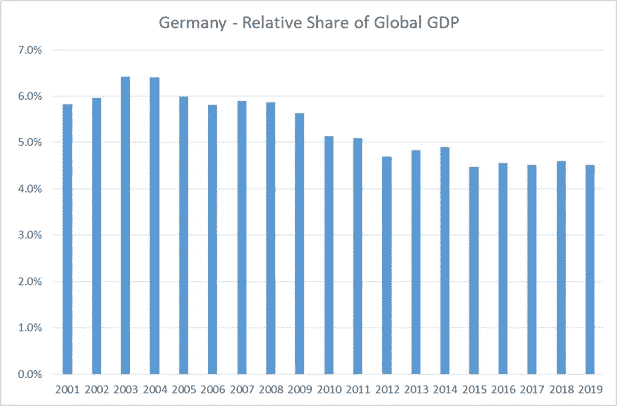

一旦我们着眼于 2017 年至 2019 年这一更近的时期，除了中国之外，全球影响是有限的，仅限于某些具有特定国家潜力或问题的经济体。然而，中国的优势仍在继续。

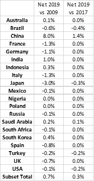

下表基于相同的数据，但显示了不同时期一个国家所占份额的比率。

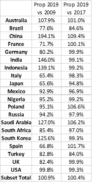

总而言之，个人、部门和公司的竞争地位都将发生重大变化。这三个标题变量的组合可能会对我们每个人产生深远的影响。然而，我预计，这种重大的再分配效应仍将在当前全球经济秩序的总体框架内发生。这种改变还在后面，我们在当前的系统中已经有了足够的改变。

2020 年 4 月