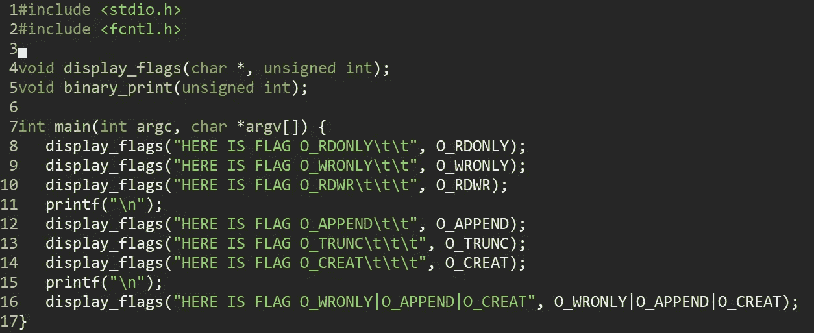
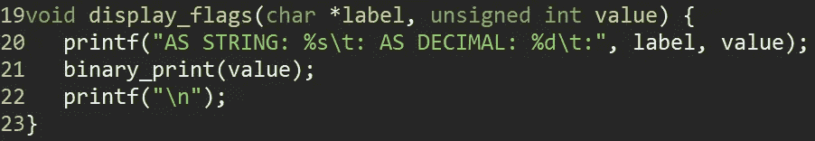
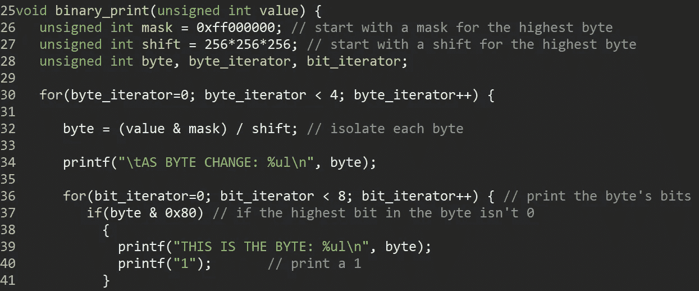
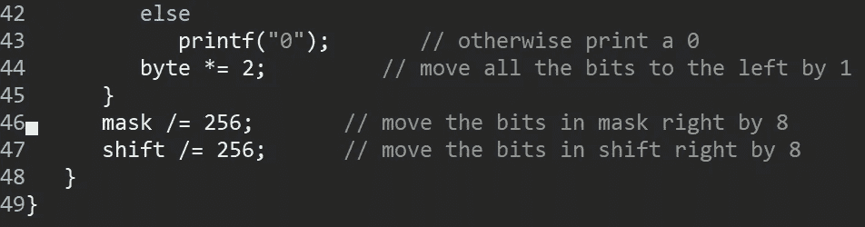
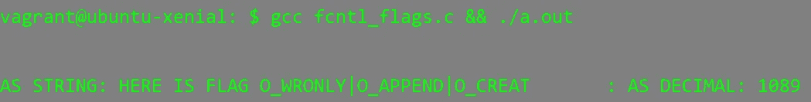

# 用按位运算符更改代码行为

> 原文：<https://medium.datadriveninvestor.com/change-your-codes-behavior-with-bitwise-operators-3055233d0d18?source=collection_archive---------13----------------------->

让我们剖析一个奇怪的位标志程序，它花了我一秒钟的时间来理解。这样做，我们将有望更好地理解位掩码和按位 OR 逻辑如何有效地操作值。

具体来说，我们要看的程序打印了 open()函数(包含在<fcntl.h>库中)中使用的不同访问模式标志的二进制表示。访问模式标志的功能是指定要打开或创建的文件的权限。这些标志具有“对应于单个比特的值”，(*黑客:利用的艺术，*乔恩·埃里克森)，因此，这些标志可以被加在一起(使用 OR 运算符)以创建新的行为。让我们来看看下面的程序:</fcntl.h>

Courtesy of “Hacking: The Art of Exploitation, Jon Erickson”

我第一次看到这个程序时，我不明白它在做什么——所以让我们浏览一下。首先，main()函数将访问模式标志的值发送给 display_flags()函数。

display_flags 函数打印访问模式标志的字符串和十进制值。Display_flags()然后将访问模式标志的十进制值发送到 binary_print()。

 [## 2019 年最值得学习的编码语言|数据驱动的投资者

### 在我读大学的那几年，我跳过了很多次夜游去学习 Java，希望有一天它能帮助我在…

www.datadriveninvestor.com](https://www.datadriveninvestor.com/2019/02/21/best-coding-languages-to-learn-in-2019/) 

Binary_print()有一个内外循环结构。我们使用一个值为 4278190080 的位掩码(“掩码”变量)(这个数字需要 4 个字节)。在二进制中，这个掩码看起来像八个 1 后面跟着二十四个 0:

11111111000000000000000000000000

然后我们有一个值为 16777216 的变量“shift ”,它看起来像一个二进制的 1 后面跟着 24 个 0:

1000000000000000000000000

外层循环运行四次，负责隔离每个字节。外部循环中的第一行代码:

byte =(值&掩码)/shift；

用访问模式标志的值和掩码的值执行按位 AND 运算。然后将结果运算的乘积除以移位，从而只保存最左边的八位。这里有一个例子:

值= 10000000000

mask = 1111111100000000

shift = 100000000

价值

&遮罩

_ _ _ _ _ _ _ _ _ _ _ _ _ _ = 1000000000/shift = 00000100

在这种情况下，字节变量将保存值 4。

一旦我们分离出每个字节，我们就进入内部循环。内部循环遍历字节中的每个位，并检查 msb(最高有效位(最左边的位))是否已设置。如果是，我们打印一个“1”。如果不是，我们打印一个“0”。打印该位后，我们通过将字节乘以 2，将字节向左移位(获得新的 msb ):

字节*= 2

《出埃及记》四变成八:

A = 00000100

A *= 2

A = 00001000

按照内部循环，我们将掩码和移位变量除以 8，以便将位向右移动 8 位。我们这样做是为了检查我们的值中的低位是否被设置。我们重复这个过程:隔离下一个字节，检查 msb 是否置位，并将位向左移位，以便我们可以检查下一个 msb 的四个字节。

在此过程结束时，我们将获得访问模式标志的完整二进制表示。虽然这本身并不十分有用，但它可能有助于进一步的低级编程工作，即拥有一个可以快速生成您正在查看的任何内容的二进制表示的函数。如果没有别的，对程序中的位是如何移动的有一个坚实的理解是很好的，因为它可以让你思考优化代码的时间和空间复杂度的方法。

在结束之前，我想演示一下 OR 位运算符如何用作加法运算符。O_WRONLY 标志的值为 1，O_APPEND 标志的值为 1024，O_CREAT 标志的值为 64。当我们调用 display_flags()并打印 O_WRONLY|O_APPEND|O_CREAT 的十进制表示时，得到的是 1089(与它们相加的结果相同)。只要每个数字中的所有位都是唯一的，这种方法就会一直有效。

