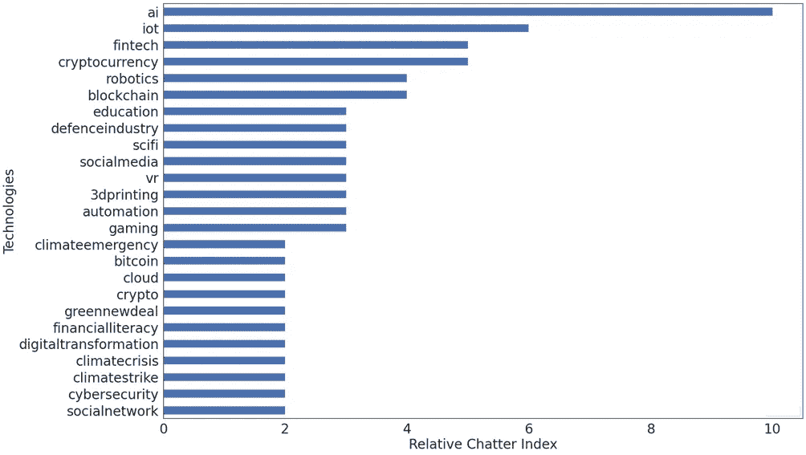
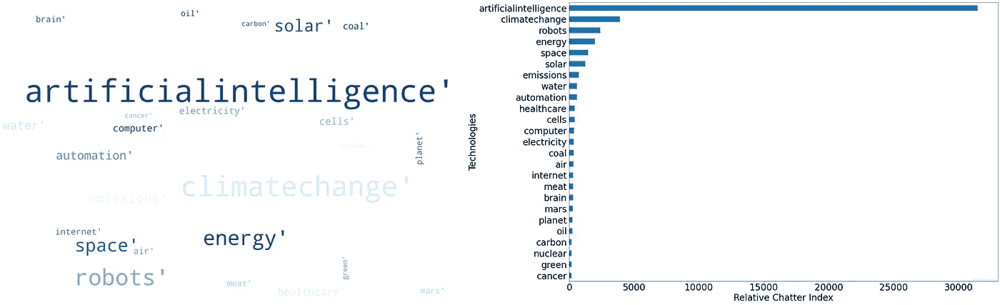
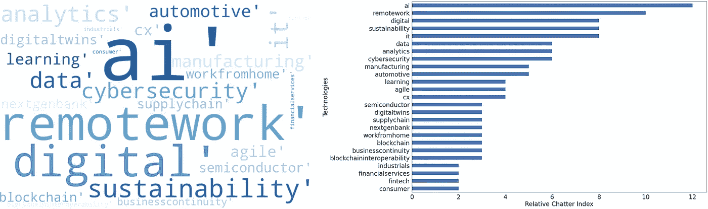

# 不断变化的技术趋势

> 原文：<https://medium.datadriveninvestor.com/changing-tech-trends-5c5d54c22219?source=collection_archive---------12----------------------->

## 基于人工智能的社交聊天分析

前所未有的时代可能会导致技术及其优先级的剧变。让我们探索一下这个世界是如何在社交媒体上谈论这件事的。

例如，在 Twitter 上有很多关于技术的讨论，当我们走出当前的全球危机时，我们比以往任何时候都更需要这些技术。通过分析自二月份以来的推文(方法见下文)，一个关于人们认为哪些技术将占据中心舞台的群体智慧图(图 1)出现了。标签云和条形图以两种可视化方式显示相同的数据，以便更好地阅读和理解。

Figure 1 (Top 25 only)

如果人工智能/人工智能获得牵引力，人们会觉得这将是一个向前发展的拐点。很大一部分对话都是围绕这个话题展开的。由于“低接触”经济，自动化/机器人/ 3D 打印等得到了很多喋喋不休。区块链加密公司也是。人们非常关注保护自然的技术，这些技术使自然变得绿色/有助于应对气候危机。此外，人们谈论了很多关于教育技术、游戏和虚拟现实的话题，这些领域在封锁期内有上升的使用趋势。

为了验证这一点，可以看看同一时期的另一个来源，如 Reddit。下面的图 2 显示了结果。

Figure 2 (Top 25 only)

人们对人工智能的讨论比其他技术多得多。这两种分析之间出现了一些模式……解决气候变化的技术在每个人的脑海中浮现，自动化/机器人也是如此。在这里，我们也看到了围绕医疗保健(一般+癌症，大脑等)和空间技术的对话。此外，围绕“食肉”的讨论也越来越多。

 [## 使用谷歌搜索趋势预测首次申请失业救济人数|数据驱动的投资者

### 几年来，我的重点一直是使用多种替代数据来预测宏观经济统计数据…

www.datadriveninvestor.com](https://www.datadriveninvestor.com/2020/03/25/using-google-search-trends-to-predict-initial-jobless-claims/) 

该分析涵盖了超过 10000 个用户的观点，数以千计的评论，并且是主动提供的。与市场调查相比，这是一个很好的不偏不倚和高度规模化的观点。

对这种方法很好奇…这里有一些建议

1.  使用 API(Twitter、Reddit)下载过去 2-3 个月的数据
2.  使用“句子嵌入”机器学习技术将每条推文或评论转换为向量。简单来说，这意味着我们像人类一样理解句子中每个单词的意思
3.  在此基础上，选择与技术相关的句子，通过“向量距离”到一个技术空间&集群
4.  可视化每个集群中的关键字

这种方法对于不同的主题是可重复的。例如，如果大众都这样想，那么高价战略咨询公司在想什么呢？下面(图 3)是全球最大的 15 家咨询公司的想法。

Figure 3 (Top 25 only)

在人工智能和自动化方面，顾问们与大众意见一致。他们确实使用了“数字”术语。他们确实在谈论可持续性，但没有大众谈论的那么多。许多部门和供应链技术变得更有分量，如制造业、DigitalTwins、敏捷等。他们谈论客户体验技术。“远程工作”得到了很多关注，像下一代银行、金融科技等概念也是如此。这反映了咨询公司代表大众思考问题，因为大众似乎没有优先考虑这些问题，也没有向他们的客户定位。数字世界中的网络安全备受关注。

人工智能、自动化和气候技术似乎是思想交汇的地方。

这场危机预计将推动人工智能上升…通过这篇文章使用人工智能来说明这一点的可能性应该会使这成为现实。