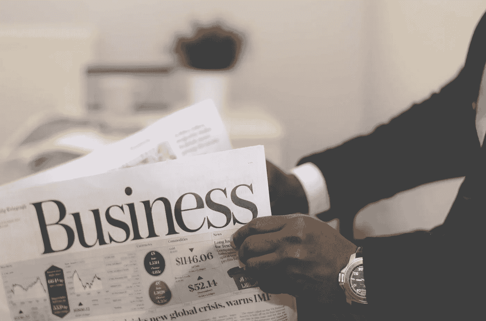

# 第一章结论:21 世纪的商业

> 原文：<https://medium.datadriveninvestor.com/chapter-first-conclusion-the-business-of-the-21st-century-8ed6289f76c9?source=collection_archive---------2----------------------->

M oney 谁不想拥有，至少我想拥有。嗯，我是一名在 IT 部门公司工作的员工，我确实认为一个人不能仅仅因为有工作而变得富有，或者换句话说，他只能在 21 世纪生存，另外他将失去的第二件事是他的独立性。

我的一个朋友向我推荐了一本名为《21 世纪的商业》的书，作者是罗伯特·清崎，金·清崎。罗伯特清崎是一个成功的商人和作家。他最著名的书是[富爸爸穷爸爸](https://amzn.to/2ULxwN4)。

我可以用一篇文章解释整本书，但这是不对的，因为如果你真的想知道他每一个决定背后的原因，你需要读这本书。

但是我要做的是，我要呈现他的思想，他在他的书的第一章中简单地解释了，所以你可以自己决定你是否想进一步阅读它。

在第一章的开始部分，Robert 讨论了市场在 2008 年至 2009 年期间是如何下跌的。这场危机不是突然发生的，它就在那里，但当它开始掏腰包时，人们开始注意到它。其中一个主要原因是缺乏金融教育。然后他把不同类型收入的讨论移到了今天的日期。

就业:-在目前的世界上，没有一个就业岗位被保存。

就业不足:这比失业更糟糕，因为你将工作更长的时间，拿更少的钱。

共同基金和股票市场:人们对在这个领域投资更感兴趣。如果你追求这些东西，那么你就是在拿你的未来计划冒险。先说 85 岁看到自己份额下降是什么感觉。他说这有风险，他不会推荐。

1971 年，美国经济脱离了金本位，因为他们开始根据自己的需要印更多的钱。但是，一个国家生产或印刷的货币应该与任何实际的、硬的、真实的价值挂钩。

因为这些银行开始向每个人发放贷款，人们变得越来越富有。为了归还贷款，他们开始选择再融资的方法。每个人都确信真实状态不会下降，但它确实下降了。

罗伯特对第一章的主要结论是，所有这些对房地产和共同基金的投资，或者在一家公司工作，都是一种古老的赚钱方式，如果我们还认为这些老马可以再次参加比赛，那我们就是傻瓜。