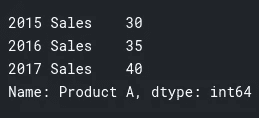
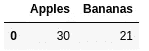
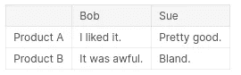
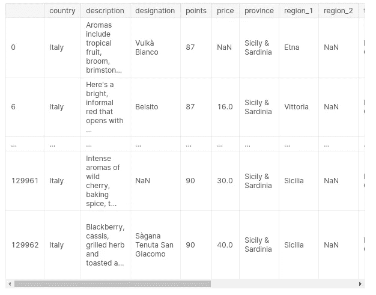
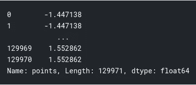
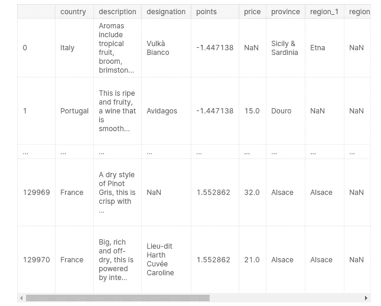
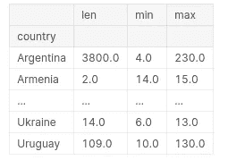
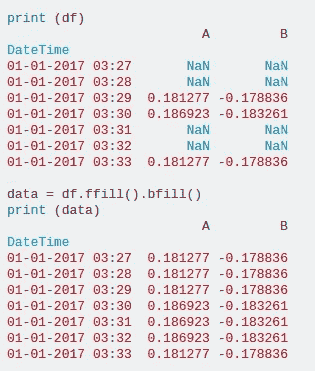
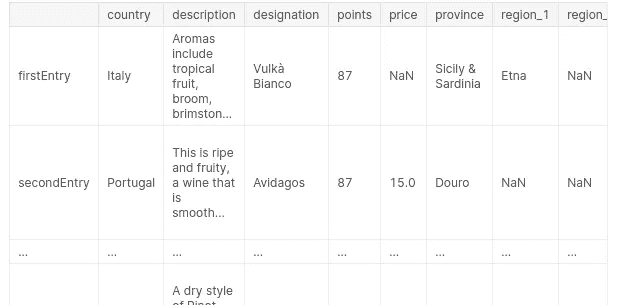
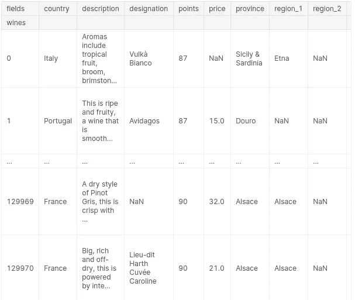

# 熊猫小抄

> 原文：<https://medium.datadriveninvestor.com/cheat-book-for-pandas-d7d3776abd88?source=collection_archive---------2----------------------->


[Source](https://www.activestate.com/blog/how-to-clean-machine-learning-datasets-using-pandas/)

让我们学习熊猫..

> [来源](https://www.quora.com/What-is-the-use-of-pandas-in-Python)
> 
> 简而言之，**熊猫**是计算机编程中的一个软件库。它是为 **Python** 编程语言编写的。它们在 Python 中用于处理数据分析和操作。简而言之，熊猫通过将数据制成表格的形式来帮助我们组织和处理数据。

熊猫有两个物体:

1.  数据帧和
2.  系列

作为一个非常简单的定义，dataframe 相当于一个表，series 相当于 list。

# 熊猫系列

## 创建系列:

列表中的系列:

```
pd.Series([1, 2, 3, 4, 5])
```


[Source](https://www.kaggle.com/residentmario/creating-reading-and-writing)

具有提及索引的列表中的系列:

```
pd.Series([30, 35, 40], index=['2015 Sales', '2016 Sales', '2017 Sales'], name='Product A')
```



[Source](https://www.kaggle.com/residentmario/creating-reading-and-writing)

# 熊猫数据框

**读取数据帧**

将 csv 文件作为数据帧读取:

```
df = pd.read_csv('<location of file.csv>')
### Printing the shape 
df.shape
### Printing the first few
df.head(<number of rows>)
```

如果 csv 文件有内置索引，您可以通过以下命令使用它:

```
df = pd.read_csv('<location of file.csv>', index_col = 0)
```

或者，您可以提到您希望作为索引的列的名称。

## **创建数据帧**:

简单的数据帧创建:

```
fruits = pd.DataFrame({'Apples':[30], 'Bananas':[21]})
```



[source](https://www.kaggle.com/raoofnaushad/exercise-creating-reading-and-writing/edit)

具有提及索引的数据帧:

```
pd.DataFrame({'Bob': ['I liked it.', 'It was awful.'], 
              'Sue': ['Pretty good.', 'Bland.']},
             index=['Product A', 'Product B'])
## More better approach
pd.DataFrame([[35, 21], [41, 34]], columns = ['Apples', 'Bananas'], index=['2017 Sales', '2018 Sales'])
```



[Source](https://www.kaggle.com/residentmario/creating-reading-and-writing)

**将 DF 写入 CSV** :

```
df.to_csv('<name of output csv>')
```

**访问数据帧和索引:**

```
#### Selecting a particular column:
df.column_name
#### OR
df['column_name']
### Selecting a particular row
df['column_name'][index]
```

**iloc** 和 **loc** :两者都用于 pd 数据帧的高级索引，这两种方法都是行优先和列第二的方法。

```
# **iloc**
### Printing the first row all columns
df.iloc[0] 
### Printing all rows and first column
df.iloc[:,0]
### Printing first 3 rows and first column
df.iloc[:3,0]
### Printing the last 5 rows of df
df.iloc[-5:]
```

iloc 比 loc 简单得多，因为我们不需要知道数据索引。

```
# **loc** ### Printing 1st row and country column
df.loc[0, 'name_of_column']
### Printing all rows and specific columns]
df.loc[:, ['name_of_column1','name_of_column2','name_of_column3']]
```

还有一点需要注意，iloc[0:10]的索引范围是从 0 到 9，而 loc[0:10]的索引范围是从 0 到 10。

## 删除列或选择列

```
df.loc[:, df.columns != '<columnName>']
#OR
df.drop('<nameOfColumn', axis=1)
```

**设定指标**

```
## To set index to column name
df.set_index('<colummn_name'>)
```

可以用 df 检查条件:

```
df.column == '<value>'
## If the condition satisfied it will give true else false
```

使用 loc 可以演示的另一个例子是

```
reviews.loc[reviews.country == 'Italy']
```



[Source](https://www.kaggle.com/residentmario/indexing-selecting-assigning)

类似地，可以添加更多的条件来选择特定的列和值

```
reviews.loc[(reviews.country == 'Italy') & (reviews.points >= 90)]
reviews.loc[(reviews.country == 'Italy') | (reviews.points >= 90)]
### isin() operator
reviews.loc[reviews.country.isin(['Italy', 'France'])
### notnull() opeartor
reviews.loc[reviews.price.notnull()
```

**分配数据**

分配一个常数值很简单

```
df['column name'] = 'value'
### Trying an iterable value, This will print range from 0 to len(df) like an indexing
df['column name'] = range(0, len(df), 1) 
```

为了获得数据的摘要:

```
### Summary as whole
df.describe()
### Summary of a column
df.column.describe()
### For any particular summary like mean
df.column.mean()
### For unique values
df.column.unique()
### To see unique values and its respective count
df.column.value_counts()
```

**Map:** 另一个转换数据的有用函数

例如，葡萄酒数据框架的点-列

```
review_points_mean = reviews.points.mean()
reviews.points.map(lambda p: p - review_points_mean)
```



[Source](https://www.kaggle.com/residentmario/summary-functions-and-maps)

map()函数只需要单个值。所以 apply()函数是帮助你整体转换 df 的函数。

```
def remean_points(row):
    row.points = row.points - review_points_mean
    return row

reviews.apply(remean_points, axis='columns')
```



[Source](https://www.kaggle.com/residentmario/summary-functions-and-maps)

> 如果我们用`axis='index'`调用了`reviews.apply()`，那么我们将需要给出一个函数来转换每个*列*，而不是传递一个函数来转换每一行。

**分组数据:**

```
df.groupby('column_name')
```

我们可以用下面的函数代替我们已经使用的 values_counts()函数

```
df.groupby('column_name').column_name.count()
## Similarly
df.groupby('column_name').column_name.mean()
df.groupby('column_name').column_name.min()
df.groupby('column_name').column_name.max()## We can also apply lambda functions. Example
reviews.groupby('winery').apply(lambda df: df.title.iloc[0])
## This will print the first wine from each winery group 
```

对于 lambda 函数，具有多列的分组也是可能的

```
reviews.groupby(['country', 'province']).apply(lambda df: df.loc[df.points.idxmax()])
```

另一个重要的功能是用 groupby 做统计处理

```
reviews.groupby(['country']).price.agg([len, min, max])
```



[Source](https://www.kaggle.com/residentmario/grouping-and-sorting)

**排序**

```
df.sort_values(by='len', ascending=False)
### If you want to sort by index
df.sort_index()
### Sorting with more than one column at a time
df.sort_values(by=['country', 'len'])
```

## 数据类型和丢失数据的处理

查找数据类型:

```
## This will give you the type of data in particular column name
df.column_name.dtype## If you want to print whole data types of a df then,
df.dtypes## Index also have its data type which can be understood by
df.index.dtype
```

Out[5]:

将列类型转换为所需的类型

```
df.column_name.astype('<Required_type>')
```

类型有:int64、float64、object(string 类型)等。

# 缺失数据:

要查找列中缺失的数据:

```
df[pd.isnull(df.name_off_column)]
## Filling missing values with some value
df.column_name.fillna("Unknown")
```

> 或者，我们可以用数据库中给定记录之后出现的第一个非空值来填充每个缺失值。这就是所谓的**回填策略。**

```
data = df.fillna(method='ffill').fillna(method='bfill')
```



[Source](https://stackoverflow.com/questions/41589365/filling-missing-values-using-forward-and-backward-fill-in-pandas-dataframe-ffil)

我们也可以用以下内容替换非空值

```
df.column_name.replace('old_val', 'new_val')
```

**更名:**

```
## Renaming column names
df.rename(columns={'points'= 'score'})
## Renaming index names
df.rename(index={0:'firstEntry', 1:'secondEntry'})
```



[Source](https://www.kaggle.com/residentmario/renaming-and-combining)

列和行都可以有自己的属性，例如:

```
reviews.rename_axis("wines", axis='rows').rename_axis("fields", axis='columns')
```



[Source](https://www.kaggle.com/residentmario/renaming-and-combining)

**组合数据帧**

```
pd.concat([df1, df2])
```

> 当我们在不同的数据框架或系列对象中有数据，但有相同的字段(列)时，这是很有用的。

`join()`允许您组合具有相同索引的不同数据帧对象。

```
df1.join(df2, lsuffix='suffix_for_df1', rsuffix='suffix_for_df2')
```

感谢阅读。这是基于熊猫的 kaggle 迷你课程的简化版。如果你想详细阅读，那是最好的。但是这可以作为相同的参考注释。


Follow me to read tech simplified contents

如果我做错了请纠正我，如果内容对你有帮助请鼓掌感谢我。非常感谢你的时间。事业有成，生活美满。

> *帮我接通*[*linkedIn*](https://www.linkedin.com/in/raoof-naushad-378432106/)*|*[*Github*](https://github.com/raoofnaushad)*。让我知道评论*

参考:

 [## 学习熊猫教程

### 解决简短的动手挑战，完善您的数据操作技能。

www.kaggle.com](https://www.kaggle.com/learn/pandas) [](https://www.quora.com/What-is-the-use-of-pandas-in-Python) [## 熊猫在 Python 中有什么用？

### 答案(13 之 1):什么是蟒蛇熊猫？Pandas 用于数据操作、分析和清理。蟒蛇熊猫是…

www.quora.com](https://www.quora.com/What-is-the-use-of-pandas-in-Python) [](https://stackoverflow.com/questions/41589365/filling-missing-values-using-forward-and-backward-fill-in-pandas-dataframe-ffil) [## 在 pandas 数据帧中使用向前和向后填充来填充缺失值(ffill 和 bfill)

### 感谢贡献一个堆栈溢出的答案！请务必回答问题。提供详细信息并分享…

stackoverflow.com](https://stackoverflow.com/questions/41589365/filling-missing-values-using-forward-and-backward-fill-in-pandas-dataframe-ffil) [](https://www.datadriveninvestor.com/2020/02/19/five-data-science-and-machine-learning-trends-that-will-define-job-prospects-in-2020/) [## 将定义 2020 年就业前景的五大数据科学和机器学习趋势|数据驱动…

### 数据科学和 ML 是 2019 年最受关注的趋势之一，毫无疑问，它们将继续发展…

www.datadriveninvestor.com](https://www.datadriveninvestor.com/2020/02/19/five-data-science-and-machine-learning-trends-that-will-define-job-prospects-in-2020/)