# 空间指南|空间入门

> 原文：<https://medium.datadriveninvestor.com/cheat-book-for-spacy-688bf7709e8a?source=collection_archive---------5----------------------->

## NLP 开源工具

嘿，我之前的故事《熊猫秘籍》得到了很好的反响。所以我想到为使用最广泛的 NLP 库 **Spacy** 写一个故事。

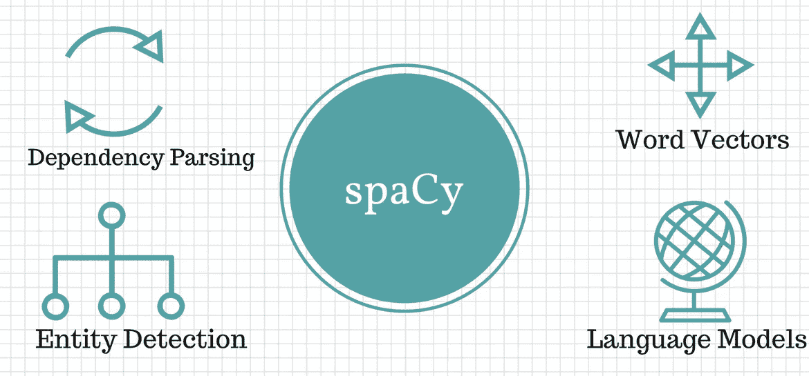

[Source](https://nlpforhackers.io/complete-guide-to-spacy/)

没有给出任何进一步的介绍和解释，我们开始。

**Spacy** 是领先的 NLP 库，被广泛使用。它推出了**语言专用**和**不同尺寸的型号。**

[](https://www.datadriveninvestor.com/2020/03/24/encoder-decoder-sequences-how-long-is-too-long/) [## 编码器解码器序列:多长是太长？数据驱动的投资者

### 在机器学习中，很多时候我们处理的输入是序列，输出也是序列。我们称这样的一个…

www.datadriveninvestor.com](https://www.datadriveninvestor.com/2020/03/24/encoder-decoder-sequences-how-long-is-too-long/) 

**为其安装**空间和语言库。

```
pip install -U spacy
#If you want small
python -m spacy download en_core_web_sm
#medium
python -m spacy download en_core_web_md
#large
python -m spacy download en_core_web_lg
```

**导入**空间并加载语言模型。

```
import spacy
nlp = spacy.load('en_core_web_sm')
```

**处理**带有空格的文本

```
doc = nlp("Hi I am Spacy. Use me for your NLP tasks")
```

你可以用 doc 尝试很多事情。

**标记化**

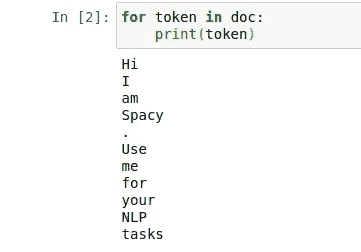

Generated by Author

**预处理**

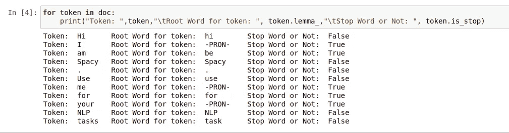

Generated by Author

**语义标记化**

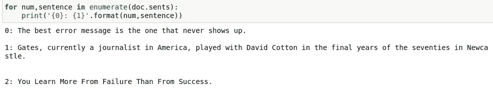

Generated by Author

**形状**

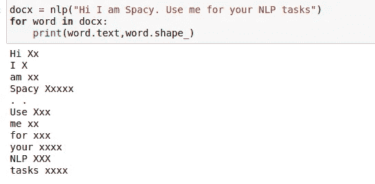

Generated by Author

**词性标注**

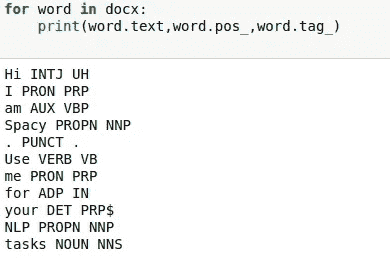

Generated by Author

**空间解释**


Generated by Author

**依存解析**

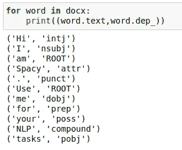

Generated by Author

**命名实体识别**

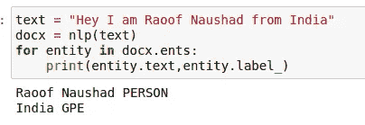

Generated by Author

**相似度**

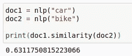

Generated by Author

**创建名词块**

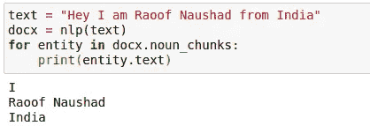

Generated by Author

还有，

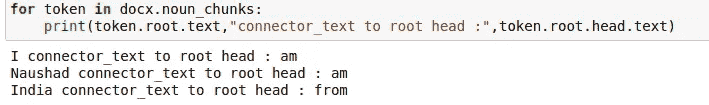

Generated by Author

**模式匹配**

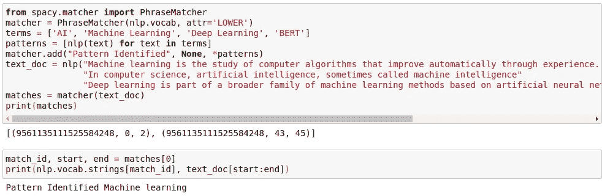

Generated by Author

**文本分类器**空间管道

这是一个简单的空间管道，有助于单词袋的转换，也有助于创建一个简单的线性模型。

在 Spacy 中，我们可以创建和删除管道。在上述案例中，Spacy-doc 提供了所有管道。因此，在这里，我们将创建一个空的空间模型，并添加文本分类管道。

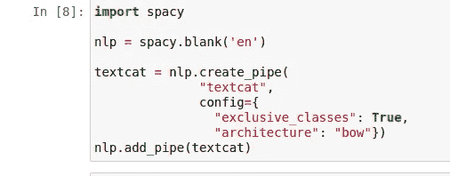

Generated By Author

现在我们需要给管道添加标签。

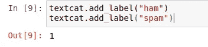

Generated By Author

让我们看看我们将要使用的数据集。

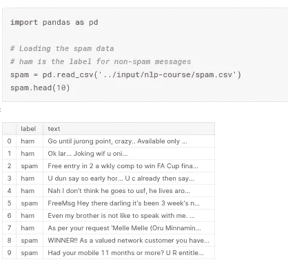

Source: Kaggle

创建培训文本和标签。

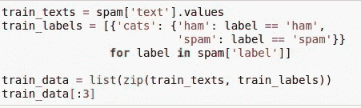

Generated by Author

输出:

```
[('Go until jurong point, crazy.. Available only in bugis n great world la e buffet... Cine there got amore wat...',
  {'cats': {'ham': True, 'spam': False}}),
 ('Ok lar... Joking wif u oni...', {'cats': {'ham': True, 'spam': False}}),
 ("Free entry in 2 a wkly comp to win FA Cup final tkts 21st May 2005\. Text FA to 87121 to receive entry question(std txt rate)T&C's apply 08452810075over18's",
  {'cats': {'ham': False, 'spam': True}})]
```

**训练数据**

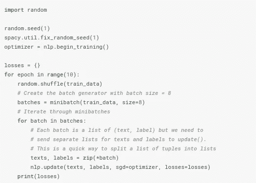

Source : Kaggle

这里我们运行了 10 个时期的代码。分批训练通常更好。所以我们使用了名为**的 8 尺寸迷你批次**的 spacy 函数。我们首先用 **nlp.begin_training()** 创建一个优化器。现在，每一批都得到预测，损失被计算，然后使用 **nlp.update()** 更新模型参数。从而提高性能并拟合数据。

输出:

```
{'textcat': 0.4334991069604257}
{'textcat': 0.6496019485207398}
{'textcat': 0.7863673790055303}
{'textcat': 0.8737475677702786}
{'textcat': 0.9302242464558885}
{'textcat': 0.9677437641341992}
{'textcat': 0.9961505980065267}
{'textcat': 1.0150542168295829}
{'textcat': 1.0298431610185577}
{'textcat': 1.040148884840773}
```

**预测**

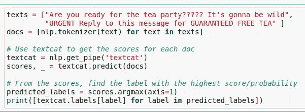

Generated by Author

输出:

```
['ham', 'spam']
```

谢谢你的阅读。希望对你有用。太棒了。

参考:

[](https://www.kaggle.com/matleonard/intro-to-nlp) [## 自然语言处理简介

### 使用 Kaggle 笔记本探索和运行机器学习代码|使用来自多个数据源的数据

www.kaggle.com](https://www.kaggle.com/matleonard/intro-to-nlp)