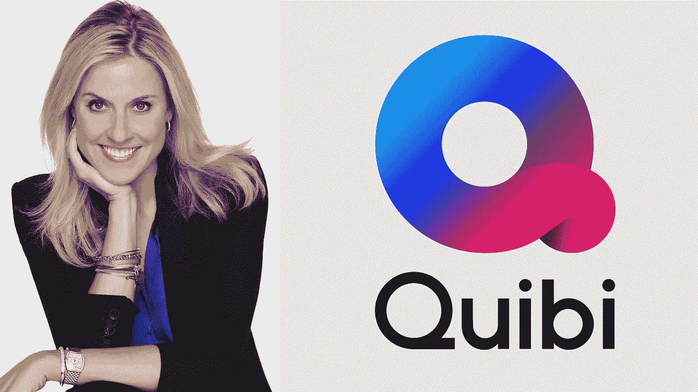

# 这些是为 Quibi 制作节目的名人——几乎好莱坞的每个人都参与其中。

> 原文：<https://medium.datadriveninvestor.com/check-out-these-stars-making-shows-for-quibi-and-near-everyone-in-hollywood-seems-to-be-involved-a1015bf2bedf?source=collection_archive---------20----------------------->

## 现在你有机会先睹为快，看看价值数十亿美元的视频初创公司 Quibi。

安东尼·布隆伯格

Quibi，代表“quick bites”，指的是该服务计划为小黑镜(你的手机)提供短片段(10 分钟或更短)。

Quibi 计划在 4 月份推出 64 本书，第一年推出约 175 本，其中许多都是好莱坞顶尖人才的作品。

但是，这种简短形式的企业几乎没有什么其他的特点。第一年，该公司的合伙人(董事长杰弗瑞·卡森伯格和首席执行官梅格·惠特曼)仅在内容收购上就花费了超过 10 亿美元。这部分是因为好莱坞的每个人似乎都在做 Quibi 秀，包括像史蒂文·斯皮尔伯格、吉尔莫·德尔·托罗、凯文·哈特和詹妮弗·洛佩兹这样的重量级人物。

该公司一直在各地推出宣传公告和预览，包括在 Twitter 上，在行业贸易出版物上，在圣丹斯电影节上，以及在上个月拉斯维加斯 CES 的主题演讲上。

奎比发布了它的首发阵容，共有 50 个节目，包括利亚姆·海姆斯沃斯的“最危险的游戏”，奎恩·拉提法的“当街灯亮起”和克莉茜·泰根的“克里斯的法庭”

但这只是 Quibi 表示将在第一年发布的一小部分。在此期间，它计划推出大约 8500 个“快速内容”，以及大约 175 个新节目——其中 35 个节目是“章节电影”；120 个是无脚本的真人秀或纪录片，其余的是新闻和生活方式，或者他们所谓的“日常必需品”

 [## 幸福的算法？数据驱动的投资者

### 从一开始，我们就认为技术正在使我们的生活变得更好、更快、更容易和更实用。社交媒体…

www.datadriveninvestor.com](https://www.datadriveninvestor.com/2019/03/08/an-algorithm-for-happiness/) 

所有这些表演最终会发生吗？他们中会有好的吗？会有人花 7.99 美元看奎比吗？

没人知道！但至少 Quibi 有一份令人印象深刻的黑体字名单，可以向投资者和潜在观众兜售。这是我们目前知道的人，按字母顺序排列。

> [但是首先……先看看我们对这个平台了解多少！](https://www.anthonyblumberg.com/blog/la-media-startup-quibis-new-technology-will-revolutionize-mobile-video-viewing)

**亚历山大·阿嘉:**导演正在开发恐怖漫画《富江》的真人版

斯蒂芬和罗比·阿梅尔:这两位演员(以及表亲)正在制作《代码 8》的衍生剧，这是一部关于被压迫的超人的众包科幻惊悚片。原版电影的导演杰夫·陈将会担纲主演。

埃里克·安德烈:他正在扩展他的成人游泳脱口秀小品《说唱战士忍者》，在这个小品中，说唱歌手必须在自由造型的同时克服怪异的障碍。

**威尔·阿奈特**:阿内特是奎比的三重威胁。他正在主持一个名为“记忆之洞”(Memory Hole)的节目，该节目探讨所谓的讨论不足的话题(比如加拿大)，他还将制作动画连续剧《你的每日星座运势》(Your Daily astograph)和每日晚间节目提要《今晨深夜》(Late Night This Morning)

**Ayo & Teo:** 病毒舞蹈挑战赛“劳力士”背后的二人组将主持“The Sauce”，这是一个跨国舞蹈比赛系列。(Usher 是评委，执行制作。)

提拉·班克斯:她主演并执行制作了一部名为《美丽》的纪录片，这部纪录片审视了世界各地的美丽标准及其发展方式。

总理“说唱歌手吉斯”班尼特:他将在另一个“朋克”复兴中接替阿什顿·库彻的角色，该复兴将继续致力于戏弄不知情的名人。

杰森·布伦:这位布伦屋制片公司的导演制作了《狼和村民》，这是一部由娜奥米·沃茨主演的类似《致命诱惑》的故事。

乔尔·金·助推器**:他(和柯克·帕尔莫)共同主持了重新开机的《单挑》，该剧已经为所有性别和性取向重新设计了 20 集。他也是火岛浪漫喜剧《旅行》的编剧和联合制作人。**

盖伊·布拉纳姆:这位喜剧演员正在复活 2003 年的浪漫喜剧《如何在 10 天内甩掉一个男人》(他可能不是他们将要失去的那个人。)

斯库特·布朗:贾斯汀比伯和爱莉安娜·格兰德的经理在奎比到处跑。他正在制作“&音乐”，这是一部音乐纪录片，讲述幕后的音乐人，如舞蹈指导、视频导演和舞台设计师。他还制作和评判一个无标题的音乐比赛系列，执行制作一个名人纹身 docuseries 和执行制作他的客户黛米·洛瓦托的脱口秀节目，“与黛米·洛瓦托枕边细语。”

泰特斯·伯吉斯(Titus Burgess):这位演员兼歌手正在主持一场名为“Dishmantled”的解构式烹饪比赛，比赛中一道神秘的菜肴被炮轰到厨师的脸上，他们必须识别并再现这道菜。(说真的。)沃尔夫冈·帕克、简·克拉考斯基和瑞秋·德拉彻是这一奇怪仪式的评委。

比尔·伯尔:这位喜剧演员是《不道德的罗盘》的编剧、导演、制片人和主演，该剧基于泰勒·福尔博关于道德困境的数字短片。

**凯·加农**:这位《完美音高》的编剧正在制作一部改编自《死亡地点》的电影，讲述了一个超自然的犯罪现场清洁工的故事。

Kiari " Offset " CEP HUS:Migos 成员带着名人乘坐" Skrrt with Offset "客人包括卡迪 B，Dapper 丹，杰雷诺，T-Pain，等等。

**安迪·科恩**:在写完《安迪·科恩日记》和《肤浅:安迪·科恩日记的更多冒险》这两本书后，这位脱口秀主持人正在撰写和制作六集动画连续剧《安迪·科恩日记》

**詹姆斯·柯登**:他的 Fulwell 73 公司正在制作读心术节目《与 Lior 一起疯了》(Gone Mental with Lior)，由以色列精神论者 Lior Suchard 主演，他经常在 Corden 的深夜节目中表现出色。不出所料，科登也将是嘉宾，还有本·斯蒂勒、佐伊·丹斯切尔、凯特·哈德森等等。

达伦·克里斯:他是 10 集音乐喜剧《皇室》的联合创作人、词曲作者和主演艾米·海克林导演了全部 10 集。

汤姆·克鲁斯:奎比正在制作一部名为《莱斯·格罗斯曼》的电视剧，讲述克鲁斯不朽的“热带惊雷”角色。虽然该服务尚未确认克鲁斯的参与，但你认为没有他他们能做到吗，playaaa？“雷霆”老兵本·斯蒂勒和贾斯汀·塞洛克斯被宣布将参加国际消费电子展。

斯蒂芬·库里:他正在制作一部关于纽瓦克的篮球队“本尼迪克特男子”的纪录片

**卡拉·迪瓦伊**:这位模特兼演员正在主持并执行制作一部恶作剧系列片——工作名称为“恶作剧”——在这部片中，她得到了一群女性同伙的协助。

吉尔莫·德尔·托罗:首先，奎比宣布这位奥斯卡获奖导演正在创作一部现代吸血鬼电影——暂定名为《余波》然后奎比说是关于僵尸的。不管怎样，这是关于亡灵的，德尔托罗的专长。

劳拉·邓恩:她将在尼克·霍恩比的调酒师系列电影《只喝一杯》中担任倒酒的工作，这部电影是他编剧和执行制作的。邓恩也是执行制作。

亚当·迪瓦恩(Adam Devine):这位喜剧演员凭借《亚当·迪瓦恩的坏主意》(Bad Ideas with Adam Devine)获得达尔文奖，这是一档冒险/旅行节目，他将自己和一些著名的同伴置于危险的境地(比如在食人鱼出没的水域穿着美味的衣服)。

扎克·埃夫隆:据报道，他在拍摄《杀死扎克·埃夫隆》时差点自杀——为了这部冒险/生存系列片，他在巴布亚新几内亚过着与世隔绝的生活，需要一架救伤直升机把他送到澳大利亚的一家医院。

**伊德瑞斯·艾尔巴**:在《厄尔巴岛大战布洛克》中，他与拉力赛车车手肯·布洛克对决，这是一部八集的系列片，以燃烧的障碍跑道和死亡之墙等特技挑战为特色。

彼得和鲍比·法拉利:这对兄弟导演正在执导一部名为《现在》的自杀喜剧，由戴夫·弗兰科、比利·穆雷、黛瑞·汉娜和小奥谢·杰克森主演

**乔恩·费儒**:他的公司假人创作公司是《微混乱》的执行制作人，这是一部致力于定格动画玩具汽车追逐的系列片，还有赛斯·格林的公司，笨笨巴迪·笨笨。

**戴克斯特·弗莱切尔**:这位《火箭人》的导演在 CES 上宣布将参与一部未指明的电影。

威尔·福特:他和凯特琳·奥尔森联合主演了《翻转》中的家庭革新者，他们幸运地进入了一个贩毒集团的藏身地，这是第一部上映的电视剧之一。

罗恩·芬奇斯:这位喜剧演员正在主持一个名为“不错”的游戏节目像克里斯·哈德维克这样的喜剧演员试着互相敬酒，而不是烤焦。

埃文·芬克(Evan Funke):这位名厨正在追求他对“意大利面形状”的痴迷(看一看这大约 18 分钟。)

**安东尼·福奎阿:**他是这部耗资 1500 万美元的电视剧《#Freerayshawn》的执行制片人，主演史蒂芬·詹姆士饰演一名被陷害的伊拉克老兵，劳伦斯·菲什伯恩饰演一名人质谈判专家。

**塞思·格雷厄姆-史密斯**:《亚伯拉罕·林肯:吸血鬼猎人》的作者是《最后的美国吸血鬼》的执行制片人，该片聚焦于吸血鬼和联邦调查局的合作。

**凯瑟琳·哈德威克**:她执导并监制了 14 集科幻惊悚片《不要看得太深》，由唐·钱德尔和艾米莉·莫迪默主演。

玛丽·哈伦:这位《美国惊魂记》的导演正在执导《期待》，这是一部由安娜索菲亚·罗伯主演的关于令人不安的怀孕的恐怖电影。

**凯文·哈特**:他在《死鹿》中担任制片人、编剧和主演，扮演一个想要成为动作英雄的自己，师从约翰·特拉沃尔塔的动作学校教练。(这是对他的电影《凯文·哈特:现在怎么办》开场场景的扩展。)

**利亚姆·海姆斯沃斯**:《饥饿游戏》中的明星是《最危险的游戏》中被追捕的猎物，这是一个经典短篇故事的重演，克里斯托弗·沃尔兹在奎比推出的首批节目中扮演策划者。愿机会永远对他有利。

迈克尔·赫斯特:《维京人》的创作者正在开发历史剧《查理大帝》

波伊德·霍布鲁克:他在《逃犯》的第二部中扮演一个被错误指控为恐怖分子(并被侦探基弗·萨瑟兰追捕)的人

萝西·杭亭顿·惠特莉:这位模特兼演员正在主持和制作一个关于美女偶像的节目，工作名称是“去看看吧”

**柯蒂斯“50 美分”杰克逊:**他是漫画小说《颤音联盟》(Trill League)的执行制作人，讲述了一群黑人超级英雄的故事。

**奥谢“艾斯·库伯”杰克森**:他参与了一个无标题的抢劫系列，在 CES 上被公布。

**勒布朗·詹姆斯**:他正在制作一部关于他在俄亥俄州的学校的纪录片，名为《我保证》

肯德尔和克莉丝·詹纳:这位模特和她的母亲克里斯正在制作一部关于模仿者“科比·詹纳”的戏仿系列，她在 Instagram 上假装是肯德尔的异卵双胞胎。(Twinstagrammer？)瑞安·西克莱斯特也是执行制片。

“摇滚”德怀恩·约翰逊:他和保罗·费格一起制作了一部以夏威夷为背景的喜剧《最后的手段》。

**乔·乔纳斯**:他正在扩大他的 Instagram 旅行记录，在《一杯咖啡》中探索巡回演出的城市，还有蒂娜·菲和杰克·布莱克等嘉宾。

**拉什达·琼斯**:这位作家兼演员和她的写作伙伴威尔·麦克马克是制作一个名为“中心装饰品”的花卉设计系列的执行人员，在这个系列中，艾娃·德约列和玛娅·鲁道夫等嘉宾与主持人莫里斯·哈里斯(Maurice Harris)一起创作花卉中心装饰品。

**安娜·肯德里克**:她是喜剧《傻瓜》的执行制片人和主演，扮演一个和她男友的性玩偶成为好朋友的女人。(在这里一窥究竟。)

丽莎·科希(Liza Koshy):这位“按需丽莎”明星正在举办一场名为“Floored”的活动舞池舞蹈比赛

凯文·关(Kevin Kwan):这位《疯狂的亚洲富人》的作者正在审视精英品牌的家族王朝与“奢侈品帝国”

奎恩·拉提法:她在《当街灯亮起》中饰演一名调查双重谋杀案的警探，这是第一部上映的电视剧之一。选择雅各布斯和马克·杜普拉斯联合主演。

汤玛斯·莱恩:另一个奎比最有价值的人，他主演并撰写了《雷诺 911》复兴和纳帕谷喜剧“酒鬼”温迪·麦克伦登·考威也在制作和联合主演“雷诺 911！”

道格·里曼:导演兼制片人正在为《疯狂天才》改编史蒂文·古尔德的故事，故事中精神病区的病人发现他们的精神问题实际上是超能力。他的 30 忍者公司也在制作《不要往深处看》。

詹妮弗·洛佩兹:她是《感谢一百万》的执行制作人并参与其中，这是一个付费转发式的节目，嘉宾包括尼克·乔纳斯、雅拉·莎希迪、加布里埃尔·伊格莱西亚斯、基丝汀·贝尔、崔西·摩根、卡莉·克劳斯和亚伦·罗杰斯，他们回报那些一路上帮助过他们的人。

黛米·洛瓦托:她的脱口秀节目“与黛米·洛瓦托的枕边谈话”将探索身体积极性、性别认同、社交媒体、激进主义等等。

**迈尔斯“里尔·游艇”麦科勒姆**:这位说唱歌手正在主演《公众人物》，这是一部以他年轻时的事件为灵感的喜剧。

**杰德·默丘里奥**:《保镖》的创作者正在开发一部科幻惊悚片《传输》，讲述一位科学家接收来自外太空的信号。

凸轮牛顿:卡罗莱纳黑豹队的四分卫是执行制作和参与体育系列“铁磨铁”，配对运动员从完全不同的运动项目一起训练。(例如，牛顿与亚特兰大老鹰队的控球后卫特雷·扬，美国女子国家队队长卡莉·洛伊德与 U.F.C .冠军阿曼达·努内斯。)

**特雷弗·诺亚:**《每日秀》的主持人是执行制片人，并主演了一部关于他巡回演出互动的喜剧游记——工作标题是“取消”

威尔·帕克:他是唐纳德·斯特林纪录片《被否决》的制作人

**吉姆·帕森斯**:他是喜剧《君主制即将灭亡》的执行制片人

特拉维斯·帕斯特拉纳:这位赛车明星正在主持硝基马戏团特技表演“真人大小的玩具”

詹姆斯·帕特森:作者是改编自他的书《玩具》的执行制片人

**宝拉·佩尔**:她是喜剧《梅普沃斯谋杀案》的联合创作人和主演，这部电影讲述了一位神秘作家，碰巧在她家附近发生了令人不安的谋杀案。她在《周六夜现场》中的同事(如弗莱德·阿米森、玛娅·鲁道夫、蒂姆·麦道斯和蒂娜·菲)作为被指控或被杀害的角色出现。洛恩·迈克尔斯和塞斯·梅耶斯是执行制片。

**:他是恐怖片《50 国惊魂》的执行制片人，探索全国各地的民间传说和都市传说，由凯伦·阿兰、雷切尔·布罗斯纳安、阿沙·巴特菲尔德、罗瑞·卡尔金、泰莎·法米加、崔维斯·费米尔、朗·里维斯顿、伊丽莎白·里塞、克里斯蒂娜·瑞西和温明娜主演。**

**梅根·拉皮诺埃:这位足球明星正在主持一部名为《神童》的关于年轻运动员的纪录片系列**

**瑞安·雷诺兹:他参与的一个未指明的动画项目在 CES 上被宣布**

****妮可·里奇:**她是喜剧《Nikki Fre$h》的执行制作人和主演，扮演说唱歌手的另一个自我。她的丈夫，乔尔·马登的音乐公司，正在监督音乐。**

**亚当·里彭:这位奥林匹克花样滑冰运动员正在主持“无用名人史上的这一天”**

**凯瑟琳·罗伯特森:这位女演员是 1995 年由琪兰·席普卡和黛安·克鲁格主演的《与鲨鱼共泳》的编剧和执行制片人。**

****米歇尔·罗德里格兹**:她在 CES 上宣布参与一档名为《十吨密友》的节目。**

****贾斯汀·罗兰**:《瑞克&莫蒂》的联合创作人制作了《格洛普世界》，这是一部粘土动画剧，两个家伙是室友，还有赛斯·格林的笨伙计斯图迪奥斯。**

****安东尼和乔·罗素:**受里德·塔克的书《激战:漫威和 DC 之间长达 50 年的史诗之战》的启发，《复仇者联盟》的导演和兄弟们正在探索漫画在《激战》中的竞争砰！**

**安迪·萨姆伯格:他主持并执行制作了一个名为“最大的小烹饪比赛”的简单烹饪比赛(换句话说，速咬。明白了吗？)他还出演了《梅普沃斯谋杀案》**

****雷德利·斯科特**:他是游戏惊悚/恐怖片《CURS_R》的执行制作人，该片讲述了一款电脑生存游戏，诱骗玩家玩游戏以求活命。**

****伊史蒂芬·索德伯格**:他是惊悚片《无线》的制片人，该片讲述了一名坠机幸存者(泰尔·谢里丹饰演)试图用智能手机进行交流的故事。(大概在第 27 分钟的时候看一下。)**

**史蒂文·斯皮尔伯格(Steven Spielberg):他正在创作一部恐怖系列片，暂定名为《天黑之后》(After Dark)，只有当观众所在位置的太阳落山后，手机才会解锁。**

****魏娜·莎德**:《杀戮》的主演是拼车惊悚片《陌生人》的创作者、编剧和导演，戴恩·德哈恩在片中饰演一个恐吓司机麦卡·梦露的反社会分子。**

****吉米·塔特罗**:他是《初中》的联合创作者和主演，这是他的 YouTube 系列的扩展，也是《现在》的联合主演**

**克莉茜·泰根:她是“克里斯法庭”小额索赔案的主审法官，在那里她裁决现实生活中的案件。Teigen 的母亲 Vilailuck 在这部 10 集的剧集中扮演法警。**

**索菲·特纳:她在亚历克斯·莫莱尔的《生存》的改编版中饰演一名自杀的飞机失事幸存者，她必须找到活下去的意愿，这是第一部推出的电视剧之一。科瑞·霍金斯联合主演。**

**加布里艾尔·尤尼恩:她是《黑咖啡》的制片人，这是一部喜剧，讲述了一位前篮球明星开了一家咖啡店的故事。**

**詹姆斯·维奇:这位因垃圾邮件 Ted 演讲而出名的喜剧演员主持“Q-Talks”喜剧特辑，由雷吉娜·赫尔、丽莎·库卓、奈希·纳什和克里斯汀·沙尔联合主演。**

****萨沙·维卢**:这位“鲁保罗变装大赛”冠军正在主持和制作一部名为《睡袍》的八集变装剧**

**马克·沃尔伯格:他是《经营这座城市》的制片人，这部纪录片是关于马萨诸塞州福尔里弗前市长贾西尔·科雷亚二世的。他在任期间被指控欺诈、贿赂和勒索。**

****丽娜·维特**:她在纪录片《你没有这些》中探索运动鞋文化，嘉宾有卡梅隆·安东尼、比利·简·金、哈桑·米娜杰、奎斯特洛夫、纳斯、麦克·艾普斯等等。**

****亚历山大·王**:这位时尚设计师将他的脱口秀节目《便壶》设在浴室里。**

**艾伦·斯特里克兰·威廉姆斯(Allen Strickland Williams):他是喜剧《无双》的创作者，讲述的是拒绝安定下来的人的故事。**

**瑞茜·威瑟斯彭(Reese Witherspoon):这位女演员兼制片人嫁给了 Quibi 的内容获取和人才主管吉姆·托特(Jim Toth)，她正在主持《凶猛的女王》(Harvey Queens)，这是一部纪录片，讲述了领导自己群体或豆荚的雌性动物(鬣狗、座头鲸)以及以配偶为食的蛇蝎美人(萤火虫)的故事。托斯，小心！**

**本文最初发表于我的博客:[https://www.anthonyblumberg.com/](https://www.anthonyblumberg.com/)查看更多关于最新科技、金融和旅游新闻的内容！**

**如果你喜欢这篇文章中的一些东西，请留下评论，与你的朋友和家人分享，并给它一些掌声！**