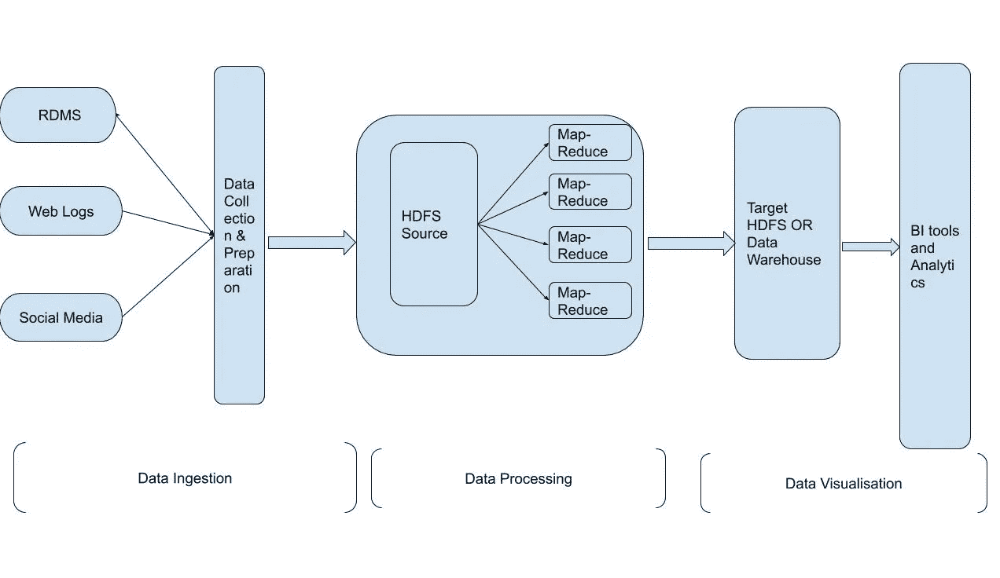
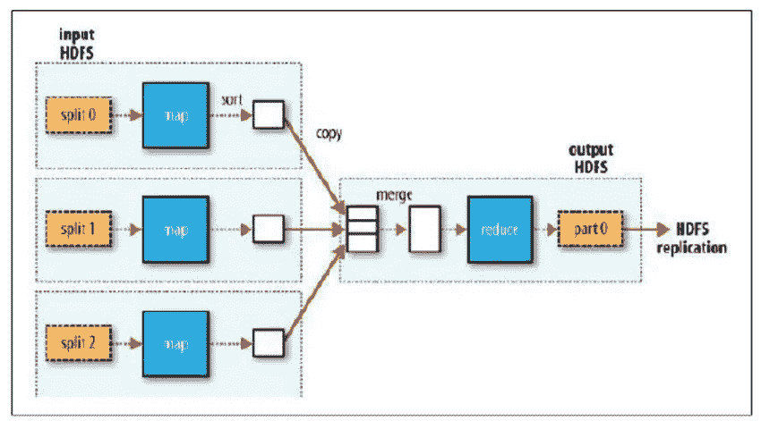

# 测试大数据系统的清单

> 原文：<https://medium.datadriveninvestor.com/checklist-of-testing-bigdata-systems-8f41257591de?source=collection_archive---------5----------------------->

B [ig Data](https://en.wikipedia.org/wiki/Big_data) 一直是软件行业的流行语，主要是因为产生了大量无法用传统计算方法处理的数据。大数据有一个 3 Vs ie 的特点。容量(数据量)、速度(数据进出的速度)、多样性(数据类型和来源的范围)。

话虽如此，测试大数据系统带来了全新的复杂性，它需要很多技能。没有结构化的策略来测试此类系统，因为您的脚本、检查和验证将取决于业务逻辑，但是在测试大数据系统时需要注意某些方法或清单。这篇文章将主要围绕这样的清单和策略。

注意——本文将 ***而不是*** 介绍方法和实现。

在进入清单之前，让我们快速讨论一下任何处理大数据的应用程序的组件

*   *数据摄取*，是将数据(即大量数据)注入大数据系统的层。这些数据可以是结构化、半结构化或非结构化的，存储可以是 Hadoop、MongoDB 或任何其他存储。它也被称为预处理阶段，在这个阶段测试非常关键，如果我们在这个阶段出错，整个管道都会受到不正确分析的影响。
*   *数据处理*顾名思义，在这一层发生摄取数据的处理。基于业务规则的数据聚合等处理，最终形成将通过 map-reduce 作业处理的键值对。
*   *数据可视化，一旦根据业务规则处理数据，处理后的数据将直接 ETL 到数据仓库，或者一些系统将目标源作为一个不确定的步骤，数据通过该步骤加载到数据仓库，以便通过业务智能和分析提取有意义的信息。*

**Big Data pipeline**

**Map-Reduce Data flow**

让我们开始讨论这份清单

*   设置 ***测试环境*** 非常关键，要确保测试环境有足够的空间来处理和存储基于被测应用的大量数据，还应该为每个组件设置一个分布式集群。
*   准备 ***测试数据*** 正反两面以涵盖所有业务场景，最初尝试在验证时使用小样本数据(以 KBs 为单位),这将使事情变得简单一些，例如对照源数据验证所摄取数据的正确性，或者通过比较输出文件和输入文件来验证对所摄取数据实施的正确业务规则和数据聚合是否正确。
*   在数据流的每个阶段定制 ***警报和日志*** 是至关重要的，尤其是在运行大量测试数据的执行时，这将有助于调试和捕捉系统错误。
*   大数据系统的 ***性能* *测试*** 非常重要，因此它涉及到建立负载测试脚本和分析指标等活动。
*   检查 ***指标*** 如吞吐量、错误率和将数据接收到数据存储所用的时间如插入率、队列可以处理的消息和 map-reduce 针对 HDFS 数据独立执行的作业。
*   由于系统由不同组件组成，因此对每个组件单独进行负载测试至关重要。
*   在执行 ***负载测试*** 时，考虑 ***因素*** 如应用程序日志将增长多少，如何缓存行缓存和键缓存，超时如查询超时和连接超时，消息队列等。
*   在 ***数据摄取*** 过程中，数据是从不同格式的多个来源生成的，如 RDBMS、社交媒体、日志等，因此准备所有可能的数据格式将是关键。并验证数据是按照定义的模式接收的。可以使用 QuerySurge，Datameer，Talend 之类的工具。
*   确保数据的正确性，如源数据与摄取数据的比较，并将数据加载到正确的 HDFS 位置。使用自定义脚本、警报和日志来调试大量数据的接收和正确性。摄取中常用的一些工具和库有— *Kafka、Zookeeper、Sqoop、Flume、Storm、Amazon Kinesis。*
*   在 ***数据处理*** 过程中，通过***map-reduce jobs***确保摄取的数据按照业务逻辑正确处理。因此，使用 [MRUnit](http://mlwiki.org/index.php/MapReduce/MRUnit) 准备单元测试是一个好主意，可以验证生成的键-值对的正确性，以及 map-reduce 作业执行后业务逻辑的正确应用。
*   确保为每个 map-reduce 作业实施正确的 ***日志记录和异常处理*** ，并验证是否对数据实施了数据聚合或分离规则。处理层中使用的一些常用工具有— Hadoop (Map-Reduce)、Cascading、Oozie、Hive、Pig。
*   一旦数据被处理，它将 ETL 到 ***目标 HDFS 或数据仓库*** 。因此，在目标系统中测试 ETL 时，加载到目标系统中的数据的正确性和完整性应该明确地在检查表中。
*   验证是否对目标系统中的数据正确应用了所有转换规则，并通过将目标数据与 HDFS 文件系统数据进行比较来检查数据是否损坏。
*   ***异常和错误*** 应该用适当的信息正确记录，这样调试和修复就容易了，如果在用大量测试数据测试时做得正确，你会感谢自己。
*   不要错过从数据摄取到数据可视化开始的 ***集成测试*** ，即测试系统整体。
*   ***混乱测试****测试这样的大系统在执行过程中发生的任何混乱变得非常关键，比如验证数据端到端的无缝处理，如果任何节点死亡或失败。*
*   *系统应该通过 ***恢复机制*** 恢复，就像切换到其他数据节点处理数据一样。*

*希望上面的清单能为测试涉及大数据的系统增加价值。*